<script>
MathJax = {
  tex: {
    inlineMath: [['$', '$'], ['\\(', '\\)']]
  }
};
</script>

<script
  id="MathJax-script"
  async
  src="https://cdn.jsdelivr.net/npm/mathjax@3/es5/tex-mml-chtml.js">
</script>

# Theoretical Questions
## Table of Contents
- [Theoretical Questions](#theoretical-questions)
  - [Table of Contents](#table-of-contents)
  - [Eigen decomposition and SVD](#eigen-decomposition-and-svd)
  - [Perceptron](#perceptron)
  - [Activation Functions](#activation-functions)
  - [NN](#nn)
  - [BackPropagation](#backpropagation)
  - [Optimization](#optimization)
  - [NN Training Process](#nn-training-process)
  - [CNN](#cnn)
  - [CNN Architectures](#cnn-architectures)
  - [RNN - LSTM](#rnn---lstm)
  - [Attention - Transformers - Autoencoders](#attention---transformers---autoencoders)
  - [GAN Related](#gan-related)

## Eigen decomposition and SVD
[Fall 2018 F]</br>
**Question:** You are given a design matrix. Let's use PCA to reduce the dimension from 2 to 1.

$$X=\begin{pmatrix}6&-4\\\\-3&5\\\\-2&6\\\\7&-3\end{pmatrix}$$

1. Compute the covariance matrix from the sample points (Warning observe that X is not centered.) Then compute the unit eigenvectors, and the corresponding eigenvalues, of the covariance matrix.
2. Suppose we use PCA to project the sample points onto a one-dimensional space. What one-dimensional subspace are we projecting onto? for each of the four sample points in X (Not the centered version of X!), Write the coordinate that the point is projected to.
3. Given a design matrix X that is taller than it is wide, prove that every right singular vector of X with singular value $\sigma$ is an eigenvector of the covariance matrix with eigenvalue $\sigma ^2$</br>

**Solution:**</br>

**Part 1 — Covariance Matrix**

Compute the sample mean (data is NOT centered):

$$\mu = \frac{1}{4}\sum x_i = [1.5,\ 1.5]^T$$

Center the data: $\tilde{X} = X - \mathbf{1}\mu^T$

$$\tilde{X} = \begin{bmatrix}4.5 & -4.5 \\ -3.5 & 5.5 \\ -5.5 & 3.5 \\ 4.5 & -4.5\end{bmatrix}$$

Sample covariance:

$$\Sigma = \frac{1}{n-1}\tilde{X}^T\tilde{X} = \begin{bmatrix}30.33 & -26.33 \\ -26.33 & 24.33\end{bmatrix}$$

Eigenvalues from $\det(\Sigma - \lambda I) = 0$:

$$\lambda_1 \approx 54.13,\quad \lambda_2 \approx 0.53$$

Principal eigenvector (unit): $v_1 \approx [0.737,\ -0.676]^T$

---

**Part 2 — Projection**

Project each original (un-centered) point $x$ onto $v_1$: coordinate $= x^T v_1$

| Point | Projection $x^T v_1$ |
|-------|----------------------|
| [6, −3] | $6(0.737) + (-3)(-0.676) \approx 6.45$ |
| [−2, 7] | $-2(0.737) + 7(-0.676) \approx -6.21$ |
| [−4, 5] | $-4(0.737) + 5(-0.676) \approx -6.33$ |
| [6, −3] | $\approx 6.45$ |

---

**Part 3 — Proof**

Let $X = U\Sigma V^T$ be the SVD. The sample covariance matrix is:

$$C = \frac{1}{n-1}X^TX = \frac{1}{n-1}(U\Sigma V^T)^T(U\Sigma V^T) = \frac{1}{n-1}V\Sigma^2 V^T$$

since $U^TU = I$. Therefore:

$$C \cdot v_i = \frac{1}{n-1}V\Sigma^2 V^T v_i = \frac{\sigma_i^2}{n-1} v_i$$

Every right singular vector $v_i$ with singular value $\sigma_i$ is an eigenvector of $C$ with eigenvalue $\lambda_i = \sigma_i^2/(n-1)$. $\square$

---
---

## Perceptron
[Fall 2018 M, Fall 2020 F]</br>
**Question-1:** Consider the classification problem defined as: Design a multilayer perceptron of threshold units that can classify all points inside the square $\{(1, 0)^t , (0, 1)^t , (−1, 0)^t , (0, −1)^t \}$ as class C1 and exterior points are in class C2 . Verify your solution by finding the class of $(0, 0)^t$ and $(0, 5)^t$ .</br>
**Solution:**</br>
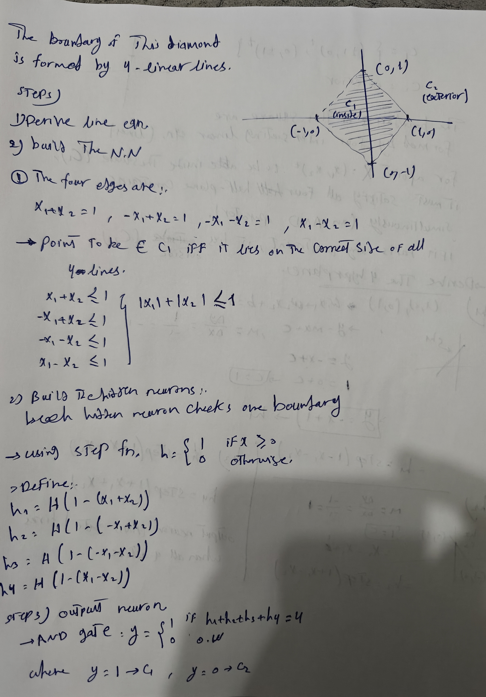
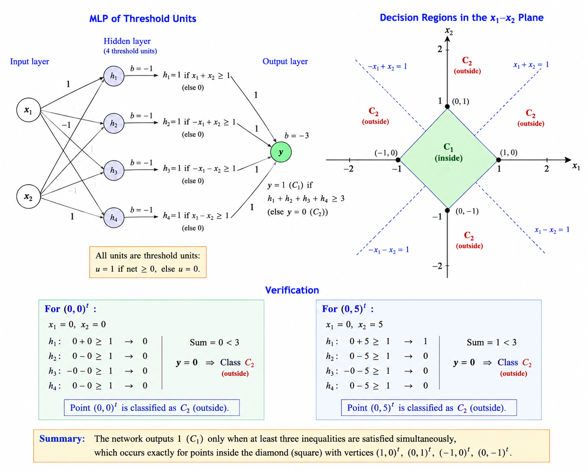

---

[Fall 2018 F]</br>
**Question-2:** Consider the following classification problem. There are two real-valued features $x_1$ and $x_2$, and a binary class label.</br>
The class label is determined by:
 
$$y = \begin{cases} 1 & \text{if } x_2 \geq |x_1| \\ 0 & \text{otherwise} \end{cases}$$

1. Can this function be perfectly represented by a feedforward neural network without a hidden layer? Why or why not?
2. Consider a simpler problem for a moment, the classification problem $y = \begin{cases} 1 & \text{if } x_2 \geq x_1 \\ 0 & \text{otherwise} \end{cases}$</br>
    Design a single neuron that represents this function. Pick the weights by hand. Use the hard threshold function applied to a linear combination of the x inputs.
3. Now go back to the classification problem at the beginning of this question. Design a two layer feedforward network (that is, one hidden layer with two layers of weights) that represents this function. Use the hard threshold activation function as in the previous question.

**Solution:**</br>
1. No. The boundary $x_2=|x_1|$ is a V-shape (non-linear). A single-layer perceptron can only form one linear boundary.
2. For $x_2 \geq x_1$, i.e., $x_2 - x_1 \geq 0$:

$$z = -x_1 + x_2,\quad y = \text{step}(z)=H(Z),\quad w_1=-1,\ w_2=+1,\ b=0$$
$$H(z)=\begin{cases} 1 & \text{if } z \geq 0 \\ 0 & \text{if } z < 0 \end{cases}$$
$$y=\begin{cases} 1 & \text{if } x_2 \geq x_1 \\ 0 & \text{if } x_2 < x_1 \end{cases}$$


  ```
  x₁ ----(-1)\
              \
              >----[ H ]---- y
              /
  x₂ ----(+1)/
  ```

3. $x_2 \geq |x_1|$ means $x_2 \geq x_1$ AND $x_2 \geq -x_1$:

- Hidden neuron to $h_1$: $h_1 = \text{step}(x_2 - x_1)$ —> detects $x_2 \geq x_1$
  - Weights: $w_1^{(1)}=(-1,1)$, bias $b_1=0$
- Hidden neuron to $h_2$: $h_2 = \text{step}(x_2 + x_1)$ —> detects $x_2 \geq -x_1$
  - Weights: $w_2^{(1)}=(1,1)$, bias $b_2=0$
- Output neuron computes the logical AND of $h_1, h_2$: $y=H(h_1 + h_2 - 2)$ — fires only when both active
  - Weights: (-1,1), bias: -2


```
                 Hidden Layer

           h₁ = H(-x₁ + x₂)

x₁ ----(-1)\         /----(1)---
             \       /            \
              > h₁ >              \
             /       \              \
x₂ ----(+1)/         \              > y = H(h₁+h₂-2)
                                    /
                                   /
x₁ ----(+1)\         /----(1)-----
             \       /
              > h₂ >
             /       \
x₂ ----(+1)/         \

           h₂ = H(x₁ + x₂)
```

---

[Fall 2020 F]</br>
**Questiob-3:** Construct a linear classifier which is able to separate the following two-dimensional samples correctly: $C_1 : {(2,1)^t } 𝐶2 : {(0,1)^t , (−1,1)^t }$ </br>
**Solution:**</br>
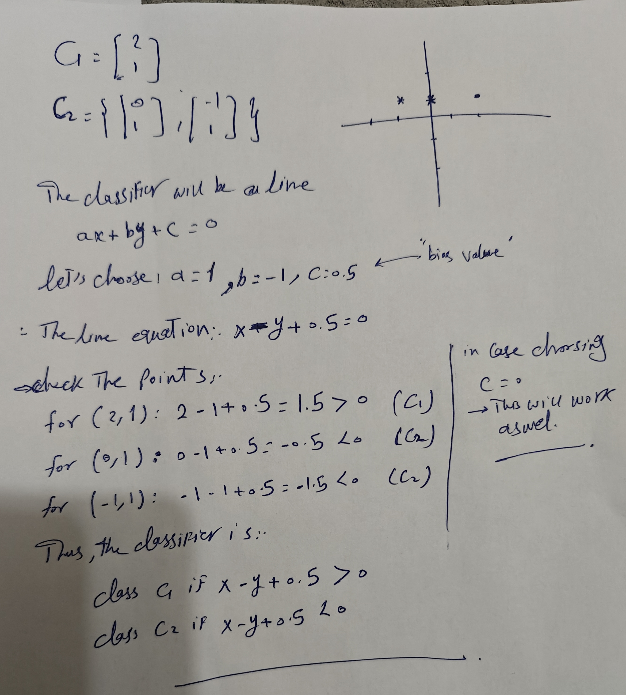
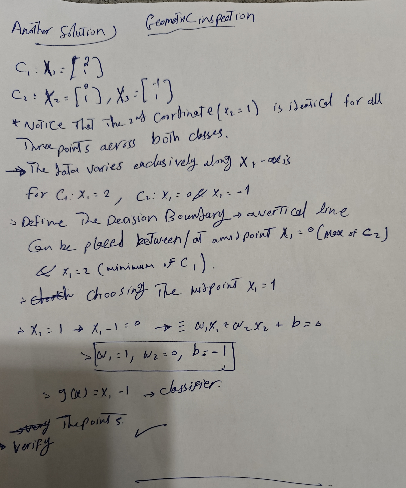

--- 

[Fall 2020 F, summer 2022 F]</br>
**Question-4:** Why is it necessary to include non-linearities in a neural network?</br>
**Solution:**</br>
To enable the network to learn complex patterns and representations. Without non-linearities, the network would be equivalent to a single-layer linear model.

Without non-linearities, every layer is a linear map. A composition of linear functions is itself linear:

$$W_L(\cdots W_2(W_1 x)\cdots) = W^* x$$

No matter how many layers, the network collapses to a single linear transformation. Non-linear activations break this collapse, enabling the network to approximate arbitrarily complex functions (Universal Approximation Theorem) and capture non-linear patterns in data.

---

[Fall 2023 M]</br>
**Question-5:** In a 2D space, suppose we have a classification task where points inside a triangle formed by the coordinates (1,1), (-1,1) and (0,-1) are classified into the first class, while points outside this triangle belong to the second class.</br>
Design a perceptron neural network using nodes with step functions to address this problem.</br>
Provide a clear specification of teh number of nodes in each layer, along with the associated weights and biases for all nodes.</br>
**Solution:**</br>

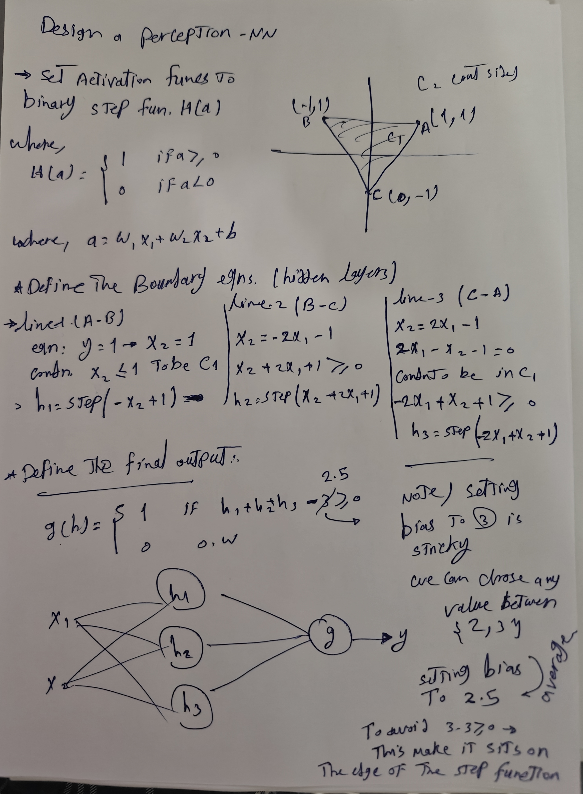


---

[Spring 2025 F]</br>
**Question-6:** What is the convergence condition of the perceptron algorithms?</br>
**Solution:**</br>
!!!!

---

[Fall 2020 M]</br>
**Question-7:** In the perceptron algorithm, what is the reason to use the learning rate 𝜌 :

$$W_(t+1)=W_t-\rho_t\sum_{x\in Y} \delta_x x$$

**Solution:**</br>
!!!!

---

[Summer 2022 M]</br>
**Question-8:** Consider the following dataset:

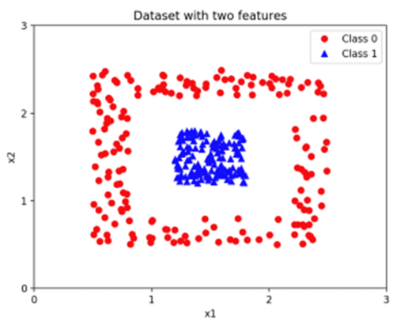

You want to develop a model to perform binary classification based on the perceptron algorithm. Suppose you’re using a small neural network with the architecture shown below.

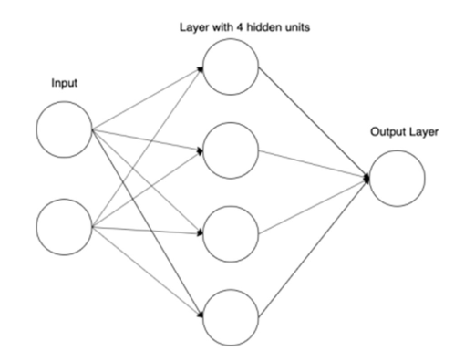

Determine the hidden and output layers weights and biases.</br>

**Solution:**</br>
!!!!

---

[Summer 2022 M]</br>
Q10. Consider the xnor problem. Can the perceptron algorithm solve it? If no, explain why. If yes, solve it using inspection. If we were to use the perceptron algorithm to obtain the solution, will the two answers from the inspection and the perceptron algorithm be the same? Explain.</br>

---

[Fall 2023 M]</br>
Q11. Consider a classification problem where any point inside a cube of unit length will belong to the first class while outside points are in the second class. Design a perceptron neural network (using nodes with step functions) to solve this problem. Cleary state the number of nodes in each layer and the associated weights and biases for all nodes

---

[Fall 2020 F]</br>
**Question-:** Assume a shallow neural network with 5 nodes used to train 10,000 labeled image feature vectors:
1. Using a perceptron criterion, find an expression for the multiclassification loss and find the derivative w.r.t each weighing coefficient vector. You must illustrate the size of all involved vectors/matrices.
2. Repeat part (a) using the SVM criterion.</br>
In your solution, you must list the training algorithms and the update rules of each
weighting vector. Data structures must be illustrated as well.<br>

---
---

## Activation Functions
[Fall 2020 F, summer 2022 F]</br>
**Question-1:** During the training of a backpropagation, as the gradient flows backwards through a tanh function. Would the gradient become smaller, equal or larger (Choose all possible answers) (Recall: if $z=\tanh(x)$ then $\frac{\partial z}{\partial x}=1-z^2$)</br>
**Solution:**</br>
The gradient can be smaller or remain equal, but it cannot become larger.</br>
tanh derivative: $1 - \tanh^2(x) \in (0, 1]$.

- **Equal (= 1):** only when $x = 0$
- **Smaller (< 1):** for all $x \neq 0$
- **Never larger:** tanh can only attenuate, never amplify, the gradient. It will never exceed 1.

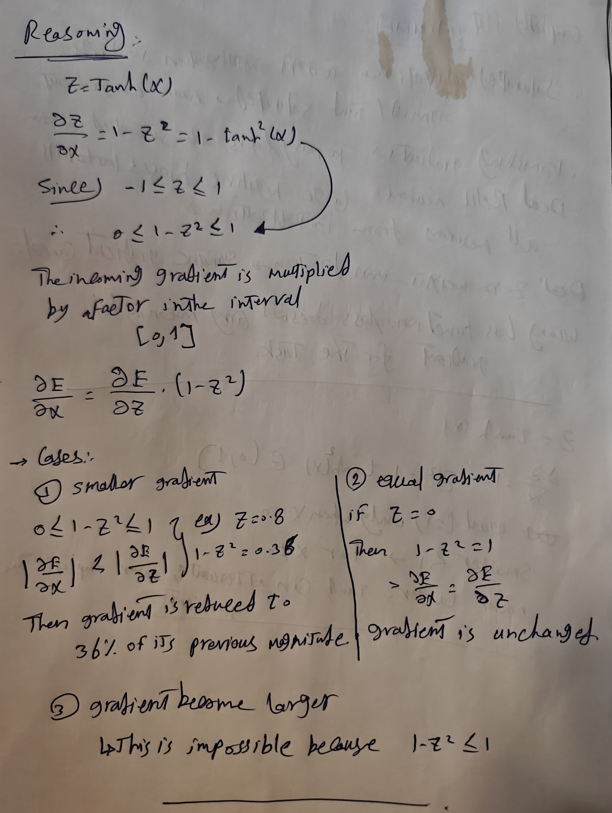

---

[Fall 2020 F, Spring 2021 F, Fall 2021 F, summer 2022 F]</br>
**Question-2:** Which of the following activation functions can lead to vanishing gradients and why? Sigmoid, tanh, relu, and leaky-relu.</br>
Which activation functions can lead to vanishing gradients?</br>
**Solution:**</br>
- **Sigmoid → YES.** Saturates at both ends; derivative $\sigma(1-\sigma) \leq 0.25$. Gradients shrink exponentially through layers.
- **tanh → YES.** Saturates at $\pm 1$; derivative $1 - \tanh^2(x) \leq 1$, approaches 0 at saturation.
- **ReLU → Partial.** Gradient = 1 for $x > 0$ (no vanishing), but = 0 for $x \leq 0$ — neurons permanently die and propagate zero gradient ("dying ReLU").
- **Leaky-ReLU → No.** Gradient = 1 for $x > 0$, $\alpha$ (small positive) for $x \leq 0$. No saturation, no dead neurons.

---

[Fall 2021 F]</br>
**Question-3:** What advantages does using ReLU activation have over sigmoid activations?</br>
**Solution:**</br>
1. **No vanishing gradient (active region):** Gradient =1 for $x>0$, no exponential shrinkage.
2. **Sparsity:** Outputs exactly 0 for $x \leq 0$ — sparse activations, computationally efficient, implicit regularization.
3. **Computational simplicity:** $\max(0, x)$ — no exponentials needed.
4. **Faster convergence:** Constant gradient in active region enables faster training in deep networks.
5. **No output saturation (positive side):** Unbounded above — no saturation for positive inputs.

---

[Fall 2021 F]</br>
**Question-4:** ReLU layers have non‐negative outputs. What is a negative consequence of this problem? What other types were developed to address this issue?</br>
**solution:**</br>
A negative consequence of ReLU's non-negative outputs is that it can lead to dead neurons during training.</br>
 If a neuron's pre-activation is always negative (large negative bias or bad initialization), Relu always outputs 0. The gradient is also 0, so weights never updates; The neuron is permanently dead.

**Alternatives:** Leaky ReLU ($\alpha x$ for $x \leq 0$), ELU (exponential for negatives), PReLU (learnable $\alpha$), GELU/Swish (used in transformers).

---

[Spring 2022 M]</br>
Q3. Recall the logistic activation function σ and the tanh activation function:

$$\sigma (z)=\frac{1}{1+\exp^{-z}}$$

$$tanh(z)=\frac{\exp^z - \exp^{-z}}{\exp^z + \exp^{-z}}$$

Both activation functions have a sigmoidal shape.</br>
1. Give the Jacobian matrix ∂y/∂z of the tanh activation function, applied elementwise to all of the units in a layer.
2. One of the difficulties with the logistic activation function is that of saturated units. Briefly explain the problem, and whether switching to tanh fixes the problem. (You may refer to your answer from part (a) or sketch the activation functions.)
3. Briefly explain one way in which using tanh instead of logistic activations makes optimization easier.

---

[Spring 2025 F]</br>
Q4. Explain why deep neural networks with ReLU activation functions can be more effective than shallow networks in modeling complex, high‐dimensional data.</br>

---
---

## NN
[Fall 2020 F, summer 2023 F]</br>
**Question-1:** Why Xavier Initialization is used for and it is important?</br>
**Solution:**</br>
Xavier Initialization is used to initialize the weights of the network in a way that keeps the variance of the activations and gradients roughly the same across all layers. It is important because it helps to avoid the problems of vanishing and exploding gradients.

---

[Fall 2021 F]</br>
**Question-2:** The figure below explains the concept of early stopping. Fill‐in the blanks. (1) and (2) describe the axes. (3) and (4) describe values on the vertical and horizontal axis. (5) and (6) describe the curves

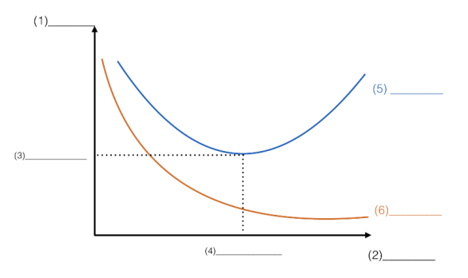

**Solution:**</br>
1. Y-axis: **Error / Loss**
2. X-axis: **Number of epochs / Training iterations**
3. Y-axis value: **Minimum validation error**
4. X-axis value: **Early stopping point**
5. Upper curve (rising): **Validation / Test error**
6. Lower curve (falling): **Training error**

---

[Fall 2018 M, Fall 2020 F, summer 2022 F]</br>
**Question-3** Explain why a multilayer network with zero initial weights will be unable to perform the required mapping</br>
**Solution:**</br>
Because All neurons in the same layer compute identical outputs and receive identical gradients during training, leading to no differentiation in the feature space. The network will fail to break the symmetry and learn distinct features.

---

[Fall 2021 F]</br>
**Question-4:** Give all the possible solution to the overfitting problem.</br>
**Question-5:** What is meant by overfitting? State all the possible methods to avoid it?</br>
**Solution:**</br>
**Overfitting**: the model learns the training data too well - including noise - and generalizes poorly. Training error << test.</br>
**Method to avoid:**</br>
1. More training data / data augmentation.
2. Early stopping.
3. L1/L2 regularization (weight penalties).
4. Dropout.
5. Reduce model complexity (fewer layers/neurons).
6. Batch-normalization.
7. Cross-validation.
8. Ensemble methods.

---

[Fall 2021 F]</br>
**Question-6:** Compute the derivatives of the BatchNorm layer with respect to parameters $\gamma, \beta$</br>
**Solution:**</br>
Forward: $\hat{x}_i = (x_i - \mu)/\sigma$, $y_i = \gamma\hat{x}_i + \beta$.

$$\frac{\partial L}{\partial \gamma} = \sum_i \frac{\partial L}{\partial y_i} \cdot \hat{x}_i$$

$$\frac{\partial L}{\partial \beta} = \sum_i \frac{\partial L}{\partial y_i}$$

$$\frac{\partial L}{\partial \hat{x}_i} = \frac{\partial L}{\partial y_i} \cdot \gamma$$

$$\frac{\partial L}{\partial x_i} = \frac{1}{\sigma}\left[\frac{\partial L}{\partial \hat{x}_i} - \frac{1}{m}\sum_j \frac{\partial L}{\partial \hat{x}_j} - \hat{x}_i \cdot \frac{1}{m}\sum_j \frac{\partial L}{\partial \hat{x}_j}\hat{x}_j\right]$$

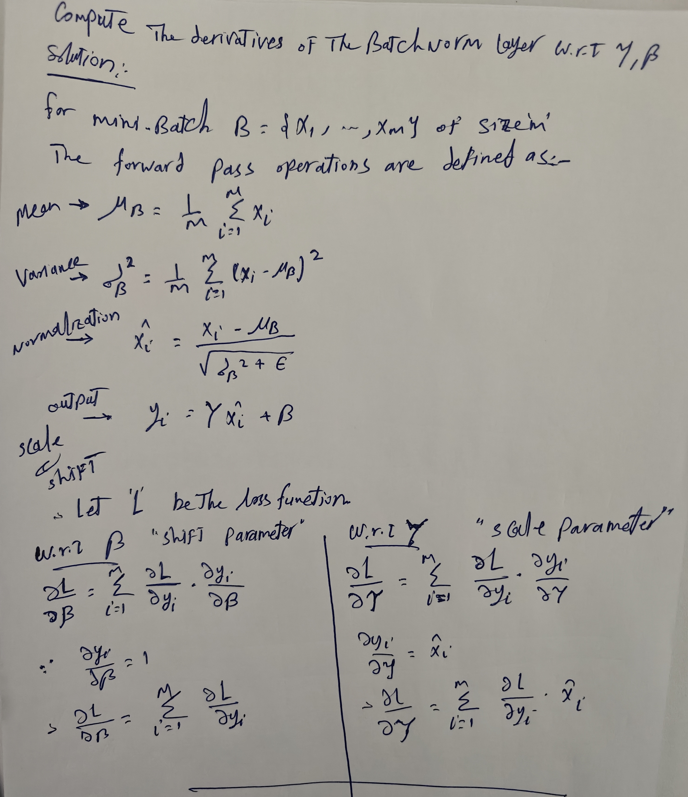

---

[Spring 2021 F, Fall 2023 M]</br>
**Question-7** Explain why a deep neural network with linear activation functions throughout and no bias parameters is equivalent to a shallow neural network.</br>
**Solution:**</br>
A composition of linear transformations is linear:

$$f(x) = W_L \cdots W_2 W_1 x = W^* x$$

where $W^* = W_L \cdots W_1$ is a single matrix. No matter how many layers, the composite is a single linear map — equivalent to one layer with weight $W^*$.

---

[Fall 2023 M]</br>
**Question-8:** What would be the output value of a neural network structured as 4-3-1, where all activation functions are sigmoidal and all weights and biases are initialized to zero, when a single input vector is forwarded through the network?</br>
**Solution:**</br>
All neurons compute $z = W \cdot \mathbf{0} + 0 = 0$, and $\sigma(0) = 0.5$.

- Hidden layer: all 3 neurons output **0.5**
- Output neuron: $z = W \cdot [0.5, 0.5, 0.5]^T = 0$ (weights are zero) → $\sigma(0) =$ **0.5**

Output is **0.5**, regardless of input. This illustrates the symmetry-breaking failure.

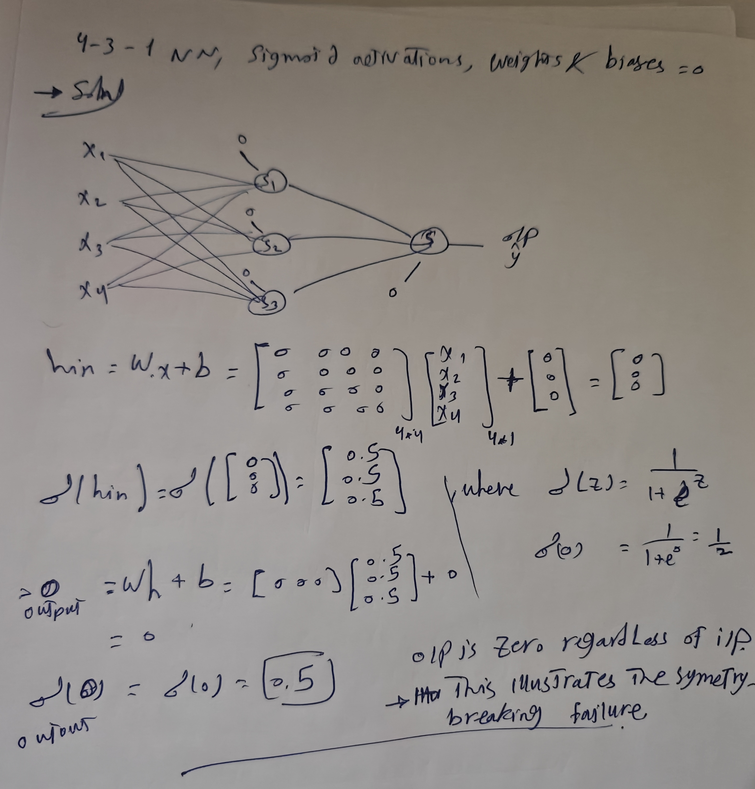

---

**Question-9:** What would be the output of a neural network with a 2‐2‐1 structure, where all activation functions are tanh and all weights and biases are initialized to 0.1, when a single input vector [0.5, ‐0.5] is forwarded through the network? Provide the calculations for each layer.</br>

---

[Fall 2023 F]</br>
**Question-10:** Let p be the probability of keeping neurons in a dropout layer. We have seen that in forward passes, we often scale activations by dividing them by p during training time. You accidentally train a model with dropout layers without dividing the activations by p. How would you resolve this issue at test time? Justify your answer.</br>

---

[Spring 2022 M]</br>
**Question-11:** Consider a neural net for a binary classification which has one hidden layer as shown in the figure. We use a linear activation function $h(z) = cz$ at hidden units and a sigmoid activation function $g(z)=\frac{1}{1+\exp^{-z}}$ at the output unit to learn the function for P(y = 1|x, w) where $x=(x_1, x_2)^T$ and $w=(w_1, w_2, ...., w_9)^T$.

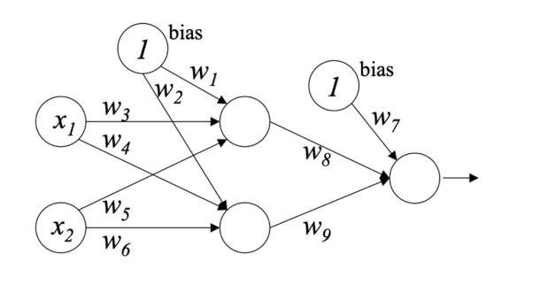

1. What is the output $P(y=1 | x,w)$ from the above neural net? express it in terms of $x_i, c$ and weights $w_i$. What is the final classification boundary?
2. Draw a neural net with no hidden layer which is equivalent to the given neural net, and write weights w˜ of this new neural net in terms of $c$ and $w$.
3. Is it true that any multi‐layered neural net with linear activation functions at hidden layers can be represented as a neural net without any hidden layer? Briefly explain your answer

---

[Fall 2023 F]</br>
**Question-12:** The following plot shows the general trend for how the training and testing error change as we increase the sample size.
1. Which curve represents the training error?
2. What does the gap between the two curves represent?

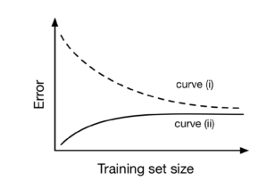

---

[Spring 2025 F]</br>
Q17. What would be the output of a neural network with a 2‐2‐1 structure, where all activation functions are tanh and all weights and biases are initialized to 0.1, when a single input vector [0.5, ‐0.5] is forwarded through the network? Provide the calculations for each layer.

---
---

## BackPropagation
[Fall 2020 F, Summer 2023 F]</br>
**Question-1:** A 1-1-1 feedforward network is trained using the backpropagation (BP) algorithm.</br>
The output node has a linear activation function, i.e., $f(n)=\alpha n$, where $n$ is the net input to that node, and the hidden node function is a ReLU function. The slobe $\alpha$ is consider a learnable parameter.
1. Draw the computational graph for the network. Identify the learnable parameters of the network.
2. Derive the BP learning rules for all learnable parameters.

**Solution:**</br>
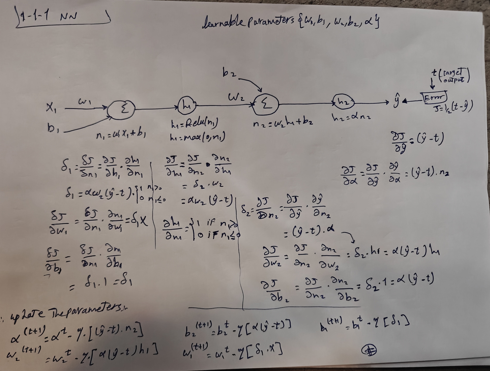

---

[Fall 2023 M]</br>
**Question-2:** Derive the backpropagation for the computational graph shown below:</br>
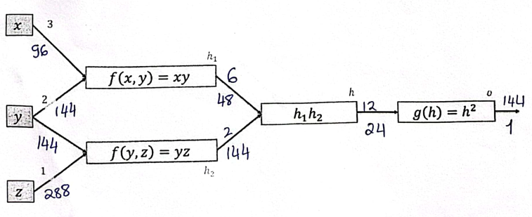

**Solution:**</br>
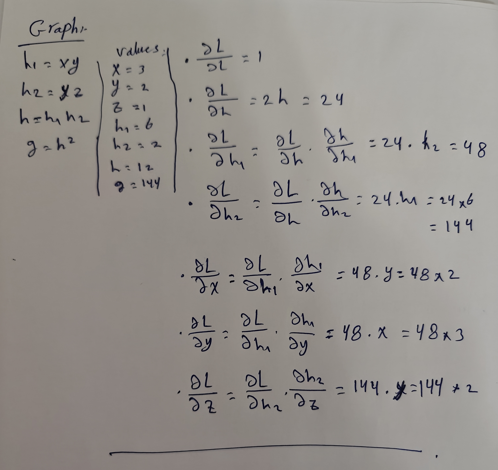

---

[Fall 2018 F]</br>
**Question-3:** You want to train a neural network to drive a car. Your training data consists of grayscale 64 × 64 pixel images. The training labels include the human driver’s steering wheel angle in degrees and the human driver’s speed in miles per hour. Your neural network consists of an input layer with 64 × 64 = 4, 096 units, a hidden layer with 2,048 units, and an output layer with 2 units (one for steering angle, one for speed). You use the ReLU activation function for the hidden units and no activation function for the outputs (or inputs).</br>
1. Calculate the number of parameters (weights) in this network. You can leave your answer as an expression. Be sure to account for the bias terms.
2. You train your network with the cost function $J=\frac{1}{2}|y-z|^2$. Use the following notation.
  - $x$ is a training image (input) vector with a 1 component appended to the end, $y$ is a training label (input) vector, and $z$ is the output vector. All vectors are column vectors.
  - $r(\gamma)=\max{x,\gamma}$ is the ReLU activation function, $r'(\gamma)$ is its derivative (1 if $\gamma > 0,0$ otherwise), and $r(v)$ is $r(.)$ applied component-wise to a vector.
  - $g$ is the vector of hidden unit values before the ReLU activation functions are applied, and $h=r(g)$ is the vector of hidden unit values after they are applied (but we append a 1 component to the end of $h$).
  - $V$ is the weight matrix mapping the input layer to the hidden layer; $g=Vx$.
  - $W$ is the weight matrix mapping the hidden layer to the output layer; $z=Wh$.</br>
Derive $\partial J/\partial W_{ij}$
1. Write $\partial J/\partial W$ as an outer product of two vectors. $\partial J/\partial W$ is a matrix with the same dimensions as $W$; it's just like gradient, except that $W$ and $\partial J/\partial W$ are matrices rather than vectors.
2. Derive $\partial J/\partial W_{ij}$  

**Solution:**</br>
!!!!

---

[Summer 2022 M, Fall 2023 M]</br>
**Question-4:**  Derive the backpropagation for the computational graph shown below:

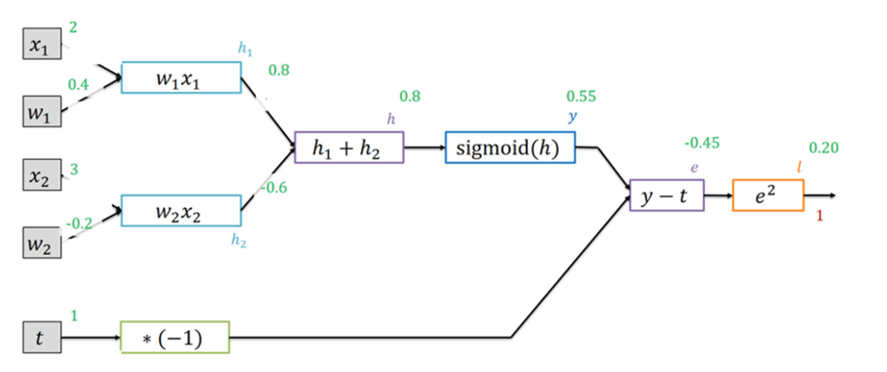

**Solution:**</br>

---

[Spring 2025 F]</br>
Q4. Derive the backpropagation for the computational graph: z = (x ‐ y) / sigmoid(x), where x = a*b and y = b+c.

---

Q7. Derive the backpropagation graph: $z=(x-y) / sigmoid(x)$, where x=a*b and y=b+c</br>

---
---

## Optimization
[Fall 2021 F]</br>
**Question-1:** What is a saddle point? What is the advantage/disadvantage of Stochastic Gradient Descent in dealing with saddle points?</br>
**Solution:**</br>
**Saddle point:** A critical point (gradient = 0) that is a local minimum in some dimensions and a local maximum in others.

**SGD Advantage:** Stochastic noise in gradient estimates rarely hits the exact zero-gradient point — perturbations can push it along descending directions, enabling escape.

**SGD Disadvantage:** The noise can also make convergence slower and less stable, requiring careful tuning of learning rates and other hyperparameters. On extended flat plateaus near saddle points, near-zero gradients mean extremely slow traversal — can take very many iterations.

---

[Spring 2021 F, Fall 2023 F]</br>
**Question-2:** In stochastic gradient descent (SGD)</br>
1. For small batch sizes, the number of iterations required to reach the target loss decreases as the batch size increases. Why is that?
2. For large batch sizes, the number of iterations does not change much as the batch size is increased. Why is that?

**Solution:**</br>
**Part 1 (small batches):** Small batches produce noisy gradient estimates. As batch size increases in the small regime, gradient estimates become more accurate → fewer iterations needed to reach target loss. This is the **linear scaling regime**.</br>
**Part 2 (large batches):** At large batch sizes, gradient estimates are already very accurate — more samples don't reduce variance meaningfully. The bottleneck shifts to the optimization landscape geometry. Iterations-to-convergence plateaus — this is the **saturation regime**.</br>

---

[Spring 2021 F, Spring 2022 F, Fall 2023 F]</br>
**Question-3:** You want to train the following model using gradient descent. Here, the input x and target t are both scalar-valued.

$$z=w_0+w_1x+w_2x^2,y=1+e^z, J=\frac{1}{2}(\log y-\log t)^2$$

Determine the backprop rules which will let you compute the loss derivative, $\frac{\partial J}{\partial w_2}$. Your equations should refer to previously computed values, e.g., your formula for $\frac{\partial J}{\partial z}$ should use the formula for $\frac{\partial J}{\partial y}$</br>
**Solution:**</br>
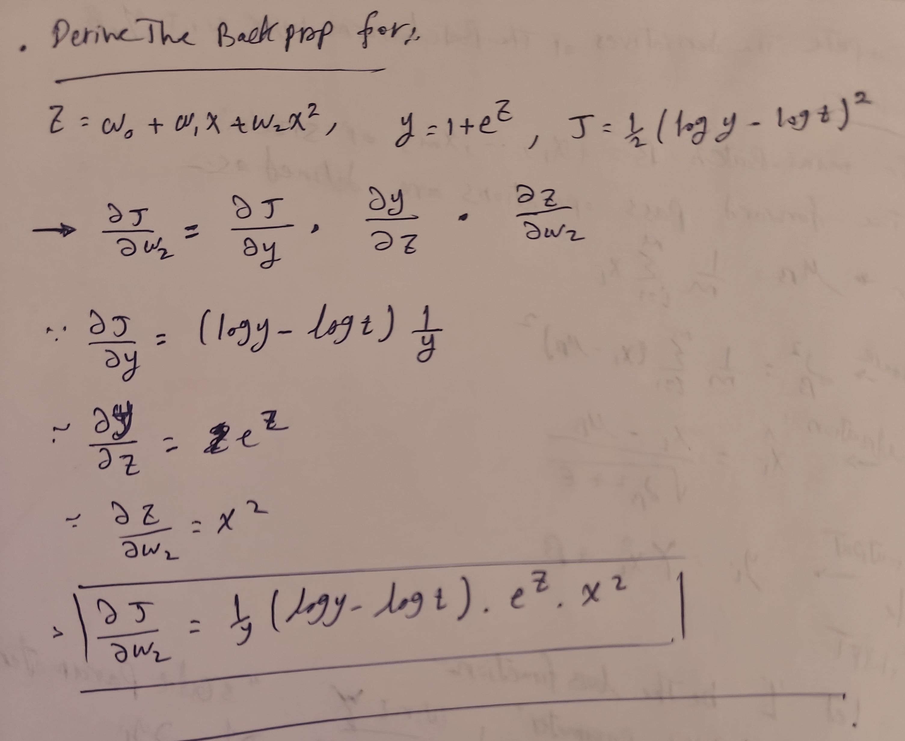

---

[Spring 2021 F, Spring 2022 F, Fall 2023 F]</br>
**Question-4:** Consider a model which has 3 parameters, 𝑤1 , 𝑤2 , 𝑤3 . Let 𝐽(θ) be the loss function and Ω(θ) be the regularizer. For example, if we use L2 regularization, then $Ω(θ) = ||θ||^2$ . The corresponding gradient descent rule for updating 𝑤1 will be $w_1=w_1-\mu\frac{\partial J}{\partial w}-2\mu \alpha w_1$ and we will have similar equations for 𝑤2 and 𝑤3 .</br>
Why do we often refer to L2-regularization as weight decay"? Explain your point. Suppose further that instead of L2 regularization, we will use L4 regularization, what will be the update rule for 𝑤1. </br>
**Solution:**</br>
**L2 weight decay:** Update rule with L2 penalty ($\Omega = \|\theta\|^2$, gradient $= 2\alpha w_1$):

$$w_1 \leftarrow w_1 - \mu\frac{\partial J}{\partial w_1} - 2\mu\alpha w_1 = (1-2\mu\alpha)w_1 - \mu\frac{\partial J}{\partial w_1}$$

The factor $(1-2\mu\alpha) < 1$ multiplies $w_1$ at every step — shrinking (decaying) weights toward zero independently of the loss gradient. Hence "weight decay."

**L4 Regularization:** $\Omega = \|\theta\|_4^4 = \sum w_i^4$, gradient $= 4w_1^3$:

$$w_1 \leftarrow w_1 - \mu\frac{\partial J}{\partial w_1} - 4\mu\alpha w_1^3$$

L4 penalizes large weights more aggressively (cubic decay rate vs linear in L2).

---

[Fall 2023 M]</br>
**Question-5:** Note that the update rule for momentum based gradient descent is given by

$$\delta w_t=\alpha \Delta w_{t-1} - \eta \nabla w_t$$

$$w_{t+1}=w_t+\Delta w_t$$

Let $\eta = 1$ and $\alpha = 0.9$ and $\nabla w_1$ be the derivative computed at the first time step. If you run momentum based gradient descent for k iterations, what fraction of $\nabla w_1$ will be part of $\Delta w_k$ ?</br>
**Solution:**</br>
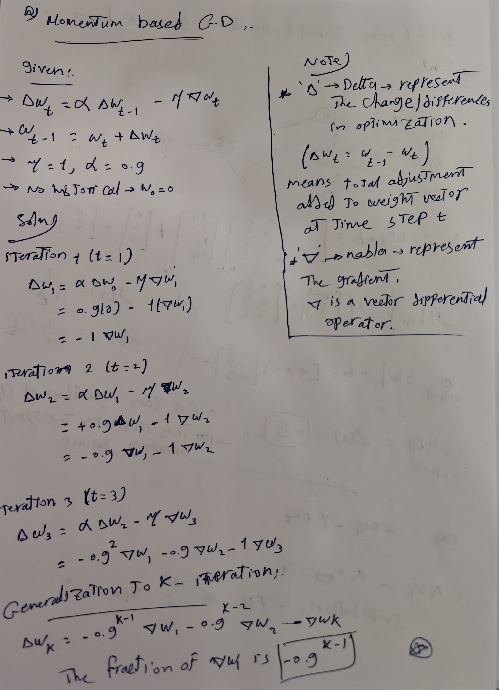

---

[Fall 2023 M]</br>
**Question-6:** Prove, mathematically, that the ReLU function is a nonlinear function. You may use the superposition theorem in your proof.</br>
**Solution:**</br>

$ReLU(x)=max(0,x)$</br>
Let $x_1=1, x_2=-1$</br>
$ReLU (x_1+x_2)=ReLU(1+(-1))=ReLU(0)=max(x,0)=0$</br>
$ReLU(x_1)+ReLU(x_2) = ReLU(1)+ReLU(-1)=max(0,1)+max(0,-1)=1+0=1$</br>
$ReLU(x_1+x_2) != ReLU(x_1)+ReLU(x_2)$</br>
This ReLU function is non-linear as it does not satisfy the additivity property.

---

[Summer 2023 F]</br>
**Question-7:** The Batch Normalization can be a linear operation or non‐linear operation. Justify this statement.</br>
**Solution:**</br>
Statement: True. Batch Normalization (BN) operates as either a linear or non-linear transformation depending on whether you evaluate a single isolated sample or a batch of samples together.

- Non-Linear Operation (Across a Batch / During Training): The normalization step calculates the mini-batch mean (μB​) and variance ($σ^2B$​) directly from the input data features. Because the variance formula involves square and square root functions of the inputs, the transformation mapping an input vector xi​ to its normalized output $\hat{x}_i$​ is fundamentally non-linear.

- Linear Operation (For an Isolated Sample / During Inference): Once training is complete, the moving average mean ($μ_{running}$​) and variance ($σ_{running}^2$​) are frozen into fixed constant scalars. Similarly, the learned parameters γ and β are static constants. For an individual test sample x, the entire operation simplifies to:
    
$y =\left(\frac{\gamma}{\sqrt{\sigma_{\text{running}}^2 + \epsilon}}\right)x+\left(\beta -\frac{\gamma \cdot \mu_{\text{running}}}{\sqrt{\sigma_{\text{running}}^2 + \epsilon}}\right)$

Because this takes the form y=mx+c, Batch Normalization becomes a purely linear (affine) transformation.

---

[Spring 2022 F]</br>
**Question-8:** What is the difference between batch normalization at training vs. test time?</br>
**Solution:**</br>

| Aspect | Training | Test time |
|--------|----------|-----------|
| Mean $\mu$ | Current mini-batch | Fixed running average |
| Variance $\sigma^2$ | Current mini-batch | Fixed running average |
| $\gamma, \beta$ | Learned via backprop | Fixed |
| Nature | Non-linear (stats depend on batch) | Linear deterministic transform |

---

[Fall 2021 F, Summer 2023 F]</br>
**Question-9:** What advantages does using ReLU activations have over sigmoid activations?</br>
**Solution:**</br>
1. **No vanishing gradient (active region):** Gradient = 1 for $x > 0$, no exponential shrinkage.
2. **Sparsity:** Outputs exactly 0 for $x \leq 0$ — sparse activations, computationally efficient, implicit regularization.
3. **Computational simplicity:** $\max(0, x)$ — no exponentials needed.
4. **Faster convergence:** Constant gradient in active region enables faster training in deep networks.
5. **No output saturation (positive side):** Unbounded above — no saturation for positive inputs.

---

[Fall 2023 M]</br>
**Question-10:** Explain why “The backpropagated gradient through a tanh non‐linearity is always smaller or equal in magnitude than the upstream gradient.”</br>
**Solution:**</br>
tanh derivative: $\frac{\partial}{\partial x}\tanh(x) = 1 - \tanh^2(x) \in (0, 1]$ for all $x$.

Backprop: downstream = upstream $\times (1-\tanh^2(x))$.

Since the multiplier is always $\leq 1$, the downstream magnitude cannot exceed upstream. Equals 1 only at $x = 0$, strictly less everywhere else. tanh always attenuates (never amplifies) the gradient. $\square$

---

[Fall 2023 M]</br>
**Question-11:** You design a fully connected neural network architecture where all activations are sigmoids. You initialize the weights with large positive numbers. Is this a good idea? Explain your answer.</br>
**Solution:**</br>
**Bad idea.** Large positive weights drive pre-activations to large positive values → sigmoid saturates near 1 → derivative $\sigma(1-\sigma) \approx 0$ → gradients vanish from the start → training fails. Additionally, all neurons saturate in the same direction (symmetry not broken), compounding the problem. Use Xavier/He initialization with small random weights.

---

[Fall 2018 M]</br>
**Question-12:**  What are the differences between ”global” and ”local” minima? how can one determine if a BP- trained network is stuck at one of the local minima? and how to correct this problem?</br>
**Solution:**</br>
- **Global minimum:** The single lowest point of the loss surface — optimal solution.
- **Local minimum:** Lower than immediate neighbors but not globally lowest — network can get stuck.

**Detection:** Train multiple times from different random initializations. Significantly varying results indicate local minima traps.

**Fixes:** Multiple random restarts; SGD noise to escape shallow minima; momentum; learning rate schedules (warm restarts); simulated annealing.

> In high-dimensional spaces, true local minima are rare — most critical points are saddle points.

---

[Fall 2020 F]</br>
**Question-13:** Compare briefly between the behaviour of SGD with modern optimization techniques (illustrated in the course lectures) when encountering saddle and local minima points</br>
**Solution:**</br>
| Scenario | SGD | Adam/RMSProp |
|----------|-----|--------------|
| Saddle points | Near-zero gradient → stalls. Stochastic noise may help escape slowly. | Adaptive rates rescale per-parameter; momentum provides gradient memory → faster escape. |
| Local minima | May trap. Stochastic noise can escape shallow ones. | Also susceptible, but momentum and adaptive rates help navigate. In deep nets, both find similar quality minima. |

---

[Spring 2022 M]</br>
**Question-14** You come across a nonlinear function that passes 1 if its input is nonnegative, else evaluates to 0, i.e.

$$f(x)=\begin{cases} 1 & \text{if } x \geq 0 \\ 0 & \text{if } x < 0 \end{cases}$$

A friend recommends you use this non‐linearity in your neural network with the Adam optimizer. Would you follow their advice? Why or why not?</br>
**Solution:**</br>
!!!!

---

[Fall 2020 F]</br>
**Question-15: **[Not Included] The following neural network (Fig. 1 (a)) is designed to represent an AND gate which has the following truth table (b). The output nod has a tanh function.</br>

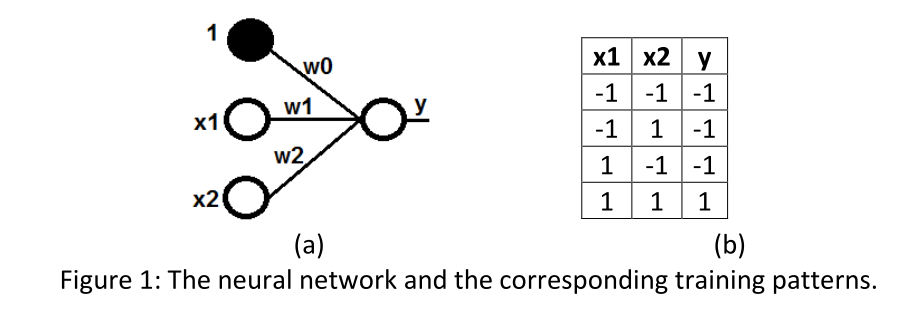

Using the NR optimization, derive the learning rules for the parameters w0, w1, and w2. Put the learning rule in the matrix form.

---
---

## NN Training Process
[Fall 2020 F]</br>
**Question-1:** When the loss function is almost completely flat when you start training a Neural Network. What could be the cause?</br>
**solution:**</br>
- **Saturated activations**: Weights initialized too large → sigmoid/tanh saturate → near-zero gradients.
- **Vanishing gradients**: Too many layers with saturating activations.
- **Dead ReLU neurons**: Large negative biases kill all neurons from initialization.
- **Learning rate too small**: Gradients exist but updates are negligibly small.
- **Zero weight initialization**: Symmetric gradients cancel.
Wrong loss function: Loss doesn't carry meaningful gradient for the task.

---

[Fall 2020 F]</br>
**Question-2:** After training a neural network, there is a large gap between the training accuracy and the test accuracy. Which methods are commonly used to reduce this gap?</br>
**Solution:**</br>
Large gap indicates overfitting. Remedies:

- More training data or data augmentation
- L1/L2 regularization
- Dropout
- Early stopping
- Reduce model complexity (fewer layers/neurons)
- Batch normalization
- Cross-validation for hyperparameter selection

---

[Fall 2021 F]</br>
**Question-3:** Explain why dropout in a neural network acts as a regularizer.</br>
**Solution:**</br>
**Short Answer**: Dropout acts as a regularizer by randomly setting a subset of activations to zero during training, which prevents neurons from co-adapting too much. This forces the network to learn more robust features that are useful in conjunction with many different random subsets of the other neurons.

**Long Answer**: 
- Prevents Co-Adaptation of Neurons: By randomly deactivating a percentage of neurons during each training step, the network cannot rely on specific individual nodes or combinations of nodes to pass information. This forces every neuron to learn more robust, self-reliant features.
- Ensemble Approximation: Deactivating different random neurons at each iteration essentially trains a vast number of unique, smaller sub-networks. At test time, using the full network acts as a geometric average (an ensemble) of all these sub-networks, which significantly boosts generalization.
- Reduces Network Capacity: Temporarily removing nodes simplifies the model architecture during training, making it harder for the network to memorize noise or overfit the specific details of the training data.
- Spreads Out Weights: Because any neuron might disappear at any moment, the network avoids assigning extremely high weights to a few dominant features. Instead, it distributes the weight values more evenly across all nodes, functioning similarly to an L2​ regularizer (weight decay).

---

[Spring 2022 F]</br>
**Question-4:** Explain why Dropout could improve performance and when we should use it?</br>
**Solution:**</br>
Dropout reduces overfitting via the regularization mechanisms described in Q3. Use it when:
- Large networks with many parameters relative to training data
- Fully connected layers (less common in conv layers due to weight sharing)
- Significant gap between training and validation accuracy

Avoid when: Dataset is very small (noise dominates), model is already underfitting, or at inference time (scale by 
$\rho$ instead).

---

[Fall 2021 F, summer 2022 F, Fall 2023 F]</br>
**Question-5:** What features of ResNet alleviate the vanishing gradient problem?</br>
**Solution:**</br>
By using residual connections or skip connections. These connections provide an alternative path for the gradient to flow through the network; allowing it to bypass several layers, thus preventing the gradient from becoming too small.

**Skip (residual) connections.** Output: $F(x) + x$ instead of $F(x)$. During backprop:

$$\frac{\partial L}{\partial x} = \frac{\partial L}{\partial (F(x)+x)} \cdot \left(\frac{\partial F}{\partial x} + I\right)$$

The identity matrix $I$ ensures gradient always has a direct path backward — even if $\partial F/\partial x \approx 0$, gradient flows through the $+I$ term. Prevents exponential decay across many layers.

---

[Spring 2021 F, Fall 2023 F]</br>
**Question-6:** When tuning hyperparameters, it's important to use a validation set.</br>
1. Briefly explain what can go wrong if you tune hyperparameters on the training set.
2. Briefly explain what can go wrong if you tune on the validation set.

**Solution:**</br>

1. Tuning hyperparameters on the training set can lead to overfitting, as the model may learn noise and specific patterns of the training data that do not generalize well to new data.
2. Tuning hyperparameters on the validation set can lead to overfitting on the validation set, reducing the model’s ability to generalize to unseen test data. This is why a separate test set should be used for final model evaluation

---

[Spring 2021 F, Fall 2023 F]</br>
**Question-7:** You would like to train a dog/cat image classier using mini-batch gradient descent. You have already split your dataset into train, dev and test sets. The classes are balanced. You realize that within the training set, the images are ordered in such a way that all the dog images come first and all the cat images come after. A friend tells you: "you absolutely need to shuffle your training set before the training procedure." Is your friend right? Explain.</br>
**Solution:**</br>
Shuffling the training set: Yes, shuffling is necessary because without shuffling, the model would see all dog images first and all cat images later, which could lead to poor convergence and overfitting to the order of the data. Shuffling ensures that each mini-batch is representative of the entire dataset, improving generalization

For mini-batch gradient descent, each batch would contain only one class → biased gradient estimates → oscillatory updates. Shuffling ensures each mini-batch is a representative sample of both classes → unbiased gradients. (Ordering doesn't matter for full-batch GD, but mini-batch is always used in practice.)

---

[Fall 2020 M]</br>
**Question-8:** What's the risk when you push the classifier to do training for a very large number of iterations and decrease the training error as much as possible?</br>
**Solution:**</br>
**Overfitting!!**. The model memorizes noise and idiosyncrasies in the training set, losing generalization ability. Training error → 0 but test error rises. The decision boundary becomes tuned to training examples rather than the underlying distribution.

---

[Fall 2018 M]</br>
**Question-9:** Consider a three layer neural network with two input units, one sigmoidal hidden unit, and two output units that will be trained for a classification task. You are required to derive the learning rules for all weights and biases of this network. The objective function, J, is chosen as the cross entropy. In the classification problem, only one target unit equals to 1 (corresponding the ground truth class) and all the other targets are zeros. The nonlinear activation function at the output layer is chosen as to be the softmax function. Also show that the prediction error is large, at least when one of the values, $\frac{\partial J}{\partial a}$, where $a$ is the pre-activation of a unit, will be large.</br>
**Solution:**</br>
!!!!
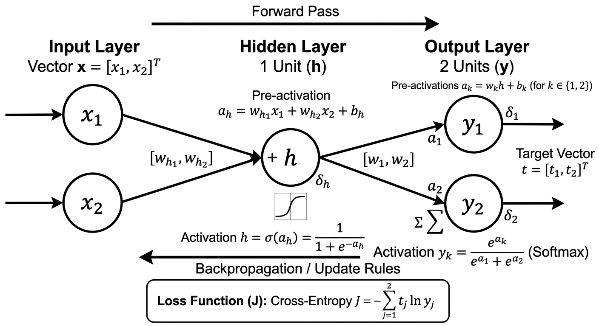

---

[Spring 2022 F]</br>
**Question-10:** What is the risk with tuning hyperparameters using a test dataset?</br>
**Solution:**</br>
Data leakage / test set contamination. The test set no longer simulates unseen data — choices are optimized for it specifically. The model may perform well on that test set but poorly in production. You lose the ability to measure true generalization.

---

[Spring 2022 F]</br>
**Question-11:** What is the typical goal of (good) weight initialization?</br>
**Solution:**</br>
- **Preserve signal variance across layers** — activations should neither explode nor vanish in the forward pass.
- **Preserve gradient variance across layers** — gradients remain similarly scaled throughout backward pass.
- **Break symmetry** — different neurons must start with different weights to learn different features.

Goal: keep activation and gradient magnitudes in a healthy, stable range from the very first pass, enabling stable and fast convergence.

---

[Spring 2022 F]</br>
**Question-12:** The following learning rate plots show the loss of an algorithm versus time. Label each plot with one of these labels:

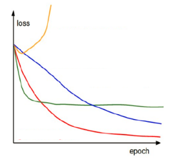

1. Low learning rate
2. Optimal learning rate
3. High learning rate
4. Very high learning rate

**Solution:**</br>
- Blue   → Low learning rate
- Red    → Optimal learning rate
- Green  → High learning rate
- Orange → Very high learning rate

Why?</br>
- The red curve reaches the minimum loss fastest without instability, which is exactly what we want from an optimal learning rate.
- The blue curve eventually improves but much more slowly.
- The green curve makes large updates, reducing loss quickly at first, but cannot settle near the optimum.
- The orange curve overshoots repeatedly and diverges, indicating the learning rate is too large.

---

[Fall 2023 F]</br>
**Question-13:** BRF NN with 13 Points </br>


**Solution:**</br>
Reading the graph: there are 13 labelled sample points. The function has one peak (large bump around x=3–4) and one trough + smaller oscillation (around x=7–11). The minimum number of hidden RBF nodes needed is one per distinct "feature" in the function — each Gaussian covers one local region. With 13 training points, the most principled minimum is one hidden node per training point (13 nodes) in the exact interpolation sense, but if we count distinct regions of significant variation the practical minimum is 3–4 nodes (one per peak/trough).</br>

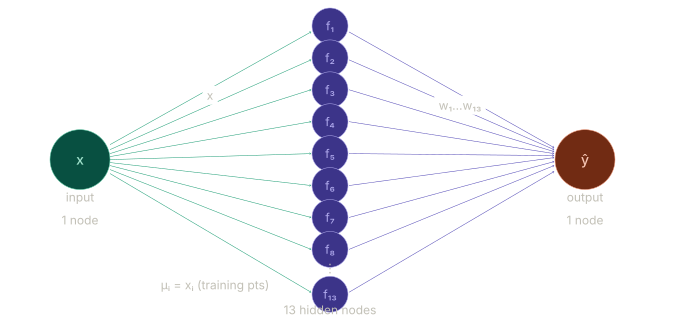


**(a) Network Structure**</br>
To approximate the continuous 1D curve mapping $x \to y$ with the **minimum number of hidden nodes**, we place one Gaussian RBF center at each major local peak (extremum) of the target function. Looking at the graph, there are **3 distinct peaks**: at $x = 3$ (height 3), at $x = 7$ (height 1), and at $x = 11$ (height 0.8).

* **Input Nodes:** **1** (takes the scalar input feature $x$).
* **Hidden Nodes:** **3** (one for each key localized feature region/peak).
* **Output Nodes:** **1** (produces the continuous scalar approximation value $\hat{y}$).

**(b) Proposed Initial Values**</br>

1. Hidden Layer Centers ($\mu_i$): Set the centers exactly at the horizontal positions of the three distinct peaks observed on the x-axis:
* $\mu_1 = 3$
* $\mu_2 = 7$
* $\mu_3 = 11$

1. Hidden Layer Widths ($\sigma_i$): To ensure smooth interpolation without excessive overlapping gaps, a standard distance-based heuristic can be applied: 

$$\sigma = \frac{\text{distance between adjacent centers}}{\sqrt{2 \times \text{number of centers}}} \approx \frac{4}{\sqrt{6}} \approx 1.63$$

  Alternatively, matching the spatial spread/variance of each localized peak directly from the grid yields:
   * $\sigma_1 = 2.0$ (covers the wider peak from $x=0$ to $x=6$)
   * $\sigma_2 = 1.5$ (covers the middle peak from $x=6$ to $x=9$)
   * $\sigma_3 = 1.5$ (covers the final peak from $x=9$ to $x=12$)

1. Output Layer Weights ($w_i$): Since a Gaussian function equals $1$ at its center ($f_i(\mu_i) = 1$), a reliable first-order approximation for the output weights is to set them proportional to the target peak heights:
* $w_1 = 3.0$
* $w_2 = 1.0$
* $w_3 = 0.8$

**(c) One-Shot Training**</br>

1. Computed Parameters: During one-shot training, the hidden layer parameters ($\mu$ and $\sigma$) are kept **fixed** as chosen in part (b). Only the **linear output layer weights ($\mathbf{w}$)** are computed.

2. Design Matrix Equation: The weights are computed exactly in a single step using the Moore-Penrose pseudo-inverse:

$$\mathbf{w} = (\mathbf{\Phi}^T \mathbf{\Phi})^{-1} \mathbf{\Phi}^T \mathbf{y}$$

3. Matrix Dimensions: Given $N = 13$ training sample points and $M = 3$ hidden RBF units:
  * **$\mathbf{\Phi}$ (Design / Activation Matrix):** Dimension is **$13 \times 3$**, where $\Phi_{ij} = \exp[-(x_i - \mu_j)^2 / \sigma_j^2]$.
  * **$\mathbf{y}$ (Target Vector):** Dimension is **$13 \times 1$**.
  * **$\mathbf{w}$ (Weight Vector):** Dimension is **$3 \times 1$**.


**(d) Iterative Training Comparisons**</br>

* **Would the parameters in (b) change?** **Yes.** If a fully supervised iterative method (like gradient descent/backpropagation) is used, **all** parameters—including the hidden layer centers ($\mu_i$) and widths ($\sigma_i$), alongside the weights ($w_i$)—will be continuously adjusted to globally minimize the prediction error.
* **Will the final weight values be different from (c)?** **Yes.** In one-shot training, the weights are optimized over static, unmoving receptive fields. In iterative training, because the shapes and positions of the Gaussian fields ($\mu, \sigma$) morph during optimization, the final linear weights will converge to a different, more finely tuned coordinate space to balance the shifting activations.


**(e) Training Equations for Each Learnable Parameter**</br>
Using gradient descent on the Mean Squared Error loss function $E = \frac{1}{2}\sum_{k=1}^{13} (y_k - \hat{y}_k)^2$, where $\hat{y}_k = \sum_{j=1}^3 w_j f_j(x_k)$, the delta update rules ($\Delta \theta = -\eta \frac{\partial E}{\partial \theta}$) are:</br>

1. For Output Weights ($w_i$):

$$\Delta w_i = \eta \sum_{k=1}^{13} (y_k - \hat{y}_k) \cdot f_i(x_k)$$

2. For Hidden Centers ($\mu_i$):</br>
   - Applying the chain rule through the Gaussian activation derivative $\frac{\partial f_i(x)}{\partial \mu_i} = f_i(x) \cdot \frac{2(x - \mu_i)}{\sigma_i^2}$:

$$\Delta \mu_i = \eta \sum_{k=1}^{13} (y_k - \hat{y}_k) \cdot w_i \cdot f_i(x_k) \cdot \frac{2(x_k - \mu_i)}{\sigma_i^2}$$

3. For Hidden Widths ($\sigma_i$):</br>
  - Applying the chain rule through the Gaussian activation derivative $\frac{\partial f_i(x)}{\partial \sigma_i} = f_i(x) \cdot \frac{2(x - \mu_i)^2}{\sigma_i^3}$:

$$\Delta \sigma_i = \eta \sum_{k=1}^{13} (y_k - \hat{y}_k) \cdot w_i \cdot f_i(x_k) \cdot \frac{2(x_k - \mu_i)^2}{\sigma_i^3}$$

---

[Fall 2020 F]</br>
**Question-14:**  Find and visualize a linear classification boundary for the following labeled data set:

$$D={([0.4,0.5]^T,+1),([0.6,0.5]^T,+1),([0.1,0.4]^T,+1),([0.2,0.7]^T,+1),([0.3,0.3]^T,+1),([0.4,0.6]^T,-1),([0.6,0.2]^T,-1),([0.7,0.4]^T,-1),([0.8,0.6]^T,-1),([0.7,0.5]^T,-1)}$$

1. Using a closed form solution. (Hint: Non-iterative approach)
2. Using the gradient descent optimization with a logistic regression model. Assume online training.

**Solution:**</br>
!!!!

---
---

## CNN
[Fall 2020 F]</br>
**Question-1:** Consider a CNN classifier. For each layer, calculate the activation map dimensions, the number of weights and number of biases. The notation follows the convention:
- CONV-K-N denotes a convolutional layer with N filters, each them of size K × K, Padding and stride parameters are always 0 and 1 respectively.
- POOL-K indicates a K × K pooling layer with stride K and padding 0.
- FC-N stands for a fully-connected layer with N neurons.

Layer|Activation map dimensions|Number of Weights|Number of Biases
|-|-|-|-|
Input|128 × 128 × 3|0|0|
CONV-9-32|
POOL-2|
CONV-5-64|
POOL-2|
CONV-5-64|
POOL-2|
FC-3|

**Solution:**</br>
| Layer | Activation map | Weights | Biases |
|-------|---------------|---------|--------|
| Input | 128×128×3 | 0 | 0 |
| CONV-9-32 | 120×120×32 | $9\times9\times3\times32 = 77{,}760$ | 32 |
| POOL-2 | 60×60×32 | 0 | 0 |
| CONV-5-64 | 56×56×64 | $5\times5\times32\times64 = 51{,}200$ | 64 |
| POOL-2 | 28×28×64 | 0 | 0 |
| CONV-5-64 | 24×24×64 | $5\times5\times64\times64 = 102{,}400$ | 64 |
| POOL-2 | 12×12×64 | 0 | 0 |
| FC-3 | 3 | $12\times12\times64\times3 = 27{,}648$ | 3 |

---

[Fall 2020 F]</br>
**Question-2:** [Tricky Question] Consider a convolutional neural network with one convolutional layer. It will be invariant to which geometric transformations (translation, rotation, scale)</br>
**Solution:**</br>
A standard Convolutional Neural Network (CNN) with only a single convolutional layer is strictly not fully invariant to any of these geometric transformations on its own. However, it exhibits a mathematical property called Translation Equivariance.

True translation invariance is only achieved if this convolutional layer is immediately followed by a global pooling layer or a flattening operation leading to a spatially independent descriptor.

**Invariant to:** Translation (approximately, via pooling).</br>
**NOT invariant to:** Rotation or scale. A standard CNN with one conv layer does not capture rotated or scaled versions of the same feature without augmentation or specialized architectures.</br>

**More Illustration (Just for knowledge):**</br>
Invariant means that the output does not change when the input undergoes a particular transformation.

$$f(T(x))=f(x)$$

Example for Translation invariance:</br>
- Original Image:
  ```
  +------------+
  |            |
  |   CAT      |
  |            |
  +------------+
  ```

- Shift the cat 20 pixels to the right:
  ```bash
  +------------+
  |            |
  |      CAT   |
  |            |
  +------------+
  ```
- The network still predicts "cat", then it is translation invariant.

**Equivariance Vs Invariance**</br>
- Invariance: $f(T(x))=f(x)$
- Equivariance: $f(T(x))=T(f(x))$
- Example:
  - A feature map produced by a convolution.
  - If the input image shifts right by 5 pixels, the feature map also shifts right by 5 pixels.
  - The feature map changes, but predictably.
  - Convolution itself is **translation equivariant**, not invariant.

What is a Convolution Layer Invariant To?</br>
**Translation:**</br> 
- A convolution operation satisfies: $Conv(T(x))=T(Conv(x))$
- Thus a convolution layer is:
  - translation equivariant
  - not translation invariant
- The feature map moves when the image moves.

**Rotation:**</br>
- Rotate the input image by 90 degrees.
- The filter is not rotated.
- The resulting feature map changes completely.
- Therefore: **Not rotation invariant**.

**Scale:**</br>
- Make the object twice as large.
- The filter sees a different pattern.
- The response changes.
- Therefore: **Not scale invariance**.

**Exam Answer**</br>
A single convolution layer is not invariant to translation, rotation, or scale.
- Translation: convolution is equivariant, not invariant.
- Rotation: not invariant.
- Scale: not invariant.

Invariant to none of the three transformations
	​
A single convolution layer only exhibits translation equivariance, meaning that translating the input translates the feature map by the same amount.

---

[Fall 2021 F]</br>
**Question-3:** A neural network is shown below with one convolutional layer with one kernel whose weights are $w_11=-2, w_12=1$. It is followed by tanh activation, and max pooling. The output of average pooling is fed to a logistic sigmoid layer with weights $w_21=2, w_22=-1$. Suppose, there is a single training input vector $[x_1, x_2, x_3, x_4, x_5]^T=[2,5,1,1,0]^T$ whose target output =1:
1. Show calculations of forward pass to compute $v$.
2. Show calculation of backpropagation to compute derivative of the loss function w.r.t. $w_21$ and $w_22$.
3. Show calculations of backpropagation to compute derivative of the loss function w.r.t. $w_11$ and $w_12$.

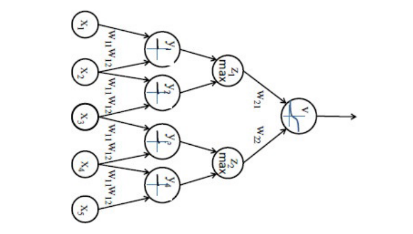

**Solution:**</br>
!!!!!

---

[Spring 2021 F]</br>
**Question-4:** Suppose we have a convolution layer which takes as input an array x = (𝑥1 , 𝑥2 , 𝑥3 ) and convolves x with the kernel (2 − 1). This layer has a linear activation function.The output is an array of length 4. This layer has a linear activation function. The output is an array of length 4.</br>
Now let's design a fully connected layer which computes the same function. It has a linear activation function and no bias, so it computes y = Wx, where the output y is a vector of length 4. </br>
Give the 4x3 weight matrix W which makes this fully connected layer equivalent to the convolution layer above. You don't need to justify your answer, but doing so may help you get partial credit. Hint: first write the values of each output as a linear function of the inputs. To help you check your work, if x =(1 2 3), your answer should give y =(2 3 4 -3).</br>
**Solution:**</br>
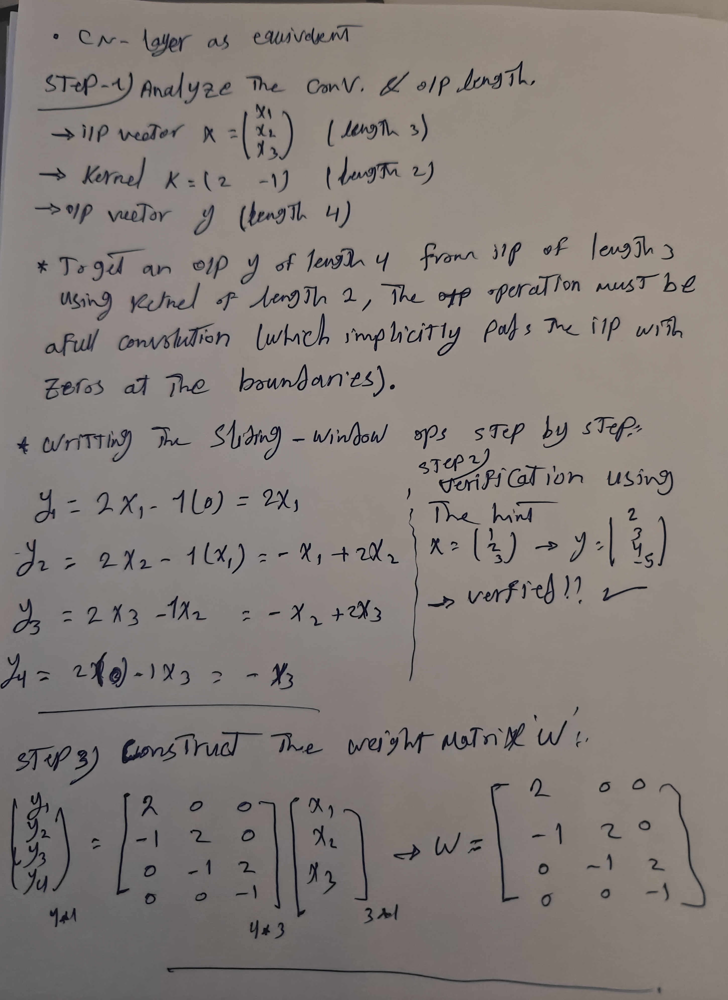

---

[Fall 2018 F]</br>
**Question-5:** Consider a layer in a convolutional neural network that takes in one 100 × 100 feature map (e.g., a gray-scale image), and outputs 100 feature maps. In each of the following cases, give the number of parameters that must be learned for this layer. Remember that we include a bias value for each output map.
1. The layer is a convolution layer where the filters are the same size as the input feature map.
2. The layer is a convolution layer with 10 × 10 filters and a stride of 5.
3. The layer is a locally-connected layer with 10 × 10 tiles and a stride of 5.
4. The layer is a convolution layer with 10 × 10 filters and a stride of 1.

**Solution:**</br>

| Case | Parameters |
|------|------------|
| 1. Conv, filter = 100×100 (same size as input) | $100 \times (100\times100\times1 + 1) = \mathbf{1{,}000{,}100}$ |
| 2. Conv, 10×10 filters, stride 5. Output: $19\times19$ | $100 \times (10\times10 + 1) = \mathbf{10{,}100}$ |
| 3. Locally connected, 10×10, stride 5 | $100 \times 19\times19 \times (10\times10+1) = \mathbf{3{,}646{,}100}$ |
| 4. Conv, 10×10 filters, stride 1. Output: $91\times91$ | $100 \times (10\times10+1) = \mathbf{10{,}100}$ |

> Locally connected layers have MORE parameters than conv layers of same filter size because filters are NOT shared across positions.

---

[Fall 2018 F]</br>
**Question-6:** What is the trade-off with having more or fewer parameters?</br>
**Solution:**</br>
**More parameters:** Higher capacity, can represent complex functions. Risk: overfitting, slower training, more memory.

**Fewer parameters:** Better generalization, faster training, lower memory. Risk: underfitting — insufficient capacity (high bias).

The optimal lies at the **bias-variance tradeoff** sweet spot.

---

[Fall 2018 F]</br>
**Question-7** Explain an additional reason (besides the number of parameters) convolution layers with filters that are smaller than the input map but larger than 1 × 1 are well-suited for image-related tasks.</br>
**Solution:**</br>
!!!!

---

[Summer 2022 F]</br>
**Question-8** Suppose you have a convolutional network with the following architecture:
- The input is an RGB image of size 256 x 256.
- The first layer is a convolution layer with 32 feature maps and filters of size 3 x 3. It uses a stride of 1, so it has the same width and height as the original image.
- The next layer is a pooling layer with a stride of 2 (so it reduces the size of each dimension by a factor of 2) and pooling groups of size 3 x 3.</br>
Determine the size of the receptive field for a single unit in the pooling layer. (i.e., determine the size of the region of the input image which influences the activation of that unit.)

**Solution:**</br>

RGB 256×256 → Conv 3×3, stride=1 → Pool 3×3, stride=2.

A pool unit looks at a 3×3 region of conv output. Each conv pixel sees 3×3 of the input. Total input extent:

$$RF = 3 \times 1 + (3-1) = 5 \quad \Rightarrow \quad \mathbf{5\times5} \text{ receptive field}$$

---

[Spring 2022 F]</br>
**Question-9:** If an input data block in a convolutional network has dimension $𝐶\times𝐻\times 𝑊= 96 \times128\times 128$ ,(96 channels, spatial dim 128 128) and we apply a convolutional filter to it of dimensions $D\times C\times H_F\times W_F=128 \times 96 \times 7 \times 7$, (i.e. a block of D=128 filters) with stride 2 and pad 3, what is the dimension of the output data block?</br>

**Solution:**</br>

Input $96\times128\times128$, filter $128\times96\times7\times7$, stride=2, pad=3:

$$H_{out} = \left\lfloor\frac{128 + 2(3) - 7}{2}\right\rfloor + 1 = 64, \quad W_{out} = 64$$

**Output: $128 \times 64 \times 64$**

---

[Spring 2022 F, summer 2022 F]</br>
**Question-10:** A convolutional neural network has 4 consecutive 3x3 convolutional layers with stride 1 and no pooling. How large is the support of (the set of image pixels which activate) a neuron in the 4th non‐image layer of this network?</br>

**Solution:**</br>

4 consecutive 3×3 conv layers, stride=1, no pooling. Receptive field after layer $n$: $RF = n(k-1) + 1 = 2n+1$. At $n=4$:

$$RF = 4(3-1)+1 = \mathbf{9\times9}$$

---

[Summer 2022 F]</br>
Q12. Consider a convolution layer. The input consists of 6 feature maps of size 20 x 20. The output consists of 8 feature maps, and the filters are of size 5 x 5. The convolution is done with a stride of 2 and zero padding, so the output feature maps are of size 10 x 10.

---
---

## CNN Architectures
[Spring 2021 F, Fall 2023 F]</br>
**Question-1:** Shown is the historical LeNet Convolutional Neural Network architecture for digit classification. Here, the INPUT layer takes in a 32x32 image, and the OUTPUT layer produces 10 outputs. The notation 6@28x28 means 6 matrices of size 28x28.

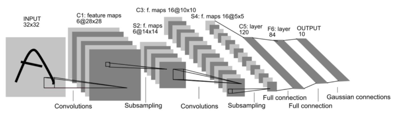

If the parameters of a given layer are the weights that connect to its inputs,</br>
1) Given that the input size is 32x32, and the Layer 1 size is 28x28, what's the size of the convolutional filter in the first layer (i.e. how many inputs is each neuron connected to)?
2) How many independent parameters (weight and bias) are in layer C1?
3) How many independent parameters (weight and bias) are in layer C3?
4) How many independent parameters (weight and bias) are in layer F6?

**Solution:**</br>
**Architecture:** Input 32×32 → C1: 6@28×28 → S2: 6@14×14 → C3: 16@10×10 → S4: 16@5×5 → C5: 120 → F6: 84 → Output: 10

**1. Filter size in C1:**</br>
$32 - 28 + 1 = 5$ → **5×5 filter** (25 inputs per neuron)

**2. Parameters in C1:**</br>
Layer C1 has 6 feature maps. Each feature map shares a single 5×5 filter kernel and 1 bias term.
- Weights per feature map: 5×5=25
- Biases per feature map: 1

Total Parameters for C1:</br>
$6$ maps $\times$ $(5\times5 + 1) = 6 \times 26 = \mathbf{156}$

**3. Parameters in C3 (full connection):**</br>
In the standard, classifical LeNet-5 architecture shown, layer C3 features 16 feature maps of size 10x10, connected to the 6 feature maps of S2 (14×14) via 5×5 kernels.</br>
$16$ maps $\times$ $(6 \times 5\times5 + 1) = 16 \times 151 = \mathbf{2{,}416}$

Note that:</br> 
Because the maps are discontinuously connected to save parameters and break symmetry, they follow Yann LeCun's specific pooling-combination table:</br>
- 6 maps take inputs from combinations of 3 S2 maps: 6×(3×5×5+1)=456
- 9 maps take inputs from combinations of 4 S2 maps: 9×(4×5×5+1)=909
- 1 map takes inputs from all 6 S2 maps: 1×(6×5×5+1)=151

Total parameters for C3=456+909+151=1,516 parameters

Note: If your specific curriculum simplifies C3 by assuming full connection to all 6 preceding maps, the calculation is instead: 16×(6×5×5+1)=2,416 parameters. Check your lecture notes for which convention your professor prefers!

**4. Parameters in F6:**</br>
Layer F6 is a standard Fully Connected (Dense) layer with 84 units. Its inputs come from layer C5, which has 120 units (treated as a 1×1×120 vector).
- Weights: 120×84=10,080
- Biases: 84

Total parameters for F6:</br>
$120 \times 84 + 84 = 10{,}080 + 84 = \mathbf{10{,}164}$

---

[Spring 2022 F]</br>
**Question0-3:** Compare GoogLeNet and Residual networks (ResNets). What are the main architectural features of each, and how did they lead to improvements over previous design?</br>
**Solution:**</br>

| Aspect | GoogLeNet (Inception) | ResNet |
|--------|----------------------|--------|
| Key innovation | Inception modules — parallel 1×1, 3×3, 5×5 filters within one block | Residual (skip) connections: output = $F(x) + x$ |
| Depth | 22 layers (auxiliary classifiers to fight vanishing gradients) | 50/101/152+ layers |
| Parameter efficiency | 1×1 convolutions reduce dimensions before expensive filters (~5M params) | Bottleneck blocks (1×1, 3×3, 1×1) |
| Vanishing gradient fix | Auxiliary classifiers inject gradient mid-network | Skip connections provide direct gradient highway |
| Improvement over VGG | Much fewer params with comparable accuracy | Enables training of arbitrarily deep nets (solved degradation problem) |

---

[Fall 2020 F]</br>
**Question-8:** For the VGGNET-19 structure given below, assume that the filter size is 3X3 in the convolutional layers with a stride of 1. Discuss and calculate the input and output size of each stage as well as the number of parameters. Asume that the number of nodes in the FC layer is 4096.</br>
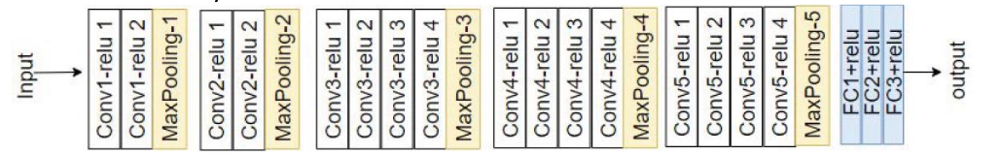

**Solution:**</br>

Stage|	Layer Block|	Input Spatial Volume|	Output Spatial Volume|	Weight & Bias Parameters
|-|-|-|-|-|
Stage 1|	Conv1 (x2) + Pool|	224×224×3|	112×112×64|	38,720
Stage 2|	Conv2 (x2) + Pool|	112×112×64|	56×56×128|	221,440
Stage 3|	Conv3 (x4) + Pool|	56×56×128|	28×28×256|	2,065,408
Stage 4|	Conv4 (x4) + Pool|	28×28×256|	14×14×512|	8,259,584
Stage 5|	Conv5 (x4) + Pool|	14×14×512|	7×7×512|	9,439,232
Dense|	FC1 + FC2 + FC3|	Flattened: 25,088|	Vector Length: 1000|	123,642,856
Total|	VGG-19 Network|	—|	—|	≈ 143.67 Million Parameters

---
---

## RNN - LSTM
[Spring 2021 F, summer 2022 F]</br>
**Question-1:** You are given a simple RNN network as illustrated in the computational graph. Assume that we use identity functions as activation functions.</br>
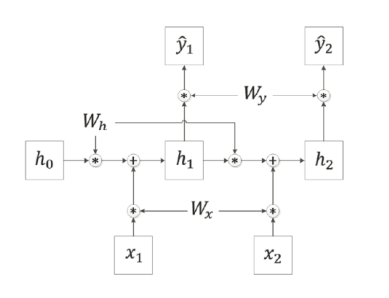

**Solution:**</br>
$h_0=1$, $x_1=x_2=10$, $y_1=y_2=5$, $W_h=1$, $W_x=0$, $W_y=2$.

**Part 1 — Forward pass:**

$$h_1 = W_h h_0 + W_x x_1 = 1 + 0 = 1, \quad \hat{y}_1 = W_y h_1 = 2$$
$$h_2 = W_h h_1 + W_x x_2 = 1, \quad \hat{y}_2 = W_y h_2 = \mathbf{2}$$

**Part 2 — Total loss:**

$$L_1 = (2-5)^2 = 9, \quad L_2 = (2-5)^2 = 9, \quad L_{total} = \mathbf{18}$$

**Part 3 — $\partial L/\partial h_1$:**

$$\frac{\partial L}{\partial h_1} = \underbrace{\frac{\partial L_1}{\partial \hat{y}_1} W_y}_{\text{via } \hat{y}_1} + \underbrace{\frac{\partial L_2}{\partial \hat{y}_2} W_y \cdot W_h}_{\text{via } h_2}$$
$$= 2(2-5)(2) + 2(2-5)(2)(1) = -12 + (-12) = \mathbf{-24}$$

---

[Spring 2025 F]</br>
**Question-2:** Write the equations for an LSTM cell, including all gates (input, forget, output, and cell state update). Explain the role of the forget gate in capturing long‐term dependencies</br>
**Solution:**</br>

$$i_t = \sigma(W_i x_t + U_i h_{t-1} + b_i) \quad \text{(input gate)}$$
$$f_t = \sigma(W_f x_t + U_f h_{t-1} + b_f) \quad \text{(forget gate)}$$
$$o_t = \sigma(W_o x_t + U_o h_{t-1} + b_o) \quad \text{(output gate)}$$
$$\tilde{c}_t = \tanh(W_c x_t + U_c h_{t-1} + b_c) \quad \text{(cell candidate)}$$
$$c_t = f_t \odot c_{t-1} + i_t \odot \tilde{c}_t \quad \text{(cell state)}$$
$$h_t = o_t \odot \tanh(c_t) \quad \text{(hidden state)}$$

**Forget gate role:** $f_t \in (0,1)$ scales $c_{t-1}$ element-wise. When $f_t \approx 1$, the cell remembers past information (long-term dependency preserved). When $f_t \approx 0$, past is forgotten. The multiplicative $\odot$ interaction means $c_t$ can flow across many steps with minimal decay when $f_t \approx 1$ — the key to long-range dependencies vanilla RNNs cannot capture.

---

[Spring 2025 F]</br>
**Question-3:** Suppose you are training an LSTM for a sequence classification task, and the model fails to learn dependencies longer than 5 time steps. Suggest two potential reasons and corresponding solutions.</br>
**Solution:**</br>
**LSTM fails to learn beyond 5 time steps. Two reasons:**

1. **Forget gate saturates to 0:** If forget gate biases are initialized poorly, the gate closes early and zeros out long-range cell states. **Solution:** Initialize forget gate biases to 1 (Jozefowicz et al., 2015) so the gate starts open.

2. **Insufficient model capacity:** Hidden state too small to encode all necessary history. **Solution:** Increase hidden state dimension, use stacked (multi-layer) LSTMs, or add attention mechanisms that directly access past states.

---

[Spring 2025 F]</br>
**Question-4** Compare and contrast LSTM and GRU in terms of architecture and computational efficiency. Why might one choose GRU over LSTM in a resource constrained environment?</br>

**Solution:**</br>

| Aspect | LSTM | GRU |
|--------|------|-----|
| Gates | 3: input, forget, output | 2: reset, update |
| States | Separate $c_t$ and $h_t$ | Single $h_t$ |
| Parameters | 4 weight matrices | 3 weight matrices (~25% fewer) |
| Training speed | Slower | Faster |
| Performance | Marginally better on complex long-range tasks | Comparable on most tasks |

**Choose GRU in resource-constrained settings** because it achieves similar performance with ~25% fewer parameters and faster computation.

---

[Spring 2025 F]</br>
Q5. Explain why vanilla RNNs suffer from the vanishing gradient problem during training. How does this affect long‐term dependencies?</br>

BPTT requires:

$$\frac{\partial h_t}{\partial h_0} = \prod_{t=1}^{T} \frac{\partial h_t}{\partial h_{t-1}} = \prod_{t=1}^{T} W_{hh}^T \cdot \text{diag}(\tanh'(\cdot))$$

Each factor has eigenvalues scaled by $W_{hh}$'s spectrum and $\tanh' \in (0,1]$. If spectral radius $< 1$: gradients decay exponentially → zero (vanishing). If $> 1$: they explode.

**Effect on long-term dependencies:** Gradients at step $T$ w.r.t. early inputs are negligibly small → the network cannot learn to use information from far back. Only recent steps (a few) are effectively trainabl

---

[Spring 2025 F]</br>
**Question-6** A student proposes using a ReLU activation instead of tanh in an RNN to avoid vanishing gradients. Discuss the potential benefits and drawbacks of this choice.</br>

**Solution:**</br>

**Benefits:** ReLU gradient = 1 for $x > 0$ (no shrinkage), potentially alleviating vanishing gradient. Computationally cheaper.

**Drawbacks:**

- **Exploding gradients dominant:** Without saturation, repeated $W_{hh}$ multiplications cause unbounded growth if spectral radius $> 1$.
- **Hidden state explosion:** No upper bound on $h_t$ → numerical instability across time steps.
- **No bounded memory:** tanh's $\pm 1$ bound provides stable hidden states; ReLU has no such bound.

In practice: clip gradients and use LSTM/GRU instead.

---

[Spring 2025 F]</br>
**Question-7:** Derive the backpropagation through time (BPTT) update rule from a simple RNN with a single hidden layer. Assume the RNN has input $x_t$, hidden state $h_t$, output $y_t$, and loss function $L_t=Loss(y_t, \hat{y}_t)$. The RNN equations are:
$$h_t=tanh(W_{xh}x_t+W_{hh}h_{t-1}+b_h), y_t=W_{hy}+b_y$$

Show the gradient of the loss $L_t$ with respect to $W_{hh}$.</br>

**Solution:**</br>

**BPTT derivation for $\partial L_t / \partial W_{hh}$:**

$$\frac{\partial L_t}{\partial W_{hh}} = \sum_{k=1}^{t} \frac{\partial L_t}{\partial h_t} \cdot \left(\prod_{j=k+1}^{t} \frac{\partial h_j}{\partial h_{j-1}}\right) \cdot \frac{\partial h_k}{\partial W_{hh}}$$

where $\frac{\partial h_j}{\partial h_{j-1}} = W_{hh}^T \cdot \text{diag}(1 - h_j^2)$ and $\frac{\partial h_k}{\partial W_{hh}} = h_{k-1}^T$.

The product term shows exponential decay/explosion with $t-k$, explaining vanishing/exploding gradients.

---

[Fall 2023 F]</br>
Q8. [VIP] A certain gated recurrent units can adaptively reset or update its memory of previous states. The feedforward computation for the unit is given by
$$z_t = \sigma(W_z x_t+U_z h_{t-1})$$
$$r_t = \sigma(W_r x_t+U_r h_{t-1})$$
$$\tilde{h}_t=tanh(Wx_t+r_t \odot Uh_{t-1})$$
$$h_t = (1-z_t)\odot h_{t-1} + z_t \odot \tilde{h}_t$$
1. Show that for the sigmoid function $\sigma(x), \sigma(-x)=1-\sigma(x)$
2. True/False. If the update gate $z_t$ is close to 0, the unit does not update its state significantly. Justify your answer.
3. True/False. If the update gate $z_t$ is close to 1 and the reset gate $r_t$ is close to 0, the unit remembers the past state very well.
4. Discuss when you would consider to use a bi‐directional RNN.

---

[Fall 2018 F]</br>
Q9. You build a sentiment analysis system that feeds a sentence into a RNN, and then computes the sentiment class between 0 (very negative) and 4 (very positive), based only on the final hidden state of the RNN.
1. What is one advantage that a RNN would have over a neural window-based model for this task?
2. Your friend suggests using an LSTM instead. Recall the units of an LSTM cell are defined as :
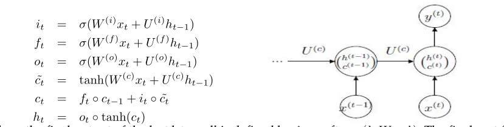

where the final output of the last lstm cell is defined by $\hat{y}=softmax(h_t W + b)$. The final cost function $J$ uses the cross-entropy loss. Consider an LSTM for two time steps, $t$ and $t − 1$.
  1. Derive the gradient $\partial J / \partial U^{(c)}$ in terms of the following gradients: $\partial h_t / \partial h_{t-1}, \partial h_{t-1}/\partial U^{(c)}, \partial J/\partial h_t, \partial c_t /\partial U^{(c)}, \partial C_{t-1}/\partial U^{(c)}, \partial c_t/\partial c_{t-1}$ and $\partial h_t/\partial o_t$. Not all of the gradients may be used. You can leave the answer in the form of chain rule and do not have to calculate any individual gradients in your final result.
  2. Which part of the gradient $\partial J / \partial U^{(c)}$ allows LSTMs to mitigate the effect of the vanishing gradient problem? Explain in two sentences or less how this would help classify the correct sentiment

---
---

## Attention - Transformers - Autoencoders
[Spring 2021 F]</br>
**Question-1:** Describe how you could use an autoencoder to denoise images with gaussian white noise.</br>
**Solution:**</br>
To denoise images using a Denoising Autoencoder (DAE), follow these structured steps:
- Data Preparation (Corrupting the Input): Take clean, uncorrupted images (x) from your dataset and manually inject synthetic Gaussian white noise to create corrupted versions ($\hat(x)=x+η$, where η∼N(0,σ2)).
- Architecture Setup: Build an autoencoder composed of an Encoder that compresses the noisy input $\hat{x}$ into a lower-dimensional latent representation (z), followed by a Decoder that reconstructs an image (x^) back to the original input space.
- Objective Function (Loss Evaluation): Train the model by passing the noisy image $\hat{x}$ through the network, but crucially compute the reconstruction loss (such as Mean Squared Error) against the clean ground-truth image (x), not the noisy input:
$$L(x,\hat{x})=\frac{1}{N}\sum_{i=1}^N ​∥x_i​−\hat{x_i}​∥^2$$
- Inference: Feed noisy image → encoder maps to latent code capturing clean structure → decoder reconstructs denoised image. The bottleneck prevents the identity function on noise, forcing the network to learn the underlying clean signal manifold.

---

[Summer 2023 M]</br>
**Question-2:** Briefly explain one flaw of encoder‐decoder architectures for machine translation which do not use attention, and how attention can fix it.</br>
**Solution:**</br>
**Short Answer:** A flaw of encoder-decoder architectures without attention is the bottleneck problem where the entire input sequence is compressed into a fixed-length context vector. Attention mechanisms allow the model to focus on different parts of the input sequence during decoding, mitigating this issue.

**Long Answer:**</br>
**Flaw of encoder-decoder without attention**: The encoder compresses the entire source sentence into a single fixed-length context vector (the final hidden state). For long sentences, this bottleneck causes information loss — the decoder cannot selectively access relevant parts of the source.

**How attention fixes it**: Instead of a single vector, attention computes a weighted combination of ALL encoder hidden states at each decoding step. The decoder dynamically retrieves relevant information from the most relevant source positions (e.g., the word being translated), eliminating the fixed-size bottleneck and dramatically improving translation quality for long sequences.

---

[Fall 2018 F]</br>
**Question-3:** An autoencoder is a neural network designed to learn feature representations in an unsupervised manner. </br>
Suppose the input is a set of P-dimensional unlabeled data $\{\mathbf{x}^{(i)}\}_{i=1}^{N}$. </br>
Consider an autoencoder with $P$ units in both the input layer, $L_1$, and output layer, $L_3$, and $H$ hidden units in $L_2$. </br>
We will use the following notation for this autoencoder: $W^e$ is a $P \times H$ encoder weight matrix, $W^d$ is an $H\times P$ decoder weight matrix, $\sigma$ is the activation for %L_2% and $L_3$ units, $S_j^{(i)}=\sum_{k=1}^{P} W_{kj}^{e} x_k^{(i)}, z_j^{(i)}=\sigma(S_j^{(i)}), t_j^{(i)}=\sum_{k=1}^{H} W_{kj}^{d} z_k^{(i)}, J(W^d, W^e)=\|X^{(i)-\hat{x}^{(i)}}\|_2^2=\sum_{k=1}^P(x_k^{(i)}-\hat{x}_k^{(i)})^2$ is the reconstruction error for example $x^{(i)}$, and $J(W^d,W^e)=\sum_i^N J(W^d,W^e)^{(i)}$ is the total reconstruction error.
1. Derive $\partial J^{(i)}/\partial W_{kl}^d, \partial J^{(i)}/\partial W_{kl}^e$, and $\partial J^{(i)}/\partial s_j^{(i)}$
2. To limit the number of activated hidden units, we add a sparsity penalty to the problem. The reconstruction error is formulated as 
$$J_{\text{sparse}} = J(W^d, W^e) + \beta \sum_{j=1}^{H} \left( \rho \log \frac{\rho}{\hat{\rho}_j} + (1 - \rho)\log \frac{(1 - \rho)}{(1 - \hat{\rho}_j)} \right)$$

  Where $\hat{\rho_j}=\frac{1}{N}\sum_{i=1}^N z_i^{(i)}$, $\rho$ and $\beta$ are hyperparameter. Find $\partial J_{sparse}/\partial W_{kl}^d$ and $\partial J_{sparse}/\partial W_{kl}^e$.

3. State some relations between autoencoders and PCA.

---

[Spring 2025 F]</br>
**Question-4:** [Unrelated] Explain how an undercomplete autoencoder can be used for anomaly detection. What assumptions does this approach make about the data?</br>

**Solution:**</br>

Train on normal data only. At test time, compute reconstruction error $\|x - \hat{x}\|$ for each sample:

- **Normal samples:** Resemble training data → well-reconstructed by learned latent space → **low error**.
- **Anomalies:** Structurally different → poor reconstruction → **high error**.

Threshold on reconstruction error distinguishes normal from anomalous.

**Assumptions:**
- Anomalies are rare in training (AE trained predominantly on normal data)
- Anomalies are structurally different enough to reconstruct poorly
- Latent space is compact enough not to generalize to out-of-distribution samples

---
[Spring 2025 F]</br>
**Question-5:** [Unrelated] Define an undercomplete auto encoder and explain how it differs from other types (e.g., overcomplete autoencoders). Why is the undercomplete constraint useful for representation learning?</br>

---

[Spring 2025 F]</br>
**Question-6:** [Unrelated] Consider an undercomplete autoencoder with a single hidden layer of size 64, input dimension 128, and mean squared error (MSE) loss. The encoder is $z=\sigma(W_x+b)$, and the decoder is $\hat{x}=\sigma(W'z+b')$ , where 𝜎 is the sigmoid activation. Derive the gradient of the MSE loss with respect to 𝑊</br>

---
---

## GAN Related
[Fall 2021 F, summer 2022 F, Fall 2023 F]</br>
**Question-1:** Consider the graph in Figure below that represents the training procedure of a GAN:</br>

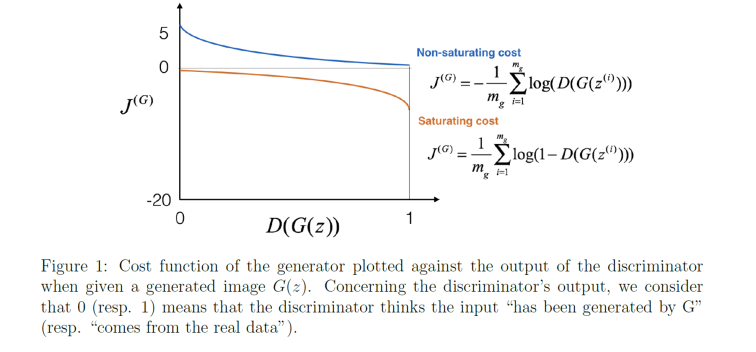
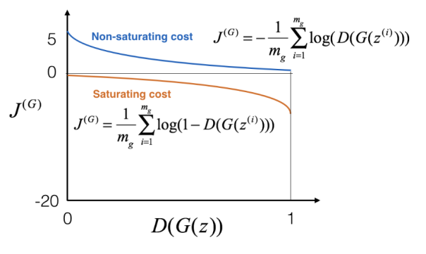

1. Explain early in the training, is the value of D(G(z)) closer to 0 or closer to 1?
2. The two cost functions in the figure, which one would you choose to train
your GAN? Justify your answer
1. You know that your GAN is trained when D(G(z)) is close to 1. True/ False ? Explain.

**Solution:**</br>
**1. Early in training — D(G(z)) closer to 0 or 1?**

**Closer to 0.** The generator produces noise-like outputs, obviously fake. The discriminator easily learns to classify them as fake → $D(G(z)) \to 0$.

**2. Which cost function?**

**Non-saturating cost:** $J^{(G)} = -\frac{1}{m_g}\sum \log(D(G(z^{(i)})))$

Justification: * Early in training (when D(G(z))≈0), the Saturating cost curve has an extremely flat slope (gradient close to 0). This causes vanishing gradients, stalling the Generator's learning process.

In contrast, the Non-saturating cost curve has a very steep slope near 0. This provides strong, highly informative gradients early on, forcing the Generator to learn rapidly when it is performing poorly.

**3. GAN trained when D(G(z)) ≈ 1?** **False.** At equilibrium, the optimal discriminator assigns equal probability to real and fake: $D^*(x) = 0.5$ everywhere. $D(G(z)) \approx 0.5$ signals convergence, not $\approx 1$.

---

[Spring 2022 F]</br>
**Question-2:** When the GAN network is trained, then D(G(z)) is close to 0, or 1, or 0.5? Justify your answer </br>

**Solution:**</br>
At equilibrium, the optimal discriminator assigns equal probability to real and fake: $D^*(x) = 0.5$ everywhere. $D(G(z)) \approx 0.5$ signals convergence, not $\approx 1$.

---

[Spring 2021 F]</br>
**Question-3:** Recall that a GAN could, in principle, be trained using the following minimax formulation, where G is the generator function, D is the probability the discriminator assigns to the sample being data, and 𝐽𝐷 and 𝐽𝐺 are the cost functions for the discriminator and generator, respectively.

$$J_D=E_x~D[-logD(x)]+E_z[-log(1-D(G(z)))]$$
$$J_G=-J_D$$
$$J_G=const+E_z[log(1-D(G(z)))]$$

However, in practice, the generator is usually trained with a different loss function .
1. What cost function do we typically use for the generator?
2. What is the reason to use this cost function rather than the one given above?

**Solution:**</br>
**Short Answers:**</br>
**1. Cost function for generator in practice:**

$$J^{(G)} = -\frac{1}{m_g}\sum_{i=1}^{m_g}\log(D(G(z^{(i)})))$$

**2. Why not $J^G = -J^D$?**</br>
The minimax generator loss $\log(1-D(G(z)))$ **saturates early in training** when $D$ easily detects fakes ($D(G(z)) \approx 0$) → gradient $\approx 0$ → generator cannot improve. The non-saturating version $-\log(D(G(z)))$ provides large gradient when $D(G(z))$ is small — the critical period when the generator most needs to update.

**Long Answers:**</br>
**1-**</br>
In practical training pipelines, we swap the minimax cost for the Non-Saturating Cost Function, defined as:
$$J_G​=E_z​[−logD(G(z))]$$

Instead of minimizing the probability that the discriminator catches it being fake (minlog(1−D(G(z)))), the generator is trained to actively maximize the probability that the discriminator gets fooled into thinking its outputs are real (maxlogD(G(z))).</br>
**2-**</br>
- Vanishing Gradients Early in Training: Early in the training cycle, the Generator (G) is highly primitive and produces obvious fakes, while the Discriminator (D) learns quickly to reject them perfectly (D(G(z))→0).
- Saturating Slope Defect: If you calculate the mathematical derivative of the original minimax objective (log(1−D(G(z)))) at a value near 0, the gradient approaches zero. This flat, horizontal slope stalls gradient descent, preventing the generator from learning anything.
- Exploding Gradients Benefit: The non-saturating function (−logD(G(z))) exhibits a fundamentally different geometric profile. Near 0, its slope is exceptionally steep. This injects powerful, highly informative objective gradients into the network precisely when the generator is performing at its worst, maximizing optimization speed and training stability.

---

[Spring 2025 F]</br>
**Question-4:** The original GAN paper proposes using $L_g=-log(D(G(z)))$ instead of $\log (1-D(G(z)))$. Explain why this modification improves training dynamics.</br>
**Solution:**</br>

Early in training, $D$ is strong and $D(G(z)) \approx 0$:

| Loss | Gradient when $D(G(z)) \to 0$ |
|------|-------------------------------|
| $\log(1-D(G(z)))$ | $\approx \nabla_G \log(1) = 0$ — **flat, no signal** |
| $-\log(D(G(z)))$ | **Large gradient** — strong learning signal |

The non-saturating objective provides **large gradients precisely when the generator is weakest**, enabling effective early learning. Both share the same Nash equilibrium, but non-saturating converges much more reliably in practice.

---

[Spring 2025 F]</br>
**Question-5:** Describe the objective function of a standard GAN, including the roles of the generator and discriminator. Write the minimax optimization problem and explain why it is a zero-sum game.</br>
**Solution:**</br>
**GAN minimax objective:**

$$\min_G \max_D V(D,G) = \mathbb{E}_{x \sim p_\text{data}}[\log D(x)] + \mathbb{E}_{z \sim p_z}[\log(1-D(G(z)))]$$

**Discriminator $D$:** Maximizes $V$ — assigns $D(x) \to 1$ for real, $D(G(z)) \to 0$ for generated. Goal: correctly classify real vs fake.

**Generator $G$:** Minimizes $V$ — makes $D(G(z)) \to 1$ to fool the discriminator. Goal: generate indistinguishable samples.

**Why zero-sum:** $J^D + J^G = 0$ in the minimax formulation. Every gain for $D$ is a loss for $G$ — the game is purely competitive with no cooperative component.

---

[Spring 2025 F]</br>
**Question-6:** Prove that the optimal discriminator in a GAN is $D*(x)=\frac{p_data(x)}{p_data(x)+p_g(x)}$, where $P_data$ is the real data distribution and $p_g$ is the generator's distribution.</br>

**Solution:**</br>
For fixed $G$, maximize $V$ over $D$ pointwise:

$$V = \int \left[p_\text{data}(x)\log D(x) + p_g(x)\log(1-D(x))\right]dx$$

Maximize integrand $f(D) = a\log D + b\log(1-D)$ where $a = p_\text{data}(x)$, $b = p_g(x)$:

$$\frac{df}{dD} = \frac{a}{D} - \frac{b}{1-D} = 0 \implies a(1-D) = bD \implies D^* = \frac{a}{a+b} = \frac{p_\text{data}(x)}{p_\text{data}(x)+p_g(x)} \quad \square$$

---

[Spring 2022 F]</br>
**Question-7:** In GANs, what is the primary goal of the discriminator? State this goal in a probabilistic sense for a class y and input x </br>
**Solution:**</br>

Maximize $P(\text{real}|x)$ — correctly classify real vs generated samples. Probabilistically: estimate $P(y=\text{real}|x) = D(x)$, aiming for $D(x) \approx 1$ for $x \sim p_\text{data}$ and $D(G(z)) \approx 0$ for generated samples.

---
