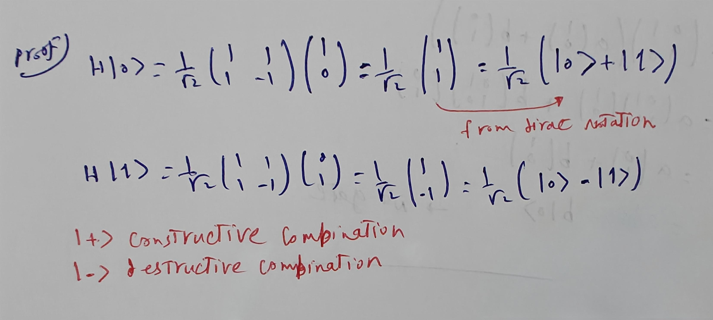
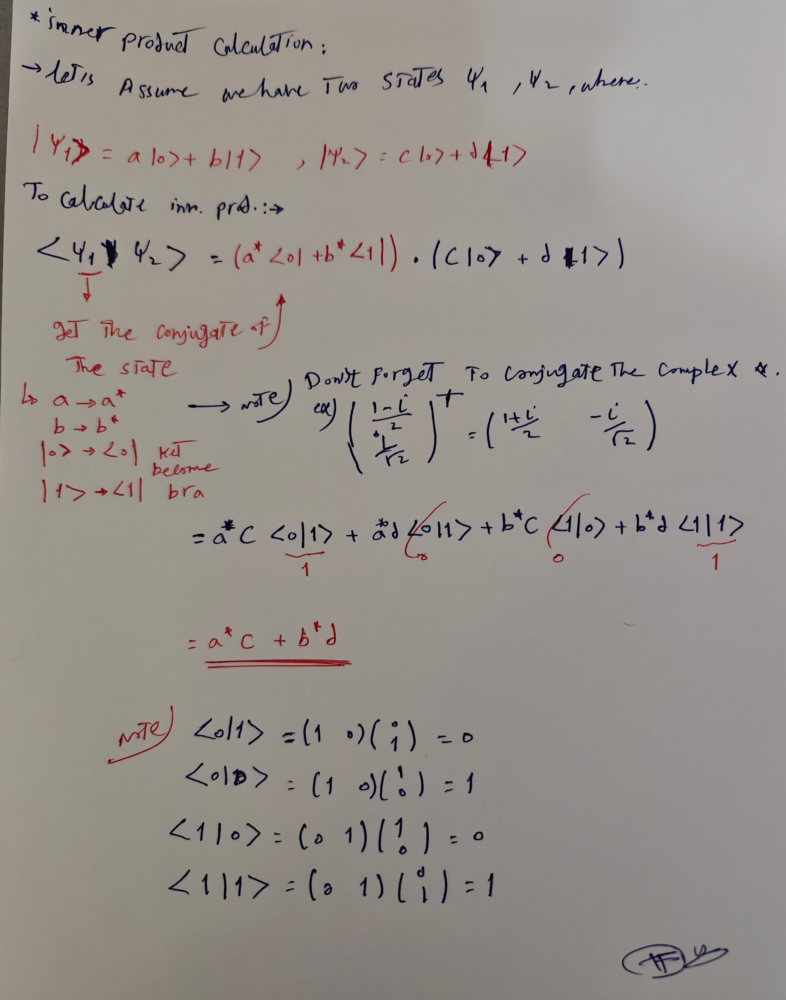
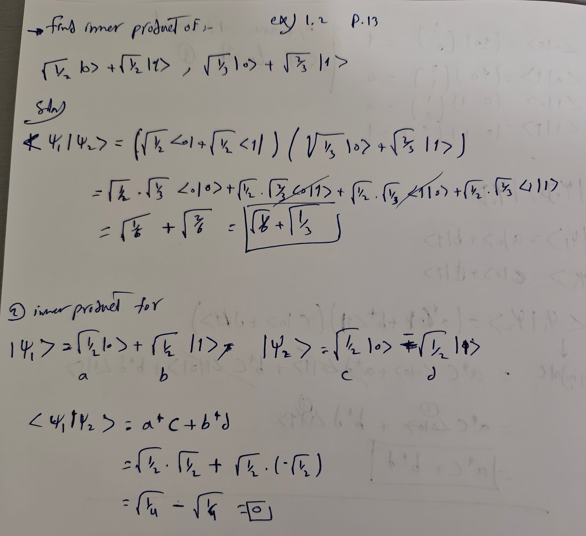

<script type="text/javascript" src="http://cdn.mathjax.org/mathjax/latest/MathJax.js?config=TeX-AMS-MML_HTMLorMML"></script>
<script type="text/x-mathjax-config">
  MathJax.Hub.Config({ tex2jax: {inlineMath: [['$', '$']]}, messageStyle: "none" });
</script>

# QML - Introduction

# Table of Contents
- [QML - Introduction](#qml---introduction)
- [Table of Contents](#table-of-contents)
- [Abstract](#abstract)
- [1. Theoretical Part](#1-theoretical-part)
  - [1.1. What is a Quantum computer?](#11-what-is-a-quantum-computer)
  - [1.2. Quantum Advantages Vs Quantum Supremacy](#12-quantum-advantages-vs-quantum-supremacy)
  - [1.3. NISQ (Noisy Intermediate-Scale Quantum) ERA](#13-nisq-noisy-intermediate-scale-quantum-era)
  - [1.4. Postulates in QM](#14-postulates-in-qm)
- [2. Mathematical Prerequisites](#2-mathematical-prerequisites)
  - [2.1. Complex Numbers Basics](#21-complex-numbers-basics)
  - [2.2. Matrix Operations](#22-matrix-operations)
  - [2.3. Linear Algebra](#23-linear-algebra)
- [3. Working with a Single Qubit](#3-working-with-a-single-qubit)
  - [3.1. Introduction to the Qubit \& Superposition](#31-introduction-to-the-qubit--superposition)
  - [3.2. Representing Qubits Mathematically](#32-representing-qubits-mathematically)
  - [3.3. How to Measure a Qubit](#33-how-to-measure-a-qubit)
  - [3.4. Qubit Representation](#34-qubit-representation)
  - [3.5. Introduction to Dirac Notation](#35-introduction-to-dirac-notation)
  - [3.6. Representing a Qubit on Bloch Sphere](#36-representing-a-qubit-on-bloch-sphere)
  - [3.7. Manipulating a Qubit - The X,Y and Z Gates](#37-manipulating-a-qubit---the-xy-and-z-gates)
  - [3.8. Intro to Phase: Global vs Relative Phase](#38-intro-to-phase-global-vs-relative-phase)
  - [3.9. Tha Hadamard Gate, and the $+, -, i$ \& $-i$ States](#39-tha-hadamard-gate-and-the----i---i-states)
  - [3.10. The $S$ and $T$ Phase Gates.](#310-the-s-and-t-phase-gates)
  - [3.11. The Rotation Gates](#311-the-rotation-gates)
- [4. Working with Multiple Qubit](#4-working-with-multiple-qubit)
  - [4.1. Representing Multiple Qubit Mathematically](#41-representing-multiple-qubit-mathematically)
  - [4.2. Quantum Circuits](#42-quantum-circuits)
  - [4.3. Multi-qubit Gates: CNOT, Toffoli and Controlled Gates](#43-multi-qubit-gates-cnot-toffoli-and-controlled-gates)
  - [Notes](#notes)
  - [The Inner Product](#the-inner-product)
    - [Calculation](#calculation)
  - [4.4. More Linear Algebra](#44-more-linear-algebra)
    - [4.4.1. The Inner Product — Notation and Properties](#441-the-inner-product--notation-and-properties)
    - [4.4.2. The Hermitian Conjugate (Adjoint)](#442-the-hermitian-conjugate-adjoint)
    - [4.4.3. Key Identities for Operator Adjoints](#443-key-identities-for-operator-adjoints)
    - [4.4.4. A Worked Example — Finding $U^\\dagger$](#444-a-worked-example--finding-udagger)
  - [4.5. The Quantum Kernel Method — Angle Encoding in Detail](#45-the-quantum-kernel-method--angle-encoding-in-detail)
    - [4.5.1. Feature Map](#451-feature-map)
    - [4.5.2. Kernel Derivation](#452-kernel-derivation)
    - [4.5.3. What Entanglement Does to the Kernel](#453-what-entanglement-does-to-the-kernel)
    - [4.5.4. Summary Table](#454-summary-table)
- [5. Quantum Neural Network (QNN)](#5-quantum-neural-network-qnn)
  - [5.1. Expectation Value of an Observable](#51-expectation-value-of-an-observable)
  - [5.2. Measurement as Expectation in training QNN](#52-measurement-as-expectation-in-training-qnn)
  - [5.3. Cost Function](#53-cost-function)
  - [5.4. The Components Summary](#54-the-components-summary)
  - [5.5. Cost Function Calculation Example](#55-cost-function-calculation-example)
  - [5.6. Parameter Shift Rule - Quantum Gradient](#56-parameter-shift-rule---quantum-gradient)
  - [5.7. Note: Cost Function - Global View vs Local View](#57-note-cost-function---global-view-vs-local-view)
  - [5.7. Empirical Estimation of Cost Functions in QNNs](#57-empirical-estimation-of-cost-functions-in-qnns)
    - [5.7.1. The Cost Function in a QNN](#571-the-cost-function-in-a-qnn)
    - [5.7.2. How to Estimate It — The Measurement Loop](#572-how-to-estimate-it--the-measurement-loop)
    - [5.7.3. Single-Qubit Example — Measuring Z](#573-single-qubit-example--measuring-z)
    - [5.7.4. Eigenvalues of Tensor Product Operators](#574-eigenvalues-of-tensor-product-operators)
    - [5.7.5. Two-Qubit Example — Measuring $Z\\otimes Z$](#575-two-qubit-example--measuring-zotimes-z)
    - [5.7.6. Hamiltonian Cost Functions — Multiple Observables](#576-hamiltonian-cost-functions--multiple-observables)
    - [5.7.7. Generalizing to Any Pauli Observable](#577-generalizing-to-any-pauli-observable)
    - [5.7.8. Summary](#578-summary)
  - [5.8. Quantum Mechanics Postulates \& the Quantum Kernel Method](#58-quantum-mechanics-postulates--the-quantum-kernel-method)
    - [5.8.2. Quantum Kernel Calculation Steps](#582-quantum-kernel-calculation-steps)
    - [5.8.1. The Five Postulates — The Rules Quantum Mechanics Runs On](#581-the-five-postulates--the-rules-quantum-mechanics-runs-on)
    - [5.8.2. Expectation Values](#582-expectation-values)
    - [5.8.3. Hermitian Conjugates and Operator Algebra](#583-hermitian-conjugates-and-operator-algebra)
    - [5.8.4. The Quantum Kernel Method](#584-the-quantum-kernel-method)
    - [5.8.5. Kernel Calculation — Angle Encoding (Toy Example 1)](#585-kernel-calculation--angle-encoding-toy-example-1)
    - [5.8.6. Adding Entanglement — CNOT Gate (Toy Example 2)](#586-adding-entanglement--cnot-gate-toy-example-2)
    - [5.8.7. Deeper Circuits — Repeating Layers (Toy Example 3)](#587-deeper-circuits--repeating-layers-toy-example-3)
    - [5.8.8. Summary](#588-summary)
- [6. Barren Plateaus](#6-barren-plateaus)
  - [6.1. What is a Barren Plateau?](#61-what-is-a-barren-plateau)
  - [6.2. Why Do Barren Plateaus Occur? (Root Causes)](#62-why-do-barren-plateaus-occur-root-causes)
  - [6.3. Why they matter when training a QNN?](#63-why-they-matter-when-training-a-qnn)
  - [6.4. Expressibility vs. Expressivity](#64-expressibility-vs-expressivity)
  - [6.5. Strategies to Mitigate Barren Plateaus](#65-strategies-to-mitigate-barren-plateaus)
- [7. QGAN](#7-qgan)
  - [7.1. Classical Generative Adversarial Networks (GANs)](#71-classical-generative-adversarial-networks-gans)
  - [7.2. GAN Training with Binary Cross-Entropy](#72-gan-training-with-binary-cross-entropy)
    - [7.2.1. What is Binary Cross-Entropy?](#721-what-is-binary-cross-entropy)
    - [7.2.2. GANs: Two Networks, One Game](#722-gans-two-networks-one-game)
    - [7.2.3. The Discriminator's Job](#723-the-discriminators-job)
    - [7.2.4. The Generator's Job](#724-the-generators-job)
    - [7.2.5. The Minimax Equation](#725-the-minimax-equation)
    - [7.2.6. From Theory to Code: The Expectation Explained](#726-from-theory-to-code-the-expectation-explained)
    - [7.2.7. The Discriminator Training Loss in Full](#727-the-discriminator-training-loss-in-full)
    - [7.2.8. Known Failure Modes](#728-known-failure-modes)
    - [7.2.9. Quick Reference](#729-quick-reference)
  - [7.3. Moving into Quantum (QGAN)](#73-moving-into-quantum-qgan)
  - [7.4. QGAN Trained on One State](#74-qgan-trained-on-one-state)
    - [7.4.1. How Classical GANs Learn (Quick Recap)](#741-how-classical-gans-learn-quick-recap)
    - [7.4.2. What Changes in a QGAN?](#742-what-changes-in-a-qgan)
    - [7.4.3. Why One State Is Enough](#743-why-one-state-is-enough)
    - [7.4.4. Why One Quantum State Can Be "Rich Enough"](#744-why-one-quantum-state-can-be-rich-enough)
    - [7.4.5. Classical vs. Quantum GAN — Side by Side](#745-classical-vs-quantum-gan--side-by-side)
    - [7.4.6. The Core Takeaway](#746-the-core-takeaway)
- [CheatSheet](#cheatsheet)

# Abstract
1. Theoretical Part.
2. Mathematical Perquisites: Complex Numbers and Basic LA. 
3. Working with a Single Qubit: What is a Qubit? and Operation on Qubits.
4. Multiple Qubits: Multi Qubit Gates and Entanglements.
5. Quantum Algorithms: Analyze Quantum algorithms.

---

# 1. Theoretical Part
## 1.1. What is a Quantum computer?
**As HW perspective:**</br>
- A **quantum computer** is a machine that performs computation using the laws of quantum mechanics.
- Instead of classical bits (0,1), it uses `qubits`.
- A Simpler form: it's a computer that compute using probability amplitudes instead of definite bits.
- **Practical Definition**: *A programmable physical system, that manipulates quantum states (vectors in Hilbert space), using unitary operations, to influence measurement probabilities.*

**More Illustration for the Practical Definition**

Id|Part|Illustration|
|-|-|-|
1|Programmable Physical System|still a hardware and instructions like classical computer.</br>Classical computer uses transistors (HW), and sequence of logic gates (Program).</br>Quantum computer: uses controlled quantum particles (ions, superconducting, circuits, photons) (HW), and sequence of quantum gates (Program).
2|Quantum states (Vectors in Hilbert space)|Instead of a bit being 0 or 1, a qubit is a vector (in Hilbert space): $\|\psi\rangle = \begin{bmatrix} \alpha \\\\ \beta \end{bmatrix}$ </br> For n qubits -> the vector has 2<sup>n</sup>, e.g., 2 qubits -> state looks like: $\|\psi\rangle = \alpha_{00}\|00\rangle + \alpha_{01}\|01\rangle + \alpha_{10}\|10\rangle + \alpha_{11}\|11\rangle$ ; that's 4 amplitudes at once.
3|Manipulates using unitary operations| A unitary operation is a special matrix that:</br> &ensp;1.Rotate the state vector, </br> &ensp;2.preserve total probability.
4|Influence measurement probabilities|Measurements gives: {probability of 0 = $\|\alpha\|^2$, probability of 1 = $\|\beta\|^2$}</br>Quantum algorithms are designed to: </br>&ensp; 1.Rotate the vector, </br>&ensp;2.increase amplitude in the correct answers, </br>&ensp;3.decrease amplitude in the wrong answers.</br>So when you measure, you are more likely to see the desired results; That's the computation.

## 1.2. Quantum Advantages Vs Quantum Supremacy
The industry often uses these terms interchangeably, but they represent two different milestones in the development of quantum technology.

|Key|Differences
|-|-|
Quantum Advantages|**Simple form**: Can solve what classical computer do, but faster; Quantum beats classical where it actually matters. The speedup e.g., could be exponential parallelism</br>**Key point**: Advantage is a practical computing milestone.</br>**Demonstration**: Quantum computer provides a measurable practical benefits over the best classical methods for a useful problem.</br>**Advantage answers**: *Can quantum outperform classical where it matters?*
Quantum Supremacy|**Simple form**: Can solve what Classical computer can't, whatever the time quantum computer will require to take.</br>**Key point**: Supremacy is a theoretical computation milestone; Supremacy proves classical infeasibility, not usefulness.</br>**Demonstration**: a quantum computer can perform a specific computational task that is infeasible for classical computers within practical resource limits.</br>**Supremacy answers**: *Can quantum outperform classical at all?*

**Myth vs. Reality**</br>
Quantum Advantage: Quantum computation has the potential for providing exponential parallelism. Quantum Supremacy: Quantum Computers can solve problems and carry out simulations that are basically impossible on conventional computers.</br>
The statements capture the intuition, but they mix concepts:

1. **Quantum Advantage**</br>
The **Misconception**: "Quantum computers have exponential parallelism, allowing them to do everything at once."
     - **The Reality**: While $n$ qubits create an exponential state space ($2^n$ amplitudes), you can only measure **one** outcome. Advantage isn't a free gift of nature; it requires specific algorithms (like interference) to "cancel out" wrong answers and boost the right ones.
     - **The Nuance**: Most problem do **not** get an exponential speedup.
     - **Definition**: > **Quantum Advantage** is achieved when a quantum computer solves a **useful, real-world problem** more efficiently (faster or cheaper) than the best known classical method.

    Level of Speedup:
    - **Exponential**: Very rare (e.g., Shor’s algorithm for factoring).
    - **Quadratic**: Significant (e.g., Grover’s algorithm for searching databases).
    - **Practical**: Even a constant-factor improvement in energy or cost for a massive industry problem counts as an advantage.

2. **Quantum Supremacy**</br>
**The Misconception**: "Quantum computers can do things that are impossible for classical computers."
    - **The Reality**: "Impossible" is technically incorrect. A classical supercomputer could eventually solve the same problem; it might just take 10,000 years and a power plant's worth of electricity.
    - **The Nuance**: Supremacy is a milestone of **scale**, not necessarily **utility**.
    - **The Definition**: **Quantum Supremacy** occurs when a quantum device performs a task that is **computationally infeasible** for any existing classical supercomputer to complete in a reasonable timeframe.

## 1.3. NISQ (Noisy Intermediate-Scale Quantum) ERA
Let's explain each keyword individually. we will reorder the abbreviation to understand more:

Key|Value|
|-|-|
Intermediate|Not small (more than a few qubits). Not large enough for full error correction.
Noisy| Means error happens, in order to prevent the errors, we have to implement algorithms that prevent the errors, which actually requires more `qubits` which is already low number.

**NISQ Vs Fault-Tolerant Quantum Devices**</br>

Comparison|NISQ Devices|Fault-tolerant Quantum Devices|
|-|-|-|
Definition|NISQ devices are current-generation quantum processors:</br>&ensp; - Have tens to 1000 physical qubits; not large enough to achieve quantum advantage.</br>&ensp;- Suffer from noise and decoherence; not advanced enough yet for fault-tolerance.</br>&ensp;- Don't implement quantum error correction.|Fault-tolerance quantum computers:</br>&ensp;- Use Quantum error correction (QEC).</br>&ensp;- Encode one logical qubit into many physical qubits.</br>&ensp;- Actively detect and correct errors during computation.</br>&ensp;- Can run deep, long circuits reliably
State Where|Errors accumulate quickly.</br>Long algorithms fails.</br>Fault tolerance is not available.|Shor’s algorithm at practical scale.</br>Large-scale quantum simulation.</br>Scalable quantum advantage
Core Technical|Errors accumulate → Computation eventually fails.|Errors are detected and corrected → computation remains stable.
Algorithms|Hybrid quantum-classical (e.g., VQE, QAOA)|Fully quantum scalable algorithms (e.g., large-scale Shor).

## 1.4. Postulates in QM
1. The State Postulate (The Space)
   - A quantum system is completely described by a state vector ∣$\rangle$⟩ that lives in a complex vector space called a Hilbert Space.
2. The Observable/Measurement Postulate (The Action)
   - An observable A is represented by a Hermitian operator. The only possible measurement results are its real eigenvalues $a_{n}$.
   - If the system is measured and eigenvalue $a_{n}$ is obtained, the state collapses to the corresponding eigenvector ∣$a_{n}$⟩.
   - e.g., If the system is in state ∣$\alpha$⟩, the probability that measuring observable B gives eigenvalue B′ is:  $P_{B'} = |\langle B' \mid \alpha \rangle|^2$
3. The Evolution Postulate (The Time)
   - The evolution of a closed quantum system is described by a unitary transformation (Schrödinger equation).
   - $i\hbar \frac{d}{dt} |\psi\rangle = H |\psi\rangle$
  
**More Details**</br>
**1- The Wave Function (The State Postulate)**</br>
The first postulate states that the physical state of a system is completely described by a complex mathematical function called the wave function, usually denoted by the Greek letter $\psi$ (Psi).
- What it means: Unlike classical physics, where you know exactly where a ball is, in quantum mechanics, the wave function tells you the probability of where a particle might be.

- The Rule: The probability density of finding a particle at a specific point is given by the square of the absolute value of the wave function: ∣Ψ∣2.

**2- Observables and Operators (The Measurement)**</br>
For every physical property you can measure—like position, momentum, or energy—there is a corresponding mathematical "operator."
- The Measurement Act: When you measure a property, the system "collapses" from a mix of possibilities into one specific state.
- Eigenvalues: The only values you can actually observe in an experiment are the eigenvalues of that operator. Essentially, nature has a "menu" of allowed values, and you have to pick one.

**3- The Schrödinger Equation (The Evolution)**</br>
This postulate describes how the wave function changes as time passes. It is governed by the Time-Dependent Schrödinger Equation:
iℏ∂t∂​Ψ(r,t)=H^Ψ(r,t)
- H^ (The Hamiltonian): represents the total energy of the system.
- Determinism: Interestingly, while measurement is random, the way the wave function moves is perfectly predictable and smooth—until someone looks at it.

Postulate|Focus|Key Concept
|-|-|-|
State|The System|Everything is a wave function (Ψ).
Measurement|The Observer|You can only measure specific allowed values.
Evolution|Time|Systems change according to the Schrödinger Equation.

---

# 2. Mathematical Prerequisites
## 2.1. Complex Numbers Basics
> Quantum computing relies heavily on complex numbers to represent states

**The Concept of $i$**</br>
To solve equations where squaring results in a negative number, we introduce the **imaginary unit**.

**The Problem:**</br>
If $x^2 = 4$, then $x = \pm2$. In case we have If $x^2 = -4$; How is this ever be negative if squaring results into +ve numbers?! That must be **Imaginary**.

**The Solution:**</br>
Define $i = \sqrt{-1}$, then $i^2 = 1$.</br>
Apply to our problem: $x^2 = -4$ then $x = \pm2i$

**Definition**</br>
A complex number $z$ is represented in its standard form as:</br>
$$z = a + bi$$

* **$a$:** The **Real part**.
* **$bi$**: The **Imaginary part** ($i = \sqrt{-1}$).
* **Constrains:** $a, b \in \mathbb{R}$ (both are real numbers)

**Magnitude (Absolute Value)**</br>
The magnitude $|z|$ represents the distance from the origin in the complex plane: 

$$|z| = \sqrt{a^2 + b^2}$$

**Complex Conjugate**</br>
The **complex conjugate** of $z$ (denoted $z^*$) is *found by flipping the sign of the imaginary part*.

* **Definition:** $z^* = a - bi$
* **Property:** Multiplication of Complex with its conjugate results into real number: 
$$(a+ib)(a-ib)=a^2+b^2$$

**Polar Representation**</br>
Complex numbers can be converted from Cartesian $(a, b)$ to **Polar** coordinates $(r, \theta)$:

| Component | Formula |
| :--- | :--- |
| **Radius ($r$)** | $r = \sqrt{a^2 + b^2}$ |
| **Angle ($\theta$)** | $\theta = \tan^{-1}\left(\frac{b}{a}\right)$ |

<div style="display: flex; align-items: center; gap: 30px;">

  <div style="flex: 1;">
    <h3><strong>Euler's Formula</strong></h3>
    <p>This formula establishes the fundamental relationship between trigonometric functions and the complex exponential function:</p>

  $z = r(\cos \theta + i \sin \theta) = re^{i\theta}$
    </br></br>
    <strong>Components:</strong>
    <ul>
      <li>$r$: Magnitude (Radius)</li>
      <li>$\theta$: Phase (Angle)</li>
    </ul>
  </div>

  <div style="flex: 1; text-align: center;">
    
    <p style="font-size: 0.8em; color: gray;"><i>Figure 1: Geometric representation in the complex plane.</i></p>
  </div>

</div>

<div style="display: flex; align-items: center; gap: 30px;">

 <div style="flex: 1;">
    <h3><strong>Operations</strong></h3>
    <ul>

- **Addition:** $(a + ib) + (c + id) = (a+c) + i(b+d)$
- **Multiplication (Cartesian):** $(a + bi)(c + di) = (ac - bd) + (ad + bc)i$
- **Multiplication (Polar):** $z_1 \cdot z_2 = (r_1 \cdot r_2)e^{i(\theta_1 + \theta_2)}$
  *(Note: Angles are added, magnitudes are multiplied)*
    </ul>

    <h3><strong>Notes</strong></h3>
    <ul>

- The Polar form is good to represent the rotation around the cartesian [Real, Img] axis.
- Fixing $r$ value results in circular rotation.
    </ul>
  </div>

  <div style="flex: 1; text-align: center;">
    
    <p style="font-size: 0.8em; color: gray;"><i>Figure: Geometric representation in the complex plane.</i></p>
  </div>

</div>

---

## 2.2. Matrix Operations

**Standard Operations**</br>
These operations allow us to manipulate quantum gates and state vectors.

|Operation|Notation|Definition/Property|
|-|-|-
**Inverse**|$A^{-1}$|$A^{-1}A = I$ (Identity Matrix).
**Transpose**|$A^T$| Swap rows and columns.
**Conjugate Transpose (Adjoint/Dagger)**|$A^\dagger$|$(A^*)^T = (A^T)^* = A^\dagger$ ; Take the complex conjugate of every element and then transpose.

**Example of Conjugate:**</br>
If we have matrix $A$:

$$A = \begin{bmatrix} 2+3i & 0 \\\\ 5 & 3-i \end{bmatrix}$$

Then the conjugate $A^*$ is:

$$A^* = \begin{bmatrix} 2-3i & 0 \\\\ 5 & 3+i \end{bmatrix}$$

Then the transpose of the conjugate $(A^*)^T$ is:

$$A^* = \begin{bmatrix} 2-3i & 5 \\\\ 0 & 3+i \end{bmatrix}$$
</br>

**Note**: This also could be obtained using transposing the matrix then replacing each element by its complex conjugate.

**Special Matrices**</br>
In Quantum Mechanics, we almost exclusively work with these two types:

|Special Matrix|Definition|Meaning|Role|
|-|-|-|-|
**Unitary Matrix ($U$)**|$U^\dagger U = I$.|Any Unitary matrix $U$ is invertible, and its inverse is given by $U^\dagger$ |- They rotate or flip vectors while preserving their magnitude (length). </br>- This is vital for maintaining probabilities in quantum computing; Since the total probability of all possible outcomes must always equal 1, quantum gates must be Unitary. </br>- This ensures that the "length" of the state vector never changes; if you start with 100% probability, you end with 100% probability, even after rotating the vector.
**Hermitian Matrix ($H$)**|$H = H^\dagger$.|***Self-Adjoint***: Any Hermitian matrix $H$ is equal to its adjoint matrix $H^\dagger$</br>$G$ is Hermitian if $G=G^\dagger$, and as **G** is unitary then $G^2=I$ |- Diagonal Elements: all elements on the principal diagonal are real numbers.</br>- Eigenvalues: All eigenvalues are strictly real.</br>- Eigenvectors: Eigenvectors corresponding to distinct eigenvalues are orthogonal.</br>- Diagonalization: It's always unitarily diagonalizable.

</br>

**Eigenvalues and Eigenvectors**</br>
When a matrix $A$ acts on an eigenvector $\vec{v}$, the vector stays in the same direction but is scaled by the eigenvalue $\lambda$:

$$A\vec{v} = \lambda\vec{v}$$

**Vector Illustration:**</br>
Imagine a vector $\vec{v}$ being stretched by a factor $\lambda$ without changing its direction.

---

## 2.3. Linear Algebra

**Vectors and Kets**</br>
In Quantum Computing, we use **Dirac Notation** (Bra-Ket notation) [Will be explained in details below]:
- **Ket:** $|\psi\rangle$ represents a column vector.
- **Bra:** $\langle\psi|$ represents the conjugate transpose (row vector).
</br>

**Basis and Unit Vectors**</br>
- **Unit Vector:** A vector with a magnitude (norm) of 1.
- **Basis:** A set of vectors used to represent any other vector in the space.
- **Orthonormal Basis:** A basis where all vectors are unit vectors and are orthogonal (perpendicular) to each other.
</br>

**Vector Operations**</br>
- **Inner Product (Dot Product):** $\langle\psi|\phi\rangle$. The result is a scalar.
- **Norm:** $|\vec{v}|| = \sqrt{\langle v|v\rangle}$. If $|\vec{v}|| = 1$, the vector is **normalized**.
- **Outer Product:** $|\psi\rangle\langle\phi|$. The result is a matrix.

---

# 3. Working with a Single Qubit

## 3.1. Introduction to the Qubit & Superposition

<div style="display: flex; align-items: flex-start; gap: 24px; padding: 12px 0;">
  
  <div style="flex: 1; min-width: 180px;">
      <h3 style="margin: 0; line-height: 1.4;">| Classical Computer vs. Quantum Computer</h3>
  </div>

  <div style="flex: 3;">
    <ul style="margin: 0; padding-left: 20px; line-height: 1.6;">

| Classical Computer | Quantum Computer |
| :--- | :--- |
| Uses **Bits** (0s & 1s) | Uses **Qubits** |
| Either 0 or 1 at any time | Can be 0 and 1 **at the same time** |

  </div>

</div>

<div style="display: flex; align-items: flex-start; gap: 24px; padding: 12px 0;">
  
  <div style="flex: 1; min-width: 180px;">
    <h3 style="margin: 0; line-height: 1.4;">| What is a Qubit?</h3>
  </div>

  <div style="flex: 3;">
    <ul style="margin: 0; padding-left: 20px; line-height: 1.6;">
      <li>Short for <strong>Quantum bit</strong>, also called {<strong>qbit, Qbit, q-bit</strong>}.</li>
      <li>Qbit is the minimal information unit in quantum computing.</li>
      <li>Physically, it is any quantum particle with two distinct states.</li>
      <li><strong>Example:</strong> A photon of light being polarized either horizontally or vertically.</li>
    </ul>
  </div>

</div>

<div style="display: flex; align-items: flex-start; gap: 24px; padding: 12px 0;">
  
  <div style="flex: 1; min-width: 180px;">
    <h3 style="margin: 0; line-height: 1.4;">| Dirac Notation for States</h3>
  </div>

  <div style="flex: 3;">
    <ul style="margin: 0; padding-left: 20px; line-height: 1.6;">

In quantum computers, we define:
- $|0\rangle = \begin{pmatrix} 1 \\\\ 0 \end{pmatrix}$
- $|1\rangle = \begin{pmatrix} 0 \\\\ 1 \end{pmatrix}$

We will cover Dirac Notation more explained in further sections below.
    </ul>
  </div>

</div>

<div style="display: flex; align-items: flex-start; gap: 24px; padding: 12px 0;">
  
  <div style="flex: 1; min-width: 180px;">
    <h3 style="margin: 0; line-height: 1.4;">| Superposition</h3>
  </div>

  <div style="flex: 3;">
    <ul style="margin: 0; padding-left: 20px; line-height: 1.6;">
A particle is in two states at the same time (simultaneously).</br>

A qubit is in superposition if it is both $|0\rangle$ and $|1\rangle$.
    </ul>
  </div>

</div>

---

## 3.2. Representing Qubits Mathematically

**| Column Vector Representation**</br>
A qubit $|\psi\rangle$ is represented as:

$$|\psi\rangle = \begin{pmatrix} \alpha \\\\ \beta \end{pmatrix}$$

- $\alpha$: Amplitude for the $|0\rangle$ state.
- $\beta$: Amplitude for the $|1\rangle$ state.

---

## 3.3. How to Measure a Qubit

<div style="display: flex; align-items: flex-start; gap: 24px; padding: 12px 0;">
  
  <div style="flex: 1; min-width: 180px;">
    <h3 style="margin: 0; line-height: 1.4;">| The Collapse</h3>
  </div>

  <div style="flex: 3;">
    <ul style="margin: 0; padding-left: 20px; line-height: 1.6;">

When we measure a quantum system, it **collapses** into the measured state.</br>
If we measure a photon in superposition and get "Horizontal," it collapses and *becomes* horizontally polarized.</br>
Measurement results in either **0** or **1**.</br>
    </ul>
  </div>

</div>

<div style="display: flex; align-items: flex-start; gap: 24px; padding: 12px 0;">
  
  <div style="flex: 1; min-width: 180px;">
    <h3 style="margin: 0; line-height: 1.4;">| Measurement Outcomes</h3>
  
  When measuring $|\psi\rangle = \begin{pmatrix} \alpha \\\\ \beta \end{pmatrix}$:
  </div>

  <div style="flex: 3;">
    <ul style="margin: 0; padding-left: 20px; line-height: 1.6;">

- We **do not** measure $\alpha$ or $\beta$.
- We measure a **0** or **1**.
- If result is 0: $|\psi\rangle \rightarrow |0\rangle$ (It's said "collapsed into")
- If result is 1: $|\psi\rangle \rightarrow |1\rangle$ (It's said "collapsed into")
    </ul>
  </div>

</div>

<div style="display: flex; align-items: flex-start; gap: 24px; padding: 12px 0;">
  
  <div style="flex: 1; min-width: 180px;">
    <h3 style="margin: 0; line-height: 1.4;">| Concluding Question</h3>

  **So what is the point of $\alpha, \beta$ if we only measure 0 or 1?**
  </div>

  <div style="flex: 3;">
    <ul style="margin: 0; padding-left: 20px; line-height: 1.6;">

- It tells the probability of measuring $|\psi\rangle$ as 0: $|\alpha|^2$ or as 1: $|\beta|^2$ 
- Apply this to "Zero state" $|0\rangle = \begin{pmatrix} 1 \\\\0 \end{pmatrix}$: Probability of measuring 0 is 1.
- Apply this to "One state" $|1\rangle = \begin{pmatrix} 0 \\\\1 \end{pmatrix}$: Probability of measuring 1 is 1.
- Probabilities should be added to 1; $|\alpha|^2+|\beta|^2=1$. This considered a valid Qubit. In case of probabilities added !=1; then this is considered as non-valid Qubit.
    </ul>
  </div>

</div>

---

## 3.4. Qubit Representation
**Bit** is short for binary digit; could be in state '0' or in state '1'. </br>
A **qbit** can be in state $|0\rangle$ or $|1\rangle$. [Called *Dirac Notation*, where the symbols $| \rangle$ are called **Kets**].</br></br>
The states: $|0\rangle, |1\rangle$ are not the only possibilities for the state of a qubit; it could be in a **superposition** of the form: $a|0\rangle + b|1\rangle$:</br>
- Where ***a*** and ***b*** are complex numbers, called **amplitudes**, such that $|a|^2 + |b|^2 = 1$
- $\sqrt{|a|^2 + |b|^2}$ : norm or length of the state, when it is equal to 1 then the state is called normalized.
</br></br>

**| Hilbert Space**: 
  - All these possible values for the state of a single qubit are vectors in the complex vector space of dimension 2.
  - In fact, they live in what is called a **Hilbert space**
  - Since we are working only with finite dimensions, there is no real difference.
</br></br>

**| Computational Basis**:</br>
To fix the vectors $|0\rangle$ and $|1\rangle$ as elements of special **basis**, we refer to as the **computational basis**.</br>
Representing these vectors, constituents of the computational basis, as the column vectors: $|0\rangle = \begin{pmatrix} 1 \\\\ 0 \end{pmatrix}$, $|1\rangle = \begin{pmatrix} 0 \\\\ 1\end{pmatrix}$</br>
Hence: $a|0\rangle + b|1\rangle = a\begin{pmatrix} 1 \\\\ 0 \end{pmatrix} + b\begin{pmatrix} 0 \\\\ 1 \end{pmatrix} = \begin{pmatrix} a \\\\ b \end{pmatrix}$.

---

## 3.5. Introduction to Dirac Notation
Working with Quantum mechanics, instead of using matrices, we use Dirac Notation.</br>
Dirac Notation Was introduced by *Paul Dirac* as a compact way to represent vectors in a complex vector space (Hilbert Space).

For an arbitrary qubit state, it can be factored into sum of two matrices: 

$$|\psi\rangle = \begin{pmatrix} \alpha \\\\ \beta\end{pmatrix} = \begin{pmatrix} \alpha \\\\ 0\end{pmatrix} + \begin{pmatrix} 0 \\\\ \beta\end{pmatrix} = \alpha\begin{pmatrix} 1 \\\\ 0\end{pmatrix} + \beta\begin{pmatrix} 0 \\\\ 1\end{pmatrix} = \alpha|0\rangle + \beta|1\rangle$$

So, a quantum state is defined as:
$|\psi\rangle = \alpha |0\rangle + \beta |1\rangle$


- This tells us that both three: $\psi,0,1$ are quantum states.

Example:

$|\psi\rangle=\begin{pmatrix} \frac{1}{2} \\\\ \frac{2\sqrt{3}}{4}\end{pmatrix}=\frac{1}{2}|0\rangle + \frac{2\sqrt{3}}{4}|1\rangle$

Note: 
- $|\alpha|^2 + |\beta|^2 = 1$
- Recall: {Ket: Represent a Quantum state (A column vector) $|\psi\rangle$, Bra: The conjugate transpose of the ket (a row vector) $\langle\psi|$}
- So a *Ket* is like: $|\psi\rangle = \begin{pmatrix}\alpha \\\\ \beta \end{pmatrix}$, and the conjugate *Bra* is: $\langle\psi| = [\alpha^* \quad \beta^*]$

--- 

## 3.6. Representing a Qubit on Bloch Sphere
We can represent a qubit $|\psi\rangle$ as a point on the surface of the **Bloch Sphere**

<div style="display: flex; align-items: flex-start; gap: 20px;">

  

  <div>

- X-axis: $|+\rangle$, $|-\rangle$ states  
- Y-axis: $|i\rangle$, $|-i\rangle$ states  
- Z-axis: $|0\rangle$, $|1\rangle$ states  
- Higher vertically = Higher probability of measuring $|\psi\rangle$ as $|0\rangle$ (north pole)  
- Lower vertically = Higher probability of measuring $|\psi\rangle$ as $|1\rangle$ (south pole)  
- Note: a qubit can spin around the sphere; this is called phase  

  </div>

</div>

---

## 3.7. Manipulating a Qubit - The X,Y and Z Gates
In classical computing, we use logic gates to change the state. In quantum computing, we still have gates that we use to change the Qubit state. These gates are little different that the logic gates.</br>
There three quantum gates: X-Gate, Y-Gate, and Z-Gate. (called **Pauli Gates**)</br>

**The X-Gate**</br>
The X-gate flips the Qubit $\pi$ radians around the x-axis on the Bloch Sphere

<div style="display: flex; justify-content: center; gap: 40px; align-items: flex-start; flex-wrap: wrap;">

  <div style="flex: 1; min-width: 300px; text-align: center;">
    <div style="display: flex; justify-content: center; gap: 10px; margin-bottom: 8px;">
      
      
    </div>
    <p style="font-size: 0.85em; color: #888;">
    
  <i>Figure: Example-1 A qubit $|0\rangle$ state -> then applying X-Gate flips -> to $|1\rangle$ state</i></p>
  </div>

  <div style="flex: 1; min-width: 300px; text-align: center;">
    <div style="display: flex; justify-content: center; gap: 10px; margin-bottom: 8px;">
      
      
    </div>
    <p style="font-size: 0.85em; color: #888;">

 <i>Figure: Example-2 A qubit $|i\rangle$ state -> then applying X-Gate flips -> to $|-i\rangle$ state.</i></p>
  </div>

</div>

**The Y-Gate**</br>
The Y-gate flips the Qubit $\pi$ radians around the y-axis on the Bloch Sphere

**Examples:**

<div style="display: flex; justify-content: center; gap: 40px; align-items: flex-start; flex-wrap: wrap;">

  <div style="flex: 1; min-width: 300px; text-align: center;">
    <div style="display: flex; justify-content: center; gap: 10px; margin-bottom: 8px;">
      
      
    </div>
    <p style="font-size: 0.85em; color: #888;">
    
  <i>Figure: Example-1</i></p>
  </div>

  <div style="flex: 1; min-width: 300px; text-align: center;">
    <div style="display: flex; justify-content: center; gap: 10px; margin-bottom: 8px;">
      
      
    </div>
    <p style="font-size: 0.85em; color: #888;">

 <i>Figure: Example-2</i></p>
  </div>

</div>

**The Z-Gate**</br>
The Z-gate flips the Qubit $\pi$ radians around the z-axis on the Bloch Sphere

<div style="display: flex; justify-content: center; gap: 40px; align-items: flex-start; flex-wrap: wrap;">

  <div style="flex: 1; min-width: 300px; text-align: center;">
    <div style="display: flex; justify-content: center; gap: 10px; margin-bottom: 8px;">
      
      
    </div>
    <p style="font-size: 0.85em; color: #888;">
    
  <i>Figure: Example</i></p>
  </div>

</div>

**| Observations**</br>
Since the $X$, $Y$, and $Z$ gates rotate around the specified axis $\pi$ radians.</br>
If we apply the same gate twice; we rotate around $2\pi$ radians; meaning the qubit will end up in the original state.</br>
! This means **The $X$, $Y$, and $Z$ gates are their own inverses**.

</br>

**| Gates Representation**</br>
These **Pauli** gate can be represented as matrices.

$X=\begin{pmatrix} 0&1 \\\\ 1&0 \end{pmatrix}$ &ensp; &ensp; $Y=\begin{pmatrix} 0&-i \\\\ i&0 \end{pmatrix}$ &ensp; &ensp; $Z=\begin{pmatrix} 1&0 \\\\ 0&-1 \end{pmatrix}$

</br>

**| Applying Gates to Qubit**</br>
Applying $X$ gate to an arbitrary qubit $|\psi\rangle = \begin{pmatrix}\alpha \\ \beta \end{pmatrix}$

$$X|\psi\rangle = \begin{pmatrix}0&1\\\\1&0\end{pmatrix} \begin{pmatrix}\alpha\\\beta\end{pmatrix} = \begin{pmatrix}\beta\\\alpha\end{pmatrix}$$

</br>

**Concrete Example**: $X|0\rangle = |1\rangle$</br> 

$$X|0\rangle = \begin{pmatrix} 0 & 1 \\\\ 1 & 0 \end{pmatrix} \begin{pmatrix} 1 \\\\ 0 \end{pmatrix} = \begin{pmatrix} 0 \\\\ 1 \end{pmatrix} = |1\rangle$$

</br>

**| Dirac Notation Note: Matrix Columns**</br>
When working in *Dirac notation*, the columns of an arbitrary gate matrix $U=\begin{pmatrix}a&b \\\\ c&d\end{pmatrix}$ directly define how the gate transforms the basis states:
- **First Columns ($|0\rangle$ outcome)**: 

$$U|0\rangle=\begin{pmatrix}a\\\\c\end{pmatrix}=a|0\rangle+c|1\rangle$$

- **Second Column ($|1\rangle$ outcome):**  

$$U|1\rangle=\begin{pmatrix}b\\\\d\end{pmatrix}=b|0\rangle+d|1\rangle$$

</br>

**Linearity Principle**</br>
Since quantum operations are linear; we can distribute the gate over any arbitrary linear combination:

$$|\psi\rangle=U(\alpha|0\rangle+\beta|1\rangle)=\alpha U|0\rangle+\beta U|1\rangle$$

</br>

**Worked Examples**</br>
**Example 1: Applying the Y Gate**</br>
Let $|\psi\rangle=\frac{\sqrt{3}}{2}|0\rangle+\frac{1}{2}|1\rangle$

$$Y|\psi\rangle=\frac{\sqrt{3}}{2} Y|0\rangle + \frac{1}{2} Y|1\rangle$$
$$Y|\psi\rangle=\frac{\sqrt{3}}{2}\begin{pmatrix}0\\\\i\end{pmatrix}+\frac{1}{2}\begin{pmatrix}-i\\\\0\end{pmatrix}$$
$$Y|\psi\rangle=\frac{\sqrt{3}}{2}i\begin{pmatrix}0\\\\1\end{pmatrix} -\frac{1}{2}i\begin{pmatrix}1\\\\0\end{pmatrix}$$
$$Y|\psi\rangle=\frac{\sqrt{3}}{2}i|1\rangle -\frac{1}{2}i|0\rangle$$

**Example 2: Applying the Z Gate**</br>
Prove: $Z(\alpha|0\rangle+\beta|1\rangle) = \alpha|0\rangle - \beta|1\rangle$

$$Z|\psi\rangle=Z(\alpha|0\rangle+\beta|1\rangle)$$
$$Z|\psi\rangle= \alpha Z|0\rangle + \beta Z|1\rangle$$ 
$$Z|\psi\rangle=\alpha \begin{pmatrix}1\\\\0\end{pmatrix} + \beta \begin{pmatrix}0\\\\-1\end{pmatrix}$$
$$Z|\psi\rangle=\alpha\begin{pmatrix}1\\\\0\end{pmatrix} + \beta (-1) \begin{pmatrix}0\\\\1\end{pmatrix}$$ 
$$Z|\psi\rangle= \alpha|0\rangle - \beta|1\rangle$$

</br>

**Summary of Gates**

|Gate| Operation
|-|-|
$X$|$\|0\rangle\xrightarrow{X}\|1\rangle$</br>$\|1\rangle\xrightarrow{X}\|0\rangle$
$Y$|$\|0\rangle\xrightarrow{Y}i\|1\rangle$</br>$\|1\rangle\xrightarrow{Y}-i\|0\rangle$
$Z$|$\|0\rangle\xrightarrow{Z}\|0\rangle$</br>$\|1\rangle\xrightarrow{Z}-\|1\rangle$

<div style="display: flex; align-items: center; gap: 30px;">

  <div style="flex: 1;">
    <h3><strong>| Concluding Question</strong></h3>
    
What is the point of Z gate? it just rotates the qubit around the Z-axis. Also, given that from previous example, the qubit still have the same $\alpha$ chances of being zero and $\beta$ chance of being one. This didn't affect the probability! The qubit stays the same distance from zero/one states.

In the further explanation, the complex numbers will be brought here in the quantum computing with introduction to Phase
  </div>

  <div style="flex: 1; text-align: center;">
    
    <p style="font-size: 0.8em; color: gray;"><i>Figure: Rotation around z-axis.</i></p>
  </div>

</div>

## 3.8. Intro to Phase: Global vs Relative Phase
To introduce phase, we must get to meet our friend "Complex numbers". In QC, the complex numbers are usually used in the exponential form; It gives a nice mathematically way in rotating the qubit based on the $\phi$ angle value.

$$|\psi\rangle=\alpha |0\rangle + e^{i\phi}\beta |1\rangle$$

- By multiplying the $|1\rangle$ by $e^{i\phi}$, we rotate around the z-axis (on the Bloch Sphere) by $\phi$ radians.

</br>

**| Why The $|1\rangle$ State that Multiply by Complex Number?**</br>

|Global Phase|Relative Phase|
|-|-|
Both states multiplied by a complex number.|Only the one-state is multiplied by a complex number.
$e^{i\phi}(\alpha \|0\rangle + \beta \|1\rangle)$ </br>= $e^{i\phi} \alpha \|0\rangle + e^{i\phi} \beta \|1\rangle$|$\alpha \|0\rangle + e^{i\phi} \beta \|1\rangle$

**The Global Phase is generally being discarded!!**</br>
- It turns out that the global phase is physically irrelevant; 
- $e^{i\phi}(\alpha |0\rangle + \beta |1\rangle) \equiv \alpha |0\rangle + \beta |1\rangle$

</br>

**What If $e^{i\theta} \alpha |0\rangle + e^{i\phi} \beta |1\rangle$ ?**</br>
Here, we have a complex number in both of amplitude of the two states.

**Prove**</br>
1. The arbitrary qubit: 
$$e^{i\theta} \alpha |0\rangle + e^{i\phi} \beta |1\rangle$$
1. Factor out the complex number over entire Qubit: 
$$e^{i\theta}(\alpha |0\rangle + (e^{i\theta})^{-1} e^{i\phi} \beta |1\rangle) = e^{i\theta}(\alpha |0\rangle + e^{i(\phi - \theta)} \beta |1\rangle)$$
1. Now, we have global phase and relative phase. Discarding the global phase: 
$$\alpha |0\rangle + e^{i(\phi - \theta)} \beta |1\rangle$$

**| Recall! Phasing Does Not Affect Probability!**</br>
the qubit still have the same $\alpha$ chances of being zero and $\beta$ chance of being one. This didn't affect the probability! The qubit stays the same distance from zero/one states. It's just rotating around the Z-axix.

<div style="display: flex; align-items: flex-start; gap: 20px;">

  

  <div>

So, if we have a Qubit $|\psi\rangle = \alpha|0\rangle + e^{i\phi} \beta|1\rangle$
- The probability of measuring 0 = $|\alpha|^2$
- The probability of measuring 1 = $|e^{i\phi}|^2 |\beta|^2$ = $1 |\beta|^2$ = $|\beta|^2$ 
- Recall, the magnitude of a complex number in exponential form $re^{i\phi}$ is $r$
  </div>

</div>

---

## 3.9. Tha Hadamard Gate, and the $+, -, i$ & $-i$ States 
**Each one of the gates contains a relative phase.**

**| States Representation**</br>

|State|Representation|
|-|-|
$\|+\rangle$| $\frac{1}{\sqrt{2}}\|0\rangle+\frac{1}{\sqrt{2}}\|1\rangle$
$\|-\rangle$| $\frac{1}{\sqrt{2}}\|0\rangle-\frac{1}{\sqrt{2}}\|1\rangle$
$\|i\rangle$| $\frac{1}{\sqrt{2}}\|0\rangle+\frac{i}{\sqrt{2}}\|1\rangle$
$\|-i\rangle$| $\frac{1}{\sqrt{2}}\|0\rangle-\frac{i}{\sqrt{2}}\|1\rangle$

**Note That**</br>
- The values for $\alpha$ & $\beta$ represents the eigenvalues; e.g., $|+\rangle$: eigenvalues are {$\frac{1}{\sqrt{2}}$,$\frac{1}{\sqrt{2}}$}, $|-\rangle$: eigenvalues are {$\frac{1}{\sqrt{2}}$,-$\frac{1}{\sqrt{2}}$}

</br>

**| The Hadamard Gate**</br>
Mathematical representation: $H = \frac{1}{\sqrt{2}}\begin{bmatrix}1&1 \\\\1&-1\end{bmatrix}$

**Applying effect of $H$ on the states**:

<div style="display: flex; align-items: flex-start; gap: 40px;">

  <div style="flex: 2; min-width: 150px;">

- $|0\rangle \xrightarrow{H} |+\rangle$
  
  </div>

   

</div>

<div style="display: flex; align-items: flex-start; gap: 40px;">

  <div style="flex: 2; min-width: 150px;">

- $|1\rangle \xrightarrow{H} |-\rangle$
  
  </div>

   

</div>

|H Operation|
|-|
$\|0\rangle \xrightarrow{H} \|+\rangle$
$\|1\rangle \xrightarrow{H} \|-\rangle$
$\|+\rangle \xrightarrow{H} \|0\rangle$
$\|-\rangle \xrightarrow{H} \|1\rangle$

**| Note**
- **The Hadamard Gate is it's own inverse**.
- $H|u\rangle = \frac{1}{\sqrt{2}} \sum_{y=0}^{1} (-1)^{uy} |y\rangle$: Why is this formula preferred in QML?
    - While the ∣0⟩±∣1⟩ notation is more intuitive, this summation form is the "workhorse" of Quantum Machine Learning and Quantum Algorithms for two reasons:
      - Generalization: It scales beautifully. For n qubits, the formula becomes H⊗n∣u⟩=2n​1​∑y∈{0,1}n​(−1)u⋅y∣y⟩. This is the Walsh-Hadamard Transform, used to create a uniform superposition of all possible states simultaneously—the ultimate "parallel processing" step in quantum computing.
      - Phase Encoding: In QML, we often use the (−1)uy term to encode data into the "phase" of the quantum state. This allows us to perform interference patterns that highlight certain data features while canceling out noise.

</br>



---

## 3.10. The $S$ and $T$ Phase Gates.
Introduction to a two Phase gates; it adds a relative phase to the $|1\rangle$ state.

|$S$ Gate|$T$ Gate|
|-|-|
$S=\begin{pmatrix}1&0\\\\0&e^{i\frac{\pi}{2}}\end{pmatrix}$|$T=\begin{pmatrix}1&0\\\\0&e^{i\frac{\pi}{4}}\end{pmatrix}$
$\|0\rangle \xrightarrow{S}\|0\rangle$|$\|0\rangle \xrightarrow{T}\|0\rangle$|
$\|1\rangle \xrightarrow{S}e^{i\frac{\pi}{2}}\|1\rangle$|$\|1\rangle \xrightarrow{T}e^{i\frac{\pi}{4}}\|1\rangle$|
Adds a relative Phase of $e^{i\frac{\pi}{2}}$| Adds a relative phase of $e^{i\frac{\pi}{4}}$
$\alpha\|0\rangle+\beta\|1\rangle\xrightarrow{S}\alpha\|0\rangle+e^{i\frac{\pi}{2}}\beta\|1\rangle$|$\alpha\|0\rangle+\beta\|1\rangle\xrightarrow{T}\alpha\|0\rangle+e^{i\frac{\pi}{4}}\beta\|1\rangle$

| $S^\dagger$ Gate | $T^\dagger$ Gate |
|------------------|------------------|
| $S^\dagger = \begin{pmatrix} 1 & 0 \\\\ 0 & e^{i(-\frac{\pi}{2})} \end{pmatrix}$ | $T^\dagger = \begin{pmatrix} 1 & 0 \\\\ 0 & e^{i(-\frac{\pi}{4})} \end{pmatrix}$ |
| Adds a relative phase of $e^{i(-\frac{\pi}{2})}$ | Adds a relative phase of $e^{i(-\frac{\pi}{4})}$ |
| $S(\alpha\|0\rangle + \beta\|1\rangle) = \alpha\|0\rangle + e^{i\frac{\pi}{2}}\beta\|1\rangle$ |$T(\alpha\|0\rangle + \beta\|1\rangle) = \alpha\|0\rangle + e^{i\frac{\pi}{4}}\beta\|1\rangle$ |
| $S^\dagger(\alpha\|0\rangle + e^{i\frac{\pi}{2}}\beta\|1\rangle)$ |$T^\dagger(\alpha\|0\rangle + e^{i\frac{\pi}{4}}\beta\|1\rangle)$ |
| $= \alpha\|0\rangle + e^{i(-\frac{\pi}{2})} e^{i\frac{\pi}{2}} \beta\|1\rangle$</br>$= \alpha\|0\rangle + e^{i(0)} \beta\|1\rangle$ </br>$= \alpha\|0\rangle + \beta\|1\rangle$|$= \alpha\|0\rangle + e^{i(-\frac{\pi}{4})} e^{i\frac{\pi}{4}} \beta\|1\rangle$</br>$= \alpha\|0\rangle + e^{i(0)} \beta\|1\rangle$</br>$= \alpha\|0\rangle + \beta\|1\rangle$ |

---

## 3.11. The Rotation Gates
Rotation Gates $(R_x, R_y, R_z)$ allow us to move a state to any point on the **Bloch sphere**.

We define the following rotation gates:

$$R_X(\theta) = e^{-i\frac{\theta}{2}X} = \cos \frac{\theta}{2}I - i \sin \frac{\theta}{2}X = \begin{pmatrix} \cos \frac{\theta}{2} & -i \sin \frac{\theta}{2} \\ -i \sin \frac{\theta}{2} & \cos \frac{\theta}{2} \end{pmatrix}$$

$$
R_Y(\theta) = e^{-i\frac{\theta}{2}Y} = \cos \frac{\theta}{2}I - i \sin \frac{\theta}{2}Y = \begin{pmatrix} \cos \frac{\theta}{2} & -\sin \frac{\theta}{2} \\ \sin \frac{\theta}{2} & \cos \frac{\theta}{2} \end{pmatrix}
$$

$$
R_Z(\theta) = e^{-i\frac{\theta}{2}Z} = \cos \frac{\theta}{2}I - i \sin \frac{\theta}{2}Z = \begin{pmatrix} e^{-i\frac{\theta}{2}} & 0 \\ 0 & e^{i\frac{\theta}{2}} \end{pmatrix} \equiv \begin{pmatrix} 1 & 0 \\ 0 & e^{i\theta} \end{pmatrix}
$$

**Note:** 
- The symbol $\equiv$ represents an equivalent action up to a **global phase**.
- The rotation gates definition derivated is explained below.

</br>

**| Notable Equivalences**</br>
Notice the following specific rotation results:
* $R_X(\pi) \equiv X$
* $R_Y(\pi) \equiv Y$
* $R_Z(\pi) \equiv Z$
* $R_Z\left(\frac{\pi}{2}\right) \equiv S$
* $R_Z\left(\frac{\pi}{4}\right) \equiv T$

**Note:** Notice how the $R_z$ gate is equivalent to the $S$ and $T$ phase gates at specifc angles; this shows that "Phase" is essentially just a rotation around the Z-axis of the sphere.

</br>

**| Geometric Interpretation**</br>

Rotation matrices can be interpreted geometrically by introducing the so-called **Bloch sphere**. In fact, for any gate $G$, if $G$ is **Hermitian**, we have:

$$R_G(\theta) = e^{-i\frac{\theta}{2}G} = \cos \frac{\theta}{2}I - i \sin \frac{\theta}{2}G$$

</br>

**| The Definition Derivitive**</br>
Let's explore how the above rotation gate defition was get:

- Example: $R_x(\theta)$:

$$R_x(\theta)=\cos\frac{\theta}{2}I-i\sin\frac{\theta}{2}X$$
$$R_x(\theta)=\cos\frac{\theta}{2} . \begin{pmatrix}1&0\\\\0&1\end{pmatrix}-i\sin\frac{\theta}{2} . \begin{pmatrix}0&1\\\\1&0\end{pmatrix}$$
$$R_x(\theta)=\begin{pmatrix}\cos\frac{\theta}{2} & 0 \\\\0&\cos\frac{\theta}{2} \end{pmatrix}+\begin{pmatrix}0&-i\sin\frac{\theta}{2}\\\\-i\sin\frac{\theta}{2}&0\end{pmatrix}$$
$$R_x(\theta)=\begin{pmatrix}\cos\frac{\theta}{2} &-i\sin\frac{\theta}{2} \\\\ -i\sin\frac{\theta}{2}&\cos\frac{\theta}{2}\end{pmatrix}$$
$$R_x(\pi)=\begin{pmatrix}\cos\frac{\pi}{2} &-i\sin\frac{\pi}{2} \\\\ -i\sin\frac{\pi}{2}&\cos\frac{\pi}{2}\end{pmatrix}=\begin{pmatrix}0&-i(i)\\\\-i(i)&0\end{pmatrix}=\begin{pmatrix}0&1\\\\1&0\end{pmatrix}=X$$


- Example: $R_y(\theta)$:

$$R_y(\theta)=\cos\frac{\theta}{2}I-i\sin\frac{\theta}{2}Y$$
$$R_y(\theta)=\cos\frac{\theta}{2} . \begin{pmatrix}1&0\\\\0&1\end{pmatrix}-i\sin\frac{\theta}{2} . \begin{pmatrix}0&-i\\\\i&0\end{pmatrix}$$
$$R_y(\theta)=\begin{pmatrix}\cos\frac{\theta}{2} & 0 \\\\0&\cos\frac{\theta}{2} \end{pmatrix}+\begin{pmatrix}0&-\sin\frac{\theta}{2}\\\\\sin\frac{\theta}{2}&0\end{pmatrix}$$
$$R_y(\theta)=\begin{pmatrix}\cos\frac{\theta}{2} &-\sin\frac{\theta}{2} \\\\ \sin\frac{\theta}{2}&\cos\frac{\theta}{2}\end{pmatrix}$$
$$R_y(\pi)=\begin{pmatrix}\cos\frac{\pi}{2} &-\sin\frac{\pi}{2} \\\\ \sin\frac{\pi}{2}&\cos\frac{\pi}{2}\end{pmatrix}=\begin{pmatrix}0&-i\\\\i&0\end{pmatrix}=Y$$

- Example: $R_z(\theta)$:

$$R_z(\theta)=\cos\frac{\theta}{2}I-i\sin\frac{\theta}{2}Z$$
$$R_z(\theta)=\cos\frac{\theta}{2} . \begin{pmatrix}1&0\\\\0&1\end{pmatrix}-i\sin\frac{\theta}{2} . \begin{pmatrix}1&0\\\\0&-1\end{pmatrix}$$
$$R_z(\theta)=\begin{pmatrix}\cos\frac{\theta}{2} & 0 \\\\0&\cos\frac{\theta}{2} \end{pmatrix}+\begin{pmatrix}-i\sin\frac{\theta}{2}&0\\\\0&i\sin\frac{\theta}{2}\end{pmatrix}$$
$$R_z(\theta)=\begin{pmatrix}\cos\frac{\theta}{2}-i\sin\frac{\theta}{2} &0 \\\\ 0&\cos\frac{\theta}{2}+i\sin\frac{\theta}{2}\end{pmatrix}$$
$$R_z(\theta)=\begin{pmatrix}e^{-i\frac{\theta}{2}}&0\\\\0&e^{i\frac{\theta}{2}}\end{pmatrix}$$
$$R_z(\pi)=\begin{pmatrix}e^{-i\frac{\pi}{2}}&0\\\\0&e^{i\frac{\pi}{2}}\end{pmatrix}=\begin{pmatrix}\cos\frac{\pi}{2}-i\sin\frac{\pi}{2}&0\\\\0&\cos\frac{\pi}{2}+i\sin\frac{\pi}{2}\end{pmatrix}=\begin{pmatrix}0-i(i)&0\\\\0&0+i(i)\end{pmatrix}=\begin{pmatrix}1&0\\\\0&-1\end{pmatrix}=Z$$

---

# 4. Working with Multiple Qubit

## 4.1. Representing Multiple Qubit Mathematically
We represent multiple qubits wiht **Tensor Product** $\otimes$

For example, if we have two qubits in state $|0\rangle$, this is reprenented with $\otimes$ and it's shortened to this $|00\rangle$ (Two zeros in the one Kit vector).

$$|0\rangle \otimes|0\rangle = |00\rangle$$

If we have a two arbitrary qubit, and want to represent them in superposition:

$$(\alpha|0\rangle + \beta|1\rangle)\ \otimes\ (\gamma|0\rangle + \delta|1\rangle)$$

$$= \alpha|0\rangle \otimes \gamma|0\rangle + \alpha|0\rangle \otimes \delta|1\rangle + \beta|1\rangle \otimes \gamma|0\rangle + \beta|1\rangle \otimes \delta|1\rangle$$

$$= \alpha\gamma |0\rangle \otimes |0\rangle+ \alpha\delta |0\rangle \otimes |1\rangle+ \beta\gamma |1\rangle \otimes |0\rangle+ \beta\delta |1\rangle \otimes |1\rangle$$

$$= \alpha\gamma |00\rangle + \alpha\delta |01\rangle + \beta\gamma |10\rangle + \beta\delta |11\rangle$$

Now, we have 4 states since these are all the possible combination of having two qubits.
- Prob(measuring $|00\rangle$) = $|\alpha\gamma|^2$
- Prob(measuring $|01\rangle$) = $|\alpha\delta|^2$
- Prob(measuring $|10\rangle$) = $|\beta\gamma|^2$
- Prob(measuring $|11\rangle$) = $|\beta\delta|^2$

**Short Hand Notation**: for applying multiple qubit

$$|0000...0\rangle=|0\rangle^{\otimes n}$$

$$|1\rangle^{\otimes 5}=|11111\rangle$$

---

## 4.2. Quantum Circuits
**They are unitary transformations represented by unitary matrices**</br></br>
In case we have a triple qubit like $|001\rangle$, how can we apply a X-Gate on the second qubit?</br>
For this we use a quantum diagram called quantum circuits.

<div style="display: flex; align-items: flex-start; gap: 40px;">

  
  <div>

- Each line represents a singular qubit.
- The states on the Left represent the initial states of the Qubits.
- The boxes are the quantum gates, and the letters on the boxes are the type of gate we're applying.
- The boxes on the right are the measurment boxes.
- The horizontal views shows the order which we apply the gates.
- The horizontal $|\psi_n\rangle$ represents the state of the system at different points during the Algorithm.

  </div>
</div>

Here are the states at each point in the circuts:

|State|Operation|Output|
|-|-|-|
$\|\psi_0\rangle$||$\|001\rangle$
$\|\psi_1\rangle$|Apply $X$-gate on the 2nd Qubit|$\|011\rangle$
$\|\psi_2\rangle$|Apply $H$-gate on the 2nd Qubit|$\|0-1\rangle$</br>$\|0\rangle\otimes\frac{1}{\sqrt{2}}(\|0\rangle-\|1\rangle)\otimes\|1\rangle$</br>$\frac{1}{\sqrt{2}}(\|001\rangle-\|011\rangle)$
$\|\psi_3\rangle$|Apply $X$ gates to both 1st and 3rd qubits|$\frac{1}{\sqrt{2}}(\|100\rangle-\|110\rangle)$
$\|\psi_4\rangle$|Measuring the Qubits|Will be $\|100\rangle \frac{1}{2}$ of the time, and $\|110\rangle \frac{1}{2}$ of the time. 

</br>

**Note:**</br>
In the above quantum circuits, some books put a double line "$=$" instead of single line "$-$" after the measurement box; to indicate a classical value is measured as double line holds classical value, while a single line holds a quantum value. 

---

## 4.3. Multi-qubit Gates: CNOT, Toffoli and Controlled Gates

<div style="display: flex; align-items: center; gap: 30px;">

  <div style="flex: 1;">
    <h3><strong>| CNOT/Controlled X Gate</strong></h3>
    
The CNOT gate applies an $X$ gate to the **target qubit**, if the **Control qubit** is a *1*

Example: The 1st qubit is the control, 2nd qubit is the target. 

$CNOT(\frac{\sqrt{3}}{4}|00\rangle+\frac{1}{2}|01\rangle+\frac{1}{\sqrt{2}}|10\rangle+\frac{1}{4}|11\rangle)$ 

= $\frac{\sqrt{3}}{4}CNOT|00\rangle+\frac{1}{2}CNOT|01\rangle+\frac{1}{\sqrt{2}}CNOT|10\rangle+\frac{1}{4}CNOT|11\rangle$

= $\frac{\sqrt{3}}{4}|00\rangle+\frac{1}{2}|01\rangle+\frac{1}{\sqrt{2}}|11\rangle+\frac{1}{4}|10\rangle$

  </div>

  <div style="flex: 1; text-align: center;">
    
    <p style="font-size: 0.8em; color: gray;"><i>Figure: CNOT Gate.</i></p>
  </div>

</div>

<div style="display: flex; align-items: center; gap: 30px;">

  <div style="flex: 1;">
    <h3><strong>| Toffoli Gate</strong></h3>
    
Same as CNOT but has 2 Control Qubits.

Example: The 2nd, 3rd qubits are the control, 4th qubit is the target.

$TOFFOLI(\frac{1}{\sqrt{2}}|0011\rangle+\frac{1}{\sqrt{2}}|0110\rangle)$

= $\frac{1}{\sqrt{2}}TOFFOLI|0011\rangle+\frac{1}{\sqrt{2}}TOFFOLI|0110\rangle$

= $\frac{1}{\sqrt{2}}|0011\rangle+\frac{1}{\sqrt{2}}|0111\rangle$

  </div>

  <div style="flex: 1; text-align: center;">
    
    <p style="font-size: 0.8em; color: gray;"><i>Figure: Toffolie Gate.</i></p>
  </div>

</div>

<div style="display: flex; align-items: center; gap: 30px;">

  <div style="flex: 1;">
    <h3><strong>| Notes</strong></h3>
    
There are also other controlled gates like: $CY, CZ, CS, CT, CH, ..$; it does the same; it applies the gate to the target qubit is the control qubit is a 1

  </div>

  <div style="flex: 1; min-width: 280px; text-align: center;">
    
    <p style="font-size: 0.8em; color: gray; margin-top: 8px;">
      <i>Figure: Controlled Gate</i>
    </p>
  </div>

  <div style="flex: 1; min-width: 280px; text-align: center;">
    
    <p style="font-size: 0.8em; color: gray; margin-top: 8px;">
      <i>Figure: S Gate as example</i>
    </p>
  </div>

</div>

---

## Notes
Theories explain; Models represent and apply.

Measurements reveals properties!!
- Each Object has properties; in classical physics, they assume these properties are defined.

## The Inner Product
The inner product between two states is written as: $\langle\phi|\psi\rangle$
- It's a complex number.
- What it means:
  - Measurement **overlap** between two quantum states.
  - Tells you how *similar* they are.
  - Determines Measurement probabilities.

[TO DO] Continue understand the inner product meaning.

### Calculation


An Example:


---

## 4.4. More Linear Algebra

### 4.4.1. The Inner Product — Notation and Properties

The inner product between two states $|\phi\rangle$ and $|\psi\rangle$ is written $\langle\phi|\psi\rangle$. Two properties come up constantly:

**| Conjugate symmetry:** Swapping the two states gives the complex conjugate of the original.

$$\langle \varphi | \psi \rangle = \langle \psi | \varphi \rangle^*$$

**| Scaling:** If `|α⟩ = c|ψ⟩` for some complex scalar `c`, then:

$$\langle \varphi | \alpha \rangle = c \langle \varphi | \psi \rangle$$

The scalar comes out on the right (ket) side as-is. If it were on the bra side, it would come out as `c*`. This asymmetry matters whenever you take adjoints of scaled states.

### 4.4.2. The Hermitian Conjugate (Adjoint)

The **Hermitian conjugate** of an operator `A`, written `A†`, satisfies:

$$\langle v | A^\dagger | u \rangle = \langle u | A | v \rangle^*$$

for any two vectors `|u⟩` and `|v⟩` in the Hilbert space. In words: if you move `A` from the ket side to the bra side (or vice versa), you replace it with `A†` and take the complex conjugate of the whole expression.

**Hermitian operators** are those where `Q = Q†`. Measurement outcomes are real because Hermitian operators have real eigenvalues and orthogonal eigenvectors — two properties that are provable from the definition.

### 4.4.3. Key Identities for Operator Adjoints

**Rule 1:** If $|\alpha\rangle=Q|\psi\rangle$, then the corresponding bra is:

$$\langle \alpha | = \langle \psi | Q^\dagger$$

**Rule 2:** For products of operators, the adjoint reverses the order:

$$(AB)^\dagger = B^\dagger A^\dagger$$
$$(ABC)^\dagger = C^\dagger B^\dagger A^\dagger$$

This reversal is the same rule as transposing a matrix product.

### 4.4.4. A Worked Example — Finding $U^\dagger$

Given:

$$U(\theta) = Y \cdot H \cdot R_x(\theta) \cdot Z$$

Apply the product reversal rule:

$$U^\dagger(\theta) = (Y H R_x(\theta) Z)^\dagger = Z^\dagger \cdot R_x^\dagger(\theta) \cdot H^\dagger \cdot Y^\dagger$$

Now use the fact that Y, H, and Z are all Hermitian (`Y† = Y`, `H† = H`, `Z† = Z`), and that:

$$R_x^\dagger(\theta) = \left(e^{-iX\theta/2}\right)^\dagger = e^{+iX\theta/2} = R_x(-\theta)$$

So the final result is:

$$U^\dagger(\theta) = Z \cdot R_x(-\theta) \cdot H \cdot Y$$

The circuit runs in reverse order with negated rotation angles. This is exactly how you invert a quantum circuit on hardware.

## 4.5. The Quantum Kernel Method — Angle Encoding in Detail

### 4.5.1. Feature Map

For a 2D input vector `x = (x₁, x₂)`, apply `Ry` rotations to two qubits:

$$|\phi(x_1, x_2)\rangle = R_y(x_1)|0\rangle \otimes R_y(x_2)|0\rangle$$

Since `Ry(θ)|0⟩ = cos(θ/2)|0⟩ + sin(θ/2)|1⟩`, expanding the tensor product gives:

$$|\phi(x_1, x_2)\rangle = \cos\frac{x_1}{2}\cos\frac{x_2}{2}|00\rangle + \cos\frac{x_1}{2}\sin\frac{x_2}{2}|01\rangle + \sin\frac{x_1}{2}\cos\frac{x_2}{2}|10\rangle + \sin\frac{x_1}{2}\sin\frac{x_2}{2}|11\rangle$$

### 4.5.2. Kernel Derivation

The inner product between two encoded states `x` and `y`:

$$\langle \phi(\vec{x}) | \phi(\vec{y}) \rangle = \cos\frac{x_1}{2}\cos\frac{y_1}{2}\cos\frac{x_2}{2}\cos\frac{y_2}{2} + \cos\frac{x_1}{2}\cos\frac{y_1}{2}\sin\frac{x_2}{2}\sin\frac{y_2}{2} + \ldots$$

Factoring by qubit:

$$= \left(\cos\frac{x_1}{2}\cos\frac{y_1}{2} + \sin\frac{x_1}{2}\sin\frac{y_1}{2}\right)\left(\cos\frac{x_2}{2}\cos\frac{y_2}{2} + \sin\frac{x_2}{2}\sin\frac{y_2}{2}\right)$$

Using the cosine difference identity `cos(A-B) = cosA cosB + sinA sinB`:

$$\langle \phi(\vec{x}) | \phi(\vec{y}) \rangle = \cos\!\left(\frac{x_1 - y_1}{2}\right) \cdot \cos\!\left(\frac{x_2 - y_2}{2}\right)$$

So the kernel is:

$$K(\vec{x}, \vec{y}) = \cos^2\!\left(\frac{x_1 - y_1}{2}\right) \cdot \cos^2\!\left(\frac{x_2 - y_2}{2}\right)$$

This has a clean geometric reading: the kernel measures how close the two input angles are. If `x = y`, the kernel is 1. As the vectors diverge, it drops toward 0.


### 4.5.3. What Entanglement Does to the Kernel

Without entanglement, the kernel factorizes — the two qubits contribute independently. Adding a CNOT gate couples them: the amplitude of each basis state in the final superposition now depends on the interaction between `x₁` and `x₂`, not just their individual values.

This breaks the product structure and produces a kernel that captures **cross-feature correlations**. The practical effect: off-diagonal kernel values drop (more separation between data points), and the expressiveness of the feature map increases.

Deeper circuits (more Rotation + CNOT layers) amplify this further — but every added layer brings more gate noise on real hardware, which degrades the kernel estimate.


### 4.5.4. Summary Table

| Concept | Formula / Rule |
|---|---|
| Inner product conjugate symmetry | `⟨φ\|ψ⟩ = ⟨ψ\|φ⟩*` |
| Adjoint definition | `⟨v\|A†\|u⟩ = ⟨u\|A\|v⟩*` |
| Hermitian operator | `Q = Q†` |
| Product adjoint | `(ABC)† = C†B†A†` |
| Ry rotation adjoint | `Rₓ†(θ) = Rₓ(−θ)` |
| Angle encoding kernel | `K(x,y) = cos²((x₁−y₁)/2) · cos²((x₂−y₂)/2)` |
| Effect of entanglement | Breaks product structure; increases feature separation |

---

# 5. Quantum Neural Network (QNN)
## 5.1. Expectation Value of an Observable
**| Expectation of an Observable from the Postulates**:</br>
1. **State Postulate**: A quantum system is described by a state vector $|\psi\rangle$ in a Hilbert space. This vector encodes all possible information about the system.
2. **Observable Postulate**: Any measurement physical quantity (observable) $\hat{A}$ is represented by a Hermitian operator. Hermiticity ensures that measurement outcomes (eigenvalues) are real.

**| Expectation Value of an Observable**:</br>
The expectation value is the **average outcome** if we repeat the measurement many times.</br>
The average value of an observable given by operator $A$ in state $|\psi\rangle$ is given by : $\langleA\rangle = \langle\psi|A|\psi\rangle$

## 5.2. Measurement as Expectation in training QNN
This is where the **foundations of quantum mechanics (expectation values)** meet the **variational training of quantum neural networks (QNNs**).</br>

**| Varitional Principle in QNN Training**:
- In **variational quantum algorithms (VQAs)** and QNNs, the state $|\psi(\theta)\rangle$ depends on tunable parameters $\theta$ (rotation angles, gate parameters).
- The **Cost function** is defined as the expectation value of some operator (often Hamilitonian or task-specific observable): $C(\theta)=\langle\psi(\theta)|\hat{O}|\psi(\theta)\rangle$
- This cost function is what get minimized (or maximized) during training.
- In practice, the QNN circuit is run many times, measurements are collected, and the empirical average of outcomes approximates the expectation value.

## 5.3. Cost Function
In QML, a cost funciton tells us how 'well' our quantum circuit is performing relative to an objective.</br>
It is almost always defined as the **expectation value** of a measurement operator (obeservable, often Hamiltonian or task-specific observable) $\hat{O}$ for the final state of the circuit $|\psi \rangle$:
$$C(\theta)=\langle\psi(\theta)|\hat{O}|\psi(\theta)\rangle$$

This cost function is what get minimized (or maximized) during training.</br>
In most of the problem it's defined as $C(\theta_1,\theta_2)=\langle\psi_f|\hat{O}|\psi_f\rangle$, where:</br>
- $|\psi_f\rangle (The Ket)$: the final column vector of our system.
- $\langle\psi_f| (The Bra)$: The conjugate transpose (row vector) of our system.
- $\hat{O} (The Operator)$: The measurement instruction (e,g, $Z\otimes X$).

## 5.4. The Components Summary

|Component|Role|
|-|-|
**Variational Form - Quantum Algorithms (VQAs) </br>or</br> Parameterized Quantum Circuit (PQC)**|This is the sequence of gates with tunable parameters ($\theta_1, \theta_2$).</br>By changing these angles, we train the circuit to minimize the cost function. 
**Rotation Gates ($R_y$)**|These move the qubit state along the Y-axis of the Bloch sphere.
**Measurement Operator ($\hat{O}=Z\otimes X$)**|This is the specific physical property we are measuring.</br>It asks: "is the first qubit aligned with the Z-axis, and is the second qubit aligned with the X-axis?"

## 5.5. Cost Function Calculation Example
A two-qubit QNN takes the input PQC $|00\rangle$. Apply rotation gates $R_y(\theta_1)$ on qubit 1, $R_y(\theta_2)$ on qubit 2, then a CNOT (control: qubit 1, target: qubit 2). the cost function operator is $\hat{O}=Z\otimes X$</br>

**| 1. Calculating ($|\psi_f\rangle$) final state from the Circuit:**

$$\because I=diag(1,1), Y=\begin{pmatrix}0&-i \\\ i&0 \end{pmatrix}$$

$$\because R_y(\theta)=e^{-i\frac{\theta}{2}y}=\cos(\frac{\theta}{2})I-i\sin(\frac{\theta}{2})Y=diag(\cos(\frac{\theta}{2}),\cos(\frac{\theta}{2}))+\begin{pmatrix}0&-\sin(\frac{\theta}{2})\\\\sin(\frac{\theta}{2}))&0\end{pmatrix}=\begin{pmatrix}\cos\frac{\theta}{2}&-\sin\frac{\theta}{2}\\\\sin\frac{\theta}{2}&\cos\frac{\theta}{2}\end{pmatrix}$$

Applying to the input qubit $|00\rangle$: {$R_y(\theta_1)$ on 1st qubit $|0\rangle$,$R_y(\theta_2)$ on 2nd qubit $|0\rangle$}

$$R_y(\theta_1)|0\rangle=\begin{pmatrix}\cos\frac{\theta_1}{2}\\\\sin\frac{\theta_1}{2}\end{pmatrix}=\cos\frac{\theta_1}{2}|0\rangle+\sin\frac{\theta_1}{2}|1\rangle$$

$$R_y(\theta_2)|0\rangle=\begin{pmatrix}\cos\frac{\theta_2}{2}\\\\sin\frac{\theta_2}{2}\end{pmatrix}=\cos\frac{\theta_2}{2}|0\rangle+\sin\frac{\theta_2}{2}|1\rangle$$

The combined state $|\psi_1\rangle$ is:

$\therefore|\psi_1\rangle=R_y(\theta_1)\otimes R_y(\theta_2)=\cos\frac{\theta_1}{2}\cos\frac{\theta_2}{2}|00\rangle+\cos\frac{\theta_1}{2}\sin\frac{\theta_2}{2}|01\rangle+\sin\frac{\theta_1}{2}\cos\frac{\theta_2}{2}|10\rangle+\sin\frac{\theta_1}{2}\sin\frac{\theta_2}{2}|11\rangle$

Applying the CNOT (control: qubit 1, target: qubit 2):

$\therefore|\psi_f\rangle=R_y(\theta_1)\otimes R_y(\theta_2)=\cos\frac{\theta_1}{2}\cos\frac{\theta_2}{2}|00\rangle+\cos\frac{\theta_1}{2}\sin\frac{\theta_2}{2}|01\rangle+\sin\frac{\theta_1}{2}\cos\frac{\theta_2}{2}|11\rangle+\sin\frac{\theta_1}{2}\sin\frac{\theta_2}{2}|10\rangle$

**| 2. Calculating the $Z\otimes X$**:

Think of $(Z \otimes X)$ as a set of transformation rules applied to each component of our state $|\psi_f\rangle$. Based on the definitions of the Pauli matrices:</br>
- $Z$ (acts on the first qubit): leaves $|0\rangle$ alone, but flips the sign of $|1\rangle$.
- $X$ (acts on the second qubit): flips $|0\rangle$ to $|1\rangle$ and $|1\rangle$ to $|0\rangle$.
  
We apply these rules to each basis state in $|\psi_f\rangle$:</br>

- $(Z \otimes X) |00\rangle \implies Z|0\rangle \otimes X|0\rangle = |0\rangle \otimes |1\rangle = \mathbf{|01\rangle}$
- $(Z \otimes X) |01\rangle \implies Z|0\rangle \otimes X|1\rangle = |0\rangle \otimes |0\rangle = \mathbf{|00\rangle}$
- $(Z \otimes X) |11\rangle \implies Z|1\rangle \otimes X|1\rangle = -|1\rangle \otimes |0\rangle = \mathbf{-|10\rangle}$
- $(Z \otimes X) |10\rangle \implies Z|1\rangle \otimes X|0\rangle = -|1\rangle \otimes |1\rangle = \mathbf{-|11\rangle}$

$$(Z \otimes X) |\psi_f\rangle = \cos\frac{\theta_1}{2}\cos\frac{\theta_2}{2}|01\rangle + \cos\frac{\theta_1}{2}\sin\frac{\theta_2}{2}|00\rangle - \sin\frac{\theta_1}{2}\cos\frac{\theta_2}{2}|10\rangle - \sin\frac{\theta_1}{2}\sin\frac{\theta_2}{2}|11\rangle$$

**| 3. Calculate the Inner Product $\langle\psi_f|(...)\rangle$**
- Why the inner product? Now that we have transformed our state, we need to find the overlap between the **original final state** and this **transformed state**.
- Think of this like a Dot Product. In quantum mechanics, $\langle i | j \rangle$ is $1$ if the states are the same, and $0$ if they are different. We compare the terms in our original state $|\psi_f\rangle$ with the terms in the result of $(Z \otimes X)|\psi_f\rangle$

| Basis State | Original Coeff (from $\|\psi_f\rangle$) | Transformed Coeff (from $\hat{O}\|\psi_f\rangle$) | Product |
| :--- | :--- | :--- | :--- |
| $\|00\rangle$ | $\cos\frac{\theta_1}{2}\cos\frac{\theta_2}{2}$ | $\cos\frac{\theta_1}{2}\sin\frac{\theta_2}{2}$ | $\cos^2\frac{\theta_1}{2} \cdot \cos\frac{\theta_2}{2}\sin\frac{\theta_2}{2}$ |
| $\|01\rangle$ | $\cos\frac{\theta_1}{2}\sin\frac{\theta_2}{2}$ | $\cos\frac{\theta_1}{2}\cos\frac{\theta_2}{2}$ | $\cos^2\frac{\theta_1}{2} \cdot \sin\frac{\theta_2}{2}\cos\frac{\theta_2}{2}$ |
| $\|10\rangle$ | $\sin\frac{\theta_1}{2}\sin\frac{\theta_2}{2}$ | $-\sin\frac{\theta_1}{2}\cos\frac{\theta_2}{2}$ | $-\sin^2\frac{\theta_1}{2} \cdot \sin\frac{\theta_2}{2}\cos\frac{\theta_2}{2}$ |
| $\|11\rangle$ | $\sin\frac{\theta_1}{2}\cos\frac{\theta_2}{2}$ | $-\sin\frac{\theta_1}{2}\sin\frac{\theta_2}{2}$ | $-\sin^2\frac{\theta_1}{2} \cdot \cos\frac{\theta_2}{2}\sin\frac{\theta_2}{2}$ |

Summing these up:</br>

$\therefore C = 2 \cos^2\frac{\theta_1}{2} \left( \sin\frac{\theta_2}{2}\cos\frac{\theta_2}{2} \right) - 2 \sin^2\frac{\theta_1}{2} \left( \sin\frac{\theta_2}{2}\cos\frac{\theta_2}{2} \right)$</br>
$\therefore C = \left( 2 \sin\frac{\theta_2}{2}\cos\frac{\theta_2}{2} \right) \left( \cos^2\frac{\theta_1}{2} - \sin^2\frac{\theta_1}{2} \right)$</br>
$\therefore C(\theta_1, \theta_2) = \sin(\theta_2) \cos(\theta_1)$

---

## 5.6. Parameter Shift Rule - Quantum Gradient

**| Conceptual Significance:**</br>
In classical deep learning, gradients are computed efficiently using automatic differentiation via backpropagation, which caches intermediate forward state vectors. On physical quantum hardware, this approach is fundamentally blocked by the **No-Cloning Theorem**, which dictates that an unknown quantum state cannot be copied.</br></br>
The **Parameter Shift Rule** addresses this limitation. It enables the calculation of exact analytical gradients for parameterized quantum gates directly on physical quantum processors without numerical finite differences, avoiding numerical instability and approximation errors.</br>

**| Mathematical Derivation (Proof)**:</br>
Let a parameter-dependent quantum cost function be defined as the expectation value of a Hermitian measurement operator $\hat{M}$ relative to a state modified by a single-parameter unitary gate $\hat{U}(\mu)$:

$$f(\mu) = \langle\psi|\hat{U}^\dagger(\mu) \hat{M} \hat{U}(\mu)|\psi\rangle$$

The unitary gate is generated by a Pauli operator $\hat{G}$ (where $\hat{G} \in \{\hat{X}, \hat{Y}, \hat{Z}\}$) with a tunable parameter $\mu$:

$$\hat{U}(\mu) = e^{-i\frac{\mu}{2} \hat{G}}$$

Because any Pauli operator satisfies $\hat{G}^2 = \hat{I}$, we can expand the exponential unitary gate using Euler's operator expansion:

$$\hat{U}(\mu) = \cos\left(\frac{\mu}{2}\right)\hat{I} - i\sin\left(\frac{\mu}{2}\right)\hat{G}$$

Its corresponding adjoint operator is:

$$\hat{U}^\dagger(\mu) = \cos\left(\frac{\mu}{2}\right)\hat{I} + i\sin\left(\frac{\mu}{2}\right)\hat{G}$$

Substituting these trigonometric expansions directly back into the cost expectation equation $f(\mu)$:

$$f(\mu) = \langle\psi| \left[\cos\left(\frac{\mu}{2}\right)\hat{I} + i\sin\left(\frac{\mu}{2}\right)\hat{G}\right] \hat{M} \left[\cos\left(\frac{\mu}{2}\right)\hat{I} - i\sin\left(\frac{\mu}{2}\right)\hat{G}\right] |\psi\rangle$$

Expanding the inner product expression terms systematically yields:

$$f(\mu) = \cos^2\left(\frac{\mu}{2}\right)\langle\psi|\hat{M}|\psi\rangle + \sin^2\left(\frac{\mu}{2}\right)\langle\psi|\hat{G}\hat{M}\hat{G}|\psi\rangle - i\sin\left(\frac{\mu}{2}\right)\cos\left(\frac{\mu}{2}\right)\langle\psi|\hat{M}\hat{G}|\psi\rangle + i\sin\left(\frac{\mu}{2}\right)\cos\left(\frac{\mu}{2}\right)\langle\psi|\hat{G}\hat{M}|\psi\rangle$$

Using standard double-angle trigonometric identities ($\cos^2\frac{\mu}{2} = \frac{1+\cos\mu}{2}$, $\sin^2\frac{\mu}{2} = \frac{1-\cos\mu}{2}$, and $2\sin\frac{\mu}{2}\cos\frac{\mu}{2} = \sin\mu$), we group the static operator expressions:

$$f(\mu) = \left(\frac{1+\cos\mu}{2}\right)\langle\hat{M}\rangle + \left(\frac{1-\cos\mu}{2}\right)\langle\hat{G}\hat{M}\hat{G}\rangle + \frac{i}{2}\sin(\mu)\langle[\hat{G}, \hat{M}]\rangle$$

This condenses the entire cost landscape into a clean sinusoidal profile:

$$f(\mu) = A + B\cos(\mu) + C\sin(\mu)$$

where $A, B, C$ are static scalar values independent of the parameter $\mu$. Differentiating $f(\mu)$ analytically with respect to $\mu$ yields:

$$\frac{\partial f}{\partial \mu} = -B\sin(\mu) + C\cos(\mu) \quad \text{--- (Equation A)}$$

Now, evaluate the cost function at two parameter locations shifted forward and backward by $\frac{\pi}{2}$:

$$f\left(\mu + \frac{\pi}{2}\right) = A + B\cos\left(\mu + \frac{\pi}{2}\right) + C\sin\left(\mu + \frac{\pi}{2}\right) = A - B\sin(\mu) + C\cos(\mu)$$

$$f\left(\mu - \frac{\pi}{2}\right) = A + B\cos\left(\mu - \frac{\pi}{2}\right) + C\sin\left(\mu - \frac{\pi}{2}\right) = A + B\sin(\mu) - C\cos(\mu)$$

Subtracting these two shifted evaluations yields:

$$f\left(\mu + \frac{\pi}{2}\right) - f\left(\mu - \frac{\pi}{2}\right) = -2B\sin(\mu) + 2C\cos(\mu)$$

Dividing this difference expression by $2$ matches the exact derivative in Equation A:

$$\frac{f\left(\mu + \frac{\pi}{2}\right) - f\left(\mu - \frac{\pi}{2} \right)}{2} = -B\sin(\mu) + C\cos(\mu) = \frac{\partial f}{\partial \mu} \quad \blacksquare$$

*(Note: Depending on the gate convention used, if the generator is expressed as $U(\theta) = e^{-i\theta G}$ without the $\frac{1}{2}$ scaling factor, the exact parameter shift points evaluate to $\pm\frac{\pi}{2}$ for a simplified Fourier form $f(\theta) = A + B\cos\theta + C\sin\theta$, yielding $\frac{\partial f}{\partial \theta} = \frac{1}{2}[f(\theta + \frac{\pi}{2}) - f(\theta - \frac{\pi}{2})]$. Both conventions represent identical hardware execution mechanics).*

---

## 5.7. Note: Cost Function - Global View vs Local View
What is the differnt between Cost function question where the cost function is defined as : $$C(\theta)=\langle\psi(\theta)|\hat{O}|\psi(\theta)\rangle$$ and with parameter shift rule: $$f(\mu) = \langle\psi|\hat{U}^\dagger(\mu) \hat{M} \hat{U}(\mu)|\psi\rangle$$? </br>

The short answer is: Mathematically, they are exactly the same thing. The difference lies purely in how the notation isolates the specific parameter we want to differentiate. In variational quantum algorithms, the second equation ($f(\mu)$) represents a zoomed-in, granular look at a single parameterized gate inside the broader circuit defined by the first equation ($C(\theta)$).</br>
Here is a breakdown of how these two representations connect, why the notation changes, and what it implies for the parameter-shift rule.</br>

**| 1. The Global View: $C(\theta) = \langle\psi(\theta)|\hat{O}|\psi(\theta)\rangle$**</br>

This notation describes the entire quantum circuit system from a high level.</br>
- $\vec{\theta}$ is usually a vector: In a real quantum circuit (like a Variational Quantum Eigensolver or a Quantum Neural Network), $\vec{\theta} = (\theta_1, \theta_2, \dots, \theta_m)$ represents all the tunable parameters across dozens of different gates in the circuit.
- $|\psi(\theta)\rangle$ is the final state: It is the state produced after passing through the entire sequence of gates:

$$|\psi(\theta)\rangle = U_m(\theta_m) \dots U_2(\theta_2) U_1(\theta_1) |0\rangle$$

- $\hat{O}$ is the global observable: This is the complete Hamiltonian or measurement operator you use to calculate your final cost.

**The Problem**: If you want to perform gradient descent, you need the partial derivative with respect to just one specific gate's parameter (e.g., $\frac{\partial C}{\partial \theta_i}$). The global notation does not show you where or how that single parameter is embedded.

**| 2. The Local View (Parameter-Shift Rule): $f(\mu) = \langle\psi|\hat{U}^\dagger(\mu) \hat{M} \hat{U}(\mu)|\psi\rangle$**</br>

To derive the parameter-shift rule, we must isolate the one specific parameter we want to differentiate and treat everything else in the circuit as constants. That is what this second equation does.</br>
Let's assume we want to find the gradient for a single gate $\hat{U}(\mu)$ located somewhere in the middle of the circuit. We split the entire circuit into three distinct parts relative to that gate:</br>
- The Initial State Preparation ($|\psi\rangle$): All the gates that execute before our target gate are lumped together. They take the ground state and turn it into a static starting state, which we label simply as $|\psi\rangle$.
- The Target Gate ($\hat{U}(\mu)$): This is the explicit gate we are actively studying, governed by the single scalar parameter $\mu$.
- The Effective Observable ($\hat{M}$): All the gates that execute after our target gate, combined with the final global measurement operator $\hat{O}$, are lumped together into a new "effective" operator $\hat{M}$. If the subsequent gates are represented by a combined unitary $V$, then $\hat{M} = V^\dagger \hat{O} V$. Because $V$ is unitary and $\hat{O}$ is Hermitian, $\hat{M}$ remains a valid Hermitian operator.

**| How They Connect in Practice:**</br>
When you train a quantum machine learning model, you evaluate $C(\theta)$ to see how well your model is performing.When it is time to update the parameter $\theta_i$, you temporarily shift your perspective to the $f(\mu)$ notation for that gate. You hold all other parameters constant, run the circuit twice to compute $f(\theta_i + \frac{\pi}{2})$ and $f(\theta_i - \frac{\pi}{2})$, subtract them, and update that specific coordinate of your global vector $\vec{\theta}$.

--- 

## 5.7. Empirical Estimation of Cost Functions in QNNs

### 5.7.1. The Cost Function in a QNN

In a Quantum Neural Network, the thing you're trying to minimize is typically the **expectation value** of some observable $O$ with respect to the state the circuit produces:

$$C(\theta) = \langle \psi(\theta) | O | \psi(\theta) \rangle$$

where $|\psi(\theta\rangle)$ is the output of your parameterized quantum circuit with parameters $\theta$. The optimizer adjusts $\theta$ to minimize $C(\theta)$.

**The problem**: quantum mechanics is probabilistic. You can't read $C(\theta)$ off in a single shot. You have to estimate it.

### 5.7.2. How to Estimate It — The Measurement Loop

Every cost function evaluation follows the same five-step process:

1. **Prepare the state.** Run the circuit with current parameters $\theta$ to get $|\psi(\theta\rangle)$.

2. **Choose the right measurement basis.** If $O$ is diagonal in the computational basis (e.g., Pauli-Z), measure directly. If not (e.g., Pauli-X or Y), first apply a basis-change (unitary) rotation so the measurement outcomes correspond to eigenvalues of $O$.

3. **Measure.** Each shot yields one eigenvalue of $O$ — for Pauli operators, that's either `+1` or `−1`.

4. **Repeat (shots).** Run the circuit thousands of times to collect a distribution of outcomes.

5. **Average.** The empirical mean approximates the expectation value:

$$\langle O \rangle \approx \frac{1}{N} \sum_{i=1}^N o_i$$

where $o_i$ is the eigenvalue outcome on shot $i$, and $N$ is the total number of shots.

### 5.7.3. Single-Qubit Example — Measuring Z

A single qubit measured in the Z basis gives `+1` for $|0\rangle$ and `−1` for $|1\rangle$.

After 1000 shots: 700 outcomes of `|0⟩`, 300 of `|1⟩`.

$$\langle Z \rangle \approx \frac{(+1)(700) + (-1)(300)}{1000} = \frac{400}{1000} = 0.4$$

That `0.4` is the cost function value fed to the optimizer.

### 5.7.4. Eigenvalues of Tensor Product Operators

For multi-qubit observables like $Z\otimes Z$, the eigenvalue for each measurement outcome is the **product** of the individual-qubit eigenvalues:

| Outcome | Qubit 1 eigenvalue | Qubit 2 eigenvalue | Product |
|---------|--------------------|--------------------|---------|
| `\|00⟩` | +1 | +1 | **+1** |
| `\|01⟩` | +1 | −1 | **−1** |
| `\|10⟩` | −1 | +1 | **−1** |
| `\|11⟩` | −1 | −1 | **+1** |

The same rule generalizes: for $Z_1Z_2Z_3$, multiply all three qubit eigenvalues together. For $Z\otimes I$, only qubit 1's eigenvalue matters (the identity contributes a factor of 1).

### 5.7.5. Two-Qubit Example — Measuring $Z\otimes Z$

After 1000 shots on some entangled state:

| Outcome | Eigenvalue | Count |
|---------|-----------|-------|
| `00` | +1 | 400 |
| `01` | −1 | 250 |
| `10` | −1 | 250 |
| `11` | +1 | 100 |

$$\langle Z \otimes Z \rangle \approx \frac{400(+1) + 250(-1) + 250(-1) + 100(+1)}{1000} = \frac{400 - 250 - 250 + 100}{1000} = 0$$

A result of 0 here means the state has equal amounts of correlated (`|00⟩`, `|11⟩`) and anti-correlated (`|01⟩`, `|10⟩`) measurement outcomes — the qubits show no net Z-correlation.

### 5.7.6. Hamiltonian Cost Functions — Multiple Observables

Real QNN cost functions are often a **weighted sum of Pauli terms**. You can't measure all terms simultaneously if they require different bases, so you handle each term in a separate set of shots.

**| Example Hamiltonian:**

$$H = 0.5 \, Z_1 + 0.3 \, X_2 + 0.2 \, Z_1 Z_2$$

**| Measurement strategy:**

| Term | What to do |
|------|-----------|
| `Z₁` | Measure qubit 1 in computational basis |
| `X₂` | Apply Hadamard to qubit 2, then measure |
| `Z₁Z₂` | Measure both qubits, take product of eigenvalues |

Each term gets its own independent set of shots. Then:

$$\langle H \rangle \approx 0.5 \langle Z_1 \rangle + 0.3 \langle X_2 \rangle + 0.2 \langle Z_1 Z_2 \rangle$$

**| Numerical example:**  
Say after 1000 shots each you find `⟨Z₁⟩ = 0.6`, `⟨X₂⟩ = −0.2`, `⟨Z₁Z₂⟩ = 0.1`.

$$\langle H \rangle \approx 0.5(0.6) + 0.3(-0.2) + 0.2(0.1) = 0.30 - 0.06 + 0.02 = 0.26$$

This `0.26` is the scalar cost value the optimizer uses to update $\theta$.

### 5.7.7. Generalizing to Any Pauli Observable

The procedure always follows the same pattern:

- **Computational basis observable** (`Z`, `ZZ`, `ZZZ...`): measure directly, multiply eigenvalues.
- **Non-computational basis observable** (`X`, `Y`, `XY`, etc.): apply the appropriate basis rotation first (Hadamard for X, Hadamard + S† for Y), then measure.
- **Linear combination** (`aZ₁ + bX₂ + cZ₁Z₂`): measure each term separately, compute weighted sum.

The more shots you take, the closer your empirical average gets to the true expectation value. Shot noise scales as `1/√N` — to halve the error, you quadruple the shots.

### 5.7.8. Summary

| Step | Action |
|---|---|
| Define cost | $C(\theta)=\langle\psi(\theta\|O\|\psi(\theta\rangle))$ |
| Prepare state | Run circuit with current $\theta$ |
| Choose basis | Rotate into measurement basis of $O$ |
| Measure | Each shot → one eigenvalue $o_i \in {\pm 1}$ |
| Average | `⟨O⟩ ≈ (1/N) Σ oᵢ` |
| Multi-term H | Measure each Pauli term separately, combine with weights |
| Shot noise | Error scales as `1/√N` |

---

## 5.8. Quantum Mechanics Postulates & the Quantum Kernel Method

### 5.8.2. Quantum Kernel Calculation Steps
1. Define the state $|\psi(x)\rangle$ as a superposition with phases $\phi_{ij}(x)$.
2. Define the Kernel as $K(x, y) = |\langle \psi(y) | \psi(x) \rangle|^2$.
3. Sum the differences in phases ($\Delta \phi$).
4. Use trig identities to arrive at the final $\cos^2 + \sin^2$ formula.

### 5.8.1. The Five Postulates — The Rules Quantum Mechanics Runs On

Quantum mechanics isn't built from intuition. It rests on five postulates — formal rules that define how quantum systems exist, evolve, and get measured. Everything else follows from these.

**| Postulate 1 — State of the System (Wavefunction):**</br>
At any moment, a quantum system is fully described by a **state vector** $|\psi\rangle$ in a Hilbert space. Not partially described. Fully. The state vector carries all the information there is to know about the system.

**| Postulate 2 — Observables Are Operators:**</br>
Every physical quantity you can measure — position, momentum, energy, spin — is represented by a **Hermitian operator**. Hermitian means the operator equals its own conjugate transpose: $Q=Q\dagger$.

Why Hermitian? Because Hermitian operators have **real eigenvalues**, and real eigenvalues are the only sensible outcome for a physical measurement. You can't measure an imaginary energy.

> **Key fact:** The Pauli operators X, Y, Z are all Hermitian. They are also unitary, which means X² = Y² = Z² = I.

**| Postulate 3 — Measurement:**</br>
Measuring an observable $Q$ can only yield one of its **eigenvalues** $q_i$, where:

$$Q|q_i\rangle = q_i|q_i\rangle$$

The eigenstates ${|q_i⟩}$ are orthogonal and complete:

$$\langle q_i | q_j \rangle = \delta_{i,j} \qquad \text{and} \qquad \sum_i |q_i\rangle\langle q_i| = I$$

Any state $|\psi\rangle$ can be written as a superposition of these eigenstates:

$$|\psi\rangle = \sum_i c_i |q_i\rangle, \quad \text{where } c_i = \langle q_i | \psi \rangle$$

The probability of getting outcome $q_i$ is:

$$P(q_i) = |c_i|^2 = |\langle q_i | \psi \rangle|^2$$

After measurement, the system **collapses** into $|q_i⟩$. The superposition is gone.

**| Postulate 4 — Time Evolution:**</br>
Between measurements, the state evolves deterministically under the **Schrödinger equation**:

$$i\hbar \frac{\partial}{\partial t}|\psi(t)\rangle = H|\psi(t)\rangle$$

where `H` is the Hamiltonian (the energy operator). The formal solution is:

$$|\psi(t)\rangle = U(t)|\psi(0)\rangle, \quad U(t) = \exp\!\left(-\frac{i}{\hbar}Ht\right)$$

$U(t)$ is a **unitary** operator: $U(t)U^\dagger(t)=I$. This means quantum evolution preserves the norm of the state — probabilities always sum to 1, and no information is lost.

**| Postulate 5 — Composite Systems**</br>
When two systems are combined, the total state lives in the **tensor product** of their Hilbert spaces. This is what makes entanglement possible: after combining, the joint state may not be separable back into individual parts.

### 5.8.2. Expectation Values

The expectation value $\langleA\rangle$ is the average measurement outcome if you repeat the same measurement many times on identically prepared states:

$$\langle A \rangle = \sum_i a_i P(a_i) = \langle \psi | A | \psi \rangle$$

The derivation goes through the spectral decomposition of $A$ and the completeness relation. The end result — $\langle\psi|A|\psi\rangle$ — is the compact form used everywhere in quantum computing.

### 5.8.3. Hermitian Conjugates and Operator Algebra

The **Hermitian conjugate** (adjoint) $A^\dagger$ of an operator satisfies:

$$\langle v | A^\dagger | u \rangle = \langle u | A | v \rangle^*$$

Two rules that come up constantly in circuit calculations:

- If $|\alpha\rangle=Q|\psi\rangle$, then $\langle\alpha=\langle\psi|Q^\dagger$
- $(ABC)^\dagger=C^\dagger B^\dagger A^\dagger$ — the order reverses

**Example:** If $U(\theta)=YHR_x(\theta)Z$, then:

$$U^\dagger = Z^\dagger R_x^\dagger(\theta) H^\dagger Y^\dagger = Z \cdot R_x(-\theta) \cdot H \cdot Y$$

since Y, H, Z are Hermitian (self-adjoint), and $R_x^\dagger(\theta)=R_x(-\theta)$.

### 5.8.4. The Quantum Kernel Method

**| The Basic Idea:**</br>
A classical kernel function $K(x_i, x_j)$ measures similarity between two data points in some feature space. In a **Quantum Kernel**, that feature space is the Hilbert space of a quantum circuit.</br>
Given a parameterized circuit `Φ(x⃗)` that maps a data vector to a quantum state:

$$|\varphi(\vec{x})\rangle = \Phi(\vec{x})|0\rangle$$

the kernel function is the **squared inner product** between two feature states:

$$K(\vec{x}_i, \vec{x}_j) = |\langle \varphi(\vec{x}_i) | \varphi(\vec{x}_j) \rangle|^2$$

In circuit form:

$$K(\vec{x}_i, \vec{x}_j) = |\langle 0 | \Phi^\dagger(\vec{x}_i) \Phi(\vec{x}_j) | 0 \rangle|^2$$

This is a transition probability — the probability of the combined circuit returning the all-zeros state `|0⟩`.

### 5.8.5. Kernel Calculation — Angle Encoding (Toy Example 1)

With two qubits and $R_y$ rotations, the feature map is:

$$|\psi(\vec{x})\rangle = R_y(x_1)|0\rangle \otimes R_y(x_2)|0\rangle$$

Expanding each qubit: $R_y(\theta)|0\rangle=cons(\frac{\theta}{2})|0\rangle+sin(\frac{\theta}{2})|1\rangle$

The inner product between two states `x` and `y` simplifies to:

$$\langle \psi(\vec{x}) | \psi(\vec{y}) \rangle = \cos\!\left(\frac{x_1 - y_1}{2}\right) \cos\!\left(\frac{x_2 - y_2}{2}\right)$$

So the kernel entry is:

$$K_{ij} = \cos^2\!\left(\frac{x_{i,1} - x_{j,1}}{2}\right) \cos^2\!\left(\frac{x_{i,2} - x_{j,2}}{2}\right)$$

For the three data points `x₁ = [0.1, 0.5]`, `x₂ = [0.8, 1.2]`, `x₃ = [1.5, 0.2]`:

|  | x₁ | x₂ | x₃ |
|--|-----|-----|-----|
| **x₁** | 1.0000 | 0.8354 | 0.7891 |
| **x₂** | 0.8354 | 1.0000 | 0.6720 |
| **x₃** | 0.7891 | 0.6720 | 1.0000 |

Diagonal entries are always 1 (a state is perfectly similar to itself). The matrix is symmetric.

### 5.8.6. Adding Entanglement — CNOT Gate (Toy Example 2)

Inserting a CNOT after the `Ry` rotations creates an **entangled feature map**. The CNOT flips qubit 2 when qubit 1 is `|1⟩`:

$$CX|00\rangle = |00\rangle, \quad CX|01\rangle = |01\rangle, \quad CX|10\rangle = |11\rangle, \quad CX|11\rangle = |10\rangle$$

The resulting state is no longer a tensor product of two independent qubits — the features `x₁` and `x₂` interact. The new kernel matrix:

|  | x₁ | x₂ | x₃ |
|--|-----|-----|-----|
| **x₁** | 1.0000 | 0.7787 | 0.5719 |
| **x₂** | 0.7787 | 1.0000 | 0.6796 |
| **x₃** | 0.5719 | 0.6796 | 1.0000 |

`K₁₃` dropped from 0.7891 → 0.5719. Entanglement pushes data points further apart in Hilbert space, which can make them easier for an SVM to separate.

### 5.8.7. Deeper Circuits — Repeating Layers (Toy Example 3)

Running the Rotation + CNOT block **twice** spreads the data even further:

|  | x₁ | x₂ | x₃ |
|--|-----|-----|-----|
| **x₁** | 1.0000 | 0.3969 | 0.1256 |
| **x₂** | 0.3969 | 1.0000 | 0.1682 |
| **x₃** | 0.1256 | 0.1682 | 1.0000 |

`K₁₂` went from 0.8354 (no entanglement) → 0.7787 (depth 1) → 0.3969 (depth 2). Deeper circuits amplify input differences and give the SVM more room to find classification boundaries. The trade-off: more depth also means more **quantum noise** (decoherence and gate errors), which degrades accuracy on real hardware.

### 5.8.8. Summary

| Concept | Core Idea |
|---|---|
| State vector `\|ψ⟩` | Complete description of a quantum system |
| Hermitian operator | Represents a measurable quantity; has real eigenvalues |
| Measurement | Yields an eigenvalue; collapses state to corresponding eigenstate |
| Unitary evolution | State changes reversibly under `U(t) = exp(-iHt/ℏ)` |
| Tensor product | Combines subsystems; enables entanglement |
| Quantum kernel | Inner product between quantum feature states; measures similarity |
| CNOT effect | Introduces non-separability; increases expressiveness of feature map |
| Circuit depth | More layers → more separation → more noise |

---

# 6. Barren Plateaus

## 6.1. What is a Barren Plateau?
A barren plateau is a region in the parameter space of a quantum neural network where the gradients become extremely small on average.</br> 
- The Core Problem: In many quantum models, the variance of the gradients shrinks exponentially as the number of qubits (system size) increases.  
- Consequence: Because the optimization landscape becomes almost completely flat and featureless, the classical optimizer sees virtually no slope to follow. This makes gradient-based training effectively impossible.

## 6.2. Why Do Barren Plateaus Occur? (Root Causes)
Barren plateaus occur primarily due to how quantum circuits explore the exponentially large Hilbert space. Key influencing factors include:  
- Excessive Expressibility & Depth: While adding layers initially helps a circuit reach more areas of the Hilbert space , reaching a "maximum expressibility" state becomes a trap. Deep, random-like circuit architectures produce typical quantum states that cause "concentration of measure," leading to gradient decay.
- Global Cost Functions: Cost functions that are "global" (measuring or acting on many qubits simultaneously) are far more prone to flat plateaus than "local" cost functions.  
- Random Initialization: Standard random initialization in deep circuits can cause the model to land directly inside a flat barren plateau right at the start of training. 

## 6.3. Why they matter when training a QNN?
- Training Becomes Impossible: Because the gradient landscape lacks a clear slope, classical optimization algorithms (like gradient descent) cannot determine a direction to update the parameters, halting the learning process.
- Scalability Bottleneck: They represent a fundamental limitation to scaling quantum machine learning models, as deeper, highly expressible, or randomly initialized circuits are highly susceptible to getting trapped in these plateaus right from the start.

## 6.4. Expressibility vs. Expressivity
- Expressibility: Focuses on geometry—how uniformly a quantum circuit can explore and touch different parts of the available Hilbert space.  
- Expressivity: Focuses on functionality—the overall power of the model to learn complex patterns or approximate a specific dataset

    Stage|Expressibility|Impact on Training
    |-|-|-|
    Shallow|Poor|Model is too simple to learn complex data.
    Optimal|Good|Balanced; captures complex patterns while remaining trainable.
    Deep|Maximum|High risk of Barren Plateaus; training becomes nearly impossible.

## 6.5. Strategies to Mitigate Barren Plateaus
Researchers have proposed several methods to bypass or smooth out these flat optimization landscapes:</br>  
1. Data Re-uploadingInstead of using a basic QNN layout—which typically features one data-loading map $F(x)$ followed by a long variational circuit $V(\theta)$ —data re-uploading repeats the data injection multiple times throughout the circuit.  This encodes the same input $x$ several times alongside interleaved processing gates.  It successfully increases the model's expressive power without needing to rely on deep, highly random layers, thereby preserving trainability.
2. Other Structural Fixes:
   1. Problem-Inspired Ansätze: Instead of building highly flexible, totally random circuits, design architectures that reflect known structural elements of the problem, such as local interactions or specific symmetries.
   2. Local Cost Functions: Transition from global observables to local cost functions that only measure a small subset of the qubits at a time.  
   3. Layer-wise Training: Start by training a few shallow layers, and then progressively add more layers over time to keep the circuit depth managed.  
   4. Identity/Weak Initialization: Use clever parameter initializations (such as starting near the identity or using weakly entangling regimes) to avoid starting the optimization process inside a plateau.  

---

# 7. QGAN

## 7.1. Classical Generative Adversarial Networks (GANs)

Before diving into the quantum realm, the lecture establishes how a classical GAN operates, using the famous Counterfeiting Analogy.</br>
**| 1. The Core Analogy:**</br>
A GAN consists of an adversarial dynamic between two agents:</br>
- The Generator (The Counterfeiter): Tries to produce fake data (e.g., counterfeit money) that looks identical to the real dataset. It starts with random noise ("arbitrary seeds") as an input and transforms it into structured data.
- The Discriminator (The Central Bank): Acts as a binary classifier. It receives both real data from the training set and fake data from the generator. Its sole job is to guess whether the sample is Real (1) or Fake (0).

```
[Real Dataset] -------------> |   Discriminator   | ---> Output: Real (1) vs Fake (0)
                              | (Binary Classifier|
[Noise Seed] -> [Generator] -> |___________________|
```

**| 2. The Training Dynamic & Nash Equilibrium:**</br>

The two networks play a zero-sum game. The Generator learns to create better fakes to trick the Discriminator, while the Discriminator learns to spot finer flaws to catch the Generator.

$$L_D=-\frac{1}{|X|+|S|}(\sum_{x\in X}logD(X)+\sum_{s\in S}log(1-D(G(s))))$$
$$L_G=-\frac{1}{|S|}\sum_{s\in S}log(D(G(s)))$$

Over many iterations, they reach a Nash Equilibrium: The generator produces "perfect fakes," and the discriminator can no longer tell the difference, resulting in a random guessing accuracy of exactly 50% (or a probability of 0.5).

$$L_D=L_G=-log(\frac{1}{2})=log(2)\approx 0.6931$$

## 7.2. GAN Training with Binary Cross-Entropy

### 7.2.1. What is Binary Cross-Entropy?
Binary Cross-Entropy (BCE) — also called log loss — measures how wrong a model is when it predicts a probability for a binary outcome (yes/no, real/fake, spam/not-spam).

For a single sample, the formula is:

$$L = -[y \cdot \log(p) + (1 - y) \cdot \log(1 - p)]$$

| Symbol | Meaning |
|--------|---------|
| `y` | The true label: `1` (positive class) or `0` (negative class) |
| `p` | The model's predicted probability that the sample is class `1` |

**| How the penalty works:**

- If `y = 1` and `p → 1` → loss ≈ 0. Correct and confident. No penalty.
- If `y = 1` and `p → 0` → loss → ∞. Confident and completely wrong. Huge penalty.
- If `y = 0` and `p → 0` → loss ≈ 0. Correct again.
- If `y = 0` and `p → 1` → loss → ∞. Badly wrong.

Over a full dataset, losses are averaged across all N samples. The model's job is to drive that average down.

### 7.2.2. GANs: Two Networks, One Game

A GAN has two networks that train simultaneously against each other.

```
Random Noise (z)
      │
      ▼
 ┌──────────┐       Fake Image G(z)        ┌──────────────┐
 │ Generator│  ─────────────────────────►  │              │
 │    G     │                              │ Discriminator│──► Real or Fake?
 └──────────┘                              │      D       │
                                           │              │
 Real Images (x)  ──────────────────────►  └──────────────┘
```

- **The Generator (G)** takes random noise and produces fake samples (e.g., fake images).
- **The Discriminator (D)** sees both real and fake samples and tries to tell them apart.

They never cooperate. D tries to get better at spotting fakes. G tries to get better at making fakes that fool D. BCE is what drives both.

### 7.2.3. The Discriminator's Job

D is a straightforward binary classifier. It uses BCE to learn two things:

- When it sees a **real** sample `x`: push `D(x) → 1`
- When it sees a **fake** sample `G(z)`: push `D(G(z)) → 0`

Its cost function penalizes it for getting either of those wrong:

$$\mathcal{L}^{(D)} = -\mathbb{E}_{x \sim p_{data}}[\log D(x)] - \mathbb{E}_{z \sim p_z}[\log(1 - D(G(z)))]$$

Two terms, two sources of error. Minimize both, and D becomes a reliable detector.

---

### 7.2.4. The Generator's Job

**G** never sees real data. It only gets a signal through D's reactions to its fakes.

**The trick:** G uses a *flipped* label. Instead of targeting `0` (fake), it targets `1` (real). If it can make D output `D(G(z)) ≈ 1` on fake images, it has fooled D completely.

**| Option A — Minimax Version (theoretical, problematic):**

$$\mathcal{L}^{(G)} = \mathbb{E}_{z \sim p_z}[\log(1 - D(G(z)))]$$

**The problem:** Early in training, G is terrible, so D rejects every fake with near-certainty (`D(G(z)) → 0`). The gradient of `log(1 - D(G(z)))` at that point is almost flat — meaning G gets almost no signal to improve. Training stalls. This is the **vanishing gradient** problem.

**| Option B — Non-Saturating Version (used in practice):**</br>

$$\mathcal{L}^{(G)}_{NS} = -\mathbb{E}_{z \sim p_z}[\log D(G(z))]$$

Instead of minimizing the chance of being caught, G now maximizes the log-probability of fooling D. Mathematically equivalent goal, but the gradient landscape is completely different.

When G is poor and `D(G(z)) → 0`, the gradient of `-log D(G(z))` is **steep** — exactly when G needs the strongest signal to learn fast. This is why this version is preferred in practice.

### 7.2.5. The Minimax Equation
Putting both perspectives together gives the famous minimax objective:

$$\min_G \max_D \, V(D, G) = \mathbb{E}_{x \sim p_{data}}[\log D(x)] + \mathbb{E}_{z \sim p_z}[\log(1 - D(G(z)))]$$

- **D** tries to **maximize** `V` — it wants both log-terms to be large.
- **G** tries to **minimize** `V` — it wants the second term to collapse.

They pull in opposite directions. In theory, the system reaches a Nash equilibrium where D can't do better than 50/50 guessing — meaning G's fakes are indistinguishable from real data.

### 7.2.6. From Theory to Code: The Expectation Explained

The `𝔼` (expected value) notation can look intimidating. It just means "average over many samples."</br>
**In theory** — a continuous integral you can't actually compute:

$$\mathbb{E}_{x \sim p_{data}}[\log D(x)] = \int p_{data}(x) \log D(x) \, dx$$

We don't know `p_data` as a closed-form formula, so the integral is intractable.</br>
**In practice** — a mini-batch average you compute every training step:

$$\mathbb{E}_{x \sim p_{data}}[\log D(x)] \approx \frac{1}{m} \sum_{i=1}^{m} \log D(x^{(i)})$$

You grab a random mini-batch of `m` real samples, run them through D, and average the log-outputs. That's your estimate of the expectation. Larger batches give a better estimate. This approximation is called **Monte Carlo sampling**.

### 7.2.7. The Discriminator Training Loss in Full

Let `X` be a batch of real samples and `S` be a batch of noise seeds fed to G. Values near `1` mean "real"; values near `0` mean "fake."

$$L_D = -\frac{1}{|X| + |S|} \left( \sum_{x \in X} \log D(x) + \sum_{s \in S} \log(1 - D(G(s))) \right)$$

This averages over both real and fake contributions in a single update step. D minimizes this loss each training iteration.

### 7.2.8. Known Failure Modes

BCE-based GAN training is theoretically clean but practically fragile. Two problems come up often:

1. **Vanishing Gradients**: If D gets too good too fast, its output for fake images saturates near `0`. The loss function flattens out and G stops receiving useful gradients. Using the non-saturating generator loss (Option B) delays this but doesn't eliminate it.
2. **Mode Collapse**: G finds one type of output that reliably fools D and just keeps producing it. It learns to exploit D's weakness rather than learn the full variety of the real data distribution.

These issues pushed the field toward alternatives like **Wasserstein GANs (WGAN)**, which replace BCE with the Wasserstein distance — a loss function with smoother, more informative gradients throughout training.

### 7.2.9. Quick Reference

| Component | Goal | Loss Function |
|-----------|------|---------------|
| Discriminator D | Correctly classify real vs. fake | Minimize `L_D` (standard BCE on both classes) |
| Generator G (minimax) | Minimize chance of being detected | Minimize `E[log(1 - D(G(z)))]` — suffers vanishing gradients |
| Generator G (non-saturating) | Maximize fooling probability | Minimize `-E[log D(G(z))]` — strong gradients early on |

## 7.3. Moving into Quantum (QGAN)
A Quantum GAN (QGAN) takes this architecture and runs either the generator, the discriminator, or both on quantum hardware. The primary objective is to train a quantum circuit to sample from a target probability distribution.

**1. How the Quantum Generator Works**</br>
Instead of classical neural network layers, the Quantum Generator uses a parameterized quantum circuit (PQC) with tunable gate parameters $\theta$.
- **Objective**: The goal of training is for the quantum state returned by the generator ($|\psi(\theta)\rangle$) to closely mimic a target distribution over the computational basis:

$$\sum_{r} \sqrt{p_{\alpha(r)}} |r\rangle$$

- **The output Mechanism**: when we measure the otuput qubits in the computational basis, obtaining a specific binary outcome $|r\rangle$ yields a corresponding data label $\alpha(r)$ with a probability of:

$$\left| \sqrt{p_{\alpha(r)}} \right|^2 = p_{\alpha(r)}$$

- **In Plain English**: A perfectly trained quantum generator does not just output a single answer; its wave function is shaped so that when you measure it repeatedly, the frequency of the binary outputs matches the exact statistical distribution of your real-world data.

## 7.4. QGAN Trained on One State

### 7.4.1. How Classical GANs Learn (Quick Recap)

A classical GAN doesn't memorize images. It trains on a *dataset*; hundreds or thousands of cat photos, for example: and the Generator gradually learns the statistical patterns shared across all of them: fur textures, ear shapes, eye positions. The Discriminator acts as a critic, and through their back-and-forth, the Generator builds an internal model of the whole distribution, not any single image.

That's the key point: **classical GANs learn distributions, not instances.**

### 7.4.2. What Changes in a QGAN?

A Quantum GAN (QGAN) applies the same adversarial framework, but the thing being generated is no longer an image — it's a **quantum state**.

The Generator is now a parameterized quantum circuit (PQC). Its job is to prepare a quantum state that matches some target. The Discriminator still judges whether what it sees is "real" (the target state) or "fake" (the Generator's current output).

The PennyLane textbook example takes this to an extreme: **train on a single target quantum state.** No dataset of many examples. Just one state.

### 7.4.3. Why One State Is Enough

This is where quantum mechanics makes things genuinely strange.

In classical ML, training on a single image is almost useless — one data point gives you almost nothing to generalize from. But a single quantum state isn't a single data point in the classical sense.

A quantum state encodes a **probability distribution over all possible measurement outcomes**. Every time you measure it, you draw a sample from that distribution. Measure it a thousand times and you get a thousand samples — all coming from the same state, all carrying information about its internal structure.

So repeated measurements of one quantum state effectively act as the training dataset.

```
Target Quantum State |ψ⟩
         │
         ▼
  Measure repeatedly
         │
    ┌────┴────┐
    │ Sample  │  ← each measurement is one training signal
    │ Sample  │
    │ Sample  │
    └─────────┘
         │
         ▼
  Discriminator compares statistics
  from target vs. Generator's output
```

### 7.4.4. Why One Quantum State Can Be "Rich Enough"

Three properties of quantum mechanics make a single state non-trivial as a training target:

**Superposition**
A quantum state isn't stuck in one configuration. It's a weighted combination of many basis states simultaneously. A Generator has to reproduce the exact amplitudes and phases of that combination — not just a single output value.

**Entanglement**
In a multi-qubit system, the state of one qubit can depend on the state of others in ways that have no classical analogue. Getting the correlations right is a hard constraint, not a trivial one.

**Exponentially Large Hilbert Space**
An n-qubit system lives in a 2ⁿ-dimensional space. With even 30 qubits, the Generator is effectively trying to reproduce a vector in a space with over a billion dimensions. "Just one state" at that scale is not a simple target.

### 7.4.5. Classical vs. Quantum GAN — Side by Side

| | Classical GAN | QGAN (one-state case) |
|---|---|---|
| **Training data** | Large dataset (many images) | Repeated measurements of one quantum state |
| **Generator output** | Images / vectors | Quantum states (prepared by a parameterized circuit) |
| **What's being learned** | Distribution over images | Structure of a target quantum state |
| **Why multiple samples?** | Different images carry different info | Same state, different measurement outcomes |
| **Richness of target** | Comes from dataset variety | Comes from superposition, entanglement, Hilbert space size |
| **Memorization risk** | High with small datasets | Less relevant — the state IS the distribution |

### 7.4.6. The Core Takeaway

Classical GAN training needs many examples because any single classical data point is just a single data point. Quantum states are different; one state already *is* a distribution. Measuring it repeatedly gives you statistical access to that distribution, which is all a GAN needs to train against.

This means QGANs can, in principle, work with far less "data" than their classical counterparts, but the complexity doesn't disappear. It shifts from dataset size to the internal structure of the quantum state itself.

---

# CheatSheet
The set of {I, X, Y, Z} known as the set of **Pauli Matrices**.

<table>
<tr><th><strong>State</strong></th><th><strong>Definitions</strong></th><th><strong>Operations</strong></th><th><strong>C-Gates</strong></th></tr>
<tr><td style="vertical-align: top;">

|State|Representation|
|-|-|
$\|+\rangle$| $\frac{1}{\sqrt{2}}(\|0\rangle+\|1\rangle)$
$\|-\rangle$| $\frac{1}{\sqrt{2}}(\|0\rangle-\|1\rangle)$
$\|i\rangle$| $\frac{1}{\sqrt{2}}(\|0\rangle+i\|1\rangle)$
$\|-i\rangle$| $\frac{1}{\sqrt{2}}(\|0\rangle-i\|1\rangle)$


</td><td style="vertical-align: top;">

| Key | Value | Additional Note |
| :---: | :--- | :--- |
| $X$ | $`\begin{pmatrix}0&1 \\ 1&0 \end{pmatrix}`$ | |
| $Y$ | $`\begin{pmatrix}0&-i \\ i&0\end{pmatrix}`$ | |
| $Z$ | $`\begin{pmatrix}1&0 \\ 0&-1\end{pmatrix}`$ | $Z \equiv (H, X, H)$ |
| $S$ | $`\begin{pmatrix}1&0 \\ 0&e^{i\pi/2}\end{pmatrix}`$ | Phase Gate |
| $T$ | $`\begin{pmatrix}1&0 \\ 0&e^{i\pi/4}\end{pmatrix}`$ | Phase Gate |
| $H$ | $`\frac{1}{\sqrt{2}} \begin{pmatrix}1&1 \\ 1&-1\end{pmatrix}`$ | |

</td><td style="vertical-align: top;">

Gate|Operation|
|-|-|
$X$|$X\|0\rangle\xrightarrow{X}\|1\rangle$&ensp;
||$X\|1\rangle\xrightarrow{X}\|0\rangle$&ensp;
||$X\|+\rangle\xrightarrow{X}\|+\rangle$&ensp;
||$X\|-\rangle\xrightarrow{X}-\|-\rangle$&ensp;
$Y$|$Y\|0\rangle\xrightarrow{Y}i\|1\rangle$&ensp;
||$Y\|1\rangle\xrightarrow{Y}-i\|0\rangle$&ensp;
||$Y\|+\rangle\xrightarrow{Y}-i\|-\rangle$&ensp;
||$Y\|-\rangle\xrightarrow{Y}i\|+\rangle$&ensp;
$Z$|$Z\|0\rangle\xrightarrow{Z}\|0\rangle$&ensp;
||$Z\|1\rangle\xrightarrow{Z}-\|1\rangle$&ensp;
||$Z\|+\rangle\xrightarrow{Z}\|-\rangle$&ensp;
||$Z\|-\rangle\xrightarrow{Z}\|+\rangle$&ensp;
$H$|$H\|0\rangle\xrightarrow{H}\|+\rangle$&ensp;
||$H\|1\rangle\xrightarrow{H}\|-\rangle$&ensp;
||$H\|+\rangle\xrightarrow{H}\|0\rangle$&ensp;
||$H\|-\rangle\xrightarrow{H}\|1\rangle$&ensp;
$S$|$S\|0\rangle\xrightarrow{S}\|0\rangle$&ensp;
||$S\|1\rangle\xrightarrow{S}e^{i\frac{\pi}{2}}\|1\rangle$&ensp;
$T$|$T\|0\rangle\xrightarrow{T}\|0\rangle$&ensp;
||$T\|1\rangle\xrightarrow{T}e^{i\frac{\pi}{4}}\|1\rangle$&ensp;

</td><td style="vertical-align: top;">

|Gate|Operation
|-|-|
CNOT|Flips Qubits
CZ|Flip Phases

</td></tr> </table>

</br>

**| Maths Recall**</br>
$$e^{i\theta}=\cos\theta+i\sin\theta$$
$$e^{-i\theta}=\cos\theta-i\sin\theta$$
$$\sin\theta = 2\sin\frac{\theta}{2}\cos\frac{\theta}{2}$$
$$\cos\theta = \cos^2\frac{\theta}{2} - \sin^2\frac{\theta}{2}$$

> Note: In quantum mechanics, we follow the math from right to left (order of application).

**| Tesnor Product**</br>
To find the operator for a two-quibt system, we calculate the tensor product:</br>

$Z\otimes I=\begin{pmatrix}1&0\\0&-1\end{pmatrix}\otimes \begin{pmatrix}1&0\\0&1\end{pmatrix}=\begin{pmatrix}1\begin{pmatrix}1&0\\0&1\end{pmatrix}&0\\0&-1\begin{pmatrix}1&0\\0&1\end{pmatrix}\end{pmatrix}=\begin{pmatrix}1&0&0&0\\0&1&0&0\\0&0&-1&0\\0&0&0&-1\end{pmatrix}=diag(1,1,-1,-1)$

**| Rotation State General rule**</br>

$$R_G(\theta)=e^{-i\frac{\theta}{2}G}=\cos \frac{\theta}{2}I-i\sin\frac{\theta}{2}G$$

To calculate: $e^{i\varphi Z\otimes I} = diag(e^{i\varphi}, e^{i\varphi}, e^{-i\varphi}, e^{-i\varphi})$
1. Calculate tesnor product: $Z\otimes I$ (calculated above = $diag(1,1,-1,-1)$ ).
2. Apply the rotation state formula: $e^{i\varphi (Z\otimes I)}=\cos \varphi I + i\sin\varphi (Z\otimes I)$
3. Calculation: </br>
    $e^{i\varphi Z\otimes I}=diag(\cos(\varphi),\cos(\varphi),\cos(\varphi),\cos(\varphi)) + i\sin(\varphi) diag(1,1,-1,-1)$</br>
    $e^{i\varphi Z\otimes I}=diag(\cos(\varphi)+i\sin(\varphi),\cos(\varphi)+i\sin(\varphi),\cos(\varphi)-i\sin(\varphi),\cos(\varphi)-i\sin(\varphi))$</br>
    $e^{i\varphi Z\otimes I}=diag(e^{i\varphi},e^{i\varphi},e^{-i\varphi},e^{-i\varphi})$

</br>

**| Steps to Deduce the Diagonal Value for $|00\rangle$ in operator $e^{ix_1Z\otimes I}$**</br>
1. **Matrix definitions**: $Z=diag(1,-1)$, $I=diag(1,1)$
2. **The Tensor Product**: $Z\otimes I=diag(1,-1)\otimes diag(1,1) = diag(1,1,-1,-1)$
     - The first two diagonal elements (1, 1) corresponds to the states where the first qubit is in state $|0\rangle$; which are $|00\rangle$ and $|01\rangle$. 
     - The last two diagonal elements (-1,-1) corresponds to the states where the first qubit is state $|1\rangle$; which  are $|10\rangle$ and $|11\rangle$.
3. **Scalar Multiplication and Exponentiation**: Apply the target variable $e^{ix_1}\rightarrow e^{ix_1Z\otimes I}=diag(e^{ix_1},e^{ix_1},e^{-ix_1},e^{-ix_1})$
4. **Mapping to the $|00\rangle State$**: In the standard computational basis for two qubits, the states are ordered as $|00\rangle,|01\rangle,|10\rangle,|11\rangle$.
      - The first entry of the diagonal $e^{ix_1}$ corresponds to the state $|00\rangle$
      - Therefor, when the operator $e^{ix_1Z\otimes I}$ acts on the state $|00\rangle$; it applies the phase $e^{ix_1}$.
      - It's written as: $e^{ix_1Z\otimes I}|00\rangle=e^{ix_1}|00\rangle$

</br>

**| The CNOT "Sandwich"**</br>
- The CNOT gate swaps the amplitudes of $|10\rangle$ and $|11\rangle$ (Assuming 1st qubit is the controller, and 2nd qubit is the target qubit).</br> 
- In terms of a diagonal matrix $D = \text{diag}(a, b, c, d)$, the operation $\text{CNOT} \cdot D \cdot \text{CNOT}$ has the effect of swapping the last two diagonal elements ($c$ and $d$).</br>
- Initial: $\text{diag}(e^{-i\varphi}, e^{i\varphi}, \mathbf{e^{-i\varphi}}, \mathbf{e^{i\varphi}})$</br>
- After CNOT swap: $\text{diag}(e^{-i\varphi}, e^{i\varphi}, \mathbf{e^{i\varphi}}, \mathbf{e^{-i\varphi}})$

</br>

**| Describe the quantum circuit of the ZZFeatureMap on 2 qubits and show that it is given by $U(x)H^{\otimes 2}$**</br>
- **Given that**: $U(x)=e^{ix_1Z\otimes I}e^{ix_2I\otimes Z}e^{ix_1x_2Z\otimes Z}$ 
- **Description**: The **ZZFeatureMap** is a circuit that encodes classical data $x=(x_1,x_2)$ into a quantum state, consisting of two primary layers applied from left to right.</br>
- **Circuit Layout**: To build the operator $U(x)H^{\otimes 2}$:</br>
  - The superposition layer $H^{\otimes 2}$: Apply an Hadamard $H$ gate to both qubits to create a uniform superposition; this puts the system into state $\frac{1}{2}(|00\rangle+|01\rangle+|10\rangle+|11\rangle)$.
  - The Encoding Layer $U(x)$: This layer encodes the classical data ($x_1, x_2$) using three of rotations $U(x)=e^{ix_1Z\otimes I}e^{ix_2I\otimes Z}e^{ix_1x_2Z\otimes Z}$:
      1. Single-qubit $Z$-rotations: an $R_z$ gate on qubit 1 with angle $\theta=-2x_1$, and an $Rz$ gate on qubit 2 with angle $\theta=-2x_2$.
      2. The Entangling ZZ-Gate: a CNOT sandwich consisting of a CNOT (control:qubit 1, target:qubit 2), followed by $R_z$ gate on qubit 2 with angle $\theta=-2x_1x_2$, and ending with another CNOT.

> Note: the mentioned angles above were the double! {$2x_1, 2x_2, 2x_1x_2$}, as in the rotation gate rule: $R(\theta)=e^{-i\frac{\theta}{2}}$

**| Summary of steps to Calculate Cost Function Empirical:**</br>

| Step | Action |
|---|---|
| Define cost | $C(\theta)=\langle\psi(\theta\|O\|\psi(\theta\rangle))$ |
| Prepare state | Run circuit with current $\theta$ |
| Choose basis | Rotate into measurement basis of $O$ |
| Measure | Each shot → one eigenvalue $o_i \in {\pm 1}$ |
| Average | `⟨O⟩ ≈ (1/N) Σ oᵢ` |
| Multi-term H | Measure each Pauli term separately, combine with weights |
| Shot noise | Error scales as `1/√N` |

