

# QML - Introduction

# Table of Contents
- [QML - Introduction](#qml---introduction)
- [Table of Contents](#table-of-contents)
  - [Abstract](#abstract)
- [1. Theoretical Part](#1-theoretical-part)
  - [1.1. What is a Quantum computer?](#11-what-is-a-quantum-computer)
  - [1.2. Quantum Advantages Vs Quantum Supremacy](#12-quantum-advantages-vs-quantum-supremacy)
  - [1.3. NISQ (Noisy Intermediate-Scale Quantum) ERA](#13-nisq-noisy-intermediate-scale-quantum-era)
  - [1.4. Postulates in QM](#14-postulates-in-qm)
- [2. Mathematical Prerequisites](#2-mathematical-prerequisites)
  - [2.1. Complex Numbers Basics](#21-complex-numbers-basics)
  - [2.2. Matrix Operations](#22-matrix-operations)
  - [2.3. Linear Algebra](#23-linear-algebra)
- [3. Working with a Single Qubit](#3-working-with-a-single-qubit)
  - [3.1. Introduction to the Qubit \& Superposition](#31-introduction-to-the-qubit--superposition)
  - [3.2. Representing Qubits Mathematically](#32-representing-qubits-mathematically)
  - [3.3. How to Measure a Qubit](#33-how-to-measure-a-qubit)
  - [3.4. Qubit Representation](#34-qubit-representation)
  - [3.5. Introduction to Dirac Notation](#35-introduction-to-dirac-notation)
  - [3.6. Representing a Qubit on Bloch Sphere](#36-representing-a-qubit-on-bloch-sphere)
  - [3.7. Manipulating a Qubit - The X,Y and Z Gates](#37-manipulating-a-qubit---the-xy-and-z-gates)
  - [3.8. Intro to Phase: Global vs Relative Phase](#38-intro-to-phase-global-vs-relative-phase)
  - [3.9. Tha Hadamard Gate, and the $+, -, i and -i$ States](#39-tha-hadamard-gate-and-the----i-and--i-states)
  - [3.10. The $S$ and $T$ Phase Gates.](#310-the-s-and-t-phase-gates)
  - [3.11. The Rotation Gates](#311-the-rotation-gates)
- [4. Working with Multiple Qubit](#4-working-with-multiple-qubit)
  - [4.1. Representing Multiple Qubit Mathematically](#41-representing-multiple-qubit-mathematically)
  - [4.2. Quantum Circuits](#42-quantum-circuits)
  - [4.3. Multi-qubit Gates: CNOT, Toffoli and Controlled Gates](#43-multi-qubit-gates-cnot-toffoli-and-controlled-gates)
- [Notes](#notes)
  - [The Inner Product](#the-inner-product)
    - [Calculation](#calculation)
  - [Hadamard "H" Gate](#hadamard-h-gate)
  - [Note: Hadamard Gate](#note-hadamard-gate)
- [5. Quantum Neural Network (QNN)](#5-quantum-neural-network-qnn)
  - [5.1. Cost Function](#51-cost-function)
  - [5.2. The Components](#52-the-components)
  - [5.3. Cost Function Calculation Example](#53-cost-function-calculation-example)
  - [5.4. Quantum Kernel](#54-quantum-kernel)
  - [5.5. Quantum Kernel Calculation Steps](#55-quantum-kernel-calculation-steps)
- [CheatSheet](#cheatsheet)

## Abstract
1. Theoretical Part.
2. Mathematical Perquisites: Complex Numbers and Basic LA. 
3. Working with a Single Qubit: What is a Qubit? and Operation on Qubits.
4. Multiple Qubits: Multi Qubit Gates and Entanglements.
5. Quantum Algorithms: Analyze Quantum algorithms.

# 1. Theoretical Part
## 1.1. What is a Quantum computer?
**As HW perspective:**
- A **quantum computer** is a machine that performs computation using the laws of quantum mechanics.
- Instead of classical bits (0,1), it uses `qubits`.
- A Simpler form: it's a computer that compute using probability amplitudes instead of definite bits.
- **Practical Definition**: *A programmable physical system, that manipulates quantum states (vectors in Hilbert space), using unitary operations, to influence measurement probabilities.*

 

**More Illustration for the Practical Definition**

Id|Part|Illustration|
|-|-|-|
1|Programmable Physical System|still a hardware and instructions like classical computer. Classical computer uses transistors (HW), and sequence of logic gates (Program). Quantum computer: uses controlled quantum particles (ions, superconducting, circuits, photons) (HW), and sequence of quantum gates (Program).
2|Quantum states (Vectors in Hilbert space)|Instead of a bit being 0 or 1, a qubit is a vector (in Hilbert space): $\|\psi\rangle = \begin{bmatrix} \alpha \\\\ \beta \end{bmatrix}$   For n qubits -> the vector has 2n, e.g., 2 qubits -> state looks like: $\|\psi\rangle = \alpha_{00}\|00\rangle + \alpha_{01}\|01\rangle + \alpha_{10}\|10\rangle + \alpha_{11}\|11\rangle$ ; that's 4 amplitudes at once.
3|Manipulates using unitary operations| A unitary operation is a special matrix that:  &ensp;1.Rotate the state vector,   &ensp;2.preserve total probability.
4|Influence measurement probabilities|Measurements gives: {probability of 0 = $\|\alpha\|^2$, probability of 1 = $\|\beta\|^2$} Quantum algorithms are designed to:  &ensp; 1.Rotate the vector,  &ensp;2.increase amplitude in the correct answers,  &ensp;3.decrease amplitude in the wrong answers. So when you measure, you are more likely to see the desired results; That's the computation.

## 1.2. Quantum Advantages Vs Quantum Supremacy
The industry often uses these terms interchangeably, but they represent two different milestones in the development of quantum technology.

|Key|Differences
|-|-|
Quantum Advantages|**Simple form**: Can solve what classical computer do, but faster; Quantum beats classical where it actually matters. The speedup e.g., could be exponential parallelism **Key point**: Advantage is a practical computing milestone. **Demonstration**: Quantum computer provides a measurable practical benefits over the best classical methods for a useful problem. Advantage answers: *Can quantum outperform classical where it matters?*
Quantum Supremacy|Simple form: Can solve what Classical computer can't, whatever the time quantum computer will require to take. Key point: Supremacy proves classical infeasibility, not usefulness. Supremacy is a theoretical computation milestone. **Demonstration**: a quantum computer can perform a specific computational task that is infeasible for classical computers within practical resource limits. Supremacy answers: *Can quantum outperform classical at all?*

**Myth vs. Reality** 
Quantum Advantage: Quantum computation has the potential for providing exponential parallelism. Quantum Supremacy: Quantum Computers can solve problems and carry out simulations that are basically impossible on conventional computers. 
The statements capture the intuition, but they mix concepts:

1. Quantum Advantage 
The **Misconception**: "Quantum computers have exponential parallelism, allowing them to do everything at once."
     - **The Reality**: While $n$ qubits create an exponential state space ($2^n$ amplitudes), you can only measure **one** outcome. Advantage isn't a free gift of nature; it requires specific algorithms (like interference) to "cancel out" wrong answers and boost the right ones.
     - **The Nuance**: Most problem do **not** get an exponential speedup.
     - **Definition**: > **Quantum Advantage** is achieved when a quantum computer solves a **useful, real-world problem** more efficiently (faster or cheaper) than the best known classical method.

    Level of Speedup:
    - Exponential: Very rare (e.g., Shor’s algorithm for factoring).
    - Quadratic: Significant (e.g., Grover’s algorithm for searching databases).
    - Practical: Even a constant-factor improvement in energy or cost for a massive industry problem counts as an advantage.

2. **Quantum Supremacy** 
**The Misconception**: "Quantum computers can do things that are impossible for classical computers."
    - **The Reality**: "Impossible" is technically incorrect. A classical supercomputer could eventually solve the same problem; it might just take 10,000 years and a power plant's worth of electricity.
    - **The Nuance**: Supremacy is a milestone of **scale**, not necessarily **utility**.
    - **The Definition**: **Quantum Supremacy** occurs when a quantum device performs a task that is **computationally infeasible** for any existing classical supercomputer to complete in a reasonable timeframe.

## 1.3. NISQ (Noisy Intermediate-Scale Quantum) ERA
Let's explain each keyword individually. we will reorder the abbreviation to understand more:

Key|Value|
|-|-|
Intermediate|Not small (more than a few qubits). Not large enough for full error correction.
Noisy| Means error happens, in order to prevent the errors, we have to implement algorithms that prevent the errors, which actually requires more `qubits` which is already low number.

**NISQ Vs Fault-Tolerant Quantum Devices** 

Comparison|NISQ Devices|Fault-tolerant Quantum Devices|
|-|-|-|
Definition|NISQ devices are current-generation quantum processors: &ensp; - Have tens to 1000 physical qubits; not large enough to achieve quantum advantage. &ensp;- Suffer from noise and decoherence; not advanced enough yet for fault-tolerance. &ensp;- Don't implement quantum error correction.|Fault-tolerance quantum computers: &ensp;- Use Quantum error correction (QEC). &ensp;- Encode one logical qubit into many physical qubits. &ensp;- Actively detect and correct errors during computation. &ensp;- Can run deep, long circuits reliably
Regime Where|Errors accumulate quickly. Long algorithms fails. Fault tolerance is not available.|Shor’s algorithm at practical scale. Large-scale quantum simulation. Scalable quantum advantage
Core Technical|Errors accumulate → Computation eventually fails.|Errors are detected and corrected → computation remains stable.
Algorithms|Hybrid quantum-classical (e.g., VQE, QAOA)|Fully quantum scalable algorithms (e.g., large-scale Shor).

## 1.4. Postulates in QM
1. The State Postulate (The Space)
   - A quantum system is completely described by a state vector ∣$\rangle$⟩ that lives in a complex vector space called a Hilbert Space.
2. The Observable/Measurement Postulate (The Action)
   - An observable A is represented by a Hermitian operator. The only possible measurement results are its real eigenvalues $a_{n}$.
   - If the system is measured and eigenvalue $a_{n}$ is obtained, the state collapses to the corresponding eigenvector ∣$a_{n}$⟩.
   - e.g., If the system is in state ∣$\alpha$⟩, the probability that measuring observable B gives eigenvalue B′ is:  $P_{B'} = |\langle B' \mid \alpha \rangle|^2$
3. The Evolution Postulate (The Time)
   - The evolution of a closed quantum system is described by a unitary transformation (Schrödinger equation).
   - $i\hbar \frac{d}{dt} |\psi\rangle = H |\psi\rangle$
  
**More Details** 
**1- The Wave Function (The State Postulate)**
- The first postulate states that the physical state of a system is completely described by a complex mathematical function called the wave function, usually denoted by the Greek letter $\psi$ (Psi).

    - What it means: Unlike classical physics, where you know exactly where a ball is, in quantum mechanics, the wave function tells you the probability of where a particle might be.

    - The Rule: The probability density of finding a particle at a specific point is given by the square of the absolute value of the wave function: ∣Ψ∣2.

**2- Observables and Operators (The Measurement)**

- For every physical property you can measure—like position, momentum, or energy—there is a corresponding mathematical "operator."

    - The Measurement Act: When you measure a property, the system "collapses" from a mix of possibilities into one specific state.

    - Eigenvalues: The only values you can actually observe in an experiment are the eigenvalues of that operator. Essentially, nature has a "menu" of allowed values, and you have to pick one.

**3- The Schrödinger Equation (The Evolution)**

- This postulate describes how the wave function changes as time passes. It is governed by the Time-Dependent Schrödinger Equation:
iℏ∂t∂​Ψ(r,t)=H^Ψ(r,t)

    - H^ (The Hamiltonian): represents the total energy of the system.

    - Determinism: Interestingly, while measurement is random, the way the wave function moves is perfectly predictable and smooth—until someone looks at it.

Postulate|Focus|Key Concept
|-|-|-|
State|The System|Everything is a wave function (Ψ).
Measurement|The Observer|You can only measure specific allowed values.
Evolution|Time|Systems change according to the Schrödinger Equation.

---

# 2. Mathematical Prerequisites
## 2.1. Complex Numbers Basics
**Quantum computing relies heavily on complex numbers to represent states.**

**The Concept of $i$** 
To solve equations where squaring results in a negative number, we introduce the **imaginary unit**.

**The Problem:** 
If $x^2 = 4$, then $x = \pm2$. In case we have If $x^2 = -4$; How is this ever be negative if squaring results into +ve numbers?! That must be **Imaginary**.

**The Solution:** 
Define $i = \sqrt{-1}$, then $i^2 = 1$. 
Apply to our problem: $x^2 = -4$ then $x = \pm2i$

**Definition** 
A complex number $z$ is represented in its standard form as: 
> $$z = a + bi$$

* **$a$:** The **Real part**.
* **$bi$**: The **Imaginary part** ($i = \sqrt{-1}$).
* **Constrains:** $a, b \in \mathbb{R}$ (both are real numbers)

**Magnitude (Absolute Value)** 
The magnitude $|z|$ represents the distance from the origin in the complex plane: 

> $$|z| = \sqrt{a^2 + b^2}$$

**Complex Conjugate** 
The **complex conjugate** of $z$ (denoted $z^*$) is *found by flipping the sign of the imaginary part*.

* **Definition:** $z^* = a - bi$
* **Property:** Multiplication of Complex with its conjugate results into real number: 
> $$(a+ib)(a-ib)=a^2+b^2$$

**Polar Representation** 
Complex numbers can be converted from Cartesian $(a, b)$ to **Polar** coordinates $(r, \theta)$:

| Component | Formula |
| :--- | :--- |
| **Radius ($r$)** | $r = \sqrt{a^2 + b^2}$ |
| **Angle ($\theta$)** | $\theta = \tan^{-1}\left(\frac{b}{a}\right)$ |

  

    <h3><strong>Euler's Formula</strong></h3>
    
This formula establishes the fundamental relationship between trigonometric functions and the complex exponential function:

  $z = r(\cos \theta + i \sin \theta) = re^{i\theta}$
      
    <strong>Components:</strong>
    <ul>
      <li>$r$: Magnitude (Radius)</li>
      <li>$\theta$: Phase (Angle)</li>
    </ul>
  

  

    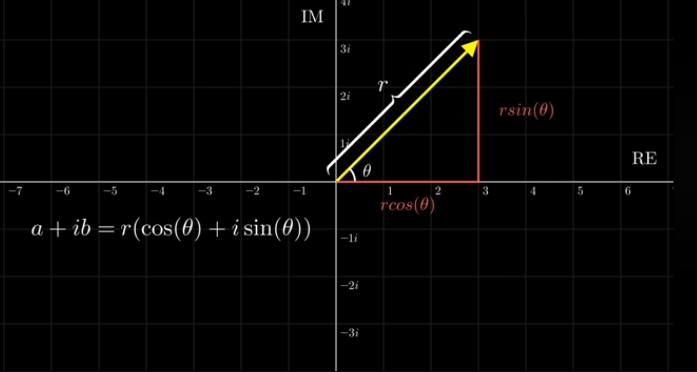
    
<i>Figure 1: Geometric representation in the complex plane.</i>

  

 

    <h3><strong>Operations</strong></h3>
    <ul>

- **Addition:** $(a + ib) + (c + id) = (a+c) + i(b+d)$
- **Multiplication (Cartesian):** $(a + bi)(c + di) = (ac - bd) + (ad + bc)i$
- **Multiplication (Polar):** $z_1 \cdot z_2 = (r_1 \cdot r_2)e^{i(\theta_1 + \theta_2)}$
  *(Note: Angles are added, magnitudes are multiplied)*
    </ul>

    <h3><strong>Notes</strong></h3>
    <ul>

- The Polar form is good to represent the rotation around the cartesian [Real, Img] axis.
- Fixing $r$ value results in circular rotation.
    </ul>
  

  

    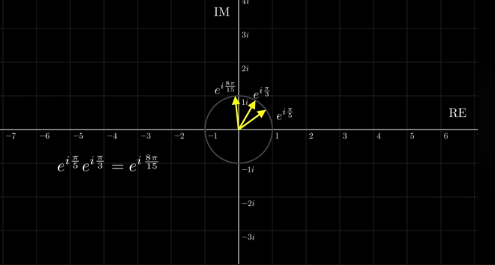
    
<i>Figure: Geometric representation in the complex plane.</i>

  

---

## 2.2. Matrix Operations

**Standard Operations** 
These operations allow us to manipulate quantum gates and state vectors.

|Operation|Notation|Definition/Property|
|-|-|-
**Inverse**|$A^{-1}$|$A^{-1}A = I$ (Identity Matrix).
**Transpose**|$A^T$| Swap rows and columns.
**Conjugate Transpose (Adjoint/Dagger)**|$A^\dagger$|$(A^*)^T = (A^T)^* = A^\dagger$ ; Take the complex conjugate of every element and then transpose.

**Example of Conjugate:** 
If we have matrix $A$:

$$A = \begin{bmatrix} 2+3i & 0 \\\\ 5 & 3-i \end{bmatrix}$$

Then the conjugate $A^*$ is:

$$A^* = \begin{bmatrix} 2-3i & 0 \\\\ 5 & 3+i \end{bmatrix}$$

Then the transpose of the conjugate $(A^*)^T$ is:

$$A^* = \begin{bmatrix} 2-3i & 5 \\\\ 0 & 3+i \end{bmatrix}$$
 

**Note**: This also could be obtained using transposing the matrix then replacing each element by its complex conjugate.

**Special Matrices** 
In Quantum Mechanics, we almost exclusively work with these two types:

|Special Matrix|Definition|Meaning|Role|
|-|-|-|-|
**Unitary Matrix ($U$)**|$U^\dagger U = I$.|Any Unitary matrix $U$ is invertible, and its inverse is given by $U^\dagger$ |- They rotate or flip vectors while preserving their magnitude (length).  - This is vital for maintaining probabilities in quantum computing; Since the total probability of all possible outcomes must always equal 1, quantum gates must be Unitary.  - This ensures that the "length" of the state vector never changes; if you start with 100% probability, you end with 100% probability, even after rotating the vector.
**Hermitian Matrix ($H$)**|$H = H^\dagger$.|***Self-Adjoint***: Any Hermitian matrix $H$ is equal to its adjoint matrix $H^\dagger$ $G$ is Hermitian if $G=G^\dagger$, and as **G** is unitary then $G^2=I$ |- Diagonal Elements: all elements on the principal diagonal are real numbers. - Eigenvalues: All eigenvalues are strictly real. - Eigenvectors: Eigenvectors corresponding to distinct eigenvalues are orthogonal. - Diagonalization: It's always unitarily diagonalizable.

 

**Eigenvalues and Eigenvectors** 
When a matrix $A$ acts on an eigenvector $\vec{v}$, the vector stays in the same direction but is scaled by the eigenvalue $\lambda$:

> $$A\vec{v} = \lambda\vec{v}$$

**Vector Illustration:** 
Imagine a vector $\vec{v}$ being stretched by a factor $\lambda$ without changing its direction.

---

## 2.3. Linear Algebra

**Vectors and Kets** 
In Quantum Computing, we use **Dirac Notation** (Bra-Ket notation) [Will be explained in details below]:
- **Ket:** $|\psi\rangle$ represents a column vector.
- **Bra:** $\langle\psi|$ represents the conjugate transpose (row vector).
 

**Basis and Unit Vectors** 
- **Unit Vector:** A vector with a magnitude (norm) of 1.
- **Basis:** A set of vectors used to represent any other vector in the space.
- **Orthonormal Basis:** A basis where all vectors are unit vectors and are orthogonal (perpendicular) to each other.
 

**Vector Operations** 
- **Inner Product (Dot Product):** $\langle\psi|\phi\rangle$. The result is a scalar.
- **Norm:** $|\vec{v}|| = \sqrt{\langle v|v\rangle}$. If $|\vec{v}|| = 1$, the vector is **normalized**.
- **Outer Product:** $|\psi\rangle\langle\phi|$. The result is a matrix.

---

# 3. Working with a Single Qubit

## 3.1. Introduction to the Qubit & Superposition

  
  

      <h3 style="margin: 0; line-height: 1.4;">Classical Computer vs. Quantum Computer</h3>
  

  

    <ul style="margin: 0; padding-left: 20px; line-height: 1.6;">

| Classical Computer | Quantum Computer |
| :--- | :--- |
| Uses **Bits** (0s & 1s) | Uses **Qubits** |
| Either 0 or 1 at any time | Can be 0 and 1 **at the same time** |

  

  
  

    <h3 style="margin: 0; line-height: 1.4;">What is a Qubit?</h3>
  

  

    <ul style="margin: 0; padding-left: 20px; line-height: 1.6;">
      <li>Short for <strong>Quantum bit</strong>, also called {<strong>qbit, Qbit, q-bit</strong>}.</li>
      <li>Qbit is the minimal information unit in quantum computing.</li>
      <li>Physically, it is any quantum particle with two distinct states.</li>
      <li><strong>Example:</strong> A photon of light being polarized either horizontally or vertically.</li>
    </ul>
  

  
  

    <h3 style="margin: 0; line-height: 1.4;">Dirac Notation for States</h3>
  

  

    <ul style="margin: 0; padding-left: 20px; line-height: 1.6;">

In quantum computers, we define:
- $|0\rangle = \begin{pmatrix} 1 \\\\ 0 \end{pmatrix}$
- $|1\rangle = \begin{pmatrix} 0 \\\\ 1 \end{pmatrix}$

We will cover Dirac Notation more explained in further sections below.
    </ul>
  

  
  

    <h3 style="margin: 0; line-height: 1.4;">Superposition</h3>
  

  

    <ul style="margin: 0; padding-left: 20px; line-height: 1.6;">
      <li>A particle is in two states at the same time (simultaneously).</li>
      <li>A qubit is in superposition if it is both $|0\rangle$ and $|1\rangle$.</li>
    </ul>
  

---

## 3.2. Representing Qubits Mathematically

**Column Vector Representation** 
A qubit $|\psi\rangle$ is represented as:

$$|\psi\rangle = \begin{pmatrix} \alpha \\\\ \beta \end{pmatrix}$$

- $\alpha$: Amplitude for the $|0\rangle$ state.
- $\beta$: Amplitude for the $|1\rangle$ state.

---

## 3.3. How to Measure a Qubit

  
  

    <h3 style="margin: 0; line-height: 1.4;">The Collapse</h3>
  

  

    <ul style="margin: 0; padding-left: 20px; line-height: 1.6;">

When we measure a quantum system, it **collapses** into the measured state. 
If we measure a photon in superposition and get "Horizontal," it collapses and *becomes* horizontally polarized. 
Measurement results in either **0** or **1**. 
    </ul>
  

  
  

    <h3 style="margin: 0; line-height: 1.4;">Measurement Outcomes</h3>
  
  When measuring $|\psi\rangle = \begin{pmatrix} \alpha \\\\ \beta \end{pmatrix}$:
  

  

    <ul style="margin: 0; padding-left: 20px; line-height: 1.6;">

- We **do not** measure $\alpha$ or $\beta$.
- We measure a **0** or **1**.
- If result is 0: $|\psi\rangle \rightarrow |0\rangle$ (It's said "collapsed into")
- If result is 1: $|\psi\rangle \rightarrow |1\rangle$ (It's said "collapsed into")
    </ul>
  

  
  

    <h3 style="margin: 0; line-height: 1.4;">Concluding Question</h3>

  **So what is the point of $\alpha, \beta$ if we only measure 0 or 1?**
  

  

    <ul style="margin: 0; padding-left: 20px; line-height: 1.6;">

- It tells the probability of measuring $|\psi\rangle$ as 0: $|\alpha|^2$ or as 1: $|\beta|^2$ 
- Apply this to "Zero state" $|0\rangle = \begin{pmatrix} 1 \\\\0 \end{pmatrix}$: Probability of measuring 0 is 1.
- Apply this to "One state" $|1\rangle = \begin{pmatrix} 0 \\\\1 \end{pmatrix}$: Probability of measuring 1 is 1.
- Probabilities should be added to 1; $|\alpha|^2+|\beta|^2=1$. This considered a valid Qubit. In case of probabilities added !=1; then this is considered as non-valid Qubit.
    </ul>
  

---

## 3.4. Qubit Representation
**Bit** is short for binary digit; could be in state '0' or in state '1'.  
A **qbit** can be in state $|0\rangle$ or $|1\rangle$. [Called *Dirac Notation*, where the symbols $| \rangle$ are called **Kets**].  
The states: $|0\rangle, |1\rangle$ are not the only possibilities for the state of a qubit; it could be in a **superposition** of the form: $a|0\rangle + b|1\rangle$: 
- Where ***a*** and ***b*** are complex numbers, called **amplitudes**, such that $|a|^2 + |b|^2 = 1$
- $\sqrt{|a|^2 + |b|^2}$ : norm or length of the state, when it is equal to 1 then the state is called normalized.
  

**Hilbert Space**: 
  - All these possible values for the state of a single qubit are vectors in the complex vector space of dimension 2.
  - In fact, they live in what is called a **Hilbert space**
  - Since we are working only with finite dimensions, there is no real difference.
  

**Computational Basis**: 
To fix the vectors $|0\rangle$ and $|1\rangle$ as elements of special **basis**, we refer to as the **computational basis**. 
Representing these vectors, constituents of the computational basis, as the column vectors: $|0\rangle = \begin{pmatrix} 1 \\\\ 0 \end{pmatrix}$, $|1\rangle = \begin{pmatrix} 0 \\\\ 1\end{pmatrix}$ 
Hence: $a|0\rangle + b|1\rangle = a\begin{pmatrix} 1 \\\\ 0 \end{pmatrix} + b\begin{pmatrix} 0 \\\\ 1 \end{pmatrix} = \begin{pmatrix} a \\\\ b \end{pmatrix}$.

---

## 3.5. Introduction to Dirac Notation
Working with Quantum mechanics, instead of using matrices, we use Dirac Notation. 
Dirac Notation Was introduced by *Paul Dirac* as a compact way to represent vectors in a complex vector space (Hilbert Space).

For an arbitrary qubit state, it can be factored into sum of two matrices: 

$$|\psi\rangle = \begin{pmatrix} \alpha \\\\ \beta\end{pmatrix} = \begin{pmatrix} \alpha \\\\ 0\end{pmatrix} + \begin{pmatrix} 0 \\\\ \beta\end{pmatrix} = \alpha\begin{pmatrix} 1 \\\\ 0\end{pmatrix} + \beta\begin{pmatrix} 0 \\\\ 1\end{pmatrix} = \alpha|0\rangle + \beta|1\rangle$$

So, a quantum state is defined as:
$|\psi\rangle = \alpha |0\rangle + \beta |1\rangle$

- This tells us that both three: $\psi,0,1$ are quantum states.

Example:

$|\psi\rangle=\begin{pmatrix} \frac{1}{2} \\\\ \frac{2\sqrt{3}}{4}\end{pmatrix}=\frac{1}{2}|0\rangle + \frac{2\sqrt{3}}{4}|1\rangle$

Note: 
- $|\alpha|^2 + |\beta|^2 = 1$
- Ket: Represent a Quantum state (A column vector) $|\psi\rangle$
- Bra: The conjugate transpose of the ket (a row vector) $\langle\psi|$
- So a *Ket* is like: $|\psi\rangle = \begin{pmatrix}\alpha \\\\ \beta \end{pmatrix}$, and the conjugate *Bra* is: $\langle\psi| = [\alpha^* \quad \beta^*]$

--- 

## 3.6. Representing a Qubit on Bloch Sphere
We can represent a qubit $|\psi\rangle$ as a point on the surface of the **Bloch Sphere**

  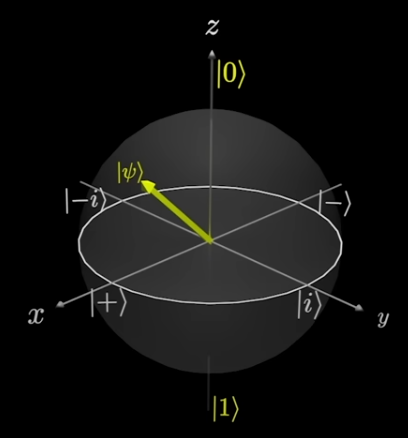

  

- X-axis: $|+\rangle$, $|-\rangle$ states  
- Y-axis: $|i\rangle$, $|-i\rangle$ states  
- Z-axis: $|0\rangle$, $|1\rangle$ states  
- Higher vertically = Higher probability of measuring $|\psi\rangle$ as $|0\rangle$ (north pole)  
- Lower vertically = Higher probability of measuring $|\psi\rangle$ as $|1\rangle$ (south pole)  
- Note: a qubit can spin around the sphere; this is called phase  

  

---

## 3.7. Manipulating a Qubit - The X,Y and Z Gates
In classical computing, we use logic gates to change the state. In quantum computing, we still have gates that we use to change the Qubit state. These gates are little different that the logic gates.

There three quantum gates: X-Gate, Y-Gate, and Z-Gate

**The X-Gate** 
The X-gate flips the Qubit $\pi$ radians around the x-axis on the Bloch Sphere

  

    

      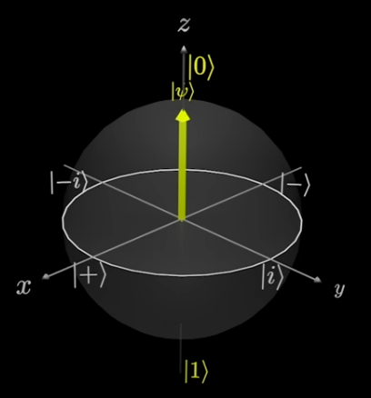
      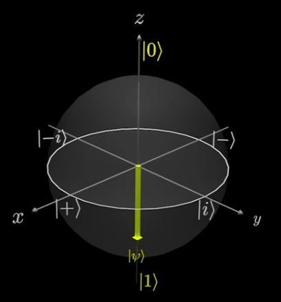
    

    

    
  <i>Figure: Example-1 A qubit $|0\rangle$ state -> then applying X-Gate flips -> to $|1\rangle$ state</i>

  

  

    

      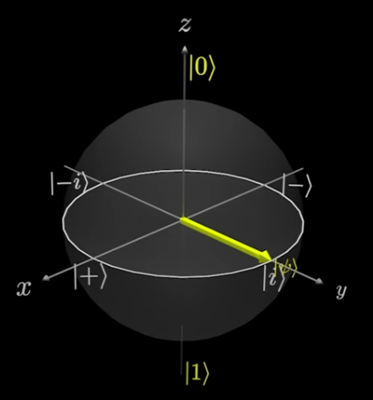
      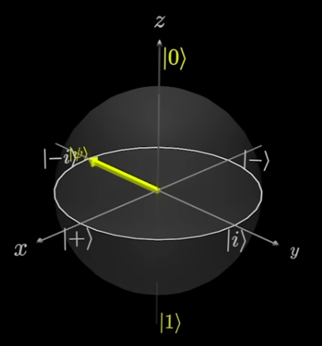
    

    

 <i>Figure: Example-2 A qubit $|i\rangle$ state -> then applying X-Gate flips -> to $|-i\rangle$ state.</i>

  

**The Y-Gate** 
The Y-gate flips the Qubit $\pi$ radians around the y-axis on the Bloch Sphere

**Examples:**

  

    

      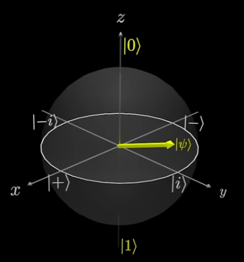
      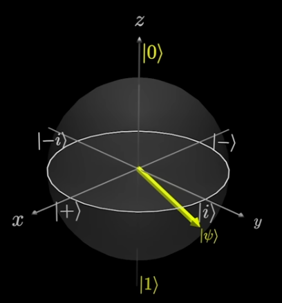
    

    

    
  <i>Figure: Example-1</i>

  

  

    

      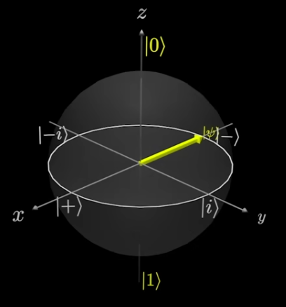
      
    

    

 <i>Figure: Example-2</i>

  

**The Z-Gate** 
The Z-gate flips the Qubit $\pi$ radians around the z-axis on the Bloch Sphere

  

    

      
      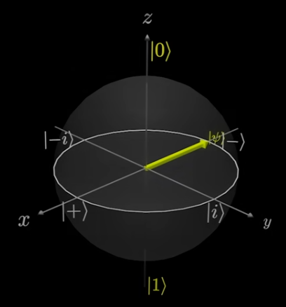
    

    

    
  <i>Figure: Example</i>

  

**Observations** 
Since the $X$, $Y$, and $Z$ gates rotate around the specified axis $\pi$ radians. 
If we apply the same gate twice; we rotate around $2\pi$ radians; meaning the qubit will end up in the original state. 
! This means **The $X$, $Y$, and $Z$ gates are their own inverses**.

 

**Gates Representation** 
These **Pauli** gate can be represented as matrices.

$X=\begin{pmatrix} 0&1 \\\\ 1&0 \end{pmatrix}$ &ensp; &ensp; $Y=\begin{pmatrix} 0&-i \\\\ i&0 \end{pmatrix}$ &ensp; &ensp; $Z=\begin{pmatrix} 1&0 \\\\ 0&-1 \end{pmatrix}$

 

**Applying Gates to Qubit** 
Applying $X$ gate to an arbitrary qubit $|\psi\rangle = \begin{pmatrix}\alpha \\ \beta \end{pmatrix}$

$$X|\psi\rangle = \begin{pmatrix}0&1\\\\1&0\end{pmatrix} \begin{pmatrix}\alpha\\\beta\end{pmatrix} = \begin{pmatrix}\beta\\\alpha\end{pmatrix}$$

 

**Concrete Example**: $X|0\rangle = |1\rangle$  

$$X|0\rangle = \begin{pmatrix} 0 & 1 \\\\ 1 & 0 \end{pmatrix} \begin{pmatrix} 1 \\\\ 0 \end{pmatrix} = \begin{pmatrix} 0 \\\\ 1 \end{pmatrix} = |1\rangle$$

 

**Dirac Notation Note: Matrix Columns** 
When working in *Dirac notation*, the columns of an arbitrary gate matrix $U=\begin{pmatrix}a&b \\\\ c&d\end{pmatrix}$ directly define how the gate transforms the basis states:
- **First Columns ($|0\rangle$ outcome)**: 

$$U|0\rangle=\begin{pmatrix}a\\\\c\end{pmatrix}=a|0\rangle+c|1\rangle$$

- **Second Column ($|1\rangle$ outcome):**  

$$U|1\rangle=\begin{pmatrix}b\\\\d\end{pmatrix}=b|0\rangle+d|1\rangle$$

 

**Linearity Principle** 
Since quantum operations are linear; we can distribute the gate over any arbitrary linear combination:

$$|\psi\rangle=U(\alpha|0\rangle+\beta|1\rangle)=\alpha U|0\rangle+\beta U|1\rangle$$

 

**Worked Examples** 
**Example 1: Applying the Y Gate** 
Let $|\psi\rangle=\frac{\sqrt{3}}{2}|0\rangle+\frac{1}{2}|1\rangle$

$$Y|\psi\rangle=\frac{\sqrt{3}}{2} Y|0\rangle + \frac{1}{2} Y|1\rangle$$
$$Y|\psi\rangle=\frac{\sqrt{3}}{2}\begin{pmatrix}0\\\\i\end{pmatrix}+\frac{1}{2}\begin{pmatrix}-i\\\\0\end{pmatrix}$$
$$Y|\psi\rangle=\frac{\sqrt{3}}{2}i\begin{pmatrix}0\\\\1\end{pmatrix} -\frac{1}{2}i\begin{pmatrix}1\\\\0\end{pmatrix}$$
$$Y|\psi\rangle=\frac{\sqrt{3}}{2}i|1\rangle -\frac{1}{2}i|0\rangle$$

**Example 2: Applying the Z Gate** 
Prove: $Z(\alpha|0\rangle+\beta|1\rangle) = \alpha|0\rangle - \beta|1\rangle$

$$Z|\psi\rangle=Z(\alpha|0\rangle+\beta|1\rangle)$$
$$Z|\psi\rangle= \alpha Z|0\rangle + \beta Z|1\rangle$$ 
$$Z|\psi\rangle=\alpha \begin{pmatrix}1\\\\0\end{pmatrix} + \beta \begin{pmatrix}0\\\\-1\end{pmatrix}$$
$$Z|\psi\rangle=\alpha\begin{pmatrix}1\\\\0\end{pmatrix} + \beta (-1) \begin{pmatrix}0\\\\1\end{pmatrix}$$ 
$$Z|\psi\rangle= \alpha|0\rangle - \beta|1\rangle$$

 

**Summary of Gates**

|Gate| Operation
|-|-|
$X$|$\|0\rangle\xrightarrow{X}\|1\rangle$ $\|1\rangle\xrightarrow{X}\|0\rangle$
$Y$|$\|0\rangle\xrightarrow{Y}i\|1\rangle$ $\|1\rangle\xrightarrow{Y}-i\|0\rangle$
$Z$|$\|0\rangle\xrightarrow{Z}\|0\rangle$ $\|1\rangle\xrightarrow{Z}-\|1\rangle$

  

    <h3><strong>Concluding Question</strong></h3>
    
What is the point of Z gate? it just rotates the qubit around the Z-axis. Also, gives that from previous example, that the qubit still have the same $\alpha$ chances of being zero and $\beta$ chance of being one. This didn't affect the probability! The qubit stays the same distance from zero/one states.

In the further explanation, the complex numbers will be brought here in the quantum computing with introduction to Phase
  

  

    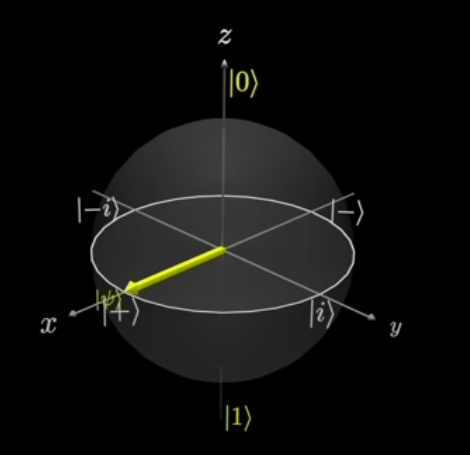
    
<i>Figure: Rotation around z-axis.</i>

  

## 3.8. Intro to Phase: Global vs Relative Phase
To introduce phase, we must get our friend "Complex numbers". In QC, the complex numbers are usually used in the exponential form; It gives a nice mathematically way in rotating the qubit based on the $\phi$ angle value.

$$|\psi\rangle=\alpha |0\rangle + e^{i\phi}\beta |1\rangle$$

- By multiplying the $|1\rangle$ by $e^{i\phi}$, we rotate around the z-axis (on the Bloch Sphere) by $\phi$ radians.

**Why The $|1\rangle$ State that Multiply by Complex Number?** 

|Global Phase|Relative Phase|
|-|-|
Both states multiplied by a complex number.|Only the one-state is multiplied by a complex number.
$e^{i\phi}(\alpha \|0\rangle + \beta \|1\rangle)$  = $e^{i\phi} \alpha \|0\rangle + e^{i\phi} \beta \|1\rangle$|$\alpha \|0\rangle + e^{i\phi} \beta \|1\rangle$

**The Global Phase is generally being discarded!!** 
- It turns out that the global phase is physically irrelevant; 
- $e^{i\phi}(\alpha |0\rangle + \beta |1\rangle) \equiv \alpha |0\rangle + \beta |1\rangle$

**What If $e^{i\theta} \alpha |0\rangle + e^{i\phi} \beta |1\rangle$ ?** 
Here, we have a complex number in both of amplitude of the two states.

**Prove** 
1. The arbitrary qubit: 
> $$e^{i\theta} \alpha |0\rangle + e^{i\phi} \beta |1\rangle$$
2. Factor out the complex number over entire Qubit: 
> $$e^{i\theta}(\alpha |0\rangle + (e^{i\theta})^{-1} e^{i\phi} \beta |1\rangle) = e^{i\theta}(\alpha |0\rangle + e^{i(\phi - \theta)} \beta |1\rangle)$$
3. Now, we have global phase and relative phase. Discarding the global phase: 
> $$\alpha |0\rangle + e^{i(\phi - \theta)} \beta |1\rangle$$

**Recall! Phasing Does Not Affect Probability!** 
the qubit still have the same $\alpha$ chances of being zero and $\beta$ chance of being one. This didn't affect the probability! The qubit stays the same distance from zero/one states. It's just rotating around the Z-axix.

  

  

So, if we have a Qubit $|\psi\rangle = \alpha|0\rangle + e^{i\phi} \beta|1\rangle$
- The probability of measuring 0 = $|\alpha|^2$
- The probability of measuring 1 = $|e^{i\phi}|^2 |\beta|^2$ = $1 |\beta|^2$ = $|\beta|^2$ 
- Recall, the magnitude of a complex number in exponential form $re^{i\phi}$ is $r$
  

---

## 3.9. Tha Hadamard Gate, and the $+, -, i and -i$ States 
**Each on of the gates contains a relative phase.**

**States Representation** 

|State|Representation|
|-|-|
$\|+\rangle$| $\|+\rangle=\frac{1}{\sqrt{2}}\|0\rangle+\frac{1}{\sqrt{2}}\|1\rangle$
$\|-\rangle$| $\|-\rangle=\frac{1}{\sqrt{2}}\|0\rangle-\frac{1}{\sqrt{2}}\|1\rangle$
$\|i\rangle$| $\|i\rangle=\frac{1}{\sqrt{2}}\|0\rangle+\frac{i}{\sqrt{2}}\|1\rangle$
$\|-i\rangle$| $\|-i\rangle=\frac{1}{\sqrt{2}}\|0\rangle-\frac{i}{\sqrt{2}}\|1\rangle$

**Note That** 
- The values for $\alpha$ & $\beta$ represents the eigenvalues; e.g., $|+\rangle$: eigenvalues are {$\frac{1}{\sqrt{2}}$,$\frac{1}{\sqrt{2}}$}, $|-\rangle$: eigenvalues are {$\frac{1}{\sqrt{2}}$,-$\frac{1}{\sqrt{2}}$}

 

**The Hadamard Gate** 
Mathematical representation: $H = \frac{1}{\sqrt{2}}\begin{bmatrix}1&1 \\\\1&-1\end{bmatrix}$

**Applying effect of $H$ on the states**:

  

- $|0\rangle \xrightarrow{H} |+\rangle$
  
  

  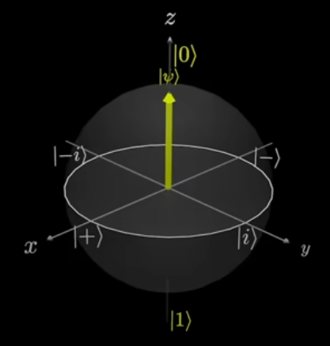 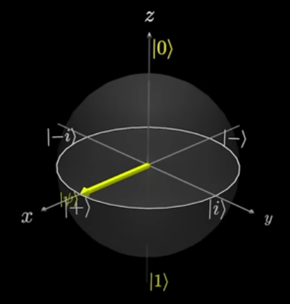

  

- $|1\rangle \xrightarrow{H} |-\rangle$
  
  

  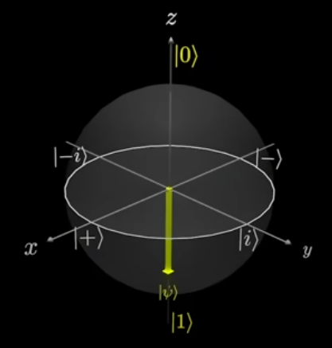 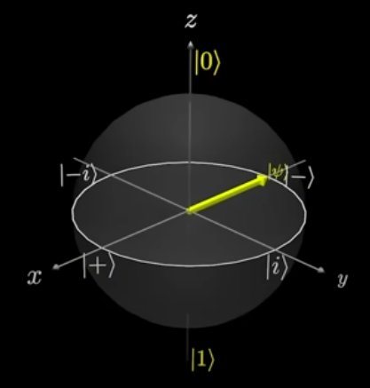

|H Operation|
|-|
$\|0\rangle \xrightarrow{H} \|+\rangle$
$\|1\rangle \xrightarrow{H} \|-\rangle$
$\|+\rangle \xrightarrow{H} \|0\rangle$
$\|-\rangle \xrightarrow{H} \|1\rangle$

**Note**
- **The Hadamard Gate is it's own inverse**.

---

## 3.10. The $S$ and $T$ Phase Gates.
Introduction to a two Phase gates; it adds a relative phase to the $|1\rangle$ state.

|$S$|$T$|
|-|-|
$S=\begin{pmatrix}1&0\\\\0&e^{i\frac{\pi}{2}}\end{pmatrix}$|$T=\begin{pmatrix}1&0\\\\0&e^{i\frac{\pi}{4}}\end{pmatrix}$
$\|0\rangle \xrightarrow{S}\|0\rangle$|$\|0\rangle \xrightarrow{T}\|0\rangle$|
$\|1\rangle \xrightarrow{S}e^{i\frac{\pi}{2}}\|1\rangle$|$\|1\rangle \xrightarrow{T}e^{i\frac{\pi}{4}}\|1\rangle$|
Adds a relative Phase of $e^{i\frac{\pi}{2}}$| Adds a relative phase of $e^{i\frac{\pi}{4}}$
$\alpha\|0\rangle+\beta\|1\rangle\xrightarrow{S}\alpha\|0\rangle+e^{i\frac{\pi}{2}}\beta\|1\rangle$|$\alpha\|0\rangle+\beta\|1\rangle\xrightarrow{T}\alpha\|0\rangle+e^{i\frac{\pi}{4}}\beta\|1\rangle$

| $S^\dagger$ Gate | $T^\dagger$ Gate |
|------------------|------------------|
| $S^\dagger = \begin{pmatrix} 1 & 0 \\\\ 0 & e^{i(-\frac{\pi}{2})} \end{pmatrix}$ | $T^\dagger = \begin{pmatrix} 1 & 0 \\\\ 0 & e^{i(-\frac{\pi}{4})} \end{pmatrix}$ |
| Adds a relative phase of $e^{i(-\frac{\pi}{2})}$ | Adds a relative phase of $e^{i(-\frac{\pi}{4})}$ |
| $S(\alpha\|0\rangle + \beta\|1\rangle) = \alpha\|0\rangle + e^{i\frac{\pi}{2}}\beta\|1\rangle$ | |
| $S^\dagger(\alpha\|0\rangle + e^{i\frac{\pi}{2}}\beta\|1\rangle)$ | |
| $= \alpha\|0\rangle + e^{i(-\frac{\pi}{2})} e^{i\frac{\pi}{2}} \beta\|1\rangle$ | |
| $= \alpha\|0\rangle + e^{i(0)} \beta\|1\rangle$ | |
| $= \alpha\|0\rangle + \beta\|1\rangle$ | |

---

## 3.11. The Rotation Gates
Rotation Gates $(R_x, R_y, R_z)$ allow us to move a state to any point on the **Bloch sphere**.

We define the following rotation gates:

$$R_X(\theta) = e^{-i\frac{\theta}{2}X} = \cos \frac{\theta}{2}I - i \sin \frac{\theta}{2}X = \begin{pmatrix} \cos \frac{\theta}{2} & -i \sin \frac{\theta}{2} \\ -i \sin \frac{\theta}{2} & \cos \frac{\theta}{2} \end{pmatrix}$$

$$
R_Y(\theta) = e^{-i\frac{\theta}{2}Y} = \cos \frac{\theta}{2}I - i \sin \frac{\theta}{2}Y = \begin{pmatrix} \cos \frac{\theta}{2} & -\sin \frac{\theta}{2} \\ \sin \frac{\theta}{2} & \cos \frac{\theta}{2} \end{pmatrix}
$$

$$
R_Z(\theta) = e^{-i\frac{\theta}{2}Z} = \cos \frac{\theta}{2}I - i \sin \frac{\theta}{2}Z = \begin{pmatrix} e^{-i\frac{\theta}{2}} & 0 \\ 0 & e^{i\frac{\theta}{2}} \end{pmatrix} \equiv \begin{pmatrix} 1 & 0 \\ 0 & e^{i\theta} \end{pmatrix}
$$

> **Note:**
>
> The symbol $\equiv$ represents an equivalent action up to a **global phase**.
>
> The rotation gates definition derivated is explained below.

**Notable Equivalences** 
Notice the following specific rotation results:
* $R_X(\pi) \equiv X$
* $R_Y(\pi) \equiv Y$
* $R_Z(\pi) \equiv Z$
* $R_Z\left(\frac{\pi}{2}\right) \equiv S$
* $R_Z\left(\frac{\pi}{4}\right) \equiv T$

> Note: Notice how the $R_z$ gate is equivalent to the $S$ and $T$ phase gates at specifc angles; this shows that "Phase" is essentially just a rotation around the Z-axis of the sphere.

 

**Geometric Interpretation** 

Rotation matrices can be interpreted geometrically by introducing the so-called **Bloch sphere**. In fact, for any gate $G$, if $G$ is **Hermitian**, we have:

$$R_G = e^{-i\frac{\theta}{2}G} = \cos \frac{\theta}{2}I - i \sin \frac{\theta}{2}G$$

 

**The Definition Derivitive** 
Let's explore how the above rotation gate defition was get:

- Example: $R_x(\theta)$:

$$R_x(\theta)=\cos\frac{\theta}{2}I-i\sin\frac{\theta}{2}X$$
$$R_x(\theta)=\cos\frac{\theta}{2} . \begin{pmatrix}1&0\\\\0&1\end{pmatrix}-i\sin\frac{\theta}{2} . \begin{pmatrix}0&1\\\\1&0\end{pmatrix}$$
$$R_x(\theta)=\begin{pmatrix}\cos\frac{\theta}{2} & 0 \\\\0&\cos\frac{\theta}{2} \end{pmatrix}+\begin{pmatrix}0&-i\sin\frac{\theta}{2}\\\\-i\sin\frac{\theta}{2}&0\end{pmatrix}$$
$$R_x(\theta)=\begin{pmatrix}\cos\frac{\theta}{2} &-i\sin\frac{\theta}{2} \\\\ -i\sin\frac{\theta}{2}&\cos\frac{\theta}{2}\end{pmatrix}$$
$$R_x(\pi)=\begin{pmatrix}\cos\frac{\pi}{2} &-i\sin\frac{\pi}{2} \\\\ -i\sin\frac{\pi}{2}&\cos\frac{\pi}{2}\end{pmatrix}=\begin{pmatrix}0&-i(i)\\\\-i(i)&0\end{pmatrix}=\begin{pmatrix}0&1\\\\1&0\end{pmatrix}=X$$

- Example: $R_y(\theta)$:

$$R_y(\theta)=\cos\frac{\theta}{2}I-i\sin\frac{\theta}{2}Y$$
$$R_y(\theta)=\cos\frac{\theta}{2} . \begin{pmatrix}1&0\\\\0&1\end{pmatrix}-i\sin\frac{\theta}{2} . \begin{pmatrix}0&-i\\\\i&0\end{pmatrix}$$
$$R_y(\theta)=\begin{pmatrix}\cos\frac{\theta}{2} & 0 \\\\0&\cos\frac{\theta}{2} \end{pmatrix}+\begin{pmatrix}0&-\sin\frac{\theta}{2}\\\\\sin\frac{\theta}{2}&0\end{pmatrix}$$
$$R_y(\theta)=\begin{pmatrix}\cos\frac{\theta}{2} &-\sin\frac{\theta}{2} \\\\ \sin\frac{\theta}{2}&\cos\frac{\theta}{2}\end{pmatrix}$$
$$R_y(\pi)=\begin{pmatrix}\cos\frac{\pi}{2} &-\sin\frac{\pi}{2} \\\\ \sin\frac{\pi}{2}&\cos\frac{\pi}{2}\end{pmatrix}=\begin{pmatrix}0&-i\\\\i&0\end{pmatrix}=Y$$

- Example: $R_z(\theta)$:

$$R_z(\theta)=\cos\frac{\theta}{2}I-i\sin\frac{\theta}{2}Z$$
$$R_z(\theta)=\cos\frac{\theta}{2} . \begin{pmatrix}1&0\\\\0&1\end{pmatrix}-i\sin\frac{\theta}{2} . \begin{pmatrix}1&0\\\\0&-1\end{pmatrix}$$
$$R_z(\theta)=\begin{pmatrix}\cos\frac{\theta}{2} & 0 \\\\0&\cos\frac{\theta}{2} \end{pmatrix}+\begin{pmatrix}-i\sin\frac{\theta}{2}&0\\\\0&i\sin\frac{\theta}{2}\end{pmatrix}$$
$$R_z(\theta)=\begin{pmatrix}\cos\frac{\theta}{2}-i\sin\frac{\theta}{2} &0 \\\\ 0&\cos\frac{\theta}{2}+i\sin\frac{\theta}{2}\end{pmatrix}$$
$$R_z(\theta)=\begin{pmatrix}e^{-i\frac{\theta}{2}}&0\\\\0&e^{i\frac{\theta}{2}}\end{pmatrix}$$
$$R_z(\pi)=\begin{pmatrix}e^{-i\frac{\pi}{2}}&0\\\\0&e^{i\frac{\pi}{2}}\end{pmatrix}=\begin{pmatrix}\cos\frac{\pi}{2}-i\sin\frac{\pi}{2}&0\\\\0&\cos\frac{\pi}{2}+i\sin\frac{\pi}{2}\end{pmatrix}=\begin{pmatrix}0-i(i)&0\\\\0&0+i(i)\end{pmatrix}=\begin{pmatrix}1&0\\\\0&-1\end{pmatrix}=Z$$

---

# 4. Working with Multiple Qubit

## 4.1. Representing Multiple Qubit Mathematically
We represent multiple qubits wiht **Tensor Product** $\otimes$

For example, if we have two qubits in state $|0\rangle$, this is reprenented with $\otimes$ and it's shortened to this $|00\rangle$ (Two zeros in the one Kit vector).

$$|0\rangle \otimes|0\rangle = |00\rangle$$

If we have a two arbitrary qubit, and want to represent them in superposition:

$$(\alpha|0\rangle + \beta|1\rangle)\ \otimes\ (\gamma|0\rangle + \delta|1\rangle)$$

$$= \alpha|0\rangle \otimes \gamma|0\rangle + \alpha|0\rangle \otimes \delta|1\rangle + \beta|1\rangle \otimes \gamma|0\rangle + \beta|1\rangle \otimes \delta|1\rangle$$

$$= \alpha\gamma |0\rangle \otimes |0\rangle+ \alpha\delta |0\rangle \otimes |1\rangle+ \beta\gamma |1\rangle \otimes |0\rangle+ \beta\delta |1\rangle \otimes |1\rangle$$

$$= \alpha\gamma |00\rangle + \alpha\delta |01\rangle + \beta\gamma |10\rangle + \beta\delta |11\rangle$$

Now, we have 4 states since these are all the possible combination of having two qubits.
- Prob(measuring $|00\rangle$) = $|\alpha\gamma|^2$
- Prob(measuring $|01\rangle$) = $|\alpha\delta|^2$
- Prob(measuring $|10\rangle$) = $|\beta\gamma|^2$
- Prob(measuring $|11\rangle$) = $|\beta\delta|^2$

**Short Hand Notation**: for applying multiple qubit

$$|0000...0\rangle=|0\rangle^{\otimes n}$$

$$|1\rangle^{\otimes 5}=|11111\rangle$$

---

## 4.2. Quantum Circuits
**They are unitary transformations represented by unitary matrices**  
In case we have a triple qubit like $|001\rangle$, how can we apply a X-Gate on the second qubit? 
For this we use a quantum diagram called quantum circuits.

  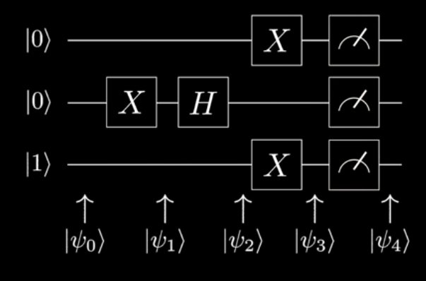
  

- Each line represents a singular qubit.
- The states on the Left represent the initial states of the Qubits.
- The boxes are the quantum gates, and the letters on the boxes are the type of gate we're applying.
- The boxes on the right are the measurment boxes.
- The horizontal views shows the order which we apply the gates.
- The horizontal $|\psi_n\rangle$ represents the state of the system at different points during the Algorithm.

  

Here are the states at each point in the circuts:

|State|Operation|Output|
|-|-|-|
$\|\psi_0\rangle$||$\|001\rangle$
$\|\psi_1\rangle$|Apply $X$-gate on the 2nd Qubit|$\|011\rangle$
$\|\psi_2\rangle$|Apply $H$-gate on the 2nd Qubit|$\|0-1\rangle$ $\|0\rangle\otimes\frac{1}{\sqrt{2}}(\|0\rangle-\|1\rangle)\otimes\|1\rangle$ $\frac{1}{\sqrt{2}}(\|001\rangle-\|011\rangle)$
$\|\psi_3\rangle$|Apply $X$ gates to both 1st and 3rd qubits|$\frac{1}{\sqrt{2}}(\|100\rangle-\|110\rangle)$
$\|\psi_4\rangle$|Measuring the Qubits|Will be $\|100\rangle \frac{1}{2}$ of the time, and $\|110\rangle \frac{1}{2}$ of the time. 

 

**Note:** 
In the above quantum circuits, some books put a double line "$=$" instead of single line "$-$" after the measurement box; to indicate a classical value is measured as double line holds classical value, while a single line holds a quantum value. 

---

## 4.3. Multi-qubit Gates: CNOT, Toffoli and Controlled Gates

  

    <h3><strong>CNOT/Controlled X Gate</strong></h3>
    
The CNOT gate applies an $X$ gate to the **target qubit**, if the **Control qubit** is a *1*

Example: The 1st qubit is the control, 2nd qubit is the target. 

$CNOT(\frac{\sqrt{3}}{4}|00\rangle)+\frac{1}{2}|01\rangle+\frac{1}{\sqrt{2}}|10\rangle+\frac{1}{4}|11\rangle)$ 

= $\frac{\sqrt{3}}{4}CNOT|00\rangle+\frac{1}{2}CNOT|01\rangle+\frac{1}{\sqrt{2}}CNOT|10\rangle+\frac{1}{4}CNOT|11\rangle$

= $\frac{\sqrt{3}}{4}|00\rangle+\frac{1}{2}|01\rangle+\frac{1}{\sqrt{2}}|11\rangle+\frac{1}{\sqrt{2}}|10\rangle$

  

  

    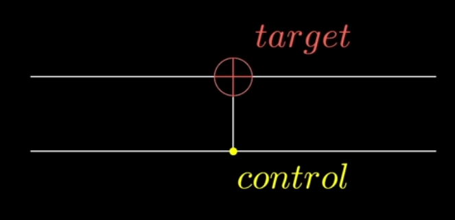
    
<i>Figure: CNOT Gate.</i>

  

  

    <h3><strong>Toffoli Gate</strong></h3>
    
Same as CNOT but has 2 Control Qubits.

Example: The 2nd, 3rd qubits are the control, 4th qubit is the target.

$TOFFOLI(\frac{1}{\sqrt{2}}|0011\rangle+\frac{1}{\sqrt{2}}|0110\rangle)$

= $\frac{1}{\sqrt{2}}TOFFOLI|0011\rangle+\frac{1}{\sqrt{2}}TOFFOLI|0110\rangle$

= $\frac{1}{\sqrt{2}}|0011\rangle+\frac{1}{\sqrt{2}}|0111\rangle$

  

  

    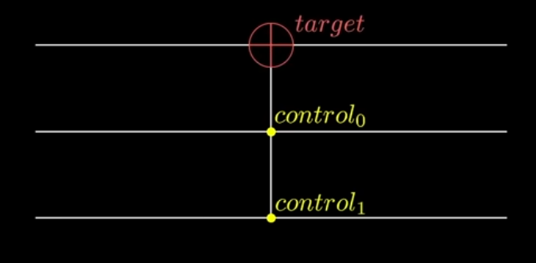
    
<i>Figure: Toffolie Gate.</i>

  

  

    <h3><strong>Notes</strong></h3>
    
There are also other controlled gates like: $CY, CZ, CS, CT, CH, ..$; it odes the same that it applies the gate to the target qubit is the control qubit is a 1

  

  

    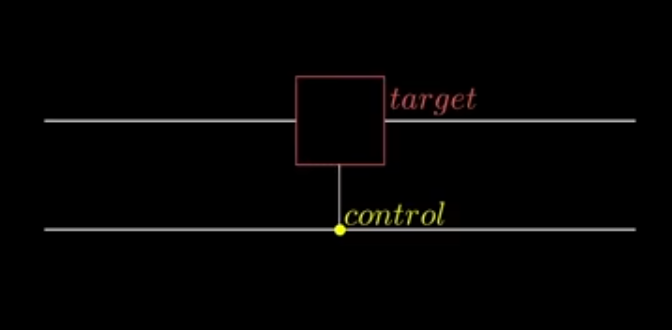
    

      <i>Figure: Controlled Gate</i>
    

  

  

    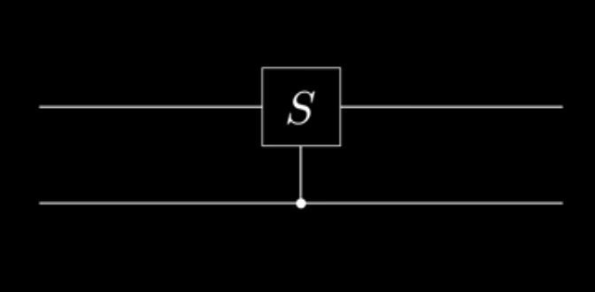
    

      <i>Figure: S Gate as example</i>
    

  

---
# Notes
Theories explain; Models represent and apply.

Measurements reveals properties!!
- Each Object has properties; in classical physics, they assume these properties are defined.

## The Inner Product
The inner product between two states is written as: $\langle\phi|\psi\rangle$
- It's a complex number.
- What it means:
  - Measurement **overlap** between two quantum states.
  - Tells you how *similar* they are.
  - Determines Measurement probabilities.

[TO DO] Continue understand the inner product meaning.

### Calculation

An Example:

## Hadamard "H" Gate

prove:

## Note: Hadamard Gate
$H|u\rangle = \frac{1}{\sqrt{2}} \sum_{y=0}^{1} (-1)^{uy} |y\rangle$

Why is this formula preferred in QML?

While the ∣0⟩±∣1⟩ notation is more intuitive, this summation form is the "workhorse" of Quantum Machine Learning and Quantum Algorithms for two reasons:

    Generalization: It scales beautifully. For n qubits, the formula becomes H⊗n∣u⟩=2n​1​∑y∈{0,1}n​(−1)u⋅y∣y⟩. This is the Walsh-Hadamard Transform, used to create a uniform superposition of all possible states simultaneously—the ultimate "parallel processing" step in quantum computing.

    Phase Encoding: In QML, we often use the (−1)uy term to encode data into the "phase" of the quantum state. This allows us to perform interference patterns that highlight certain data features while canceling out noise.

# 5. Quantum Neural Network (QNN)
## 5.1. Cost Function
In QML, a cost funciton tells us how 'well' our quantum circuit is performing relative to an objective. 
It is almost always defined as the **expectation value** of a measurement operator (obeservable) $\hat{O}$ for the final state of the circuit $|\psi \rangle$:
$$C(\theta)=\langle\psi(\theta)|\hat{O}|\psi(\theta)\rangle$$

In most of the problem it's defined as $C(\theta_1,\theta_2)=\langle\psi_f|\hat{O}|\psi_f\rangle$, where: 
- $|\psi_f\rangle (The Ket): the final column vector of our system.$
- $\langle\psi_f|$ (The Bra): The conjugate transpose (row vector) of our system.
- $\hat{O}$ (The Operator): The measurement instruction (e,g, $Z\otimes X$).

## 5.2. The Components

|Component|Role|
|-|-|
**Variational Form (PQC)**|This is the sequence of gates with tunable parameters ($\theta_1, \theta_2$). By changing these angles, we train the circuit to minimize the cost function. 
**Rotation Gates ($R_y$)**|These move the qubit state along the Y-axis of the Bloch sphere.
**Measurement Operator ($\hat{O}=Z\otimes X$)**|This is the specific physical property we are measuring. It asks: "is the first qubit aligned with the Z-axis, and is the second qubit aligned with the X-axis?"

## 5.3. Cost Function Calculation Example
A two-qubit QNN takes the input PQC $|00\rangle$. Apply rotation gates $R_y(\theta_1)$ on qubit 1, $R_y(\theta_2)$ on qubit 2, then a CNOT (control: qubit 1, target: qubit 2). the cost function operator is $\hat{O}=Z\otimes X$ 

**1. Calculating final state from the Circuit:** 
$\because I=diag(1,1), Y=\begin{pmatrix}0&-i \\\\ i&0\end{pmatrix}$ 

$\because R_y(\theta)=e^{-i\frac{\theta}{2}y}=\cos(\frac{\theta}{2})I-i\sin(\frac{\theta}{w})Y=diag(\cos(\frac{\theta}{2}),\cos(\frac{\theta}{2}))+\begin{pmatrix}0&-\sin(\frac{\theta}{2})\\\\\sin(\frac{\theta}{2}))&0\end{pmatrix}=\begin{pmatrix}\cos\frac{\theta}{2}&-\sin\frac{\theta}{2}\\\\\sin\frac{\theta}{2}&\cos\frac{\theta}{2}\end{pmatrix}$ 

Applying to $|0\rangle$: 
$R_y(\theta_1)|0\rangle=\begin{pmatrix}\cos\frac{\theta_1}{2}\\\\\sin\frac{\theta_1}{2}\end{pmatrix}=\cos\frac{\theta_1}{2}|0\rangle+\sin\frac{\theta_1}{2}|1\rangle$  
$R_y(\theta_2)|0\rangle=\begin{pmatrix}\cos\frac{\theta_2}{2}\\\\\sin\frac{\theta_2}{2}\end{pmatrix}=\cos\frac{\theta_2}{2}|0\rangle+\sin\frac{\theta_2}{2}|1\rangle$ 

The combined state $|\psi_1\rangle$ is: 
$\therefore|\psi_1\rangle=R_y(\theta_1)\otimes R_y(\theta_2)=\cos\frac{\theta_1}{2}\cos\frac{\theta_2}{2}|00\rangle+\cos\frac{\theta_1}{2}\sin\frac{\theta_2}{2}|01\rangle+\sin\frac{\theta_1}{2}\cos\frac{\theta_2}{2}|10\rangle+\sin\frac{\theta_1}{2}\sin\frac{\theta_2}{2}|11\rangle$ 

Applying the CNOT (control: qubit 1, target: qubit 2): 
$\therefore|\psi_f\rangle=R_y(\theta_1)\otimes R_y(\theta_2)=\cos\frac{\theta_1}{2}\cos\frac{\theta_2}{2}|00\rangle+\cos\frac{\theta_1}{2}\sin\frac{\theta_2}{2}|01\rangle+\sin\frac{\theta_1}{2}\cos\frac{\theta_2}{2}|11\rangle+\sin\frac{\theta_1}{2}\sin\frac{\theta_2}{2}|10\rangle$ 

**2. Calculating the $Z\otimes X$**: 
Think of $(Z \otimes X)$ as a set of transformation rules applied to each component of our state $|\psi_f\rangle$. Based on the definitions of the Pauli matrices: 
- $Z$ (acts on the first qubit): leaves $|0\rangle$ alone, but flips the sign of $|1\rangle$.
- $X$ (acts on the second qubit): flips $|0\rangle$ to $|1\rangle$ and $|1\rangle$ to $|0\rangle$.
  
We apply these rules to each basis state in $|\psi_f\rangle$: 
- $(Z \otimes X) |00\rangle \implies Z|0\rangle \otimes X|0\rangle = |0\rangle \otimes |1\rangle = \mathbf{|01\rangle}$
- $(Z \otimes X) |01\rangle \implies Z|0\rangle \otimes X|1\rangle = |0\rangle \otimes |0\rangle = \mathbf{|00\rangle}$
- $(Z \otimes X) |11\rangle \implies Z|1\rangle \otimes X|1\rangle = -|1\rangle \otimes |0\rangle = \mathbf{-|10\rangle}$
- $(Z \otimes X) |10\rangle \implies Z|1\rangle \otimes X|0\rangle = -|1\rangle \otimes |1\rangle = \mathbf{-|11\rangle}$

$$(Z \otimes X) |\psi_f\rangle = \cos\frac{\theta_1}{2}\cos\frac{\theta_2}{2}|01\rangle + \cos\frac{\theta_1}{2}\sin\frac{\theta_2}{2}|00\rangle - \sin\frac{\theta_1}{2}\cos\frac{\theta_2}{2}|10\rangle - \sin\frac{\theta_1}{2}\sin\frac{\theta_2}{2}|11\rangle$$

**3. Calculate the Inner Product $\langle\psi_f|(...)\rangle$**
- Why the inner product? Now that we have transformed our state, we need to find the overlap between the **original final state** and this **transformed state**.
- Think of this like a Dot Product. In quantum mechanics, $\langle i | j \rangle$ is $1$ if the states are the same, and $0$ if they are different. We compare the terms in our original state $|\psi_f\rangle$ with the terms in the result of $(Z \otimes X)|\psi_f\rangle$

| Basis State | Original Coeff (from $\|\psi_f\rangle$) | Transformed Coeff (from $\hat{O}\|\psi_f\rangle$) | Product |
| :--- | :--- | :--- | :--- |
| $\|00\rangle$ | $\cos\frac{\theta_1}{2}\cos\frac{\theta_2}{2}$ | $\cos\frac{\theta_1}{2}\sin\frac{\theta_2}{2}$ | $\cos^2\frac{\theta_1}{2} \cdot \cos\frac{\theta_2}{2}\sin\frac{\theta_2}{2}$ |
| $\|01\rangle$ | $\cos\frac{\theta_1}{2}\sin\frac{\theta_2}{2}$ | $\cos\frac{\theta_1}{2}\cos\frac{\theta_2}{2}$ | $\cos^2\frac{\theta_1}{2} \cdot \sin\frac{\theta_2}{2}\cos\frac{\theta_2}{2}$ |
| $\|10\rangle$ | $\sin\frac{\theta_1}{2}\sin\frac{\theta_2}{2}$ | $-\sin\frac{\theta_1}{2}\cos\frac{\theta_2}{2}$ | $-\sin^2\frac{\theta_1}{2} \cdot \sin\frac{\theta_2}{2}\cos\frac{\theta_2}{2}$ |
| $\|11\rangle$ | $\sin\frac{\theta_1}{2}\cos\frac{\theta_2}{2}$ | $-\sin\frac{\theta_1}{2}\sin\frac{\theta_2}{2}$ | $-\sin^2\frac{\theta_1}{2} \cdot \cos\frac{\theta_2}{2}\sin\frac{\theta_2}{2}$ |

Summing these up: 
$\therefore C = 2 \cos^2\frac{\theta_1}{2} \left( \sin\frac{\theta_2}{2}\cos\frac{\theta_2}{2} \right) - 2 \sin^2\frac{\theta_1}{2} \left( \sin\frac{\theta_2}{2}\cos\frac{\theta_2}{2} \right)$ 
$\therefore C = \left( 2 \sin\frac{\theta_2}{2}\cos\frac{\theta_2}{2} \right) \left( \cos^2\frac{\theta_1}{2} - \sin^2\frac{\theta_1}{2} \right)$ 
$\therefore C(\theta_1, \theta_2) = \sin(\theta_2) \cos(\theta_1)$

## 5.4. Quantum Kernel

## 5.5. Quantum Kernel Calculation Steps
1. Define the state $|\psi(x)\rangle$ as a superposition with phases $\phi_{ij}(x)$.
2. Define the Kernel as $K(x, y) = |\langle \psi(y) | \psi(x) \rangle|^2$.
3. Sum the differences in phases ($\Delta \phi$).
4. Use trig identities to arrive at the final $\cos^2 + \sin^2$ formula.

# CheatSheet
The set of {I, X, Y, Z} known as the set of **Pauli Matrices**.

<table>
<tr><th><strong>State</strong></th><th><strong>Definitions</strong></th><th><strong>Operations</strong></th><th><strong>C-Gates</strong></th></tr>
<tr><td style="vertical-align: top;">

|State|Representation|
|-|-|
$\|+\rangle$| $\frac{1}{\sqrt{2}}(\|0\rangle+\|1\rangle)$
$\|-\rangle$| $\frac{1}{\sqrt{2}}(\|0\rangle-\|1\rangle)$
$\|i\rangle$| $\frac{1}{\sqrt{2}}(\|0\rangle+i\|1\rangle)$
$\|-i\rangle$| $\frac{1}{\sqrt{2}}(\|0\rangle-i\|1\rangle)$

</td><td style="vertical-align: top;">

|Key|Value|Additional Note
|-|-|-|
$X$|$\begin{pmatrix}0&1\\\\1&0\end{pmatrix}$
$Y$|$\begin{pmatrix}0&-i\\\\i&0\end{pmatrix}$
$Z$|$\begin{pmatrix}1&0\\\\0&-1\end{pmatrix}$|$Z\equiv(H,X,H)$
$S$|$\begin{pmatrix}1\quad0 \\\\ 0\quad e^{i\pi/2}\end{pmatrix}$|Phase Gate
$T$|$\begin{pmatrix}1\quad0 \\\\ 0\quad e^{i\pi/4}\end{pmatrix}$|Phase Gate
$H$|$\frac{1}{\sqrt{2}}\begin{pmatrix}1&1\\\\1&-1\end{pmatrix}$

</td><td style="vertical-align: top;">

Gate|Operation|
|-|-|
$X$|$X\|0\rangle\xrightarrow{X}\|1\rangle$
||$X\|1\rangle\xrightarrow{X}\|0\rangle$
||$X\|+\rangle\xrightarrow{X}\|+\rangle$
||$X\|-\rangle\xrightarrow{X}-\|-\rangle$
$Y$|$Y\|0\rangle\xrightarrow{Y}i\|1\rangle$
||$Y\|1\rangle\xrightarrow{Y}-i\|0\rangle$
||$Y\|+\rangle\xrightarrow{Y}-i\|-\rangle$
||$Y\|-\rangle\xrightarrow{Y}i\|+\rangle$
$Z$|$Z\|0\rangle\xrightarrow{Z}\|0\rangle$
||$Z\|1\rangle\xrightarrow{Z}-\|1\rangle$
||$Z\|+\rangle\xrightarrow{Z}\|-\rangle$
||$Z\|-\rangle\xrightarrow{Z}\|+\rangle$
$H$|$H\|0\rangle\xrightarrow{H}\|+\rangle$
||$H\|1\rangle\xrightarrow{H}\|-\rangle$
||$H\|+\rangle\xrightarrow{H}\|0\rangle$
||$H\|-\rangle\xrightarrow{H}\|1\rangle$
$S$|$S\|0\rangle\xrightarrow{S}\|0\rangle$
||$S\|1\rangle\xrightarrow{S}e^{i\frac{\pi}{2}}\|1\rangle$
$T$|$T\|0\rangle\xrightarrow{T}\|0\rangle$
||$T\|1\rangle\xrightarrow{T}e^{i\frac{\pi}{4}}\|1\rangle$

</td><td style="vertical-align: top;">

|Gate|Operation
|-|-|
CNOT|Flips Qubits
CZ|Flip Phases

</td></tr> </table>

 

**Rules** 
**Maths Recall** 
$$e^{i\theta}=\cos\theta+i\sin\theta$$
$$e^{-i\theta}=\cos\theta-i\sin\theta$$
$$\sin\theta = 2\sin\frac{\theta}{2}\cos\frac{\theta}{2}$$
$$\cos\theta = \cos^2\frac{\theta}{2} - \sin^2\frac{\theta}{2}$$

Note: In quantum mechanics, we follow the math from right to left (order of application).

**Tesnor Product** 
To find the operator for a two-quibt system, we calculate the tensor product: 
$Z\otimes I = \begin{pmatrix}1&0\\\\0&-1\end{pmatrix} \otimes \begin{pmatrix}1&0\\\\0&1\end{pmatrix}==\begin{pmatrix}1\begin{pmatrix}1&0\\\\0&1\end{pmatrix}&0\\\\0&-1\begin{pmatrix}1&0\\\\0&1\end{pmatrix}\end{pmatrix}=\begin{pmatrix}1&0&0&0\\\\0&1&0&0\\\\0&0&-1&0\\\\0&0&0&-1\end{pmatrix}=diag(1,1,-1,-1)$

**Rotation State General rule** 
$$R_G = e^{-i\frac{\theta}{2}G} = \cos \frac{\theta}{2}I - i \sin \frac{\theta}{2}G$$

To calculate: $e^{i\varphi Z\otimes I} = diag(e^{i\varphi}, e^{i\varphi}, e^{-i\varphi}, e^{-i\varphi})$
1. Use tesnor product: $Z\otimes I$
2. Apply the rotation state formula: $e^{i\varphi Z\otimes I}=\cos i\varphi I + i\sin\varphi (Z\otimes I)$

 

**The CNOT "Sandwich"** 
- The CNOT gate swaps the amplitudes of $|10\rangle$ and $|11\rangle$.  
- In terms of a diagonal matrix $D = \text{diag}(a, b, c, d)$, the operation $\text{CNOT} \cdot D \cdot \text{CNOT}$ has the effect of swapping the last two diagonal elements ($c$ and $d$). 
- Initial: $\text{diag}(e^{-i\varphi}, e^{i\varphi}, \mathbf{e^{-i\varphi}}, \mathbf{e^{i\varphi}})$ 
- After CNOT swap: $\text{diag}(e^{-i\varphi}, e^{i\varphi}, \mathbf{e^{i\varphi}}, \mathbf{e^{-i\varphi}})$

 

**Steps to Deduce the Diagonal Value for $|00\rangle$ in operator $e^{ix_1Z\otimes I}$** 
1. **Matrix definitions**: $Z=diag(1,-1)$, $I=diag(1,1)$
2. **The Tensor Product**: $Z\otimes I=diag(1,-1)\otimes diag(1,1) = diag(1,1,-1,-1)$
     - The first two diagonal elements (1, 1) corresponds to the states where the first qubit is in state $|0\rangle$; which are $|00\rangle$ and $|01\rangle$. 
     - The last two diagonal elements (-1,-1) corresponds to the states where the first qubit is state $|1\rangle$; which  are $|10\rangle$ and $|11\rangle$.
3. **Scalar Multiplication and Exponentiation**: Apply the target variable $e^{ix_1}\rightarrow e^{ix_1Z\otimes I}=diag(e^{ix_1},e^{ix_1},e^{-ix_1},e^{-ix_1})$
4. **Mapping to the $|00\rangle State$**: In the standard computational basis for two qubits, the states are ordered as $|00\rangle,|01\rangle,|10\rangle,|11\rangle$.
      - The first entry of the diagonal $e^{ix_1}$ corresponds to the state $|00\rangle$
      - Therefor, when the operator $e^{ix_1Z\otimes I}$ acts on the state $|00\rangle$; it applies the phase $e^{ix_1}$.
      - It's written as: $e^{ix_1Z\otimes I}|00\rangle=e^{ix_1}|00\rangle$

 

**Describe the quantum circuit of the ZZFeatureMap on 2 qubits and show that it is given by $U(x)H^{\otimes 2}$** 
- **Description**: The **ZZFeatureMap** is a circuit that encodes classical data $x=(x_1,x_2)$ into a quantum state, consisting of two primary layers applied from left to right. 
- **Circuit Layout**: To build the operator $U(x)H^{\otimes 2}$: 
  - The superposition layer $H^{\otimes 2}$: Apply an Hadamard $H$ gate to both qubits to create a uniform superposition; this puts the system into state $\frac{1}{2}(|00\rangle+|01\rangle+|10\rangle+|11\rangle)$.
  - The Encoding Layer $U(x)$: This layer encodes the classical data ($x_1, x_2$) using three of rotations $U(x)=e^{ix_1Z\otimes I}e^{ix_2I\otimes Z}e^{ix_1x_2Z\otimes Z}$:
      1. Single-qubit $Z$-rotations: an $R_z$ gate on qubit 1 with angle $\theta=-2x_1$, and an $Rz$ gate on qubit 2 with angle $\theta=-2x_2$.
      2. The Entangling ZZ-Gate: a CNOT sandwich consisting of a CNOT (control:qubit 1, target:qubit 2), followed by $R_z$ gate on qubit 2 with angle $\theta=-2x_1x_2$, and edning with another CNOT.

> Note: the mentioned angles above were the double! {$2x_1, 2x_2, 2x_1x_2$}, as in the rotation gate rule: $R(\theta)=e^{-i\frac{\theta}{2}}$
