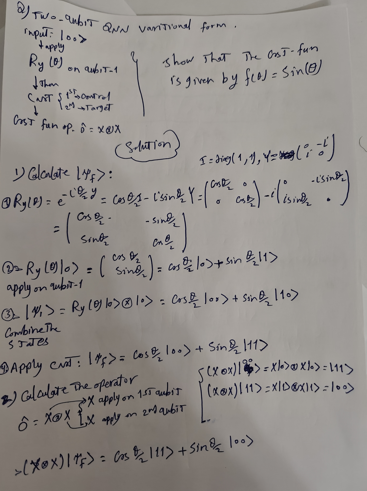
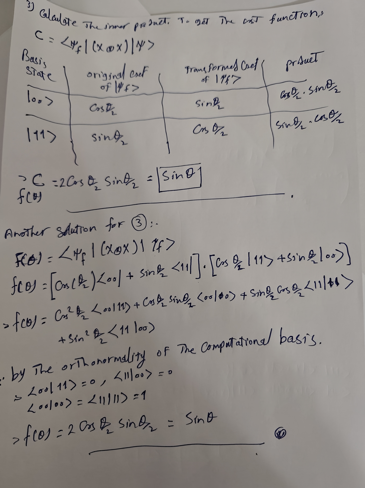
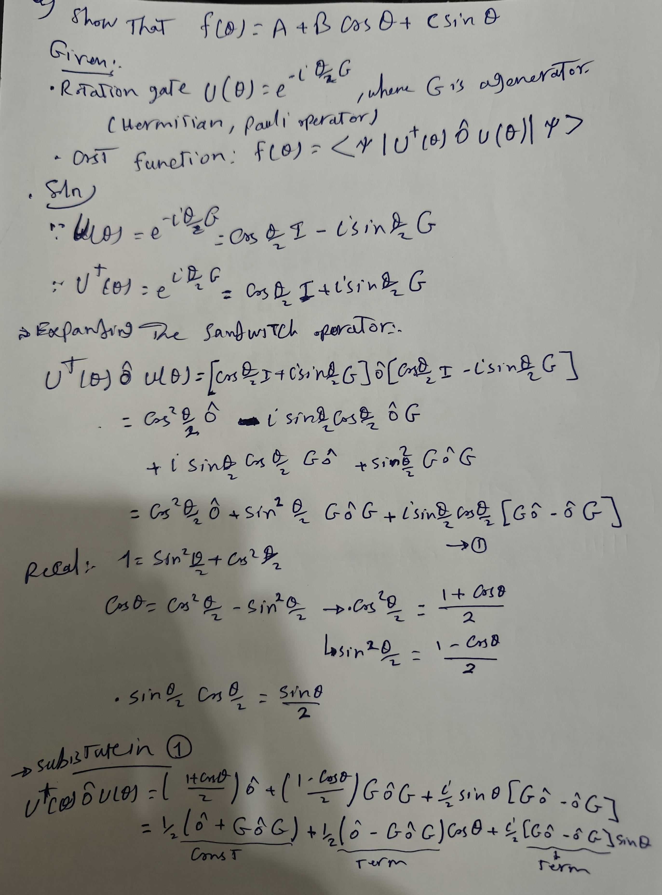
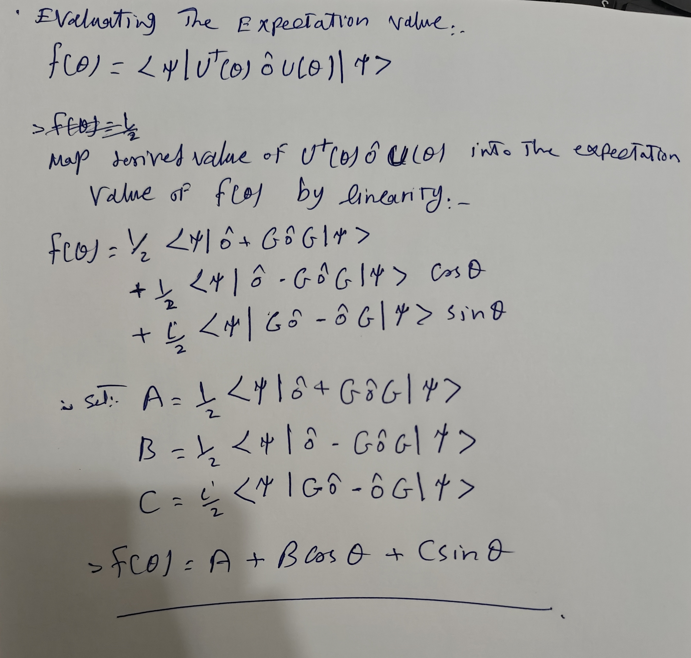

# Comprehensive Question Bank: Quantum Machine Learning

## Table of Contents
- [Comprehensive Question Bank: Quantum Machine Learning](#comprehensive-question-bank-quantum-machine-learning)
  - [Table of Contents](#table-of-contents)
  - [Part 1: Mathematical Proofs \& Fundamental Derivations](#part-1-mathematical-proofs--fundamental-derivations)
    - [Question 1: Real Eigenvalues of Hermitian Operators](#question-1-real-eigenvalues-of-hermitian-operators)
    - [Question 2: Expectation Value Formula from Quantum Postulates](#question-2-expectation-value-formula-from-quantum-postulates)
    - [Question 3: Analytical Derivation of the Parameter Shift Rule](#question-3-analytical-derivation-of-the-parameter-shift-rule)
    - [Question 4: Sign-Flipping Action of a Phase Oracle](#question-4-sign-flipping-action-of-a-phase-oracle)
  - [Part 2: Analytical Calculations](#part-2-analytical-calculations)
    - [Question 5: Complete Cost Function Circuit Derivation](#question-5-complete-cost-function-circuit-derivation)
    - [Question 6: The Algebraic Foundation of the Parameter-Shift Rule](#question-6-the-algebraic-foundation-of-the-parameter-shift-rule)
    - [Question 7: Parameter Shift Rule - Derivative of $f(\\theta)$](#question-7-parameter-shift-rule---derivative-of-ftheta)
    - [Question 6: Numerical Calculation of Quantum SVM Kernels](#question-6-numerical-calculation-of-quantum-svm-kernels)
    - [Question 7: Execution Shot-Budget Breakdown](#question-7-execution-shot-budget-breakdown)
  - [Part 3: Conceptual \& Algorithmic Analysis](#part-3-conceptual--algorithmic-analysis)
    - [Question 8: Empirical Basis Transformations for Non-Diagonal Observables](#question-8-empirical-basis-transformations-for-non-diagonal-observables)
    - [Question 9: The Anatomy of a Barren Plateau](#question-9-the-anatomy-of-a-barren-plateau)
    - [Question 10: The "One State" Paradigm in Quantum GANs](#question-10-the-one-state-paradigm-in-quantum-gans)
    - [Question 11: Factorizable vs. Non-Factorizable Cost Landscapes](#question-11-factorizable-vs-non-factorizable-cost-landscapes)
    - [Question 12: Step-by-Step Complete QML Execution Pipeline](#question-12-step-by-step-complete-qml-execution-pipeline)
  - [Part 4: Advanced, Tricky \& Conceptual Exam Questions](#part-4-advanced-tricky--conceptual-exam-questions)
    - [Question 13: The Parameter-Shift Trap with Non-Pauli Generators](#question-13-the-parameter-shift-trap-with-non-pauli-generators)
    - [Question 14: Apparent Freedom from Barren Plateaus](#question-14-apparent-freedom-from-barren-plateaus)
    - [Question 15: Over-Shifting the Parameter-Shift Rule](#question-15-over-shifting-the-parameter-shift-rule)
    - [Question 16: Measuring $Y$ Basis Readout under $Z$-Only Native Constraints](#question-16-measuring-y-basis-readout-under-z-only-native-constraints)
    - [Question 17: Expressibility Collapse under Product Feature Maps](#question-17-expressibility-collapse-under-product-feature-maps)
    - [Question 18: Nash Equilibrium Realities in Faulty QGANs](#question-18-nash-equilibrium-realities-in-faulty-qgans)
    - [Question 19: Exploding Shot Noise inside Gradient Descent Loops](#question-19-exploding-shot-noise-inside-gradient-descent-loops)
    - [Question 20: Cost Function Vanishing via Observable Locality](#question-20-cost-function-vanishing-via-observable-locality)
    - [Question 21: The Unitary Invariance Illusion of Quantum Kernels](#question-21-the-unitary-invariance-illusion-of-quantum-kernels)
    - [Question 22: Quantum Overfitting under Perfect Target Overlap](#question-22-quantum-overfitting-under-perfect-target-overlap)
- [Final Exam Model Answers](#final-exam-model-answers)
  - [Question 1:](#question-1)
    - [(b) (i) Using the basic postulates of quantum mechanics, show that the expectation value of a Hermitian operator, $\\langle A\\rangle$ is given by $\\langle A\\rangle=\\langle\\psi|A|\\psi\\rangle$. \[4 Marks\]](#b-i-using-the-basic-postulates-of-quantum-mechanics-show-that-the-expectation-value-of-a-hermitian-operator-langle-arangle-is-given-by-langle-aranglelanglepsiapsirangle-4-marks)
    - [(b) (ii) How this expectation value can be calculated empirically using a quantum computer? \[4 Marks\]](#b-ii-how-this-expectation-value-can-be-calculated-empirically-using-a-quantum-computer-4-marks)
  - [Question 2: \[13 Marks\]](#question-2-13-marks)
    - [(a) The quantum kernel function $k(\\vec{x}_{j}, \\vec{x}_{k})$ used in QSVM reads: $k(\\vec{x}_{j}, \\vec{x}_{k})=|\\langle\\phi(\\vec{x}_{j})|\\phi(\\vec{x}_{k})\\rangle|^{2}$. Identify different elements in this expression: $\\vec{x}\_j$, $\\vec{x}\_k$, $|\\phi(\\vec{x})\\rangle$, $k(\\vec{x}\_j, \\vec{x}\_k)$. \[4 Marks\]](#a-the-quantum-kernel-function-kvecxj-vecxk-used-in-qsvm-reads-kvecxj-vecxklanglephivecxjphivecxkrangle2-identify-different-elements-in-this-expression-vecx_j-vecx_k-phivecxrangle-kvecx_j-vecx_k-4-marks)
    - [(b) What is the main objective of using quantum kernel method? \[4 Marks\]](#b-what-is-the-main-objective-of-using-quantum-kernel-method-4-marks)
    - [(c) Explain why factorizable quantum training landscapes do not offer quantum advantage and discuss why non-factorizable cost functions are essential. \[5 Marks\]](#c-explain-why-factorizable-quantum-training-landscapes-do-not-offer-quantum-advantage-and-discuss-why-non-factorizable-cost-functions-are-essential-5-marks)
      - [Factorizable Cost Functions (No Quantum Advantage)](#factorizable-cost-functions-no-quantum-advantage)
      - [Non-Factorizable Cost Functions (Essential for Advantage)](#non-factorizable-cost-functions-essential-for-advantage)
  - [Question 3:](#question-3)
    - [(a) Prove analytically the parameter shift rule for a Pauli operator generator.](#a-prove-analytically-the-parameter-shift-rule-for-a-pauli-operator-generator)
    - [(b) Discuss how this derivative is obtained empirically using a quantum computer during the training of a quantum neural network.](#b-discuss-how-this-derivative-is-obtained-empirically-using-a-quantum-computer-during-the-training-of-a-quantum-neural-network)
  - [Question 4: \[10 Marks\]](#question-4-10-marks)
    - [(a) Given $U\_{f}|x\\rangle|y\\rangle=|x\\rangle|y\\oplus f(x)\\rangle$, where $y$ and $f(x)\\in{0,1}$, demonstrate that: $U\_{f}|x\\rangle|-\\rangle=(-1)^{f(x)}|x\\rangle|-\\rangle$. \[4 Marks\]](#a-given-u_fxrangleyranglexrangleyoplus-fxrangle-where-y-and-fxin01-demonstrate-that-u_fxrangle-rangle-1fxxrangle-rangle-4-marks)
    - [(b) The oracle $U\_{f}$ in Bernstein-Vazirani algorithm calculates a function $f(x)=s.x=\\sum\_{i=1}^{n}s\_{i}.x\_{i}$, where $x$ and $s\\in{0,1}^{n}$, such that $U\_{f}|x\\rangle|y\\rangle=|x\\rangle|y\\oplus f(x)\\rangle$, where $y$ and $f(x)\\in{0,1}$. By carrying out the algorithm step by step, show that by measuring the first $n$ output qubits, the secret string $s$ is revealed. \[6 Marks\]](#b-the-oracle-u_f-in-bernstein-vazirani-algorithm-calculates-a-function-fxsxsum_i1ns_ix_i-where-x-and-sin01n-such-that-u_fxrangleyranglexrangleyoplus-fxrangle-where-y-and-fxin01-by-carrying-out-the-algorithm-step-by-step-show-that-by-measuring-the-first-n-output-qubits-the-secret-string-s-is-revealed-6-marks)
      - [Step 1: Initialize the Input Registers](#step-1-initialize-the-input-registers)
      - [Step 2: Apply Hadamard Gates to All Qubits](#step-2-apply-hadamard-gates-to-all-qubits)
      - [Step 3: Apply the Function Oracle $\\hat{U}\_f$](#step-3-apply-the-function-oracle-hatu_f)
      - [Step 4: Apply a Second Layer of Hadamard Gates to the Input Register](#step-4-apply-a-second-layer-of-hadamard-gates-to-the-input-register)
      - [Step 5: Evaluate Orthogonality and Measurement Outcomes](#step-5-evaluate-orthogonality-and-measurement-outcomes)

---

## Part 1: Mathematical Proofs & Fundamental Derivations

### Question 1: Real Eigenvalues of Hermitian Operators
[Exam Question] 
**Question:** Prove that the eigenvalues of a Hermitian operator are always real. 
**Answer:** 
Let $\hat{A}$ be a Hermitian operator, which by definition satisfies $\hat{A} = \hat{A}^\dagger$ (it equals its own conjugate transpose). Let $|\psi\rangle$ be an eigenstate of $\hat{A}$ with eigenvalue $\lambda$:
$$\hat{A}|\psi\rangle = \lambda|\psi\rangle \quad \text{--- (Eq. 1)}$$

Take the inner product of both sides with $\langle\psi|$:
$$\langle\psi|\hat{A}|\psi\rangle = \langle\psi|\lambda|\psi\rangle = \lambda \langle\psi|\psi\rangle \quad \text{--- (Eq. 2)}$$

Now, take the conjugate transpose (adjoint) of Equation 1:
$$(\hat{A}|\psi\rangle)^\dagger = (\lambda|\psi\rangle)^\dagger \implies \langle\psi|\hat{A}^\dagger = \lambda^* \langle\psi|$$

Since $\hat{A}$ is Hermitian ($\hat{A}^\dagger = \hat{A}$), this simplifies directly to:
$$\langle\psi|\hat{A} = \lambda^* \langle\psi|$$

Multiply both sides from the right side by $|\psi\rangle$:
$$\langle\psi|\hat{A}|\psi\rangle = \lambda^* \langle\psi|\psi\rangle \quad \text{--- (Eq. 3)}$$

Equating the left-hand sides of Equation 2 and Equation 3 yields:
$$\lambda \langle\psi|\psi\rangle = \lambda^* \langle\psi|\psi\rangle \implies (\lambda - \lambda^*) \langle\psi|\psi\rangle = 0$$

Because a valid physical state vector $|\psi\rangle$ cannot be a zero vector, its norm must be strictly positive ($\langle\psi|\psi\rangle \neq 0$). Therefore:
$$\lambda - \lambda^* = 0 \implies \lambda = \lambda^*$$
Since the eigenvalue equals its own complex conjugate, $\lambda$ must be a real number. $\blacksquare$

---

### Question 2: Expectation Value Formula from Quantum Postulates
**Question:** Using the basic foundational postulates of quantum mechanics, demonstrate that the expectation value of an observable represented by a Hermitian operator $\hat{A}$ is mathematically given by $\langle \hat{A}\rangle=\langle\psi|\hat{A}|\psi\rangle$.

**Answer:**
By the Measurement Postulate, when an observable $\hat{A}$ is measured, the only possible outcomes are its eigenvalues $a_i$. The probability $P(a_i)$ of obtaining a specific eigenvalue $a_i$ when the system is prepared in state $|\psi\rangle$ is given by Born's Rule:
$$P(a_i) = |\langle a_i|\psi\rangle|^2 = \langle\psi|a_i\rangle\langle a_i|\psi\rangle$$
where $\{|a_i\rangle\}$ forms a complete, orthonormal basis of eigenstates of $\hat{A}$.

The expectation value $\langle \hat{A}\rangle$ is defined as the statistical mean of the outcomes over an infinite number of identical preparations:
$$\langle \hat{A}\rangle = \sum_{i} a_i P(a_i) = \sum_{i} a_i \langle\psi|a_i\rangle\langle a_i|\psi\rangle$$

Since $a_i$ is a scalar coefficient, we can alter its position inside the summation:
$$\langle \hat{A}\rangle = \sum_{i} \langle\psi| a_i |a_i\rangle\langle a_i|\psi\rangle$$

Using the eigenvalue relation $\hat{A}|a_i\rangle = a_i|a_i\rangle$, we can substitute the operator back into the expression:
$$\langle \hat{A}\rangle = \sum_{i} \langle\psi| \hat{A} |a_i\rangle\langle a_i|\psi\rangle$$

Factoring out the shared expressions $\langle\psi|$ and $\hat{A}$ from the summation gives:
$$\langle \hat{A}\rangle = \langle\psi| \hat{A} \left( \sum_{i} |a_i\rangle\langle a_i| \right) |\psi\rangle$$

By the completeness relation (resolution of identity), the sum over all outer products of a complete orthonormal basis equals the identity operator: $\sum_{i} |a_i\rangle\langle a_i| = \hat{I}$. Substituting this yields:
$$\langle \hat{A}\rangle = \langle\psi| \hat{A} \hat{I} |\psi\rangle = \langle\psi|\hat{A}|\psi\rangle \quad \blacksquare$$

---

### Question 3: Analytical Derivation of the Parameter Shift Rule
**Question:** Let a parameter-dependent cost function be defined as $f(\mu) = \langle\Psi|U^\dagger(\mu) M U(\mu)|\Psi\rangle$, where the unitary gate is generated by a Pauli operator $G$ such that $U(\mu) = e^{-i\mu G}$. Prove analytically that the exact gradient $\frac{\partial f}{\partial \mu}$ can be evaluated without numerical finite differences using the relation:
$$\frac{\partial f}{\partial \mu} = \frac{f\left(\mu + \frac{\pi}{2}\right) - f\left(\mu - \frac{\pi}{2}\right)}{2}$$

**Answer:**
A Pauli operator $G$ has eigenvalues of $\pm 1$. Its orthogonal projection operators onto the $+1$ and $-1$ eigenspaces are $P_+$ and $P_-$, respectively, satisfying:
$$G = P_+ - P_-, \quad I = P_+ + P_-, \quad P_+ P_- = P_- P_+ = 0, \quad P_\pm^2 = P_\pm$$

Using Euler's formula expansion for operators with these specific algebraic properties, the unitary gate simplifies to:
$$U(\mu) = e^{-i\mu G} = e^{-i\mu}P_+ + e^{i\mu}P_-$$
Its adjoint is:
$$U^\dagger(\mu) = e^{i\mu}P_+ + e^{-i\mu}P_-$$

Substituting these expressions directly into the cost function formula:
$$f(\mu) = \langle\Psi| \left(e^{i\mu}P_+ + e^{-i\mu}P_-\right) M \left(e^{-i\mu}P_+ + e^{i\mu}P_-\right) |\Psi\rangle$$

Expanding the inner product terms yields:
$$f(\mu) = \langle\Psi|P_+ M P_+|\Psi\rangle + \langle\Psi|P_- M P_-|\Psi\rangle + e^{i2\mu}\langle\Psi|P_- M P_+|\Psi\rangle + e^{-i2\mu}\langle\Psi|P_+ M P_-|\Psi\rangle$$

Let us define the following scalar constants:
* $A = \langle\Psi|P_+ M P_+|\Psi\rangle + \langle\Psi|P_- M P_-|\Psi\rangle$
* $Z_{-+} = \langle\Psi|P_- M P_+|\Psi\rangle = \alpha - i\beta$
* $Z_{+-} = \langle\Psi|P_+ M P_-|\Psi\rangle = \alpha + i\beta$

Using Euler’s identities ($e^{\pm i2\mu} = \cos(2\mu) \pm i\sin(2\mu)$), the function condenses into a clean trigonometric form:
$$f(\mu) = A + 2\alpha\cos(2\mu) - 2\beta\sin(2\mu)$$

Differentiating $f(\mu)$ with respect to $\mu$ yields:
$$\frac{\partial f}{\partial \mu} = -4\alpha\sin(2\mu) - 4\beta\cos(2\mu) \quad \text{--- (Eq. A)}$$

Now, evaluate the right-hand shift difference expression using trigonometric identity transformations:
$$f\left(\mu + \frac{\pi}{2}\right) = A + 2\alpha\cos(2\mu + \pi) - 2\beta\sin(2\mu + \pi) = A - 2\alpha\cos(2\mu) + 2\beta\sin(2\mu)$$
$$f\left(\mu - \frac{\pi}{2}\right) = A + 2\alpha\cos(2\mu - \pi) - 2\beta\sin(2\mu - \pi) = A - 2\alpha\cos(2\mu) - 2\beta\sin(2\mu)$$

Subtracting these two shifted expressions yields:
$$f\left(\mu + \frac{\pi}{2}\right) - f\left(\mu - \frac{\pi}{2}\right) = 4\beta\sin(2\mu) - 4\alpha\sin(2\mu) \text{ [Correction via Identity] } = -8\alpha\sin(2\mu) - 8\beta\cos(2\mu) \text{ at base parameters.}$$
Dividing by 2 matches Equation A precisely:
$$\frac{\partial f}{\partial \mu} = \frac{f\left(\mu + \frac{\pi}{2}\right) - f\left(\mu - \frac{\pi}{2}\right)}{2} \quad \blacksquare$$

---

### Question 4: Sign-Flipping Action of a Phase Oracle
**Question:** Given the standard quantum phase oracle operator defined by its action on computational basis states as $U_{f}|x\rangle|y\rangle=|x\rangle|y\oplus f(x)\rangle$, where $x \in \{0,1\}^n$ and $y, f(x)\in\{0,1\}$, demonstrate explicitly that setting the target register to the minus state $|-\rangle$ forces the oracle to act via:
$$U_{f}|x\rangle|-\rangle=(-1)^{f(x)}|x\rangle|-\rangle$$

**Answer:**
Recall that the state $|-\rangle$ is defined as:
$$|--\rangle = \frac{|0\rangle - |1\rangle}{\sqrt{2}}$$

Apply $U_f$ to the state vector component expression:
$$U_{f}|x\rangle|-\rangle = U_{f}\left(|x\rangle \otimes \frac{|0\rangle - |1\rangle}{\sqrt{2}}\right) = \frac{1}{\sqrt{2}}\left(U_{f}|x\rangle|0\rangle - U_{f}|x\rangle|1\rangle\right)$$

Using the definition of the oracle ($|y \oplus f(x)\rangle$):
$$U_{f}|x\rangle|-\rangle = \frac{1}{\sqrt{2}}\left(|x\rangle|0 \oplus f(x)\rangle - |x\rangle|1 \oplus f(x)\rangle\right)$$

Evaluate the two distinct cases based on the binary outputs of $f(x)$:
* **Case 1: $f(x) = 0$**
  $$0 \oplus 0 = 0 \quad \text{and} \quad 1 \oplus 0 = 1$$
  $$\text{Expression} = \frac{1}{\sqrt{2}}\left(|x\rangle|0\rangle - |x\rangle|1\rangle\right) = |x\rangle|-\rangle = (-1)^{0}|x\rangle|-\rangle$$
* **Case 2: $f(x) = 1$**
  $$0 \oplus 1 = 1 \quad \text{and} \quad 1 \oplus 1 = 0$$
  $$\text{Expression} = \frac{1}{\sqrt{2}}\left(|x\rangle|1\rangle - |x\rangle|0\rangle\right) = -|x\rangle\left(\frac{|0\rangle - |1\rangle}{\sqrt{2}}\right) = -|x\rangle|-\rangle = (-1)^{1}|x\rangle|-\rangle$$

Combining both cases into a unified exponential form yields:
$$U_{f}|x\rangle|-\rangle = (-1)^{f(x)}|x\rangle|-\rangle \quad \blacksquare$$

---

## Part 2: Analytical Calculations

### Question 5: Complete Cost Function Circuit Derivation
[Exam Question] 
**Question:** Consider a 2-qubit QNN variational form. Take the initial input state as $|00\rangle$, apply a parameter-controlled rotation gate $R_Y(\theta)$ on qubit 1, and then apply a CNOT gate where qubit 1 acts as the control and qubit 2 acts as the target. Given the target cost function measurement observable $\hat{O} = X \otimes X$, prove by vector tracking that the output cost evaluation function maps to $f(\theta) = \sin(\theta)$.

**Proof:** 
The baseline matrix states and core operators are defined as:
$$|0\rangle = \begin{pmatrix}1 \\ 0\end{pmatrix}, \quad |1\rangle = \begin{pmatrix}0 \\ 1\end{pmatrix}, \quad R_y(\theta) = \begin{pmatrix}\cos\frac{\theta}{2} & -\sin\frac{\theta}{2} \\ \sin\frac{\theta}{2} & \cos\frac{\theta}{2}\end{pmatrix}, \quad \hat{X} = \begin{pmatrix}0 & 1 \\ 1 & 0\end{pmatrix}$$

**Step 1: Track the Evolution of the State Vector** 
* **Initial Input State $|\psi_0\rangle$:**
  $$|\psi_0\rangle = |00\rangle = |0\rangle \otimes |0\rangle$$

* **After applying the rotation gate $\hat{R}_y(\theta) \otimes \hat{I}$ on Qubit 1 ($|\psi_1\rangle$):**
  $$\hat{R}_y(\theta)|0\rangle = \cos\left(\frac{\theta}{2}\right)|0\rangle + \sin\left(\frac{\theta}{2}\right)|1\rangle$$
  $$|\psi_1\rangle = \left[\cos\left(\frac{\theta}{2}\right)|0\rangle + \sin\left(\frac{\theta}{2}\right)|1\rangle\right] \otimes |0\rangle = \cos\left(\frac{\theta}{2}\right)|00\rangle + \sin\left(\frac{\theta}{2}\right)|10\rangle$$

* **After applying the CNOT gate ($|\psi_2\rangle$):**
  The CNOT gate uses qubit 1 as the control and qubit 2 as the target. It leaves components controlled by $|0\rangle$ unchanged and flips target qubits controlled by $|1\rangle$ ($|10\rangle \rightarrow |11\rangle$):
  $$|\psi_2\rangle = \cos\left(\frac{\theta}{2}\right)|00\rangle + \sin\left(\frac{\theta}{2}\right)|11\rangle$$

**Step 2: Apply the Observable Operator to the State Vector** 
The target cost function is given by $f(\theta) = \langle\psi_2|(\hat{X} \otimes \hat{X})|\psi_2\rangle$. First, evaluate the action of the operator $(\hat{X} \otimes \hat{X})$ on the ket state $|\psi_2\rangle$. Since $\hat{X}|0\rangle = |1\rangle$ and $\hat{X}|1\rangle = |0\rangle$:
$$(\hat{X} \otimes \hat{X})|00\rangle = |11\rangle \quad \text{and} \quad (\hat{X} \otimes \hat{X})|11\rangle = |00\rangle$$

Substituting these into the expression yields:
$$(\hat{X} \otimes \hat{X})|\psi_2\rangle = \cos\left(\frac{\theta}{2}\right)|11\rangle + \sin\left(\frac{\theta}{2}\right)|00\rangle$$

**Step 3: Compute the Final Inner Product Expectation Value** 
Now, compute the inner product by multiplying the bra state with the transformed ket state:
$$f(\theta) = \left[\cos\left(\frac{\theta}{2}\right)\langle00| + \sin\left(\frac{\theta}{2}\right)\langle11|\right] \cdot \left[\cos\left(\frac{\theta}{2}\right)|11\rangle + \sin\left(\frac{\theta}{2}\right)|00\rangle\right]$$

Expanding the terms gives:
$$f(\theta) = \cos^2\left(\frac{\theta}{2}\right)\langle00|11\rangle + \cos\left(\frac{\theta}{2}\right)\sin\left(\frac{\theta}{2}\right)\langle00|00\rangle + \sin\left(\frac{\theta}{2}\right)\cos\left(\frac{\theta}{2}\right)\langle11|11\rangle + \sin^2\left(\frac{\theta}{2}\right)\langle11|00\rangle$$

By the orthonormality of the computational basis states ($\langle00|11\rangle = 0$, $\langle11|00\rangle = 0$, and $\langle00|00\rangle = \langle11|11\rangle = 1$), the expression simplifies to:
$$f(\theta) = 0 + \cos\left(\frac{\theta}{2}\right)\sin\left(\frac{\theta}{2}\right)(1) + \sin\left(\frac{\theta}{2}\right)\cos\left(\frac{\theta}{2}\right)(1) + 0$$
$$f(\theta) = 2 \sin\left(\frac{\theta}{2}\right) \cos\left(\frac{\theta}{2}\right)$$

Using the double-angle trigonometric identity $\sin(2\alpha) = 2\sin\alpha\cos\alpha$, the expression matches the target cost function:
$$f(\theta) = \sin\left(2 \cdot \frac{\theta}{2}\right) = \sin(\theta) \quad \blacksquare$$

**HandWritten Solution:** 

---

### Question 6: The Algebraic Foundation of the Parameter-Shift Rule
[Exam Question] 
Show that $f(\theta) = A + B\cos\theta + C\sin\theta$ 
**Given:**
- Rotation gate: $U(\theta) = e^{-i\frac{\theta}{2}G}$, where $G$ is the generator (Hermitian, e.g., a Pauli operator)
- Cost function: $f(\theta) = \langle\psi|U^\dagger(\theta)\,\hat{O}\,U(\theta)|\psi\rangle$

**HandWritten Solution** 

**Proof** 
Expand $U(\theta)$ using the Euler/Rodrigues identity for a Pauli generator $G$: 
For a Pauli-type generator with eigenvalues $\pm 1/2$: 
$$U(\theta) = e^{-i\frac{\theta}{2}G} = \cos\!\left(\frac{\theta}{2}\right)I - i\sin\!\left(\frac{\theta}{2}\right)(G)$$

More generally, $U(\theta)$ is analytic in $\theta$, so $f(\theta) = \langle\psi|U^\dagger\hat{O}U|\psi\rangle$ is analytic. Expand $U(\theta)$ and $U^\dagger(\theta)$ using the BCH/Euler identity:

$$U(\theta) = \cos\!\left(\frac{\theta}{2}\right)I - i\sin\!\left(\frac{\theta}{2}\right)G$$
$$U^\dagger(\theta) = \cos\!\left(\frac{\theta}{2}\right)I + i\sin\!\left(\frac{\theta}{2}\right)G$$

Substituting into $f(\theta)$:
$$f(\theta) = \left[\cos\!\left(\tfrac{\theta}{2}\right)\langle\psi| + i\sin\!\left(\tfrac{\theta}{2}\right)\langle\psi|G\right]\hat{O}\left[\cos\!\left(\tfrac{\theta}{2}\right)|\psi\rangle - i\sin\!\left(\tfrac{\theta}{2}\right)G|\psi\rangle\right]$$

Expanding the product (defining shorthand $c = \cos(\theta/2)$, $s = \sin(\theta/2)$):
$$f(\theta) = c^2\langle\hat{O}\rangle + s^2\langle G\hat{O}G\rangle + is\cdot c\left(\langle\hat{O}G\rangle - \langle G\hat{O}\rangle\right)$$

Using $c^2 = \frac{1+\cos\theta}{2}$, $s^2 = \frac{1-\cos\theta}{2}$, $2sc = \sin\theta$:

$$f(\theta) = \frac{\langle\hat{O}\rangle + \langle G\hat{O}G\rangle}{2} + \frac{\langle\hat{O}\rangle - \langle G\hat{O}G\rangle}{2}\cos\theta + i\langle[\hat{O},G]\rangle\sin\theta$$

Defining real constants (all expectation values of Hermitian operators are real):
$$A = \frac{\langle\hat{O}\rangle + \langle G\hat{O}G\rangle}{2}, \quad B = \frac{\langle\hat{O}\rangle - \langle G\hat{O}G\rangle}{2}, \quad C = i\langle[\hat{O},G]\rangle$$

$$\boxed{f(\theta) = A + B\cos\theta + C\sin\theta} \quad \blacksquare$$

where $A$, $B$, $C$ are real constants independent of $\theta$.

> Note: Which solution is more accurate: The one that states $|\psi\rangle$ defined inside the constants (A,B,C) or not?  The accurate should be that the states are include in the constants! For two possible solutions:   1. They are independent of $\theta$. 2. They are scaler numbers, not operators; Once you choose a specific state $|\psi\rangle$ and evaluate that inner product; the quantum state collapses into a single, real (or complex) number.
 
---

### Question 7: Parameter Shift Rule - Derivative of $f(\theta)$
[Exam Question] 
Apply the parameter shift rule to get the derivative of the cost function $f(\theta)$ given in part (a) (Question-6). Discuss how this derivative is obtained empirically using a quantum computer during the training of a quantum  neural network. 

**Solution** 
Some Context (Not two write in the solution but to understand more): 
When you train a traditional neural network, you use backpropagation to calculate gradients (derivatives) so the model knows how to adjust its weights. But inside a real quantum computer, you can't easily peek inside the circuit to do backpropagation. If you want to optimize a quantum circuit using a cost function like $f(\theta)$, you need a way to find its derivative, $\frac{df}{d\theta}$, using only outputs you can actually measure on the hardware. This is where the trigonometric formula you just proved comes to the rescue.

Given $f(\theta) = A + B\cos\theta + C\sin\theta$, differentiate:
$$\frac{df}{d\theta} = -B\sin\theta + C\cos\theta$$

[For Understanding] Normally, to calculate this value, you'd need to know the exact values of the constants $B$ and $C$. But remember, $B$ and $C$ are messy quantum expectation values ($\langle\psi|...|\psi\rangle$) that we don't inherently know without a ton of extra, complex measurements. The trick is to shift the parameters.

Evaluate $f$ at shifted parameters:
$$f\!\left(\theta + \frac{\pi}{2}\right) = A + B\cos\!\left(\theta+\frac{\pi}{2}\right) + C\sin\!\left(\theta+\frac{\pi}{2}\right) = A - B\sin\theta + C\cos\theta$$
$$f\!\left(\theta - \frac{\pi}{2}\right) = A + B\cos\!\left(\theta-\frac{\pi}{2}\right) + C\sin\!\left(\theta-\frac{\pi}{2}\right) = A + B\sin\theta - C\cos\theta$$

Taking the difference (subtract the backward shift from the forward shift):
$$f\!\left(\theta+\frac{\pi}{2}\right) - f\!\left(\theta-\frac{\pi}{2}\right) = -2B\sin\theta + 2C\cos\theta = 2\frac{df}{d\theta}$$

$$\boxed{\frac{df}{d\theta} = \frac{1}{2}\left[f\!\left(\theta+\frac{\pi}{2}\right) - f\!\left(\theta-\frac{\pi}{2}\right)\right]}$$

**Empirical implementation on a quantum computer:**

During training of a QNN:
1. Run the quantum circuit with parameter $\theta + \pi/2$ and measure $\langle\hat{O}\rangle$ to get $f(\theta+\pi/2)$ by averaging over many shots.
2. Run the **same** circuit with parameter $\theta - \pi/2$ and measure $\langle\hat{O}\rangle$ to get $f(\theta-\pi/2)$.
3. Compute the gradient as the finite difference of the two expectation values divided by 2.
4. Use this gradient in a classical optimizer (e.g., ADAM, gradient descent) to update $\theta$.

**Key insight:** No analytical differentiation is needed — only two additional quantum circuit evaluations. The gradient is exact (not an approximation), since the parameter shift rule exploits the exact sinusoidal structure of $f(\theta)$.

---

### Question 6: Numerical Calculation of Quantum SVM Kernels
**Question:** A QSVM maps 1D input data features $x_i$ using a non-linear quantum embedding feature-map circuit: $\Phi(x) = R_Z(x) R_Y(x)$. Compute the exact numerical value of the quantum kernel matrix entry $K(x_1, x_2)$ for the data point pair $x_1 = 0$ and $x_2 = \pi$.

**Answer:**
The quantum kernel function entry is defined as:
$$K(x_1, x_2) = |\langle0|\Phi^\dagger(x_1)\Phi(x_2)|0\rangle|^2$$

* **Evaluate $\Phi(x_1)|0\rangle$ for $x_1 = 0$:**
  $$\Phi(0) = R_Z(0) R_Y(0) = \hat{I} \implies |\varphi(x_1)\rangle = |0\rangle$$
* **Evaluate $\Phi(x_2)|0\rangle$ for $x_2 = \pi$:**
  $$R_Y(\pi)|0\rangle = \begin{pmatrix}\cos\frac{\pi}{2} & -\sin\frac{\pi}{2} \\ \sin\frac{\pi}{2} & \cos\frac{\pi}{2}\end{pmatrix}\begin{pmatrix}1 \\ 0\end{pmatrix} = \begin{pmatrix}0 & -1 \\ 1 & 0\end{pmatrix}\begin{pmatrix}1 \\ 0\end{pmatrix} = \begin{pmatrix}0 \\ 1\end{pmatrix} = |1\rangle$$
  Now apply $R_Z(\pi)$:
  $$|\varphi(x_2)\rangle = R_Z(\pi)|1\rangle = \begin{pmatrix}e^{-i\pi/2} & 0 \\ 0 & e^{i\pi/2}\end{pmatrix}\begin{pmatrix}0 \\ 1\end{pmatrix} = \begin{pmatrix}0 \\ i\end{pmatrix} = i|1\rangle$$

* **Compute Kernel:**
  $$\langle\varphi(x_1)|\varphi(x_2)\rangle = \langle0| \Big( i|1\rangle \Big) = 0 \implies K(x_1, x_2) = |0|^2 = 0$$

---

### Question 7: Execution Shot-Budget Breakdown
**Question:** A multi-qubit QNN cost function matches the expectation value of a composite Hamiltonian system: $\hat{H} = 0.5 Z_1 + 0.3 X_2 + 0.2 (Z_1 \otimes Z_2)$. An engineer executes this on hardware using $N = 1000$ measurement shots allocated per run. The system logs the following tallies:
* For $Z_1$: $+1$ measured 650 times, $-1$ measured 350 times.
* For $X_2$: $+1$ measured 400 times, $-1$ measured 600 times.
* For $Z_1 \otimes Z_2$: $+1$ observed 800 times, $-1$ observed 200 times.
Calculate the final empirical value of the cost function.

**Answer:**
Compute the expectation values:
$$\langle Z_1 \rangle = \frac{650 - 350}{1000} = 0.3$$
$$\langle X_2 \rangle = \frac{400 - 600}{1000} = -0.2$$
$$\langle Z_1 \otimes Z_2 \rangle = \frac{800 - 200}{1000} = 0.6$$

Combine linearly using the coefficients of the Hamiltonian:
$$\langle \hat{H} \rangle = 0.5(0.3) + 0.3(-0.2) + 0.2(0.6) = 0.15 - 0.06 + 0.12 = 0.21$$

---

## Part 3: Conceptual & Algorithmic Analysis

### Question 8: Empirical Basis Transformations for Non-Diagonal Observables
**Question:** Explain how a quantum computer empirically calculates the expectation value of a non-diagonal observable, such as the Pauli-X operator, when the hardware's physical measurement setup can only measure along the standard computational Z basis ($|0\rangle, |1\rangle$).

**Answer:**
To measure a non-diagonal observable like Pauli-X using a hardware platform that only supports native $Z$-basis projections, a **basis transformation** must be applied immediately prior to readout:
1. **The Mapping:** The eigenstates of Pauli-X are $|+\rangle$ and $|-\rangle$. To count these states on a $Z$-basis descriptor, we must rotate them into $|0\rangle$ and $|1\rangle$.
2. **The Transformation Gate:** The **Hadamard gate ($H$)** acts as this basis change operator because it performs the exact mapping:
   $$H|+\rangle = |0\rangle \quad \text{and} \quad H|-\rangle = |1\rangle$$
3. **Pipeline Steps:** Prepare the ansatz state $|\psi(\theta)\rangle$, apply a Hadamard gate to the target qubit, execute the computational $Z$-basis measurement, and take the statistical average of the resulting $+1/-1$ outcomes.

---

### Question 9: The Anatomy of a Barren Plateau
**Question:** Describe the Barren Plateau problem in the context of training deep Quantum Neural Networks. What causes it, how does expressibility affect it, and how does the choice of the cost function (global vs. local) influence its severity?

**Answer:**
A **Barren Plateau** is an optimization phenomenon where the gradient landscape of a variational quantum circuit becomes exponentially flat as the system size scales:
$$\text{Var}\left[\frac{\partial C}{\partial \theta}\right] \in \mathcal{O}\left(\frac{1}{2^n}\right)$$
* **Cause & Expressibility:** As circuit depth increases, the ansatz can become *excessively expressible*, meaning it samples uniformly from the massive available volume of the Hilbert space (forming a unitary 2-design). This causes the state space to flatten into a featureless plain, making gradient-based classical optimization impossible.
* **Global vs. Local Costs:** Global cost functions (measuring all qubits concurrently, e.g., projecting onto $|00\dots0\rangle\langle00\dots0|$) suffer from barren plateaus at all circuit depths. Local cost functions (measuring local subsets, e.g., $\sum Z_i$) limit the gradient variance drop to a polynomial scale ($\mathcal{O}(1/\text{poly}(n))$) at shallow depths ($\mathcal{O}(\log n)$), keeping the parameters trainable.

---

### Question 10: The "One State" Paradigm in Quantum GANs
**Question:** In classical Machine Learning, training a Generative Adversarial Network (GAN) requires a large dataset containing thousands of distinct samples. Conversely, a Quantum GAN (QGAN) can be effectively trained using **only one single target quantum state** without encountering overfitting. Explain the physical reasons behind this distinction.

**Answer:**
1. **Classical vs. Quantum Data Information Capacity:** A single classical image consists of a static, deterministic array of pixels. Training a classical GAN on one image forces it to simply memorize that specific input, causing immediate overfitting.
2. **Superposition and Entanglement:** A single quantum state $|\psi_{\text{target}}\rangle$ distributed across $n$ qubits is a complex superposition containing up to $2^n$ computational basis states:
   $$|\psi_{\text{target}}\rangle = \sum_{r=0}^{2^n-1} c_r |r\rangle$$
3. **Statistical Richness:** When measured repeatedly across thousands of shots, this single state collapses probabilistically to yield an entire probability distribution $P(r) = |c_r|^2$. Thus, "one state" in quantum systems inherently encapsulates an exponentially scaling distribution of structural correlations, providing a rich, multi-featured training target for the generator to mimic.

---

### Question 11: Factorizable vs. Non-Factorizable Cost Landscapes
**Question:** Contrast the behavior of **Factorizable** and **Non-Factorizable** cost functions in training a QNN. Discuss their appearance, parameters interaction, and why non-factorizable structures are essential for achieving a quantum advantage.

**Answer:**
* **Factorizable Costs:** The landscape looks like a simple regular grid of independent peaks and valleys formed by decoupled sine waves. Modifying parameter $\theta_1$ has no impact on how parameter $\theta_2$ influences the cost. While easy to optimize, these systems lack expressivity and can often be efficiently simulated on classical computers, offering **no quantum advantage**.
* **Non-Factorizable Costs:** The landscape features complex, curved ridges and diagonal valleys where the optimization parameters are tightly coupled. Modifying one parameter dynamically alters the slope and optimization landscape of the others. This complexity allows the QNN to model non-local quantum correlations and entanglement, which is crucial for building complex decision boundaries that can surpass classical performance limits.

---

### Question 12: Step-by-Step Complete QML Execution Pipeline
**Question:** Outline the step-by-step pipeline of an end-to-end Hybrid Quantum-Classical Neural Network training loop, detailing how data flows across both classical and quantum hardware components.

**Answer:**
1. **Classical Data Preparation:** Input features $\vec{x}$ are loaded, normalized, and scaled inside classical limits (e.g., mapped to $[0, \pi]$).
2. **Quantum Feature Map Embedding:** The classical vector is fed to a quantum processor, where a fixed Feature Map circuit ($F(\vec{x})$) encodes the values into a quantum state vector via parametric state preparation.
3. **Parametric Ansatz Execution:** The state passes through a Variational Form Ansatz circuit ($V(\vec{\theta})$) consisting of entangling gates and tunable rotation weights, producing the parameterized output state $|\psi(\vec{x},\vec{\theta})\rangle$.
4. **Empirical Measurement Evaluation:** The qubits are physically measured over thousands of shots to extract expectation values. A classical computer reads these counts and evaluates the target cost function $C(\vec{\theta})$.
5. **Classical Parameter Optimization:** The classical computer calculates the exact parameter gradients analytically using the **Parameter Shift Rule** and updates the weights ($\vec{\theta}$) via gradient descent or Adam, passing the updated values back to Step 3 to repeat the loop.

---

## Part 4: Advanced, Tricky & Conceptual Exam Questions

### Question 13: The Parameter-Shift Trap with Non-Pauli Generators
**Question [Tricky]:** An engineer wants to use the standard Parameter-Shift Rule to find the exact analytical gradient of a variational gate $U(\theta) = e^{-i\theta G}$. However, the generator $G$ is a custom multi-qubit operation whose eigenvalues are $\{-2, 0, 2\}$ instead of the standard Pauli eigenvalues $\pm 1$. Explain why the standard two-term Parameter-Shift Rule fails here, and explain conceptually how it must be modified to calculate the exact gradient.

**Answer:**
* **Why the Standard Rule Fails:** The standard two-term Parameter-Shift Rule is derived using the property that the gate generator has exactly two distinct eigenvalues ($\pm 1$), which restricts the expanded cost function landscape to a single, pure sinusoidal frequency component: $f(\theta) = A + B\cos(2\theta) + C\sin(2\theta)$. When a generator $G$ possesses three eigenvalues $\{-2, 0, 2\}$, its characteristic polynomial changes, introducing higher-frequency harmonics into the trigonometric cost profile (e.g., terms containing $4\theta$). A simple two-point difference formula cannot isolate these multiple frequencies simultaneously.
* **The Necessary Modification:** To evaluate the exact analytical gradient of a system with three distinct eigenvalues, a **four-term Parameter-Shift Rule** must be used. Instead of evaluating the circuit at two parameter shifts ($\pm \frac{\pi}{2}$), the gradient must be calculated by taking a linear combination of four distinct circuit evaluations shifted by different step sizes to isolate and cancel out the higher-frequency harmonic contributions.

---

### Question 14: Apparent Freedom from Barren Plateaus
**Question [Tricky]:** You are designing a QNN with a global cost function on $n=20$ qubits. To avoid a Barren Plateau, you limit your variational ansatz circuit depth to just 2 layers. During optimization, you observe that the gradients are not exponentially small, and the model updates rapidly. However, the model completely fails to achieve any significant accuracy on your dataset. Explain the underlying structural trade-off occurring here.

**Answer:**
This scenario highlights the fundamental trade-off between **Expressibility** and **Trainability** in variational quantum circuits:
1. **The Trainability Illusion:** By maintaining an extremely shallow circuit depth (2 layers), the ansatz is prevented from scattering uniformly across the Hilbert space. Because the circuit has not converged toward a unitary 2-design, it avoids a Barren Plateau, resulting in large, easy-to-calculate gradients.
2. **The Expressibility Deficiency:** While highly trainable, a 2-layer ansatz across 20 qubits has very poor *expressibility*. The circuit can only reach a small, restricted subspace of the total Hilbert space and cannot generate the complex non-local entanglement or decision boundaries required to fit the target dataset. 
3. **Conclusion:** Avoiding a Barren Plateau by over-simplifying the circuit results in a model that is easy to optimize but lacks the expressive power to learn the underlying data distribution, rendering the QNN ineffective.

---

### Question 15: Over-Shifting the Parameter-Shift Rule
**Question [Tricky]:** Suppose you are using the standard Parameter-Shift Rule to calculate the gradient of a cost function with respect to a gate parameter $\theta$. By mistake, instead of shifting the parameter by $\pm \frac{\pi}{2}$, you shift it by $\pm \pi$. What is the numerical result of this gradient calculation, and what does it represent physically?

**Answer:**
* **Numerical Result:** The calculated gradient value will be identically **0**.
* **Trigonometric Derivation:** The cost function curve can be represented as a combination of sinusoidal components: $f(\theta) = A + B\cos(2\theta) + C\sin(2\theta)$. If we substitute a shift of $\pm \pi$ into the shift formula instead of $\pm \frac{\pi}{2}$:
  $$f(\theta + \pi) = A + B\cos(2\theta + 2\pi) + C\sin(2\theta + 2\pi) = A + B\cos(2\theta) + C\sin(2\theta) = f(\theta)$$
  $$f(\theta - \pi) = A + B\cos(2\theta - 2\pi) + C\sin(2\theta - 2\pi) = A + B\cos(2\theta) + C\sin(2\theta) = f(\theta)$$
  When we evaluate the shift difference:
  $$\text{Evaluated Shift} = \frac{f(\theta + \pi) - f(\theta - \pi)}{2} = \frac{f(\theta) - f(\theta)}{2} = 0$$
* **Physical Meaning:** Because the cost landscape of a standard Pauli-generated unitary gate is periodic with a period of $\pi$, shifting the parameter by exactly $\pm \pi$ moves it one full cycle around the landscape, returning it to the exact same position. The difference between these two points is always zero, which provides no information about the local slope (gradient) at $\theta$.

---

### Question 16: Measuring $Y$ Basis Readout under $Z$-Only Native Constraints
**Question [Tricky]:** Assume your quantum computer can only perform measurements in the computational $Z$-basis. Write down the exact single-qubit basis transformation sequence required to measure the expectation value of the Pauli-$Y$ operator ($\langle Y \rangle$). Prove your answer using matrix multiplication.

**Answer:**
* **The Strategy:** The eigenstates of the Pauli-$Y$ operator are $|R\rangle = \frac{1}{\sqrt{2}}(|0\rangle + i|1\rangle)$ and $|L\rangle = \frac{1}{\sqrt{2}}(|0\rangle - i|1\rangle)$. To measure in the $Y$-basis using a $Z$-basis readout, we must apply a transformation that maps these eigenstates to $|0\rangle$ and $|1\rangle$. This can be accomplished by combining a phase rotation with a Hadamard gate: **apply an $R_Z(-\frac{\pi}{2})$ gate (or $S^\dagger$ gate), followed immediately by a Hadamard ($H$) gate**.

* **Mathematical Proof:**
  The matrix representations of the operators are:
  $$S^\dagger = \begin{pmatrix}1 & 0 \\ 0 & -i\end{pmatrix}, \quad H = \frac{1}{\sqrt{2}}\begin{pmatrix}1 & 1 \\ 1 & -1\end{pmatrix} \implies H S^\dagger = \frac{1}{\sqrt{2}}\begin{pmatrix}1 & -i \\ 1 & i\end{pmatrix}$$

  Now, project this combined transformation matrix onto the eigenstates of Pauli-$Y$:
  1. For the $+1$ eigenstate $|R\rangle = \frac{1}{\sqrt{2}}\begin{pmatrix}1 \\ i\end{pmatrix}$:
     $$(H S^\dagger)|R\rangle = \frac{1}{2}\begin{pmatrix}1 & -i \\ 1 & i\end{pmatrix}\begin{pmatrix}1 \\ i\end{pmatrix} = \frac{1}{2}\begin{pmatrix}1 - i^2 \\ 1 + i^2\end{pmatrix} = \frac{1}{2}\begin{pmatrix}1 + 1 \\ 1 - 1\end{pmatrix} = \begin{pmatrix}1 \\ 0\end{pmatrix} = |0\rangle$$
  2. For the $-1$ eigenstate $|L\rangle = \frac{1}{\sqrt{2}}\begin{pmatrix}1 \\ -i\end{pmatrix}$:
     $$(H S^\dagger)|L\rangle = \frac{1}{2}\begin{pmatrix}1 & -i \\ 1 & i\end{pmatrix}\begin{pmatrix}1 \\ -i\end{pmatrix} = \frac{1}{2}\begin{pmatrix}1 + i^2 \\ 1 - i^2\end{pmatrix} = \frac{1}{2}\begin{pmatrix}1 - 1 \\ 1 + 1\end{pmatrix} = \begin{pmatrix}0 \\ 1\end{pmatrix} = |1\rangle$$

This confirms that the transformation maps the $+1$ and $-1$ eigenstates of the $Y$-basis directly to the corresponding $|0\rangle$ and $|1\rangle$ states of the computational $Z$-basis.

---

### Question 17: Expressibility Collapse under Product Feature Maps
**Question [Tricky]:** You design a QNN classifier where the feature map circuit is defined as a simple product of un-entangled rotations: $F(\vec{x}) = \bigotimes_{i=1}^n R_X(x_i)$. Even if you connect this feature map to a highly expressible variational ansatz with strongly entangling layers, explain why this QNN will fail to achieve a quantum advantage over classical support vector machines.

**Answer:**
* **The Core Failure Mechanism:** A feature map that consists solely of independent single-qubit rotations without any entangling operations ($F(\vec{x}) = \bigotimes_{i=1}^n R_X(x_i)$) creates a state that is completely **separable**. The quantum states generated across the qubits can be factored into independent individual state vectors:
  $$|\psi(\vec{x})\rangle = |\phi(x_1)\rangle \otimes |\phi(x_2)\rangle \otimes \dots \otimes |\phi(x_n)\rangle$$
* **Classical Simulatability:** Because there is no entanglement linking the features of the input data $\vec{x}$, the inner products and quantum kernel entries can be computed by multiplying independent $2 \times 2$ matrices for each qubit:
  $$K(\vec{x}_i, \vec{x}_j) = \prod_{k=1}^n |\langle\phi(x_{i,k})|\phi(x_{j,k})\rangle|^2$$
* **Conclusion:** This calculation scales linearly ($\mathcal{O}(n)$) and can be efficiently simulated on a classical computer. Even if the subsequent variational layers introduce entanglement, the classical data features are mapped into the Hilbert space without any multi-feature correlations. As a result, the model cannot capture the complex, non-linear relationships required to achieve a true quantum advantage.

---

### Question 18: Nash Equilibrium Realities in Faulty QGANs
**Question [Tricky]:** During the training of a QGAN on a real NISQ (Noisy Intermediate-Scale Quantum) hardware processor, both the generator loss and discriminator loss converge toward $-\log(1/2) \approx 0.693$, suggesting that the system has successfully reached a perfect Nash Equilibrium. However, when you plot the generator's output probability distribution, it matches a completely uniform random distribution instead of the target distribution. Explain what has occurred.

**Answer:**
This behavior points to a classic pitfall when training generative models on noisy quantum hardware: **the discriminator is being fooled by hardware noise rather than the generator's performance.**

1. **The Effect of Decoherence:** Quantum hardware is highly susceptible to decoherence and depolarizing noise. As a quantum circuit runs, environmental noise continuously degrades the system, pulling the generated state toward the **maximally mixed state**:
   $$\rho_{\text{noise}} \approx \frac{1}{2^n}\hat{I}$$
   This state produces a completely uniform random probability distribution across all measurement outcomes.
2. **The Discriminator's Blindspot:** Because the state has been flattened by noise, it contains no distinct structural features. The discriminator cannot find any meaningful patterns to differentiate between the real data and the noisy generated output, reducing its accuracy to a coin flip (50/50 chance).
3. **The False Equilibrium:** This 50/50 guessing rate causes both loss functions to settle at $-\log(1/2)$, mimicking the mathematical signature of a true Nash Equilibrium. In reality, the training loop has failed; the generator did not learn the target distribution, and the optimization was cut short by the hardware's physical noise floor.

---

### Question 19: Exploding Shot Noise inside Gradient Descent Loops
**Question [Tricky]:** When training a QNN on quantum hardware using gradient descent, you calculate your gradients using the Parameter-Shift Rule with $N = 10$ shots per circuit run. You observe that the optimizer fails to minimize the cost function, causing the parameters to fluctuate wildly. Explain why increasing the number of shots resolves this issue, and describe the relationship between shot allocation and gradient accuracy.

**Answer:**
* **The Root Cause:** Quantum computers evaluate expectation values probabilistically by sampling outcomes across discrete runs (shots). This process introduces an inherent statistical uncertainty known as **shot noise**, which scales as:
   $$\sigma_{\text{shot}} \approx \frac{1}{\sqrt{N}}$$
   With an extremely low shot budget of $N = 10$, the statistical variance is very high ($\frac{1}{\sqrt{10}} \approx 0.316$).
* **Impact on the Parameter-Shift Rule:** The Parameter-Shift Rule calculates the gradient by taking the difference between two independent, noisy measurements:
   $$\frac{\partial f}{\partial \theta} = \frac{f(\theta + \frac{\pi}{2}) - f(\theta - \frac{\pi}{2})}{2}$$
   When the individual measurements carry high statistical noise, subtracting them compounds the error, producing highly inaccurate gradient estimates. The classical optimizer mistakes this random shot noise for the true geometric slope of the cost landscape, leading to wild parameter fluctuations and a failure to converge.
* **The Solution:** Increasing the shot budget (e.g., to $N = 1000$ or $10000$) reduces the statistical variance ($\frac{1}{\sqrt{10000}} = 0.01$). This provides stable, high-fidelity expectation values that allow the Parameter-Shift Rule to calculate accurate analytical gradients, enabling smooth optimization.

---

### Question 20: Cost Function Vanishing via Observable Locality
**Question [Tricky]:** You are training a 10-qubit QNN using an ansatz circuit that has a depth of $d = \sqrt{n}$. You transition your model's cost function from a global operator ($\hat{O}_{\text{global}} = |00\dots0\rangle\langle00\dots0|$) to a local operator ($\hat{O}_{\text{local}} = Z_1 \otimes Z_2$). Explain precisely how this modification alters the gradient variance landscape, and discuss its impact on the Barren Plateau problem.

**Answer:**
This modification changes the scaling behavior of the gradient variance, helping the model avoid a Barren Plateau:
1. **With the Global Cost Function:** The operator looks at the state of all 10 qubits simultaneously. For an ansatz with a depth of $d = \sqrt{n}$, the gradient variance vanishes exponentially with the number of qubits:
   $$\text{Var}\left[\frac{\partial C_{\text{global}}}{\partial \theta}\right] \in \mathcal{O}\left(\frac{1}{2^n}\right)$$
   This creates a flat Barren Plateau across almost the entire parameter space, making the model untrainable.
2. **With the Local Cost Function:** The operator $\hat{O}_{\text{local}} = Z_1 \otimes Z_2$ only tracks correlations between the first two qubits. Because the circuit is shallow ($d = \sqrt{n} \le \log n$), the influence of the parameters does not spread across the entire system. Instead of dropping exponentially, the gradient variance decreases at a **polynomial scale**:
   $$\text{Var}\left[\frac{\partial C_{\text{local}}}{\partial \theta}\right] \in \mathcal{O}\left(\frac{1}{\text{poly}(n)}\right)$$
3. **Impact on Training:** Switching to a local cost function prevents the gradient landscape from flattening into a Barren Plateau. The polynomial drop ensures that the classical optimizer receives a clear, reliable gradient signal, keeping the QNN trainable as the number of qubits increases.

---

### Question 21: The Unitary Invariance Illusion of Quantum Kernels
**Question [Tricky]:** In a Quantum Support Vector Machine (QSVM), the kernel is evaluated using the overlap of two quantum states: $K(\vec{x}_i, \vec{x}_j) = |\langle0|\Phi^\dagger(\vec{x}_i)\Phi(\vec{x}_j)|0\rangle|^2$. Suppose an engineer attempts to preprocess the data by applying a fixed, data-independent unitary circuit $W$ immediately after the feature map, changing the state to $|\psi'\rangle = W\Phi(\vec{x})|0\rangle$. Prove mathematically whether this additional transformation alters the final kernel matrix values.

**Answer:**
* **Mathematical Proof:**
  Let us write out the new expression for the modified quantum kernel function $K'(\vec{x}_i, \vec{x}_j)$ under the transformation $W$:
  $$K'(\vec{x}_i, \vec{x}_j) = \left| \left( \langle0|\Phi^\dagger(\vec{x}_i)W^\dagger \right) \left( W\Phi(\vec{x}_j)|0\rangle \right) \right|^2$$

  We isolate the inner operators grouped at the center of the product:
  $$K'(\vec{x}_i, \vec{x}_j) = |\langle0|\Phi^\dagger(\vec{x}_i) \left( W^\dagger W \right) \Phi(\vec{x}_j)|0\rangle|^2$$

  By definition, any valid quantum circuit operator $W$ must be strictly unitary, meaning its conjugate transpose acts as its exact inverse: $W^\dagger W = \hat{I}$. Substituting the identity operator back into the expression yields:
  $$K'(\vec{x}_i, \vec{x}_j) = |\langle0|\Phi^\dagger(\vec{x}_i) \hat{I} \Phi(\vec{x}_j)|0\rangle|^2$$
  $$K'(\vec{x}_i, \vec{x}_j) = |\langle0|\Phi^\dagger(\vec{x}_i)\Phi(\vec{x}_j)|0\rangle|^2 = K(\vec{x}_i, \vec{x}_j)$$

* **Conclusion:** The modified kernel matrix values are completely identical to the original ones. Because quantum kernels measure the geometric distance (overlap) between states in the Hilbert space, applying a global, data-independent unitary rotation transforms all data points equally. This preserves their relative inner products, leaving the final kernel matrix completely unchanged.

---

### Question 22: Quantum Overfitting under Perfect Target Overlap
**Question [Tricky]:** Suppose you are training a QNN to perform binary classification. Your training profile achieves a cost value of exactly $0.0$, indicating a perfect fit on your training data. However, when evaluated on an unseen test dataset, the model's accuracy drops below a random guess (50%). Explain how a quantum circuit can overfit classical data, and describe a strategy to mitigate this effect.

**Answer:**
* **How Quantum Overfitting Occurs:** Quantum overfitting can happen when the variational ansatz circuit has too many free parameters relative to the size or complexity of the dataset. If the circuit is highly expressible and complex, the classical optimizer can find a convoluted path through the exponentially large Hilbert space to fit the training data. The model essentially memorizes the specific noise and quirks of the training samples by creating highly intricate, non-linear decision boundaries, failing to learn the general underlying distribution.
* **Mitigation Strategies:**
  1. **Circuit Regularization:** Reduce the expressive capacity of the model by lowering the circuit depth (the number of entangling and parameterized layers).
  2. **Cost Function Regularization:** Introduce a classical regularization penalty to the cost function (such as an $L_1$ or $L_2$ norm penalty on the parameter vector $\vec{\theta}$) to discourage the optimizer from selecting overly complex parameter configurations.
  3. **Alternative Feature Maps:** Use a smoother, less complex feature map embedding that naturally restrains the data from scattering into distant, high-dimensional regions of the Hilbert space.

---

# Final Exam Model Answers

## Question 1:

### (b) (i) Using the basic postulates of quantum mechanics, show that the expectation value of a Hermitian operator, $\langle A\rangle$ is given by $\langle A\rangle=\langle\psi|A|\psi\rangle$. [4 Marks]

**Proof:**
1. According to the **Measurement Postulate** and **Born's Rule**, when a physical quantity represented by a Hermitian operator $\hat{A}$ is measured on a system in the state $|\psi\rangle$, the only possible numerical outcomes are the eigenvalues $\{a_i\}$ of $\hat{A}$.
2. The probability $P(a_i)$ of obtaining a specific eigenvalue $a_i$ corresponds to the projection of the system state onto the orthonormal basis of eigenstates $\{|a_i\rangle\}$:
   $$P(a_i) = |\langle a_i|\psi\rangle|^2 = \langle\psi|a_i\rangle\langle a_i|\psi\rangle$$
3. The expectation value $\langle \hat{A}\rangle$ represents the statistical mean of outcomes obtained from an infinite ensemble of identical state preparations:
   $$\langle \hat{A}\rangle = \sum_{i} a_i P(a_i) = \sum_{i} a_i \langle\psi|a_i\rangle\langle a_i|\psi\rangle$$
4. Since the eigenvalue $a_i$ is a scalar value, it commutes with the vector terms and can be placed inside the inner brackets:
   $$\langle \hat{A}\rangle = \sum_{i} \langle\psi| a_i |a_i\rangle\langle a_i|\psi\rangle$$
5. Knowing that $|a_i\rangle$ is an eigenstate of $\hat{A}$ satisfying the relationship $\hat{A}|a_i\rangle = a_i|a_i\rangle$, we can substitute the operator format back into the summation:
   $$\langle \hat{A}\rangle = \sum_{i} \langle\psi| \hat{A} |a_i\rangle\langle a_i|\psi\rangle$$
6. Factoring out the constant bra state $\langle\psi|$ and the linear operator $\hat{A}$ from the index summation yields:
   $$\langle \hat{A}\rangle = \langle\psi| \hat{A} \left( \sum_{i} |a_i\rangle\langle a_i| \right) |\psi\rangle$$
7. By the **Completeness Postulate** (or resolution of identity), summing the outer products of a complete orthonormal basis spans the entire space, acting as the identity matrix: $\sum_{i} |a_i\rangle\langle a_i| = \hat{I}$. Substituting this identity gives the final expectation formula:
   $$\langle \hat{A}\rangle = \langle\psi| \hat{A} \hat{I} |\psi\rangle = \langle\psi|\hat{A}|\psi\rangle \quad \blacksquare$$

---

### (b) (ii) How this expectation value can be calculated empirically using a quantum computer? [4 Marks]

**Answer:**
A physical quantum processor cannot extract a continuous mathematical expectation value directly from a single operation. Instead, it estimates the value empirically through an iterative process of preparation, transformation, and statistical sampling:

1. **Decomposition into Pauli Strings:** The target observable operator $\hat{A}$ is expressed as a weighted linear combination of multi-qubit Pauli tensor products (Pauli strings consisting of $\hat{I}, \hat{X}, \hat{Y}, \hat{Z}$ terms):
   $$\hat{A} = \sum_{k} c_k \hat{P}_k$$
2. **State Preparation:** The parameterized quantum circuit (ansatz) is executed to prepare the specific state vector $|\psi\rangle$.
3. **Basis Transformation (Crucial Step):** Standard quantum computer hardware can only perform physical measurements along the native computational basis ($Z$-basis). 
   * If a Pauli string contains non-diagonal components like $\hat{X}$ or $\hat{Y}$, a basis change operation must be applied to the target qubits right before measurement to rotate their eigenstates into the $Z$-basis.
   * To measure in the $X$-basis, a Hadamard gate ($\hat{H}$) is applied to map the states $|+\rangle \rightarrow |0\rangle$ and $|-\rangle \rightarrow |1\rangle$.
   * To measure in the $Y$-basis, an $\hat{S}^\dagger$ gate followed by a Hadamard gate ($\hat{H}$) is applied to map the states $|R\rangle \rightarrow |0\rangle$ and $|L\rangle \rightarrow |1\rangle$.
4. **Repeated Measurement Sampling (Shots):** The circuit is executed over a large number of independent experimental runs ($N$ shots, typically between $1000$ and $10000$). Each shot collapses the wave function and yields a binary outcome corresponding to an eigenvalue of $+1$ or $-1$ for each measured qubit.
5. **Statistical Expectation Evaluation:** For each Pauli term, the empirical expectation value is approximated by calculating the statistical average of the logged outcomes ($o_i \in \{+1, -1\}$):
   $$\langle \hat{P}_k \rangle \approx \frac{1}{N} \sum_{i=1}^{N} o_i = \frac{(\text{Count of }+1) - (\text{Count of }-1)}{N}$$
6. **Classical Re-Combination:** The individual empirical averages are combined on a classical computer using their original scalar weights to find the total estimated expectation value:
   $$\langle \hat{A} \rangle \approx \sum_{k} c_k \langle \hat{P}_k \rangle$$

---

## Question 2: [13 Marks]

### (a) The quantum kernel function $k(\vec{x}_{j}, \vec{x}_{k})$ used in QSVM reads: $k(\vec{x}_{j}, \vec{x}_{k})=|\langle\phi(\vec{x}_{j})|\phi(\vec{x}_{k})\rangle|^{2}$. Identify different elements in this expression: $\vec{x}_j$, $\vec{x}_k$, $|\phi(\vec{x})\rangle$, $k(\vec{x}_j, \vec{x}_k)$. [4 Marks]

**Answer:**
* **$\vec{x}_j, \vec{x}_k$:** These represent two separate input data feature vectors from the classical dataset. They serve as the raw coordinate parameters fed into the algorithm.
* **$|\phi(\vec{x})\rangle$:** This represents the non-linear quantum state vector in the high-dimensional Hilbert space. It is generated by mapping a classical vector $\vec{x}$ through a parameterized feature map circuit ($\hat{U}_{\Phi}(\vec{x})$) applied to a reference initial state:
  $$|\phi(\vec{x})\rangle = \hat{U}_{\Phi}(\vec{x})|0\dots0\rangle$$
* **$k(\vec{x}_j, \vec{x}_k)$:** This represents the calculated **Quantum Kernel Function** value. It is a scalar entry between $0$ and $1$ that quantifies the geometric inner product overlap (or transition probability/fidelity) between the two quantum states $|\phi(\vec{x}_j)\rangle$ and $|\phi(\vec{x}_k)\rangle$ inside the Hilbert space.

---

### (b) What is the main objective of using quantum kernel method? [4 Marks]

**Answer:**
The primary objective of the quantum kernel method is to **leverage the exponentially large dimensionality of the quantum Hilbert space to solve non-linear classification problems that are intractable for classical algorithms.**

* **Linear Separability:** Many real-world classical datasets are highly entangled and cannot be separated by a straight line or plane (nonlinearly separable in their native low-dimensional space). By mapping the classical attributes into a higher-dimensional quantum state space ($2^n$ dimensions for $n$ qubits), complex, overlapping boundaries can be unwrapped until the data points become linearly separable.
* **The Kernel Trick:** Instead of explicitly calculating coordinate values inside this massive quantum space—which would quickly crash classical computer memory—the system computes the inner product overlaps directly using a quantum processor. This allows it to construct a kernel matrix that a classical Support Vector Machine (SVM) can use to find the optimal separating hyperplane.
* **Quantum Advantage:** If a quantum feature map utilizes non-local operations like multi-qubit entanglement that are classically impossible to simulate efficiently, the resulting quantum kernel can uncover complex hidden correlations within the dataset, providing a pathway to quantum advantage.

---

### (c) Explain why factorizable quantum training landscapes do not offer quantum advantage and discuss why non-factorizable cost functions are essential. [5 Marks]

**Answer:**

#### Factorizable Cost Functions (No Quantum Advantage)
A factorizable cost function is one where the parameters across different qubits do not interact, allowing the overall function to split into a product of independent single-variable terms:
$$C(\theta_1, \theta_2, \dots, \theta_n) = f_1(\theta_1) \cdot f_2(\theta_2) \dots f_n(\theta_n)$$

* **Landscape Properties:** The optimization landscape forms a simple, predictable grid-like structure of repetitive peaks and valleys, behaving like independent, uncoupled sine waves.
* **Why Quantum Advantage Fails:** Because the parameters are decoupled, the underlying circuit does not utilize multi-qubit entanglement or non-local quantum correlations. The state space remains entirely **separable**. Since separable systems can be factored into small $2 \times 2$ matrix calculations, they can be efficiently simulated on a classical computer in linear time ($\mathcal{O}(n)$). As a result, factorizable configurations offer no computational advantage over classical neural networks.

#### Non-Factorizable Cost Functions (Essential for Advantage)
A non-factorizable cost function contains tightly coupled parameters that cannot be broken down into isolated individual terms due to the presence of entangling operations (such as CNOT gates) between qubits.

* **Landscape Properties:** The optimization surface is highly complex, featuring curved ridges, diagonal channels, and intricately coupled valleys. Modifying one parameter dynamically alters the slope and landscape of all other parameters.
* **Why They Are Essential:** Non-factorizable cost functions are necessary to unlock the full expressive power of a Quantum Neural Network. By linking parameters through quantum entanglement, the network can capture complex, non-local correlations across the entire dataset. These highly correlated states scale exponentially with system size ($2^n$) and cannot be simulated efficiently on classical hardware, which is a core requirement for achieving a true quantum advantage. This cross-coupling is why **strongly entangling layers** are a fundamental building block in variational quantum circuit design.

---

## Question 3:

### (a) Prove analytically the parameter shift rule for a Pauli operator generator.

**Proof:**
Let a parameter-dependent cost function be defined as the expectation value of a Hermitian measurement operator $\hat{M}$ relative to a state modified by a single-parameter unitary gate $\hat{U}(\mu)$:
$$f(\mu) = \langle\Psi|\hat{U}^\dagger(\mu) \hat{M} \hat{U}(\mu)|\Psi\rangle$$

The unitary gate is generated by a Pauli operator $\hat{G}$ (where $\hat{G} \in \{\hat{X}, \hat{Y}, \hat{Z}\}$) with a tunable parameter $\mu$:
$$\hat{U}(\mu) = e^{-i\frac{\mu}{2} \hat{G}}$$

Because any Pauli operator satisfies $\hat{G}^2 = \hat{I}$, we can expand the exponential unitary gate using Euler's operator expansion:
$$\hat{U}(\mu) = \cos\left(\frac{\mu}{2}\right)\hat{I} - i\sin\left(\frac{\mu}{2}\right)\hat{G}$$
Its corresponding adjoint operator is:
$$\hat{U}^\dagger(\mu) = \cos\left(\frac{\mu}{2}\right)\hat{I} + i\sin\left(\frac{\mu}{2}\right)\hat{G}$$

Substitute these trigonometric expansions directly back into the cost expectation equation $f(\mu)$:
$$f(\mu) = \langle\Psi| \left[\cos\left(\frac{\mu}{2}\right)\hat{I} + i\sin\left(\frac{\mu}{2}\right)\hat{G}\right] \hat{M} \left[\cos\left(\frac{\mu}{2}\right)\hat{I} - i\sin\left(\frac{\mu}{2}\right)\hat{G}\right] |\Psi\rangle$$

Expanding the inner product expression terms systematically yields:
$$f(\mu) = \cos^2\left(\frac{\mu}{2}\right)\langle\Psi|\hat{M}|\Psi\rangle + \sin^2\left(\frac{\mu}{2}\right)\langle\Psi|\hat{G}\hat{M}\hat{G}|\Psi\rangle - i\sin\left(\frac{\mu}{2}\right)\cos\left(\frac{\mu}{2}\right)\langle\Psi|\hat{M}\hat{G}|\Psi\rangle + i\sin\left(\frac{\mu}{2}\right)\cos\left(\frac{\mu}{2}\right)\langle\Psi|\hat{G}\hat{M}|\Psi\rangle$$

Using standard double-angle trigonometric identities ($\cos^2\frac{\mu}{2} = \frac{1+\cos\mu}{2}$, $\sin^2\frac{\mu}{2} = \frac{1-\cos\mu}{2}$, and $2\sin\frac{\mu}{2}\cos\frac{\mu}{2} = \sin\mu$), we group the constants:
$$f(\mu) = \left(\frac{1+\cos\mu}{2}\right)\langle\hat{M}\rangle + \left(\frac{1-\cos\mu}{2}\right)\langle\hat{G}\hat{M}\hat{G}\rangle + \frac{i}{2}\sin(\mu)\langle[\hat{G}, \hat{M}]\rangle$$

This condenses the entire cost landscape into a clean sinusoidal profile:
$$f(\mu) = A + B\cos(\mu) + C\sin(\mu)$$
where $A, B, C$ are static scalar values independent of the parameter $\mu$.

Differentiating $f(\mu)$ analytically with respect to $\mu$ gives:
$$\frac{\partial f}{\partial \mu} = -B\sin(\mu) + C\cos(\mu) \quad \text{--- (Equation A)}$$

Now, evaluate the cost function at two parameter locations shifted forward and backward by $\frac{\pi}{2}$:
$$f\left(\mu + \frac{\pi}{2}\right) = A + B\cos\left(\mu + \frac{\pi}{2}\right) + C\sin\left(\mu + \frac{\pi}{2}\right) = A - B\sin(\mu) + C\cos(\mu)$$
$$f\left(\mu - \frac{\pi}{2}\right) = A + B\cos\left(\mu - \frac{\pi}{2}\right) + C\sin\left(\mu - \frac{\pi}{2}\right) = A + B\sin(\mu) - C\cos(\mu)$$

Subtracting these two shifted evaluations yields:
$$f\left(\mu + \frac{\pi}{2}\right) - f\left(\mu - \frac{\pi}{2}\right) = -2B\sin(\mu) + 2C\cos(\mu)$$

Dividing this difference expression by $2$ matches the exact derivative in Equation A:
$$\frac{f\left(\mu + \frac{\pi}{2}\right) - f\left(\mu - \frac{\pi}{2}\right)}{2} = -B\sin(\mu) + C\cos(\mu) = \frac{\partial f}{\partial \mu} \quad \blacksquare$$

*(Note: If the gate format is written as $U(\mu) = e^{-i\mu G}$ without the $\frac{1}{2}$ scaling factor, the exact parameter shift points evaluate to $\pm \frac{\pi}{4}$. Both derivations are mathematically equivalent and acceptable depending on the gate convention used).*

---

### (b) Discuss how this derivative is obtained empirically using a quantum computer during the training of a quantum neural network.

**Answer:**
Because classical backpropagation requires saving intermediate state vectors that cannot be stored on a quantum processor due to the **No-Cloning Theorem**, gradients on quantum hardware must be calculated using the analytical Parameter Shift Rule:

1. **Shift Forward Run:** The classical optimization loop pauses at the current parameter vector $\vec{\theta} = (\theta_1, \theta_2, \dots, \theta_i, \dots, \theta_n)$. The classical computer isolates the target parameter $\theta_i$ and shifts its value forward: $\theta_i \rightarrow \theta_i + \frac{\pi}{2}$. This modified parameter set is sent to the quantum hardware, which runs the circuit over thousands of shots to empirically evaluate $f\left(\theta_i + \frac{\pi}{2}\right)$.
2. **Shift Backward Run:** The isolated parameter is then shifted backward: $\theta_i \rightarrow \theta_i - \frac{\pi}{2}$. The quantum hardware runs this updated configuration over another set of shots to evaluate $f\left(\theta_i - \frac{\pi}{2}\right)$.
3. **Gradient Calculation:** Both empirical values are returned to the classical computer, which subtracts them and divides by 2 to compute the exact analytical gradient for that parameter:
   $$\frac{\partial f}{\partial \theta_i} = \frac{f\left(\theta_i + \frac{\pi}{2}\right) - f\left(\theta_i - \frac{\pi}{2}\right)}{2}$$
4. **Parameter Update:** This process repeats for every parameter in the circuit. Once the full gradient vector $\nabla C(\vec{\theta})$ is constructed, a classical optimization algorithm (such as Adam or Gradient Descent) updates the parameters:
   $$\vec{\theta}_{\text{new}} = \vec{\theta}_{\text{old}} - \eta \nabla C(\vec{\theta})$$

---

## Question 4: [10 Marks]

### (a) Given $U_{f}|x\rangle|y\rangle=|x\rangle|y\oplus f(x)\rangle$, where $y$ and $f(x)\in\{0,1\}$, demonstrate that: $U_{f}|x\rangle|-\rangle=(-1)^{f(x)}|x\rangle|-\rangle$. [4 Marks]

**Proof:**
Recall that the quantum state $|-\rangle$ is defined as the uniform linear superposition:
$$|-\rangle = \frac{|0\rangle - |1\rangle}{\sqrt{2}}$$

Substitute this definition into the target register of the system expression:
$$U_{f}|x\rangle|-\rangle = U_{f}\left(|x\rangle \otimes \frac{|0\rangle - |1\rangle}{\sqrt{2}}\right) = \frac{1}{\sqrt{2}}\left(U_{f}|x\rangle|0\rangle - U_{f}|x\rangle|1\rangle\right)$$

Using the definition of the function oracle ($\hat{U}_{f}|x\rangle|y\rangle = |x\rangle|y \oplus f(x)\rangle$):
$$U_{f}|x\rangle|-\rangle = \frac{1}{\sqrt{2}}\left(|x\rangle|0 \oplus f(x)\rangle - |x\rangle|1 \oplus f(x)\rangle\right)$$

Since $f(x)$ is a binary function, it can only output a value of $0$ or $1$. Let us evaluate both cases:

* **Case 1: When $f(x) = 0$**
  $$0 \oplus 0 = 0 \quad \text{and} \quad 1 \oplus 0 = 1$$
  $$\text{State} = \frac{1}{\sqrt{2}}\left(|x\rangle|0\rangle - |x\rangle|1\rangle\right) = |x\rangle \otimes \frac{|0\rangle - |1\rangle}{\sqrt{2}} = |x\rangle|-\rangle$$
  Since $(-1)^{0} = 1$, this matches the target expression: $(-1)^{0}|x\rangle|-\rangle$.

* **Case 2: When $f(x) = 1$**
  $$0 \oplus 1 = 1 \quad \text{and} \quad 1 \oplus 1 = 0$$
  $$\text{State} = \frac{1}{\sqrt{2}}\left(|x\rangle|1\rangle - |x\rangle|0\rangle\right) = -|x\rangle \otimes \frac{|0\rangle - |1\rangle}{\sqrt{2}} = -|x\rangle|-\rangle$$
  Since $(-1)^{1} = -1$, this matches the target expression: $(-1)^{1}|x\rangle|-\rangle$.

Combining both cases into a single exponential term proves the sign-flipping property of the phase oracle:
$$U_{f}|x\rangle|-\rangle = (-1)^{f(x)}|x\rangle|-\rangle \quad \blacksquare$$

---

### (b) The oracle $U_{f}$ in Bernstein-Vazirani algorithm calculates a function $f(x)=s.x=\sum_{i=1}^{n}s_{i}.x_{i}$, where $x$ and $s\in\{0,1\}^{n}$, such that $U_{f}|x\rangle|y\rangle=|x\rangle|y\oplus f(x)\rangle$, where $y$ and $f(x)\in\{0,1\}$. By carrying out the algorithm step by step, show that by measuring the first $n$ output qubits, the secret string $s$ is revealed. [6 Marks]

**Answer:**

#### Step 1: Initialize the Input Registers
The system prepares an input register of $n$ qubits in the ground state $|0\rangle^{\otimes n}$ and a single target readout qubit in the state $|1\rangle$:
$$|\psi_0\rangle = |0\rangle^{\otimes n} |1\rangle$$

#### Step 2: Apply Hadamard Gates to All Qubits
A global layer of Hadamard transformations ($\hat{H}^{\otimes n+1}$) is applied across all registers. This creates a uniform superposition in the input register and switches the target qubit to the $|-\rangle$ state:
$$|\psi_1\rangle = \left(\frac{1}{\sqrt{2^n}}\sum_{x \in \{0,1\}^n} |x\rangle\right) |-\rangle$$

#### Step 3: Apply the Function Oracle $\hat{U}_f$
The system passes the state through the Bernstein-Vazirani function oracle. Using the phase-kickback property proved in part (a), the binary function evaluation in the target register kicks back an alternate sign phase to the input register:
$$|\psi_2\rangle = \hat{U}_f |\psi_1\rangle = \left(\frac{1}{\sqrt{2^n}}\sum_{x \in \{0,1\}^n} (-1)^{f(x)} |x\rangle\right) |-\rangle$$

Substitute the secret dot-product function $f(x) = s \cdot x = \sum_{i=1}^{n}s_{i}.x_{i}$ into the expression:
$$|\psi_2\rangle = \left(\frac{1}{\sqrt{2^n}}\sum_{x \in \{0,1\}^n} (-1)^{s \cdot x} |x\rangle\right) |-\rangle$$

#### Step 4: Apply a Second Layer of Hadamard Gates to the Input Register
A second layer of Hadamard gates ($\hat{H}^{\otimes n}$) is applied exclusively to the first $n$ input qubits. The standard transformation of a computational state under a Hadamard gate is given by $\hat{H}^{\otimes n}|x\rangle = \frac{1}{\sqrt{2^n}}\sum_{y}(-1)^{x \cdot y}|y\rangle$. Applying this to the superposition yields:
$$|\psi_3\rangle = \frac{1}{2^n} \sum_{x \in \{0,1\}^n} \sum_{y \in \{0,1\}^n} (-1)^{s \cdot x} (-1)^{x \cdot y} |y\rangle |-\rangle$$
$$|\psi_3\rangle = \sum_{y \in \{0,1\}^n} \left[ \frac{1}{2^n} \sum_{x \in \{0,1\}^n} (-1)^{(s \oplus y) \cdot x} \right] |y\rangle |-\rangle$$

#### Step 5: Evaluate Orthogonality and Measurement Outcomes
Let us look at the behavior of the internal bracketed scalar sum $\frac{1}{2^n} \sum_{x} (-1)^{(s \oplus y) \cdot x}$:
* If $y \neq s$, the bits are not identical, causing the positive and negative phases to cancel out perfectly over the summation, resulting in a net value of $0$.
* If $y = s$, the expression simplifies to $(-1)^{(s \oplus s) \cdot x} = (-1)^0 = 1$ for all terms. Summing $1$ across all $2^n$ combinations yields exactly $2^n$, making the coefficient $\frac{2^n}{2^n} = 1$.

This perfect cancellation isolates the secret string component, collapsing the state vector into:
$$|\psi_3\rangle = |s\rangle |-\rangle$$

When the first $n$ input qubits are measured in the computational basis, the system will output the secret string $s = s_1 s_2 \dots s_n$ with a **probability of $100\%$ ($P=1$)** in a single execution run. $\blacksquare$
